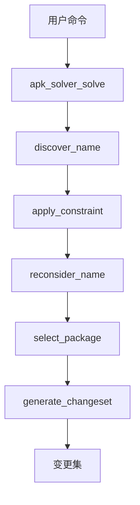
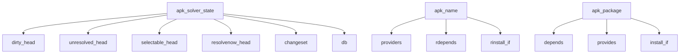

# 依赖解析器

<cite>
**本文档引用的文件**   
- [solver.c](file://src/solver.c)
- [apk_solver.h](file://src/apk_solver.h)
- [apk_package.h](file://src/apk_package.h)
- [apk_database.h](file://src/apk_database.h)
</cite>

## 目录
1. [引言](#引言)
2. [系统上下文图](#系统上下文图)
3. [组件分解图](#组件分解图)
4. [求解器高层设计](#求解器高层设计)
5. [关键数据结构](#关键数据结构)
6. [求解过程数据流](#求解过程数据流)
7. [冲突处理与虚拟提供者](#冲突处理与虚拟提供者)
8. [性能考虑与优化策略](#性能考虑与优化策略)
9. [复杂依赖场景行为分析](#复杂依赖场景行为分析)
10. [结论](#结论)

## 引言
apk-tools的依赖解析系统是Alpine Package Keeper (APK)的核心组件，负责解决软件包之间的复杂依赖关系。该系统采用向前/向后传播、约束检查和推导式求解的算法，确保依赖关系的一致性和可满足性。本文档详细描述了求解器的设计原理、关键数据结构、数据流以及在复杂场景下的行为。

**Section sources**
- [solver.c](file://src/solver.c#L1-L1147)
- [apk_solver.h](file://src/apk_solver.h#L1-L57)

## 系统上下文图

**Diagram sources**
- [solver.c](file://src/solver.c#L1069-L1145)

## 组件分解图

**Diagram sources**
- [solver.c](file://src/solver.c#L30-L43)
- [apk_database.h](file://src/apk_database.h#L120-L136)
- [apk_package.h](file://src/apk_package.h#L73-L101)

## 求解器高层设计
apk-tools的依赖求解器采用推导式求解算法，结合向前和向后传播机制。求解过程从世界依赖（world dependencies）开始，通过`discover_name`函数发现所有相关的包和依赖。然后，`apply_constraint`函数应用约束，`reconsider_name`函数重新评估名称状态，最后`select_package`函数选择合适的包。

求解器支持多种求解标志，如`APK_SOLVERF_LATEST`（选择最新版本）、`APK_SOLVERF_AVAILABLE`（优先选择可用包）和`APK_SOLVERF_IGNORE_CONFLICT`（忽略冲突）。这些标志通过`solver_flags`参数传递，影响求解器的行为。

**Section sources**
- [solver.c](file://src/solver.c#L1069-L1145)
- [apk_solver.h](file://src/apk_solver.h#L30-L37)

## 关键数据结构
### apk_solver_state
`apk_solver_state`结构体是求解器的核心状态容器，包含以下字段：
- `db`: 指向`apk_database`的指针
- `changeset`: 指向`apk_changeset`的指针
- `dirty_head`: 脏名称列表
- `unresolved_head`: 未解决名称列表
- `selectable_head`: 可选择名称列表
- `resolvenow_head`: 立即解决名称列表
- `errors`: 错误计数
- `solver_flags_inherit`: 继承的求解标志
- `pinning_inherit`: 继承的固定标志
- `default_repos`: 默认仓库
- `order_id`: 顺序ID
- `ignore_conflict`: 忽略冲突标志

### apk_name
`apk_name`结构体表示一个包名称，包含以下字段：
- `providers`: 提供者数组
- `rdepends`: 反向依赖数组
- `rinstall_if`: 反向install-if数组
- `ss`: 求解器状态

### apk_package
`apk_package`结构体表示一个包，包含以下字段：
- `depends`: 依赖数组
- `provides`: 提供数组
- `install_if`: install-if数组
- `ss`: 求解器包状态

**Section sources**
- [solver.c](file://src/solver.c#L30-L43)
- [apk_database.h](file://src/apk_database.h#L120-L136)
- [apk_package.h](file://src/apk_package.h#L73-L101)

## 求解过程数据流
求解过程从`apk_solver_solve`函数开始，首先对世界依赖进行排序，然后初始化求解器状态。接着，`discover_name`函数发现所有相关的名称和包，`apply_constraint`函数应用初始约束。

在主循环中，求解器不断从`dirty_head`列表中取出名称进行重新评估，直到没有更多的脏名称。然后，从`resolvenow_head`、`selectable_head`和`unresolved_head`列表中选择下一个名称进行求解。`select_package`函数选择最合适的包，并应用其依赖。

最后，`generate_changeset`函数生成变更集，记录安装、删除和调整的包。

**Section sources**
- [solver.c](file://src/solver.c#L1069-L1145)

## 冲突处理与虚拟提供者
求解器通过`mark_error`函数处理冲突，当发现冲突时，会标记相关包为错误状态。`disqualify_package`函数用于取消不合格包的资格，防止它们被选择。

对于虚拟提供者，求解器通过`exclude_non_providers`函数排除不能提供所需功能的包。`is_provider_auto_selectable`函数判断一个提供者是否可以自动选择，考虑了提供者优先级和依赖关系。

**Section sources**
- [solver.c](file://src/solver.c#L82-L89)
- [solver.c](file://src/solver.c#L169-L177)
- [solver.c](file://src/solver.c#L339-L353)

## 性能考虑与优化策略
求解器采用多种优化策略提高性能：
- 使用`merge_index`和`merge_index_complete`函数合并共同依赖，减少重复计算
- 通过`queue_dirty`和`queue_unresolved`函数管理待处理的名称，避免不必要的重新评估
- 利用`compare_providers`函数的复杂比较逻辑，快速选择最佳提供者

此外，求解器支持重启机制，当发现世界依赖有错误时，可以重新开始求解过程，确保最终结果的正确性。

**Section sources**
- [solver.c](file://src/solver.c#L362-L370)
- [solver.c](file://src/solver.c#L91-L99)
- [solver.c](file://src/solver.c#L119-L141)
- [solver.c](file://src/solver.c#L533-L684)

## 复杂依赖场景行为分析
在复杂依赖场景下，求解器表现出以下行为：
- 当存在多个提供者时，根据版本、优先级和安装状态选择最佳包
- 处理循环依赖时，通过延迟求解和重新评估避免死锁
- 在仓库固定（pinning）场景下，优先选择指定仓库的包
- 支持`install-if`条件，根据其他包的安装状态决定是否安装

求解器还能够处理虚拟包和提供者优先级，确保系统的一致性和稳定性。

**Section sources**
- [solver.c](file://src/solver.c#L733-L790)
- [solver.c](file://src/solver.c#L1069-L1145)

## 结论
apk-tools的依赖解析系统是一个高效、可靠的求解器，能够处理复杂的依赖关系。通过向前/向后传播、约束检查和推导式求解的算法，确保了依赖关系的一致性和可满足性。关键数据结构和优化策略的设计，使得求解器在各种场景下都能表现出色。