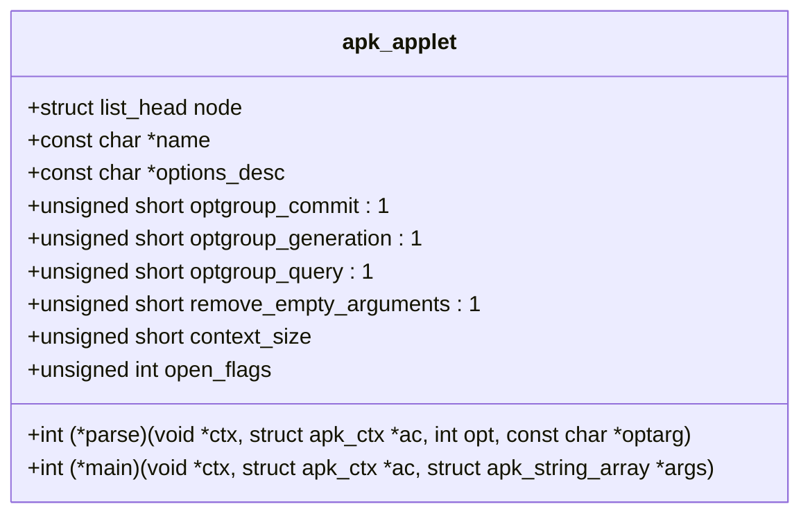
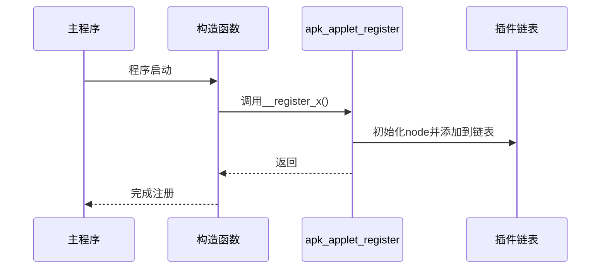
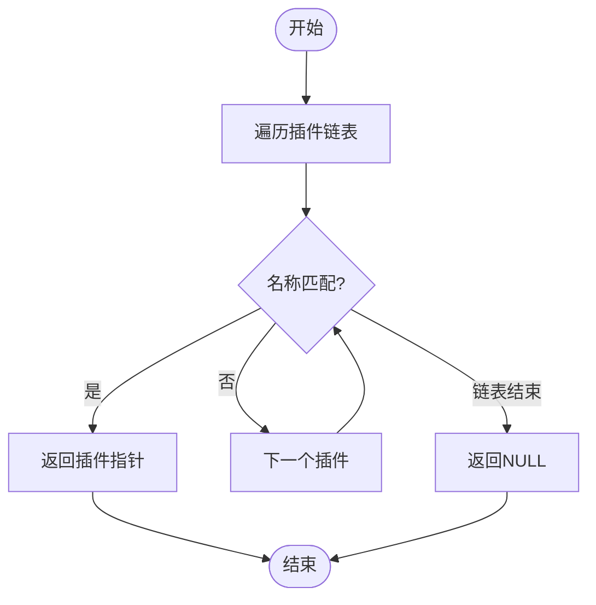
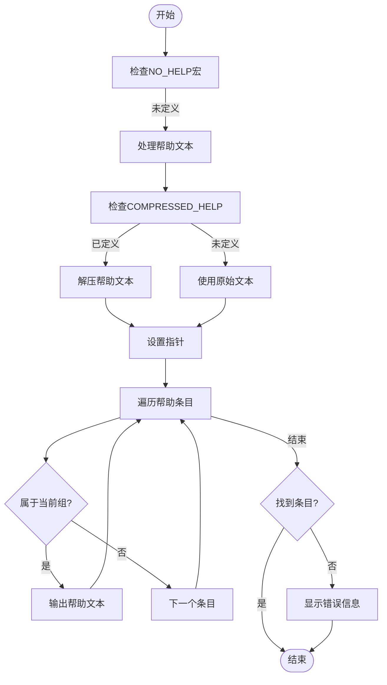
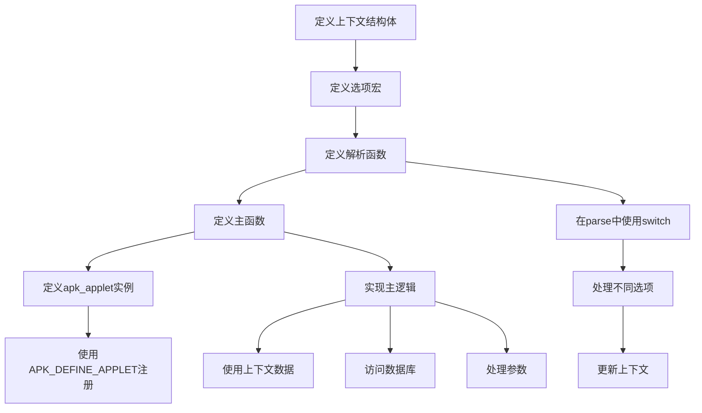
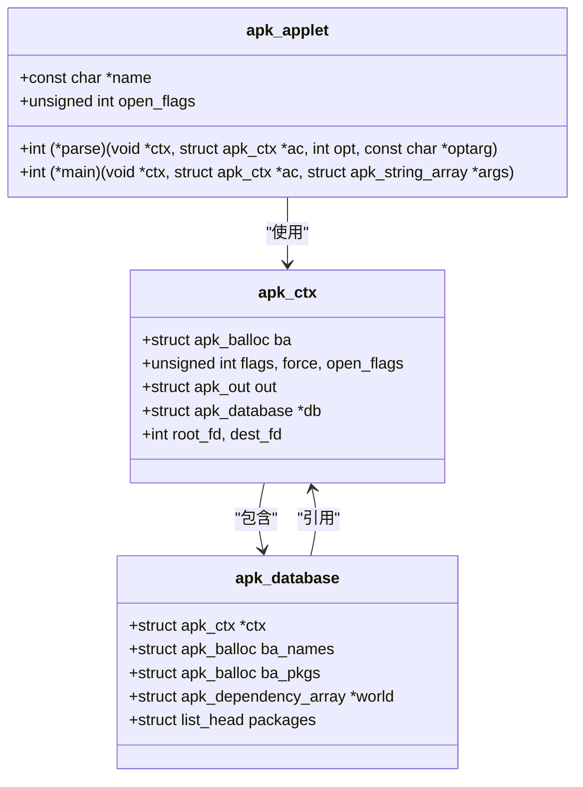

# C插件系统

<cite>
**Referenced Files in This Document**   
- [apk_applet.h](file://src/apk_applet.h)
- [applet.c](file://src/applet.c)
- [apk_context.h](file://src/apk_context.h)
- [apk_database.h](file://src/apk_database.h)
- [apk.c](file://src/apk.c)
- [app_add.c](file://src/app_add.c)
</cite>

## 目录
1. [插件系统架构概述](#插件系统架构概述)
2. [apk_applet结构体详解](#apk_applet结构体详解)
3. [插件注册机制](#插件注册机制)
4. [核心函数工作流程](#核心函数工作流程)
5. [插件开发示例](#插件开发示例)
6. [系统集成与内存管理](#系统集成与内存管理)

## 插件系统架构概述

apk-tools的C语言插件系统采用模块化设计，通过`apk_applet`结构体定义插件接口，实现子命令的动态注册与调用。该系统基于链表管理所有注册的插件，并通过`APK_DEFINE_APPLET`宏在程序启动时自动完成注册。插件系统与核心数据库和上下文模块紧密集成，通过`struct apk_ctx`提供统一的运行时环境。

**Section sources**
- [apk_applet.h](file://src/apk_applet.h#L1-L59)
- [applet.c](file://src/applet.c#L1-L77)

## apk_applet结构体详解

`struct apk_applet`是插件系统的核心数据结构，定义了插件的元数据和行为接口。

**Diagram sources**
- [apk_applet.h](file://src/apk_applet.h#L36-L51)

**Section sources**
- [apk_applet.h](file://src/apk_applet.h#L36-L51)

### 字段含义

- **name**: 插件名称，作为命令行子命令的标识符
- **options_desc**: 选项描述字符串，用于生成getopt选项
- **optgroup_commit/query/generation**: 标志位，指示插件是否属于特定功能组
- **remove_empty_arguments**: 标志位，指示是否移除空参数
- **context_size**: 上下文结构体大小，用于动态分配插件私有数据
- **open_flags**: 数据库打开标志，控制数据库访问模式
- **parse**: 选项解析回调函数，处理命令行参数
- **main**: 主逻辑回调函数，执行插件核心功能

## 插件注册机制

插件系统通过`APK_DEFINE_APPLET`宏实现自动注册，利用GCC的`__attribute__((constructor))`特性在程序初始化阶段执行注册函数。

**Diagram sources**
- [apk_applet.h](file://src/apk_applet.h#L57-L58)
- [applet.c](file://src/applet.c#L18-L22)

**Section sources**
- [apk_applet.h](file://src/apk_applet.h#L57-L58)
- [applet.c](file://src/applet.c#L18-L22)

### 动态链接交互

`APK_DEFINE_APPLET`宏定义的构造函数在动态链接阶段由加载器调用，确保所有插件在`main`函数执行前完成注册。这种机制不依赖于特定的链接顺序，保证了插件注册的可靠性。

## 核心函数工作流程

### applet_find函数

`apk_applet_find`函数通过名称在注册的插件链表中查找对应的插件实例。

**Diagram sources**
- [applet.c](file://src/applet.c#L24-L33)

### applet_help函数

`apk_applet_help`函数提供插件帮助信息的显示功能，支持压缩帮助文本的解压和条件显示。

**Diagram sources**
- [applet.c](file://src/applet.c#L48-L71)

**Section sources**
- [applet.c](file://src/applet.c#L24-L77)

## 插件开发示例

以下示例展示了如何定义一个新的子命令插件，包括选项解析、上下文初始化和主逻辑实现。

**Diagram sources**
- [app_add.c](file://src/app_add.c#L18-L209)

**Section sources**
- [app_add.c](file://src/app_add.c#L18-L209)

### 上下文初始化

插件的上下文初始化在`main`函数中完成，通过`context_size`字段确定需要分配的内存大小，并在插件执行完毕后自动释放。

## 系统集成与内存管理

### 线程安全性

插件系统本身不提供线程安全保证，所有插件在单线程环境中执行。核心数据库操作通过文件锁确保数据一致性。

### 内存管理策略

系统采用分层内存管理策略：
- 使用`apk_balloc`进行小对象批量分配
- 插件上下文通过`calloc`分配，由主程序在`main`函数末尾统一释放
- 数据库相关资源通过`apk_database`结构体的生命周期管理

### 与核心模块集成

插件系统与`struct apk_ctx`和`struct apk_database`深度集成，通过以下方式实现功能扩展：

**Diagram sources**
- [apk_context.h](file://src/apk_context.h#L65-L98)
- [apk_database.h](file://src/apk_database.h#L182-L252)
- [apk_applet.h](file://src/apk_applet.h#L36-L51)

**Section sources**
- [apk_context.h](file://src/apk_context.h#L65-L98)
- [apk_database.h](file://src/apk_database.h#L182-L252)