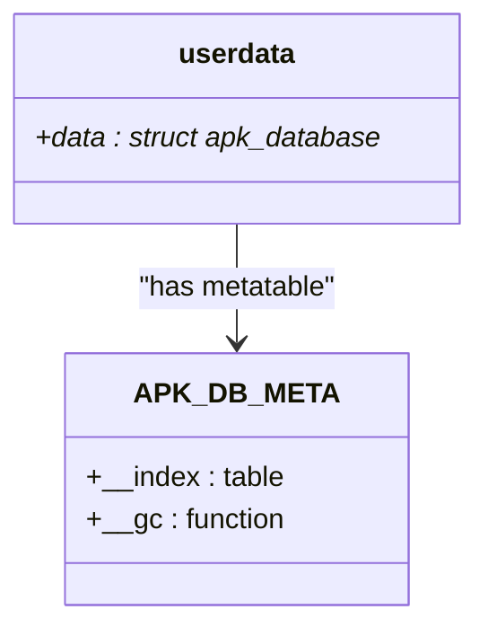
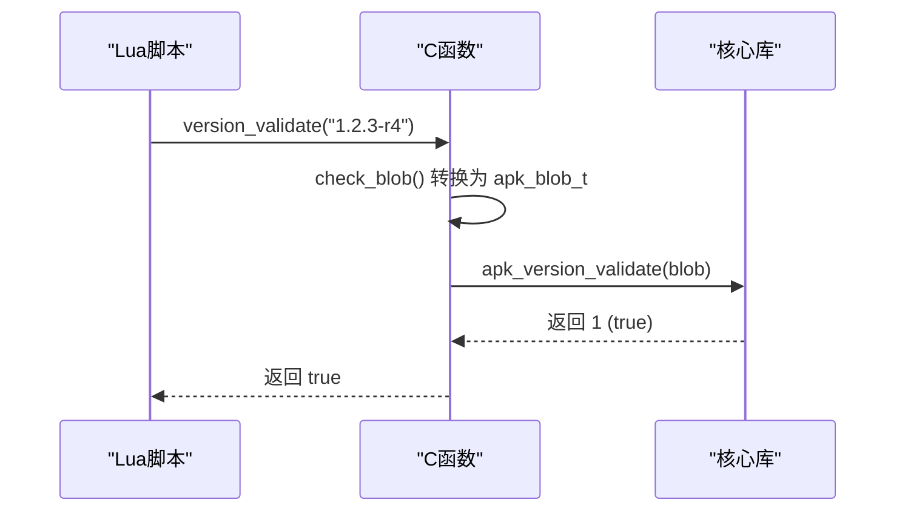
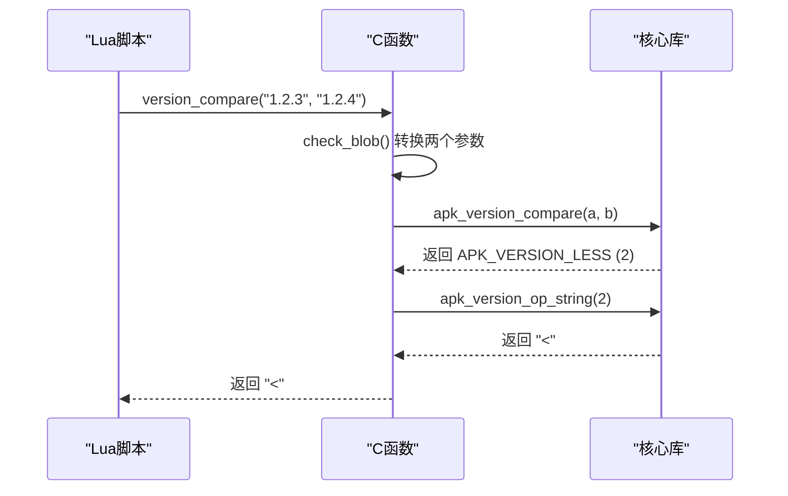
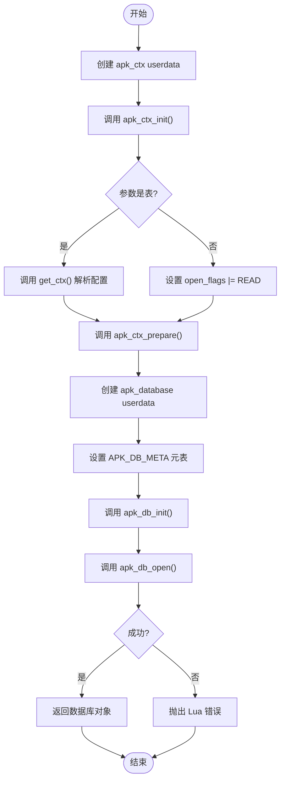
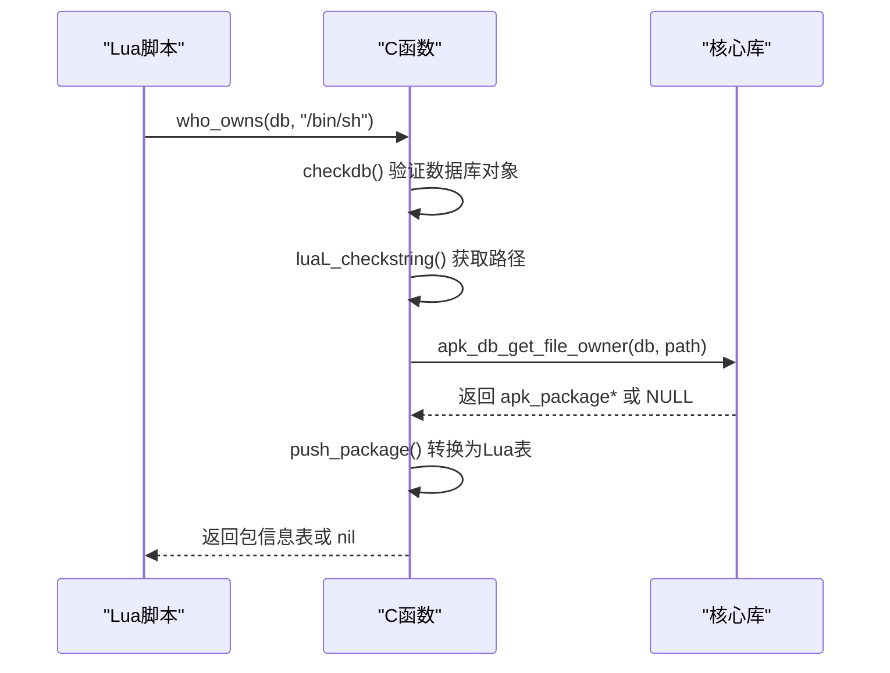
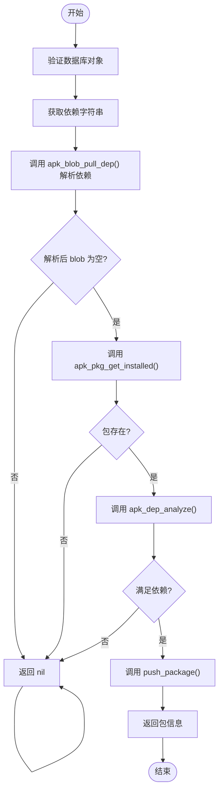
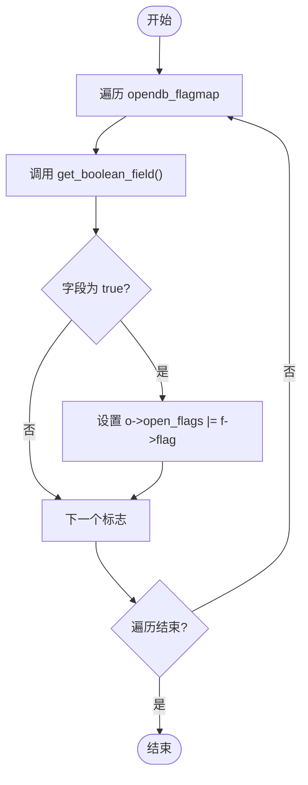
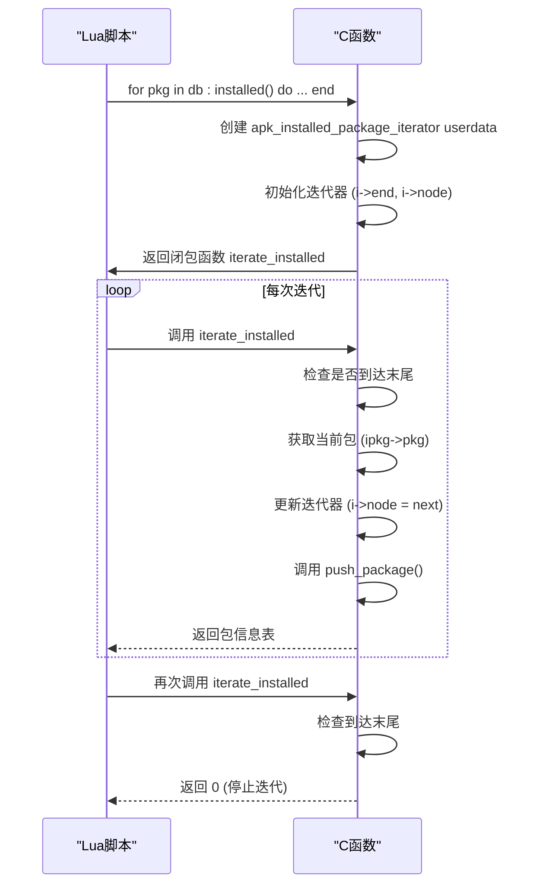

# Lua绑定

<cite>
**本文档引用的文件**   
- [lua-apk.c](file://lua/lua-apk.c)
- [apk_database.h](file://src/apk_database.h)
- [apk_context.h](file://src/apk_context.h)
- [apk_version.h](file://src/apk_version.h)
- [apk_defines.h](file://src/apk_defines.h)
</cite>

## 目录
1. [引言](#引言)
2. [元表设计与方法注册](#元表设计与方法注册)
3. [版本操作函数](#版本操作函数)
4. [数据库查询功能](#数据库查询功能)
5. [上下文与数据库对象封装](#上下文与数据库对象封装)
6. [open_flags标志映射](#open_flags标志映射)
7. [迭代器模式实现](#迭代器模式实现)
8. [Lua代码示例](#lua代码示例)
9. [结论](#结论)

## 引言
`apk-tools`的Lua绑定实现（`lua-apk.c`）为Lua脚本提供了访问Alpine包管理器核心功能的能力。该绑定通过精心设计的元表和方法注册机制，将C语言的`apk_database`和`apk_ctx`对象安全地暴露给Lua环境。本文档深入分析其实现细节，重点阐述元表设计、方法注册、对象封装、资源管理和迭代器模式等关键机制。

**Section sources**
- [lua-apk.c](file://lua/lua-apk.c#L1-L339)

## 元表设计与方法注册

### 元表设计
Lua绑定的核心是元表（metatable）机制，它用于定义用户数据（userdata）的行为。在`lua-apk.c`中，定义了名为`APK_DB_META`的元表，用于封装`struct apk_database`对象。



**Diagram sources**
- [lua-apk.c](file://lua/lua-apk.c#L20)
- [lua-apk.c](file://lua/lua-apk.c#L314-L322)

`db_create_meta`函数负责创建和初始化`APK_DB_META`元表：
1.  使用`luaL_newmetatable`创建元表。
2.  创建一个空表并将其设置为元表的`__index`字段，这允许在该表中查找方法。
3.  将`Papk_db_close`函数设置为`__gc`元方法，确保在Lua对象被垃圾回收时能正确释放C端资源。

### 方法注册机制
Lua API函数通过`luaL_Reg`结构体数组进行注册。`reg_apk_methods`数组定义了所有暴露给Lua的函数：

```c
static const luaL_Reg reg_apk_methods[] = {
    {"version_validate",    Pversion_validate},
    {"version_compare",     Pversion_compare},
    {"version_is_less",     Pversion_is_less},
    {"db_open",             Papk_db_open},
    {"who_owns",            Papk_who_owns},
    {"exists",              Papk_exists},
    {"is_installed",        Papk_exists},
    {"installed",           Pinstalled},
    {NULL,                  NULL}
};
```

`luaopen_apk`是Lua库的入口点，它执行以下操作：
1.  调用`db_create_meta`创建数据库元表。
2.  使用`luaL_newlib`和`reg_apk_methods`创建一个包含所有API函数的表。
3.  将此表设置为名为`apk`的全局变量。
4.  将库的版本号添加到全局表中。

**Section sources**
- [lua-apk.c](file://lua/lua-apk.c#L302-L311)
- [lua-apk.c](file://lua/lua-apk.c#L324-L336)

## 版本操作函数

### version_validate
`version_validate`函数用于验证一个版本字符串是否符合Alpine的版本格式规范。



**Diagram sources**
- [lua-apk.c](file://lua/lua-apk.c#L69-L75)
- [apk_version.h](file://src/apk_version.h#L26)

### version_compare
`version_compare`函数比较两个版本字符串，并返回比较结果。



**Diagram sources**
- [lua-apk.c](file://lua/lua-apk.c#L81-L87)
- [apk_version.h](file://src/apk_version.h#L27)

## 数据库查询功能

### db_open
`db_open`函数用于打开一个`apk_database`连接。它接受一个可选的配置表作为参数。



**Diagram sources**
- [lua-apk.c](file://lua/lua-apk.c#L179-L201)
- [apk_database.h](file://src/apk_database.h#L279)
- [apk_database.h](file://src/apk_database.h#L280)

### who_owns
`who_owns`函数查询指定文件路径由哪个已安装的包拥有。



**Diagram sources**
- [lua-apk.c](file://lua/lua-apk.c#L234-L239)
- [apk_database.h](file://src/apk_database.h#L301)

### exists
`exists`函数检查一个依赖项（dependency）是否被某个已安装的包满足。



**Diagram sources**
- [lua-apk.c](file://lua/lua-apk.c#L242-L263)

## 上下文与数据库对象封装

### 对象封装
Lua绑定通过用户数据（userdata）来封装C语言的`apk_ctx`和`apk_database`对象。`Papk_db_open`函数首先在Lua堆栈上创建一个`struct apk_ctx`的userdata，然后初始化它。接着，它创建一个`struct apk_database`的userdata，并将其与`APK_DB_META`元表关联。

### 生命周期管理
生命周期管理通过`__gc`元方法实现。当Lua的垃圾回收器回收一个数据库对象时，会自动调用`Papk_db_close`函数。

```mermaid
classDiagram
class apk_ctx {
+flags, open_flags : unsigned int
+root, keys_dir : const char*
+arch_list : struct apk_string_array*
+...
}
class apk_database {
+ctx : struct apk_ctx*
+available : struct { ... }
+installed : struct { ... }
+...
}
class userdata {
+data : void*
}
userdata --> apk_database : "封装"
apk_database --> apk_ctx : "包含"
```

**Diagram sources**
- [apk_context.h](file://src/apk_context.h#L64-L97)
- [apk_database.h](file://src/apk_database.h#L181-L251)

`Papk_db_close`函数负责释放资源：
1.  调用`apk_db_close`关闭数据库。
2.  调用`apk_ctx_free`释放上下文对象的内存。

**Section sources**
- [lua-apk.c](file://lua/lua-apk.c#L204-L209)
- [apk_context.h](file://src/apk_context.h#L100)

## open_flags标志映射

### 配置方式
`opendb_flagmap`数组定义了Lua表中的布尔字段与C语言`open_flags`标志位之间的映射关系。

```c
struct flagmap opendb_flagmap[] = {
    {"read",                APK_OPENF_READ},
    {"write",               APK_OPENF_WRITE},
    {"create",              APK_OPENF_CREATE},
    // ... 其他标志
    {NULL, 0}
};
```

`get_ctx`函数遍历此数组，并检查Lua表中是否存在同名的布尔字段。如果存在且为`true`，则将对应的标志位设置到`apk_ctx`的`open_flags`字段中。



**Diagram sources**
- [lua-apk.c](file://lua/lua-apk.c#L32-L48)
- [lua-apk.c](file://lua-apk.c#L155-L166)
- [apk_defines.h](file://src/apk_defines.h#L42-L58)

## 迭代器模式实现

### installed函数
`installed`函数实现了迭代器模式，用于遍历所有已安装的包。



**Diagram sources**
- [lua-apk.c](file://lua/lua-apk.c#L287-L299)
- [lua-apk.c](file://lua/lua-apk.c#L272-L285)

`Pinstalled`函数创建一个迭代器状态对象（`struct apk_installed_package_iterator`），并将其作为上值（upvalue）传递给一个闭包函数`iterate_installed`。Lua的`for`循环会反复调用这个闭包，直到它返回`nil`或`0`。

**Section sources**
- [lua-apk.c](file://lua/lua-apk.c#L266-L285)

## Lua代码示例

以下Lua代码展示了如何使用这些绑定：

```lua
-- 打开数据库
local db = apk.db_open({
    root = "/target",
    arch = "x86_64",
    read = true
})

-- 验证版本
if apk.version_validate("1.2.3-r4") then
    print("版本格式有效")
end

-- 比较版本
local cmp = apk.version_compare("1.2.3", "1.2.4")
print("比较结果:", cmp) -- 输出: <

-- 查询文件归属
local pkg = db:who_owns("/bin/sh")
if pkg then
    print("拥有者:", pkg.name, pkg.version)
end

-- 检查包是否存在
if db:exists("bash") then
    print("bash 已安装")
end

-- 遍历所有已安装的包
for pkg in db:installed() do
    print(pkg.name, pkg.version)
end

-- 关闭数据库 (可选，由 __gc 处理)
-- db = nil
```

**Section sources**
- [lua-apk.c](file://lua/lua-apk.c#L302-L311)

## 结论
`apk-tools`的Lua绑定通过`lua-apk.c`文件，利用Lua的元表、用户数据和闭包等高级特性，成功地将复杂的C语言包管理API安全、高效地暴露给了Lua脚本。其设计精巧，通过`APK_DB_META`元表和`__gc`方法实现了对象的封装和自动资源管理，通过`luaL_Reg`数组和`luaopen_apk`函数实现了清晰的方法注册。`opendb_flagmap`提供了灵活的配置方式，而`installed`函数则展示了如何在Lua中实现高效的迭代器模式。这些机制共同构成了一个强大且易用的脚本接口。