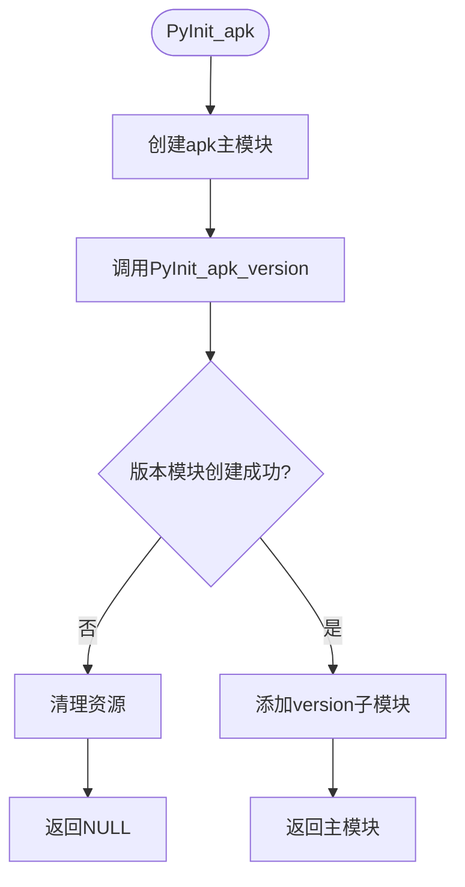
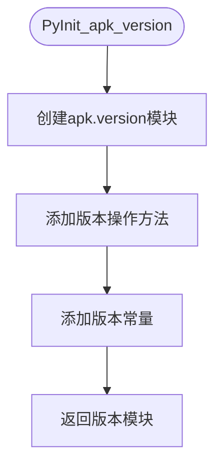
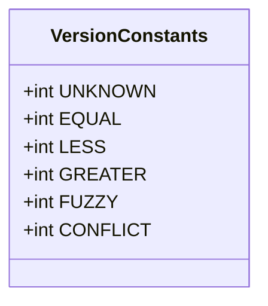
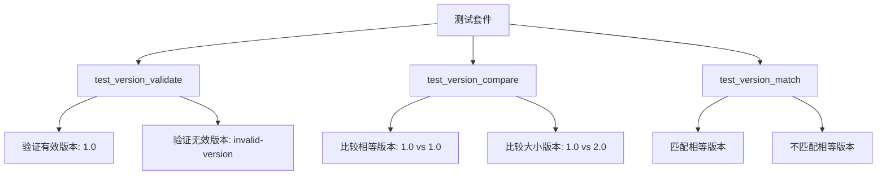

# Python绑定

<cite>
**Referenced Files in This Document**   
- [apk_module.c](file://python/apk_module.c)
- [test_apk.py](file://python/tests/test_apk.py)
- [apk_version.h](file://src/apk_version.h)
- [version.c](file://src/version.c)
- [apk_blob.h](file://src/apk_blob.h)
</cite>

## 目录
1. [简介](#简介)
2. [核心功能](#核心功能)
3. [模块初始化](#模块初始化)
4. [常量定义](#常量定义)
5. [数据类型转换](#数据类型转换)
6. [错误处理](#错误处理)
7. [性能优化](#性能优化)
8. [兼容性](#兼容性)
9. [测试用例](#测试用例)

## 简介
`apk-tools`的Python绑定为开发者提供了访问Alpine包管理器核心版本处理功能的接口。该绑定主要通过`apk_module.c`文件实现，封装了底层C库的版本验证、比较和匹配功能，使Python脚本能够高效地进行包版本管理操作。

**Section sources**
- [apk_module.c](file://python/apk_module.c#L1-L115)

## 核心功能

### 版本验证 (version_validate)
`version_validate`函数用于验证版本字符串的格式是否符合Alpine包管理器的规范。该函数接收一个版本字符串作为输入，返回布尔值表示验证结果。

**参数**
- `verstr` (str): 待验证的版本字符串

**返回值**
- bool: 有效版本返回True，无效版本返回False

### 版本比较 (version_compare)
`version_compare`函数用于比较两个版本字符串的大小关系。该函数实现了Alpine特有的版本比较算法，能够正确处理包含字母、后缀和修订号的复杂版本格式。

**参数**
- `verstr1` (str): 第一个版本字符串
- `verstr2` (str): 第二个版本字符串

**返回值**
- int: 返回比较结果，与`apk.version`命名空间下的常量对应

### 版本匹配 (version_match)
`version_match`函数用于检查两个版本字符串是否满足指定的比较操作。该函数支持多种比较操作符，可用于实现复杂的版本依赖检查。

**参数**
- `verstr1` (str): 第一个版本字符串
- `op` (int): 比较操作符，使用`apk.version`命名空间下的常量
- `verstr2` (str): 第二个版本字符串

**返回值**
- bool: 匹配成功返回True，否则返回False

**Section sources**
- [apk_module.c](file://python/apk_module.c#L20-L58)
- [version.c](file://src/version.c#L273-L330)

## 模块初始化

### PyInit_apk
`PyInit_apk`是主模块的初始化函数，负责创建`apk`模块对象并注册子模块。该函数首先创建主模块，然后调用`PyInit_apk_version`创建版本子模块，并将其作为`version`属性添加到主模块中。



**Diagram sources**
- [apk_module.c](file://python/apk_module.c#L100-L113)

### PyInit_apk_version
`PyInit_apk_version`是版本子模块的初始化函数，负责创建`apk.version`命名空间。该函数不仅注册了版本相关的函数，还添加了重要的常量定义，为Python层提供了完整的版本操作接口。



**Diagram sources**
- [apk_module.c](file://python/apk_module.c#L76-L89)

**Section sources**
- [apk_module.c](file://python/apk_module.c#L76-L113)

## 常量定义
`apk.version`命名空间定义了多个常量，用于表示版本比较的结果和操作类型。这些常量在版本匹配和比较操作中起着关键作用。



**常量说明**
- `UNKNOWN` (0): 未知或无效的比较结果
- `EQUAL` (1): 版本相等
- `LESS` (2): 第一个版本小于第二个版本
- `GREATER` (4): 第一个版本大于第二个版本
- `FUZZY` (8): 模糊匹配，通常用于前缀匹配
- `CONFLICT` (16): 冲突标记，用于否定匹配结果

**Section sources**
- [apk_version.h](file://src/apk_version.h#L13-L18)
- [apk_module.c](file://python/apk_module.c#L82-L87)

## 数据类型转换
Python绑定通过`python_str_to_blob`函数实现了Python字符串到C层`apk_blob_t`数据结构的转换。这种转换机制确保了Python层和C层之间的数据能够正确传递。

```c
static apk_blob_t python_str_to_blob(PyObject *py_str) {
    const char *str;
    Py_ssize_t len;
    str = PyUnicode_AsUTF8AndSize(py_str, &len);
    apk_blob_t blob = APK_BLOB_PTR_LEN((char *) str, len);
    return blob;
}
```

该转换过程包括：
1. 使用`PyUnicode_AsUTF8AndSize`获取Python字符串的UTF-8编码和长度
2. 使用`APK_BLOB_PTR_LEN`宏创建`apk_blob_t`结构体
3. 返回转换后的blob对象

**Section sources**
- [apk_module.c](file://python/apk_module.c#L12-L17)
- [apk_blob.h](file://src/apk_blob.h#L30)

## 错误处理
Python绑定的错误处理遵循Python C API的标准模式。当函数执行失败时，会返回`NULL`，这会自动转换为Python层的异常。主要的错误处理策略包括：

- **参数解析错误**: 使用`PyArg_ParseTuple`解析参数，失败时返回`NULL`
- **内存分配错误**: 模块创建失败时返回`NULL`
- **资源清理**: 在错误发生时，使用`Py_DECREF`释放已分配的资源

这种错误处理机制确保了Python脚本能够通过标准的异常处理机制来捕获和处理错误。

**Section sources**
- [apk_module.c](file://python/apk_module.c#L23-L24)
- [apk_module.c](file://python/apk_module.c#L107-L109)

## 性能优化
Python绑定在设计时考虑了性能因素，通过以下方式优化了执行效率：

1. **零拷贝转换**: `python_str_to_blob`函数直接引用Python字符串的内部缓冲区，避免了不必要的内存拷贝
2. **直接调用**: 所有版本操作都直接调用底层C函数，减少了中间层的开销
3. **常量缓存**: 版本常量在模块初始化时一次性添加，避免了运行时的重复计算

这些优化确保了Python绑定能够提供接近原生C代码的性能表现。

**Section sources**
- [apk_module.c](file://python/apk_module.c#L12-L17)
- [version.c](file://src/version.c#L281-L315)

## 兼容性
Python绑定使用标准的Python C API，确保了与不同Python版本的兼容性。主要的兼容性特性包括：

- **PY_SSIZE_T_CLEAN**: 定义此宏以确保正确的`Py_ssize_t`类型处理
- **Unicode支持**: 使用`PyUnicode_AsUTF8AndSize`处理Unicode字符串
- **标准API**: 仅使用稳定的Python C API函数

这些设计选择确保了绑定能够在支持Python C API的各个Python版本上正常工作。

**Section sources**
- [apk_module.c](file://python/apk_module.c#L7)
- [apk_module.c](file://python/apk_module.c#L15)

## 测试用例
项目提供了完整的单元测试，验证Python绑定的正确性。测试用例覆盖了所有核心功能，包括版本验证、比较和匹配操作。



**Diagram sources**
- [test_apk.py](file://python/tests/test_apk.py#L1-L21)

**Section sources**
- [test_apk.py](file://python/tests/test_apk.py#L1-L21)