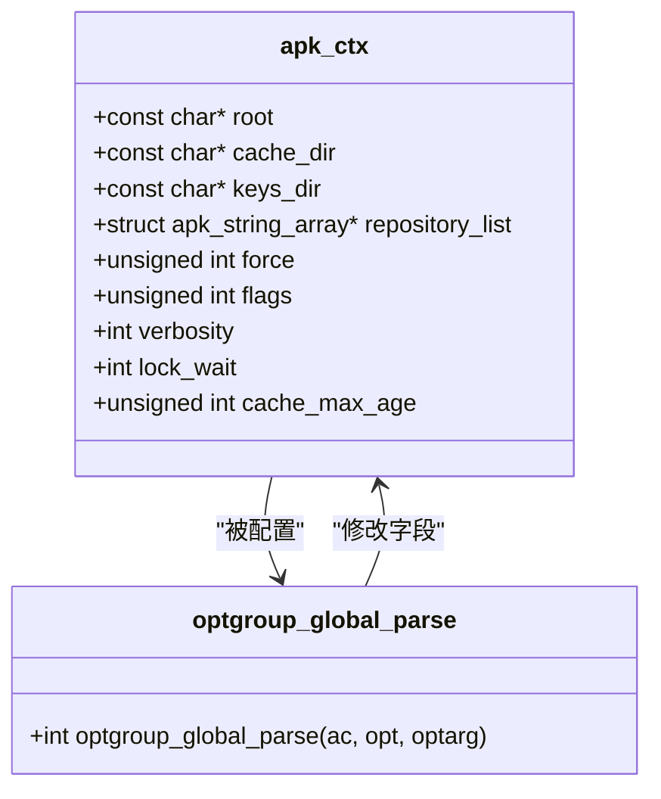

# 全局选项

<cite>
**Referenced Files in This Document**   
- [src/apk.c](file://src/apk.c)
- [src/apk_context.h](file://src/apk_context.h)
- [src/apk_applet.h](file://src/apk_applet.h)
- [src/apk_defines.h](file://src/apk_defines.h)
</cite>

## 目录
1. [全局选项概述](#全局选项概述)
2. [核心全局选项详解](#核心全局选项详解)
3. [布尔选项与参数选项处理机制](#布尔选项与参数选项处理机制)
4. [选项解析实现原理](#选项解析实现原理)
5. [实际使用示例](#实际使用示例)
6. [选项参考表](#选项参考表)

## 全局选项概述

apk-tools 提供了一套丰富的全局命令行选项，这些选项在所有子命令执行前被解析和处理，用于配置软件包管理器的运行时行为。全局选项通过 `optgroup_global_parse` 函数进行解析，该函数根据不同的选项标识符（opt）来设置 `apk_ctx` 结构体中的相应字段。这些选项影响着 apk 的根目录、缓存行为、密钥管理、仓库配置以及各种强制行为。

全局选项的解析发生在命令行参数处理的早期阶段，确保在执行任何具体操作之前，运行环境已经被正确配置。这些选项可以分为几类：路径配置类（如 `--root`、`--cache-dir`）、仓库配置类（如 `--repository`）、强制行为类（如 `--force`）以及输出控制类（如 `--quiet`、`--verbose`）。

**Section sources**
- [src/apk.c](file://src/apk.c#L82-L210)
- [src/apk_context.h](file://src/apk_context.h#L65-L98)

## 核心全局选项详解

### 路径与目录选项

`--root` 选项用于指定 apk 操作的根目录。当使用此选项时，所有文件系统操作都将相对于指定的根目录进行，这对于在 chroot 环境或容器中管理软件包非常有用。该选项的值被直接赋给 `apk_ctx` 结构体的 `root` 字段。

`--cache-dir` 选项允许用户自定义包缓存的存储位置。默认情况下，apk 会使用系统定义的缓存目录，但通过此选项可以将其重定向到其他位置，例如更快的存储设备或网络挂载点。该选项的值被赋给 `apk_ctx` 结构体的 `cache_dir` 字段。

`--keys-dir` 选项指定了用于验证包签名的公钥目录。apk 使用这些密钥来验证从仓库下载的包的完整性和来源。通过此选项，用户可以使用自定义的密钥集，这对于私有仓库或特定安全策略的环境至关重要。

**Section sources**
- [src/apk.c](file://src/apk.c#L89-L94)
- [src/apk_context.h](file://src/apk_context.h#L71-L73)

### 仓库配置选项

`--repository` 选项允许用户在命令行上直接指定额外的软件包仓库。这在临时添加一个仓库或测试新仓库时非常有用，而无需修改系统的仓库配置文件。每次使用此选项时，其参数值都会通过 `apk_string_array_add` 函数添加到 `apk_ctx` 结构体的 `repository_list` 数组中，从而支持指定多个仓库。

`--repositories-file` 选项用于指定一个替代的仓库列表文件，而不是使用默认的 `/etc/apk/repositories`。这对于在不同配置之间快速切换或在测试环境中使用特定仓库列表非常有用。

**Section sources**
- [src/apk.c](file://src/apk.c#L98-L103)
- [src/apk_context.h](file://src/apk_context.h#L80-L81)

### 强制行为选项

`--force` 选项是一个复合选项，它同时启用多种强制行为，包括强制覆盖文件、强制安装旧版本的包、强制处理非仓库包以及强制二进制输出到标准输出。在 `optgroup_global_parse` 函数中，此选项通过将多个标志位（如 `APK_FORCE_OVERWRITE` 和 `APK_FORCE_OLD_APK`）进行按位或操作，一次性设置到 `apk_ctx` 结构体的 `force` 字段中。

除了 `--force`，apk 还提供了更细粒度的强制选项，如 `--force-overwrite`、`--force-refresh` 等。这些选项允许用户精确控制特定的强制行为，而不是启用一整套强制规则。

**Section sources**
- [src/apk.c](file://src/apk.c#L113-L139)
- [src/apk_context.h](file://src/apk_context.h#L67)

## 布尔选项与参数选项处理机制

apk-tools 中的全局选项分为布尔选项和参数选项两种类型，它们的处理机制有所不同。

布尔选项（如 `--quiet` 和 `--verbose`）用于开启或关闭某种行为。`--quiet` 选项会递减 `apk_ctx` 结构体中 `out` 成员的 `verbosity` 字段，从而降低输出的详细程度。相反，`--verbose` 选项会递增该字段，增加输出的详细程度。这种设计允许用户通过多次使用 `-v` 选项来逐步增加详细程度。

参数选项（如 `--arch` 和 `--timeout`）需要一个额外的参数值。`--arch` 选项用于指定目标架构，其参数值（如 `x86_64`）会被添加到 `apk_ctx` 结构体的 `arch_list` 数组中，支持为单个操作指定多个架构。`--timeout` 选项则用于设置网络操作的超时时间（以秒为单位），它通过调用 `apk_io_url_set_timeout` 函数来配置底层网络库的超时设置。

**Section sources**
- [src/apk.c](file://src/apk.c#L104-L109)
- [src/apk.c](file://src/apk.c#L198-L199)
- [src/apk.c](file://src/apk.c#L195-L197)
- [src/apk_io.h](file://src/apk_io.h#L136)

## 选项解析实现原理

全局选项的解析机制基于 C 语言的 `getopt_long` 函数，并通过宏定义进行扩展，以实现类型安全和易于维护的代码。

### 选项定义与宏系统

全局选项的定义使用了 `APK_OPTIONS` 宏。这个宏接受两个参数：变量名和初始化宏。它首先展开初始化宏（如 `GLOBAL_OPTIONS`）来生成一个枚举，为每个选项分配一个唯一的标识符（例如 `OPT_GLOBAL_root`）。然后，它再次展开该宏来生成一个包含所有选项描述字符串的静态字符数组。这种设计将选项的标识符和其字符串表示形式（长选项名）紧密地关联在一起。

`APK_OPT_BOOL` 和 `APK_OPT_ARG` 是用于标记选项类型的特殊宏。`APK_OPT_BOOL` 用于布尔选项，它会在选项名前添加一个特殊字符（`\xab`）并自动创建一个对应的 `no-` 前缀的反向选项。`APK_OPT_ARG` 用于需要参数的选项，它使用另一个特殊字符（`\xaf`）进行标记。



**Diagram sources**
- [src/apk_context.h](file://src/apk_context.h#L65-L98)
- [src/apk.c](file://src/apk.c#L82-L210)

### 解析流程

选项解析的主流程在 `parse_options` 函数中。该函数首先调用 `add_options` 将全局选项（以及其他子命令的选项）注册到一个 `apk_options` 结构体中，该结构体包含了 `getopt_long` 所需的 `option` 数组和短选项字符串。

当 `getopt_long` 解析到一个选项时，它会返回一个由 `APK_OPTVAL_PACK` 宏打包的值，该值包含了选项所属的组ID和选项ID。`parse_options` 函数根据组ID选择相应的解析函数（对于全局选项，就是 `optgroup_global_parse`），并传入选项ID和参数值。`optgroup_global_parse` 函数使用一个 `switch` 语句来分发不同的选项ID，执行相应的配置逻辑。

**Section sources**
- [src/apk.c](file://src/apk.c#L474-L519)
- [src/apk_applet.h](file://src/apk_applet.h#L26-L28)
- [src/apk_defines.h](file://src/apk_defines.h#L31-L41)

## 实际使用示例

以下是一些组合使用全局选项的实际示例：

```bash
# 在指定根目录下更新缓存，并使用自定义仓库和密钥目录
apk --root /mnt/chroot --keys-dir /custom/keys --repository http://custom.repo.com/alpine/v3.18/main update

# 以静默模式安装包，并强制覆盖冲突文件
apk --quiet --force-overwrite add nginx

# 指定多个架构并设置较长的网络超时时间来搜索包
apk --arch x86_64 --arch armv7 --timeout 120 search package_name

# 使用临时仓库配置文件进行安装，且不进行网络连接（仅使用缓存）
apk --repositories-file /tmp/repo.list --no-network add package_name
```

这些示例展示了如何通过组合不同的全局选项来定制 apk 的行为，以适应各种复杂的使用场景。

## 选项参考表

| 选项 | 短选项 | 类型 | 功能描述 |
| :--- | :--- | :--- | :--- |
| `--root` | `-p` | 参数 | 指定根目录 |
| `--cache-dir` | | 参数 | 指定包缓存目录 |
| `--keys-dir` | | 参数 | 指定密钥目录 |
| `--repository` | `-X` | 参数 | 添加额外的仓库 |
| `--force` | `-f` | 标志 | 启用多种强制行为 |
| `--quiet` | `-q` | 标志 | 减少输出详细程度 |
| `--verbose` | `-v` | 标志 | 增加输出详细程度 |
| `--arch` | | 参数 | 指定目标架构 |
| `--timeout` | | 参数 | 设置网络超时（秒） |

**Section sources**
- [src/apk.c](file://src/apk.c#L38-L78)
- [src/apk_context.h](file://src/apk_context.h#L65-L98)