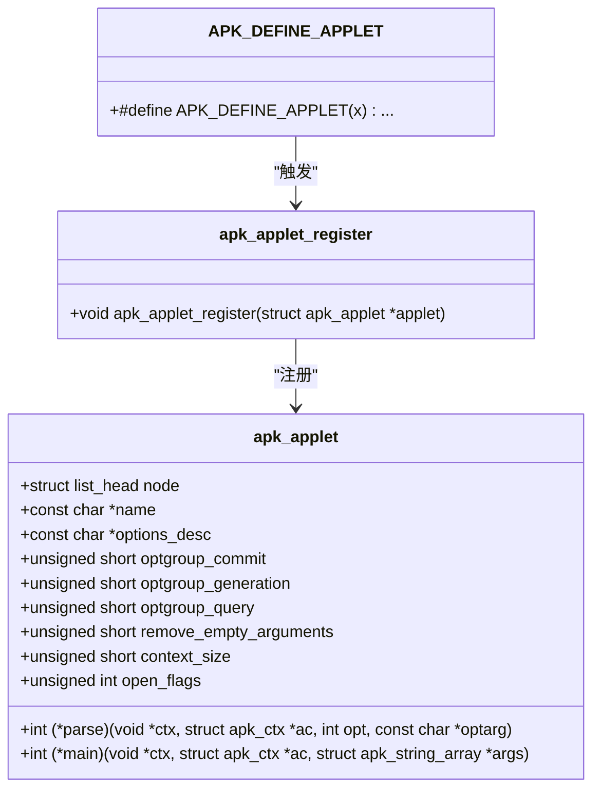
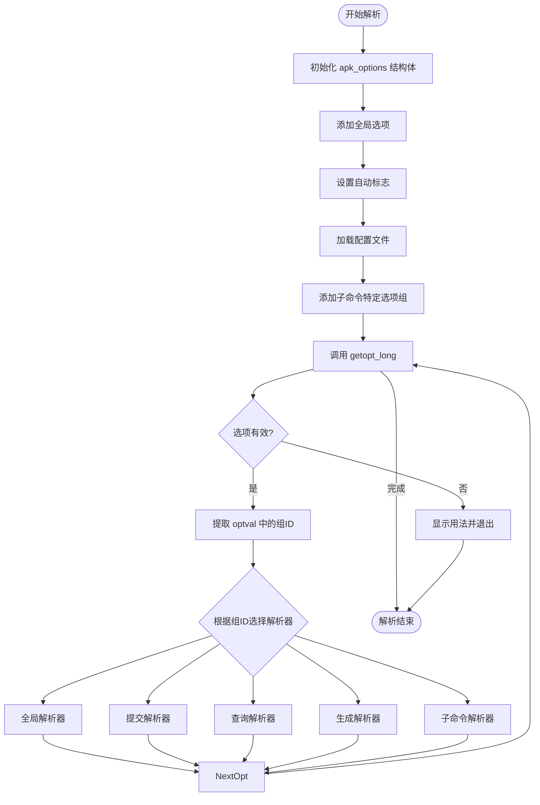

# 命令行接口

<cite>
**本文档中引用的文件**  
- [apk.c](file://src/apk.c)
- [applet.c](file://src/applet.c)
- [apk_applet.h](file://src/apk_applet.h)
- [genhelp_apk.lua](file://src/genhelp_apk.lua)
- [app_add.c](file://src/app_add.c)
- [app_info.c](file://src/app_info.c)
- [app_upgrade.c](file://src/app_upgrade.c)
</cite>

## 目录
1. [简介](#简介)
2. [命令行接口架构](#命令行接口架构)
3. [子命令注册机制](#子命令注册机制)
4. [全局选项与子命令解析流程](#全局选项与子命令解析流程)
5. [帮助系统工作原理](#帮助系统工作原理)
6. [命令行参数解析实现](#命令行参数解析实现)
7. [扩展自定义子命令](#扩展自定义子命令)
8. [命令调用示例与输出格式](#命令调用示例与输出格式)
9. [开发者指导](#开发者指导)
10. [用户命令参考](#用户命令参考)

## 简介
`apk-tools` 是 Alpine Linux 的包管理工具，提供了一套完整的命令行接口（CLI）用于软件包的安装、升级、查询和维护。其命令行架构基于模块化的子命令系统，通过 `applet` 机制实现灵活的扩展性。本文档深入解析其命令行架构、子命令注册、参数解析、帮助系统生成等核心机制，并为开发者和用户提供详尽的使用与扩展指南。

## 命令行接口架构
`apk-tools` 的命令行接口采用单入口多子命令的模式。主程序 `apk` 根据用户输入的第一个非选项参数（如 `add`, `upgrade`, `info`）来确定执行哪个子命令。整个架构的核心是 `applet` 系统，它将每个子命令封装为一个独立的 `struct apk_applet` 结构体，并通过注册机制进行管理。

程序的入口是 `main()` 函数，其主要流程包括：
1.  **初始化**：设置信号处理、终端缓冲区、上下文（`struct apk_ctx`）等。
2.  **推断子命令**：调用 `deduce_applet()` 函数，根据命令行参数或程序名确定要执行的子命令。
3.  **解析选项**：根据选定的子命令，加载全局选项和子命令特定选项，然后使用 `getopt_long()` 进行解析。
4.  **执行主逻辑**：调用子命令注册的 `.main` 函数指针，执行具体的业务逻辑。

**Section sources**
- [apk.c](file://src/apk.c#L558-L646)

## 子命令注册机制
`apk-tools` 使用 `apk_applet_register()` 函数来注册所有可用的子命令。每个子命令在代码中被定义为一个 `struct apk_applet` 类型的静态结构体变量。

### 注册过程
1.  **定义结构体**：每个子命令（如 `add`, `info`）都定义一个 `struct apk_applet` 变量，其中包含子命令的名称、描述、选项解析函数、主执行函数等信息。
2.  **自动注册**：通过宏 `APK_DEFINE_APPLET(x)`，利用 GCC 的 `__attribute__((constructor))` 特性，在程序启动时自动调用 `apk_applet_register(&x)` 函数，将该子命令结构体注册到全局的链表中。



**Diagram sources**
- [apk_applet.h](file://src/apk_applet.h#L36-L51)
- [applet.c](file://src/applet.c#L18-L22)
- [apk_applet.h](file://src/apk_applet.h#L57-L58)

### 查找子命令
当用户执行命令时，`deduce_applet()` 函数会遍历由 `apk_applet_register()` 注册的全局链表，通过 `strcmp()` 比较子命令名称，找到并返回对应的 `struct apk_applet` 指针。

**Section sources**
- [applet.c](file://src/applet.c#L24-L32)
- [apk.c](file://src/apk.c#L292-L313)

## 全局选项与子命令解析流程
`apk-tools` 的选项解析是一个分阶段、分组的复杂过程，由 `parse_options()` 函数主导。

### 选项分组
选项被分为多个逻辑组，每个组由一个宏（如 `GLOBAL_OPTIONS`, `COMMIT_OPTIONS`）定义，并通过 `APK_OPTIONS` 宏生成枚举和字符串描述。
- **全局选项 (Global Options)**：适用于所有子命令，如 `--root`, `--quiet`, `--verbose`。
- **提交选项 (Commit Options)**：适用于需要修改系统状态的子命令（如 `add`, `upgrade`），如 `--simulate`, `--no-scripts`。
- **查询选项 (Query Options)**：适用于查询类子命令（如 `info`, `search`），如 `--installed`, `--provides`。
- **生成选项 (Generation Options)**：适用于生成包的子命令，如 `--compression`, `--sign-key`。

### 解析流程
1.  **初始化选项结构**：创建一个 `struct apk_options` 结构体，用于存储所有可用的 `getopt` 选项。
2.  **加载选项**：调用 `add_options()` 函数，将全局选项和当前子命令相关的特定选项组（如 `commit`, `query`）添加到 `apk_options` 结构体中。此过程会处理长选项、短选项（`APK_OPT_SH`）和布尔选项（`APK_OPT_BOOL`）。
3.  **配置自动标志**：根据环境变量（如 `TERM=dumb`）和文件系统状态（如 `/etc/apk/interactive`）设置一些自动标志。
4.  **加载配置文件**：读取 `/etc/apk/config` 或 `/lib/apk/config` 文件，将其中的配置项作为命令行选项进行解析。
5.  **执行解析**：使用 `getopt_long()` 遍历命令行参数。对于每个解析出的选项，根据其 `optval` 中编码的组ID（`APK_OPTVAL_GROUPID`）调用相应的解析函数：
    -   `OPT_GLOBAL_*`：调用 `optgroup_global_parse()`
    -   `OPT_COMMIT_*`：调用 `optgroup_commit_parse()`
    -   `OPT_GENERATION_*`：调用 `optgroup_generation_parse()`
    -   子命令特定选项：调用子命令自身的 `.parse` 函数
6.  **错误处理**：如果选项不被支持或参数无效，解析过程会返回错误，最终调用 `usage()` 函数显示帮助信息。



**Diagram sources**
- [apk.c](file://src/apk.c#L374-L518)
- [apk.c](file://src/apk.c#L38-L78)
- [apk.c](file://src/apk.c#L213-L219)

## 帮助系统工作原理
`apk-tools` 的帮助系统是编译时生成的，将 `scdoc` 格式的文档编译为内嵌在二进制文件中的字符串，从而实现无需外部文件即可显示帮助。

### scdoc 格式
`scdoc` 是一种轻量级的标记语言，用于编写 man page。`apk-tools` 的帮助文档位于 `doc/` 目录下，如 `apk-add.8.scd`。其结构包括 `SYNOPSIS`（用法）、`DESCRIPTION`（描述）、`OPTIONS`（选项）等部分。

### genhelp_apk.lua 编译流程
`genhelp_apk.lua` 是一个 Lua 脚本，负责将 `scdoc` 文件编译为 C 语言源码。

1.  **解析 scdoc**：脚本 `genhelp.lua` 定义了一个 `scdoc` 解析器，它读取 `.scd` 文件，提取 `SYNOPSIS`、`DESCRIPTION`、`OPTIONS` 等部分的内容。
2.  **生成中间数据**：解析器将提取的内容组织成 Lua 表（tables），如 `usage`, `description`, `commands`, `options`。
3.  **渲染帮助文本**：`genhelp_apk.lua` 脚本中的 `render()` 和 `render_options()` 函数将这些 Lua 表渲染成格式化的帮助文本。例如，`OPTIONS` 部分会被格式化为“选项: 描述”的列表。
4.  **生成 C 源码**：`generate_help()` 函数将所有渲染后的帮助文本连接成一个大的字符串。然后，它将这个字符串（或其 zlib 压缩后的版本）转换为 C 语言的 `static const unsigned char payload_help[]` 数组，并生成相应的头文件定义（如 `payload_help_size`）。
5.  **编译进二进制**：生成的 C 源码（如 `help.c`）被编译并链接到 `apk` 二进制文件中。

### 显示帮助
当用户执行 `apk --help` 或 `apk <subcommand> --help` 时，`apk_applet_help()` 函数会被调用：
1.  如果启用了压缩（`COMPRESSED_HELP`），则先使用 `uncompress()` 解压 `payload_help` 数组。
2.  遍历解压后的字符串，这些字符串以 `\0` 分隔，形成一个“主题-内容”对的列表。
3.  使用 `is_group()` 函数判断当前主题是否与请求的帮助相关（如请求 `add` 子命令的帮助，则显示 `add` 主题和 `GLOBAL` 主题）。
4.  将匹配的主题内容输出到标准输出。

**Section sources**
- [genhelp_apk.lua](file://src/genhelp_apk.lua#L1-L151)
- [genhelp.lua](file://src/genhelp.lua#L1-L195)
- [applet.c](file://src/applet.c#L48-L75)

## 命令行参数解析实现
命令行参数解析的核心是 `parse_options()` 函数，它巧妙地利用了 `getopt_long()` 和自定义的选项描述机制。

### 选项描述机制
`APK_OPTIONS` 宏是关键。它接受一个宏（如 `GLOBAL_OPTIONS`）作为参数，该宏定义了所有选项。`APK_OPTIONS` 会：
1.  **生成枚举**：使用 `__APK_OPT_ENUM` 展开宏，为每个选项生成一个唯一的整数 ID。
2.  **生成描述字符串**：使用 `__APK_OPT_DESC` 展开宏，将选项的描述（包含特殊前缀）连接成一个以 `\0` 分隔的字符串。

这些特殊前缀（如 `\xaf` 表示有参数，`\xab` 表示布尔选项，`\xf1` 表示短选项）被编码在描述字符串中，`add_options()` 函数在解析此字符串时会提取这些信息，并构建出 `struct option` 数组供 `getopt_long()` 使用。

### 参数处理
在 `main()` 函数中，`optind` 是 `getopt_long()` 解析完所有选项后指向的第一个非选项参数的索引。`apk` 会将 `argc` 和 `argv` 调整为从 `optind` 开始，然后将这些参数传递给子命令的 `.main` 函数进行处理。某些子命令（如 `add`）会进一步处理空字符串参数。

**Section sources**
- [apk.c](file://src/apk.c#L37-L78)
- [apk.c](file://src/apk.c#L324-L388)
- [apk.c](file://src/apk.c#L474-L518)

## 扩展自定义子命令
开发者可以通过定义新的 `struct apk_applet` 并使用 `APK_DEFINE_APPLET` 宏来轻松扩展 `apk-tools` 的功能。

### 步骤
1.  **创建源文件**：在 `src/` 目录下创建一个新的 `.c` 文件，如 `app_mycommand.c`。
2.  **定义上下文结构**（可选）：如果子命令需要保存状态，定义一个上下文结构体。
3.  **定义选项**：使用 `MYCOMMAND_OPTIONS(OPT)` 宏定义子命令的选项。
4.  **实现解析函数**：编写 `mycommand_parse_option()` 函数，处理子命令的特定选项。
5.  **实现主函数**：编写 `mycommand_main()` 函数，实现子命令的核心逻辑。
6.  **定义 applet 结构体**：填充 `struct apk_applet` 结构体，指定名称、选项描述、解析函数、主函数等。
7.  **注册子命令**：使用 `APK_DEFINE_APPLET(apk_mycommand);` 宏进行注册。

### 示例骨架
```c
#include "apk_applet.h"
#include "apk_database.h"

// 1. 定义上下文
struct mycommand_ctx {
    int flag;
};

// 3. 定义选项
#define MYCOMMAND_OPTIONS(OPT) \
    OPT(OPT_MYCOMMAND_flag, "flag")

APK_OPTIONS(mycommand_options_desc, MYCOMMAND_OPTIONS);

// 4. 实现解析函数
static int mycommand_parse_option(void *ctx, struct apk_ctx *ac, int opt, const char *optarg) {
    struct mycommand_ctx *mctx = (struct mycommand_ctx *) ctx;
    switch (opt) {
        case OPT_MYCOMMAND_flag:
            mctx->flag = 1;
            break;
        default:
            return -ENOTSUP;
    }
    return 0;
}

// 5. 实现主函数
static int mycommand_main(void *ctx, struct apk_ctx *ac, struct apk_string_array *args) {
    // 实现你的逻辑
    return 0;
}

// 6. 定义 applet 结构体
static struct apk_applet apk_mycommand = {
    .name = "mycommand",
    .options_desc = mycommand_options_desc,
    .context_size = sizeof(struct mycommand_ctx),
    .parse = mycommand_parse_option,
    .main = mycommand_main,
};

// 7. 注册子命令
APK_DEFINE_APPLET(apk_mycommand);
```

**Section sources**
- [app_add.c](file://src/app_add.c#L18-L210)
- [app_info.c](file://src/app_info.c#L18-L385)
- [apk_applet.h](file://src/apk_applet.h#L57-L58)

## 命令调用示例与输出格式
以下是一些常见的 `apk` 命令调用示例及其输出格式说明。

### 示例 1: 安装包
```bash
apk add curl
```
**输出**：
```
fetch https://dl-cdn.alpinelinux.org/alpine/v3.18/main/x86_64/APKINDEX.tar.gz
fetch https://dl-cdn.alpinelinux.org/alpine/v3.18/community/x86_64/APKINDEX.tar.gz
(1/4) Installing ca-certificates (20230506-r1)
(2/4) Installing brotli-libs (1.0.9-r10)
(3/4) Installing libcurl (8.2.1-r0)
(4/4) Installing curl (8.2.1-r0)
Executing busybox-1.36.1-r4.trigger
Executing ca-certificates-20230506-r1.trigger
OK: 8 MiB in 15 packages
```
**格式说明**：输出显示了包的下载、安装进度（序号/总数）、包名和版本，以及触发器的执行。最后一行显示了总包数和占用空间。

### 示例 2: 查询包信息
```bash
apk info curl
```
**输出**：
```
curl-8.2.1-r0 description:
Command line tool and library for transferring data with URLs

curl-8.2.1-r0 webpage:
https://curl.se/

curl-8.2.1-r0 installed size:
1.4M
```
**格式说明**：默认情况下，`info` 命令会显示包的描述、网页和安装大小。使用 `-a` 选项可显示所有信息。

### 示例 3: 显示帮助
```bash
apk add --help
```
**输出**：
```
add options:
      --initdb           Reinitialize the package database
  -l, --latest           Install latest version of package
      --no-chown         Do not change ownership of files
  -u, --upgrade          Upgrade if already installed
      --usermode         Install packages as user
  -t, --virtual PKG      Create a virtual package

For more information: man apk-add 8
```
**格式说明**：帮助信息清晰地列出了所有可用选项及其简短描述，并在末尾提供了指向完整 man page 的链接。

## 开发者指导
本节为希望为 `apk-tools` 贡献代码或创建自定义子命令的开发者提供指导。

### 理解核心数据结构
-   **`struct apk_ctx`**：贯穿整个程序执行过程的上下文，包含输出设置、数据库配置、解析后的选项等。
-   **`struct apk_database`**：表示 APK 数据库的句柄，用于与包数据库进行交互。
-   **`struct apk_applet`**：子命令的核心结构体，是扩展功能的入口。

### 遵循编码规范
-   **选项定义**：始终使用 `APK_OPTIONS` 宏来定义选项，确保与解析系统兼容。
-   **内存管理**：注意使用 `apk_string_array`、`apk_blob` 等工具进行内存分配和释放，避免内存泄漏。
-   **错误处理**：使用 `IS_ERR()` 和 `PTR_ERR()` 宏来处理错误指针，并返回适当的错误码。

### 测试
在提交代码前，务必运行 `apk-tools` 自带的测试套件，确保新功能不会破坏现有行为。

**Section sources**
- [apk.c](file://src/apk.c#L521-L522)
- [apk_applet.h](file://src/apk_applet.h#L36-L51)

## 用户命令参考
`apk-tools` 提供了丰富的子命令，以下是最常用的一些：

| 子命令 | 简写 | 描述 |
| :--- | :--- | :--- |
| `add` | `a` | 安装新的软件包。 |
| `del` | `d` | 删除已安装的软件包。 |
| `upgrade` | `u` | 升级已安装的软件包。 |
| `update` | `U` | 更新本地包索引。 |
| `info` | `i` | 显示包的详细信息。 |
| `search` | `s` | 搜索包。 |
| `list` | `l` | 列出已安装的包。 |
| `fetch` | | 下载包而不安装。 |
| `cache` | | 管理本地包缓存。 |
| `verify` | | 验证已安装包的完整性。 |

每个子命令都支持 `--help` 选项以获取更详细的帮助。

**Section sources**
- [app_add.c](file://src/app_add.c#L198-L207)
- [app_upgrade.c](file://src/app_upgrade.c#L230-L237)
- [app_info.c](file://src/app_info.c#L374-L382)