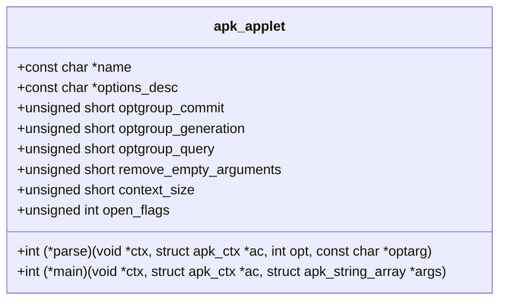
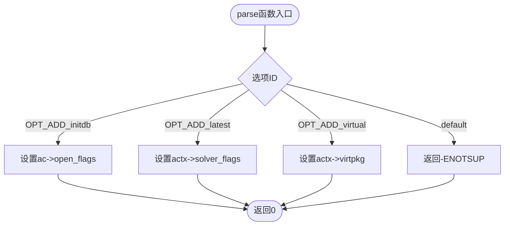

# 子命令实现模式

<cite>
**本文档中引用的文件**  
- [app_add.c](file://src/app_add.c)
- [app_del.c](file://src/app_del.c)
- [app_upgrade.c](file://src/app_upgrade.c)
- [app_fetch.c](file://src/app_fetch.c)
- [app_query.c](file://src/app_query.c)
- [apk_applet.h](file://src/apk_applet.h)
- [apk.c](file://src/apk.c)
</cite>

## 目录
1. [引言](#引言)
2. [子命令实现结构概览](#子命令实现结构概览)
3. [核心组件分析](#核心组件分析)
4. [APK_OPTIONS宏详解](#apk_options宏详解)
5. [标准实现模板与最佳实践](#标准实现模板与最佳实践)
6. [总结](#总结)

## 引言
本文档系统性地分析`apk-tools`项目中子命令（如add、del、upgrade、fetch、query等）的实现模式。通过深入研究`app_*.c`系列文件，揭示其共性结构与设计原则，为开发者提供创建新子命令的标准化指南。

## 子命令实现结构概览
在`apk-tools`中，每个子命令（如`add`、`del`）都通过一个独立的`.c`文件实现，遵循统一的设计模式。该模式围绕`struct apk_applet`结构体展开，定义了命令的名称、选项描述、上下文大小、标志位以及关键的`parse`和`main`函数指针。

**Section sources**
- [apk_applet.h](file://src/apk_applet.h#L36-L51)

## 核心组件分析

### apk_applet结构体
`struct apk_applet`是所有子命令的核心注册结构，定义在`apk_applet.h`中。它包含了子命令的所有元信息和行为逻辑。



**Diagram sources**
- [apk_applet.h](file://src/apk_applet.h#L36-L51)

**Section sources**
- [apk_applet.h](file://src/apk_applet.h#L36-L51)

### 上下文管理（Context Management）
每个子命令可以定义一个私有的上下文结构（如`add_ctx`、`del_ctx`），用于在`parse`和`main`函数之间传递状态和配置。该结构的大小通过`apk_applet.context_size`指定，由主程序自动分配和释放。

例如，在`app_add.c`中定义的`add_ctx`结构体用于存储虚拟包名和求解器标志。

**Section sources**
- [app_add.c](file://src/app_add.c#L18-L21)
- [app_del.c](file://src/app_del.c#L16-L21)
- [app_upgrade.c](file://src/app_upgrade.c#L26-L33)

### 选项解析（parse函数）
`parse`函数负责处理命令行选项。它接收一个`ctx`指针（指向子命令的上下文）、`ac`（全局应用上下文）、`opt`（选项ID）和`optarg`（选项参数）。函数通过`switch`语句分发不同的选项，并更新上下文或全局状态。



**Diagram sources**
- [app_add.c](file://src/app_add.c#L33-L57)

**Section sources**
- [app_add.c](file://src/app_add.c#L33-L57)
- [app_del.c](file://src/app_del.c#L28-L39)
- [app_upgrade.c](file://src/app_upgrade.c#L45-L78)

### 主逻辑执行（main函数）
`main`函数是子命令的核心业务逻辑入口。它接收与`parse`函数相同的参数，并在此执行具体的命令操作，如添加、删除或升级包。该函数通常会调用数据库、求解器或其他核心服务。

```mermaid
sequenceDiagram
participant Main as "main函数"
participant DB as "apk_database"
participant Solver as "apk_solver"
participant Out as "apk_out"
Main->>DB : 获取数据库实例
Main->>DB : 检查世界状态
Main->>Solver : 设置求解器标志
loop 遍历参数
Main->>Solver : 添加依赖项
end
Main->>Solver : 提交求解
Solver-->>Main : 返回结果
Main->>Out : 输出日志或错误
Main-->> : 返回状态码
```

**Diagram sources**
- [app_add.c](file://src/app_add.c#L107-L195)
- [app_del.c](file://src/app_del.c#L144-L189)
- [app_upgrade.c](file://src/app_upgrade.c#L166-L227)

**Section sources**
- [app_add.c](file://src/app_add.c#L107-L195)
- [app_del.c](file://src/app_del.c#L144-L189)
- [app_upgrade.c](file://src/app_upgrade.c#L166-L227)

## APK_OPTIONS宏详解
`APK_OPTIONS`宏是定义命令行选项的关键机制。它利用C预处理器的宏展开能力，将一组选项定义同时生成枚举值和描述字符串。

### 宏定义
```c
#define APK_OPTIONS(var_name, init_macro) \
    enum { init_macro(__APK_OPT_ENUM) }; \
    static const char var_name[] = init_macro(__APK_OPT_DESC);
```

### 工作原理
1.  **宏展开**：`init_macro`（如`ADD_OPTIONS`）被调用两次。
2.  **生成枚举**：第一次调用`init_macro(__APK_OPT_ENUM)`生成一个枚举，为每个选项分配唯一的整数ID。
3.  **生成描述**：第二次调用`init_macro(__APK_OPT_DESC)`生成一个包含所有选项描述的、以`\x00`分隔的字符串。

例如，在`app_add.c`中：
```c
#define ADD_OPTIONS(OPT) \
    OPT(OPT_ADD_initdb, "initdb") \
    OPT(OPT_ADD_latest, APK_OPT_SH("l") "latest")

APK_OPTIONS(add_options_desc, ADD_OPTIONS);
```
这会生成：
- 一个枚举：`OPT_ADD_initdb = 0`, `OPT_ADD_latest = 1`
- 一个字符串：`"initdb\x00l\rlatest\x00"`

主程序`apk.c`中的`add_options`函数会解析这个字符串，构建`getopt_long`所需的`struct option`数组。

**Section sources**
- [apk_applet.h](file://src/apk_applet.h#L26-L28)
- [app_add.c](file://src/app_add.c#L23-L29)
- [apk.c](file://src/apk.c#L345-L388)

## 标准实现模板与最佳实践
基于对现有子命令的分析，可以总结出创建新子命令的标准模板。

### 1. 定义上下文结构
为子命令定义一个私有上下文结构，用于存储解析后的选项和状态。

### 2. 定义选项宏
使用`APK_OPTIONS`宏定义命令行选项，确保选项ID和描述字符串的同步生成。

### 3. 实现parse函数
编写`parse`函数，处理所有自定义选项。对于全局选项，主程序会自动处理。

### 4. 实现main函数
编写`main`函数，实现核心业务逻辑。注意进行参数验证和错误处理。

### 5. 注册子命令
定义一个`struct apk_applet`的全局实例，并使用`APK_DEFINE_APPLET`宏将其注册到系统中。

**Section sources**
- [app_add.c](file://src/app_add.c#L18-L209)
- [app_del.c](file://src/app_del.c#L16-L203)
- [app_upgrade.c](file://src/app_upgrade.c#L26-L239)

## 总结
`apk-tools`的子命令实现模式体现了高度的模块化和一致性。通过`struct apk_applet`和`APK_OPTIONS`宏，实现了命令的注册、选项解析和逻辑执行的解耦。开发者在创建新命令时，应严格遵循此模式，以确保代码的可维护性和一致性。