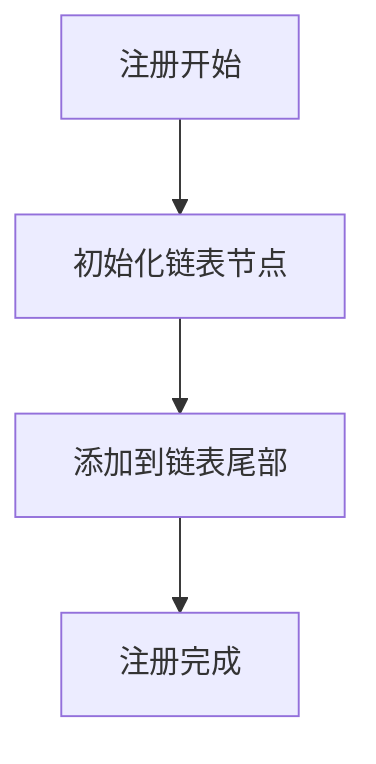
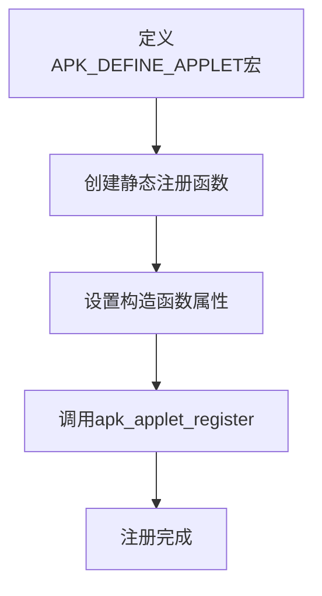
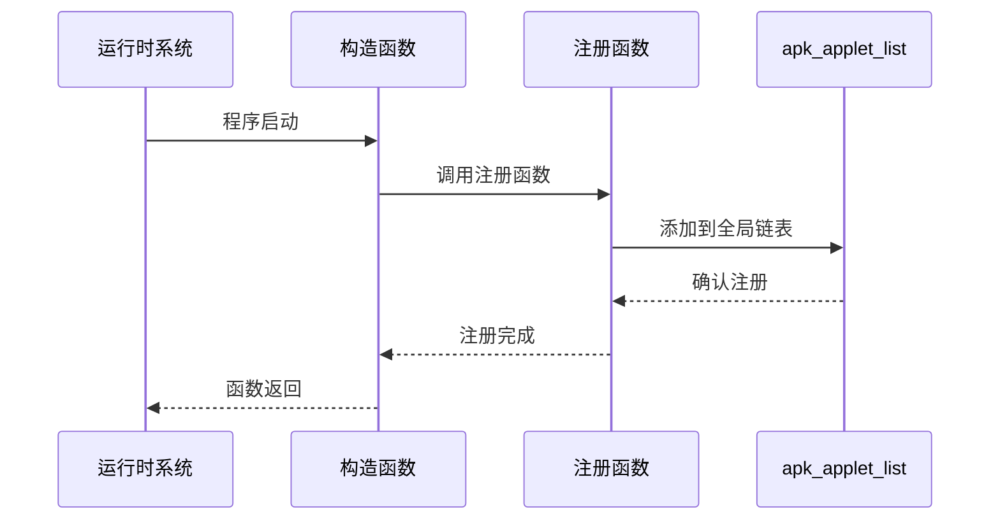
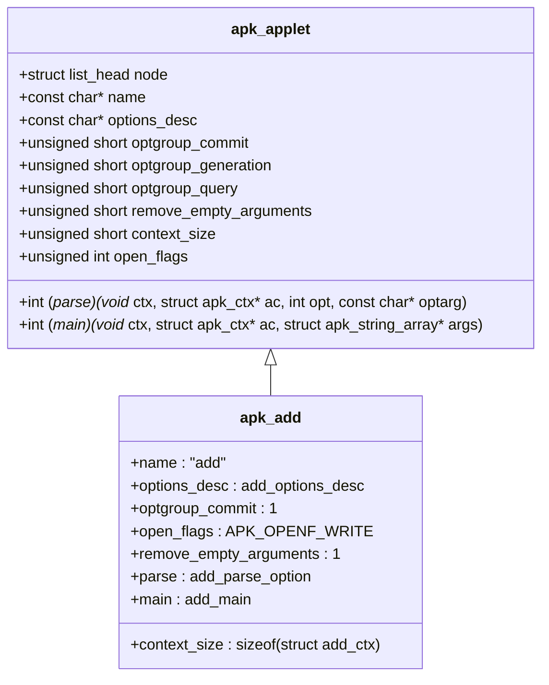

# 子命令注册机制

<cite>
**Referenced Files in This Document**   
- [apk_applet.h](file://src/apk_applet.h)
- [applet.c](file://src/applet.c)
- [apk_defines.h](file://src/apk_defines.h)
- [app_add.c](file://src/app_add.c)
- [app_del.c](file://src/app_del.c)
- [app_info.c](file://src/app_info.c)
- [apk.c](file://src/apk.c)
</cite>

## 目录
1. [引言](#引言)
2. [核心结构体分析](#核心结构体分析)
3. [注册机制实现](#注册机制实现)
4. [构造函数属性](#构造函数属性)
5. [宏定义简化流程](#宏定义简化流程)
6. [子命令注册流程](#子命令注册流程)
7. [结构体字段详解](#结构体字段详解)
8. [代码示例与实现](#代码示例与实现)
9. [总结](#总结)

## 引言
apk-tools 采用基于 `apk_applet` 结构体的子命令注册机制，通过链表将各个子命令注册到全局的 `apk_applet_list` 中。该机制利用 `__attribute__((constructor))` 属性确保在程序启动时自动注册子命令，并通过 `APK_DEFINE_APPLET` 宏简化注册流程。这种设计实现了子命令的模块化管理和自动发现，为 apk-tools 提供了灵活的命令扩展能力。

## 核心结构体分析

`apk_applet` 结构体是子命令注册机制的核心，定义了子命令的基本属性和行为。该结构体包含指向链表节点的指针、子命令名称、选项描述符以及解析和执行函数等关键字段。

**Section sources**
- [apk_applet.h](file://src/apk_applet.h#L36-L50)

## 注册机制实现

子命令注册机制通过 `apk_applet_register` 函数实现，该函数将 `apk_applet` 结构体实例添加到全局链表 `apk_applet_list` 中。注册过程包括初始化链表节点并将其添加到链表尾部，确保子命令按注册顺序排列。

**Diagram sources**
- [applet.c](file://src/applet.c#L18-L21)

**Section sources**
- [applet.c](file://src/applet.c#L18-L21)

## 构造函数属性

`__attribute__((constructor))` 属性确保在程序启动时自动执行注册函数。当包含子命令定义的共享库被加载时，标记为构造函数的函数会自动调用，从而实现子命令的自动注册。这种机制避免了手动注册的繁琐，提高了代码的可维护性。

**Section sources**
- [apk_applet.h](file://src/apk_applet.h#L57-L58)

## 宏定义简化流程

`APK_DEFINE_APPLET` 宏通过预处理器指令简化了子命令的注册流程。该宏定义了一个静态函数，使用 `__attribute__((constructor))` 属性标记，并在函数体内调用 `apk_applet_register` 函数注册子命令。这种设计将复杂的注册逻辑封装在宏中，使开发者能够以简洁的方式定义和注册子命令。

**Diagram sources**
- [apk_applet.h](file://src/apk_applet.h#L57-L58)

**Section sources**
- [apk_applet.h](file://src/apk_applet.h#L57-L58)

## 子命令注册流程

子命令注册流程从程序启动开始，运行时系统自动调用所有标记为构造函数的函数。每个子命令的注册函数将对应的 `apk_applet` 结构体实例注册到全局链表中。主程序通过 `apk_applet_find` 函数在链表中查找并执行相应的子命令，实现了命令的动态发现和执行。

**Diagram sources**
- [applet.c](file://src/applet.c#L18-L21)
- [apk_applet.h](file://src/apk_applet.h#L57-L58)

**Section sources**
- [applet.c](file://src/applet.c#L18-L21)
- [apk_applet.h](file://src/apk_applet.h#L57-L58)

## 结构体字段详解

`apk_applet` 结构体中的各个字段在注册过程中扮演着重要角色。`name` 字段用于标识子命令，`options_desc` 字段描述命令行选项，`parse` 和 `main` 函数指针分别指向选项解析和主执行函数。这些字段共同定义了子命令的行为和接口。

**Section sources**
- [apk_applet.h](file://src/apk_applet.h#L39-L50)

## 代码示例与实现

开发者通过定义 `apk_applet` 结构体实例并使用 `APK_DEFINE_APPLET` 宏来实现子命令的自动注册。以 `app_add.c` 中的 `apk_add` 实例为例，开发者只需填充结构体字段并应用宏，即可完成子命令的定义和注册。这种方式既保证了代码的简洁性，又提供了足够的灵活性来定制子命令的行为。

**Diagram sources**
- [app_add.c](file://src/app_add.c#L197-L206)
- [apk_applet.h](file://src/apk_applet.h#L36-L50)

**Section sources**
- [app_add.c](file://src/app_add.c#L197-L206)
- [app_del.c](file://src/app_del.c#L191-L200)
- [app_info.c](file://src/app_info.c#L374-L382)

## 总结
apk-tools 的子命令注册机制通过 `apk_applet` 结构体、链表管理和构造函数属性的结合，实现了高效、灵活的命令注册系统。`APK_DEFINE_APPLET` 宏进一步简化了开发者的注册流程，使得新子命令的添加变得简单而直观。这种设计模式不仅提高了代码的可维护性，还为未来的功能扩展提供了坚实的基础。

**Section sources**
- [apk_applet.h](file://src/apk_applet.h)
- [applet.c](file://src/applet.c)