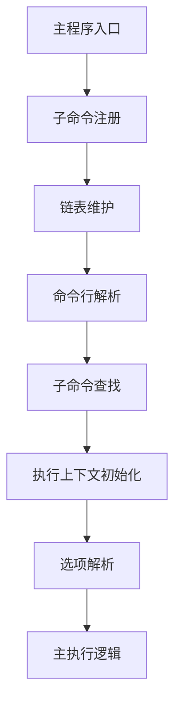
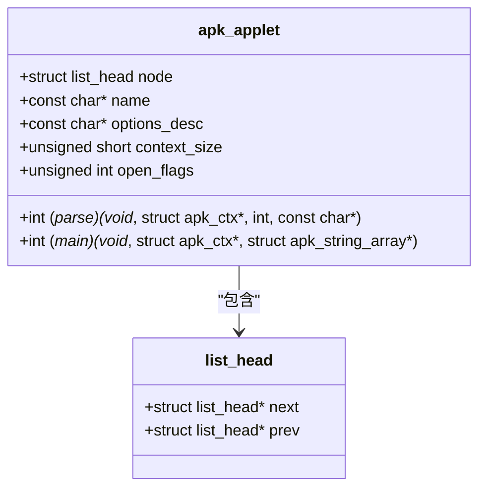
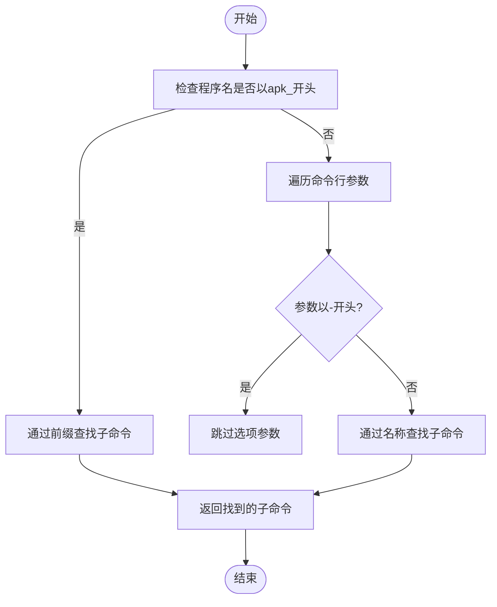

# 子命令系统

<cite>
**本文档中引用的文件**   
- [apk_applet.h](file://src/apk_applet.h)
- [applet.c](file://src/applet.c)
- [apk.c](file://src/apk.c)
- [app_add.c](file://src/app_add.c)
- [app_del.c](file://src/app_del.c)
- [app_upgrade.c](file://src/app_upgrade.c)
- [app_fetch.c](file://src/app_fetch.c)
</cite>

## 目录
1. [子命令系统架构](#子命令系统架构)
2. [apk_applet结构体设计](#apk_applet结构体设计)
3. [注册机制与链表维护](#注册机制与链表维护)
4. [子命令解析流程](#子命令解析流程)
5. [核心子命令功能概述](#核心子命令功能概述)
6. [自定义子命令开发指南](#自定义子命令开发指南)

## 子命令系统架构

apk-tools的子命令系统采用模块化设计，通过统一的接口注册和管理所有可用的子命令。系统启动时会自动注册所有内置子命令，并通过链表数据结构进行维护。每个子命令都实现了标准的解析和执行接口，确保了命令处理的一致性和可扩展性。



**Diagram sources**
- [apk.c](file://src/apk.c#L558-L646)
- [applet.c](file://src/applet.c#L14-L21)

**Section sources**
- [apk.c](file://src/apk.c#L558-L646)
- [applet.c](file://src/applet.c#L14-L21)

## apk_applet结构体设计

`apk_applet`结构体是子命令系统的核心数据结构，定义了子命令的所有属性和行为。该结构体包含子命令的名称、选项描述、标志位以及关键的函数指针。

```c
struct apk_applet {
	struct list_head node;
	const char *name;
	const char *options_desc;
	unsigned short optgroup_commit : 1;
	unsigned short optgroup_generation : 1;
	unsigned short optgroup_query : 1;
	unsigned short remove_empty_arguments : 1;
	unsigned short context_size;
	unsigned int open_flags;
	int (*parse)(void *ctx, struct apk_ctx *ac, int opt, const char *optarg);
	int (*main)(void *ctx, struct apk_ctx *ac, struct apk_string_array *args);
};
```

结构体中的关键字段包括：
- **name**: 子命令的名称标识
- **options_desc**: 选项描述字符串
- **context_size**: 上下文结构体大小
- **open_flags**: 数据库打开标志
- **parse**: 选项解析函数指针
- **main**: 主执行函数指针

**Section sources**
- [apk_applet.h](file://src/apk_applet.h#L36-L51)

## 注册机制与链表维护

子命令的注册通过`APK_DEFINE_APPLET`宏实现，该宏利用GCC的`__attribute__((constructor))`特性，在程序启动时自动执行注册函数。所有注册的子命令通过双向链表进行维护。



**Diagram sources**
- [apk_applet.h](file://src/apk_applet.h#L36-L51)
- [applet.c](file://src/applet.c#L14-L21)

**Section sources**
- [apk_applet.h](file://src/apk_applet.h#L36-L51)
- [applet.c](file://src/applet.c#L14-L21)

## 子命令解析流程

子命令的解析通过`deduce_applet`函数实现，该函数根据命令行参数确定目标子命令。解析流程包括程序名检查和参数遍历两个阶段。



**Diagram sources**
- [apk.c](file://src/apk.c#L291-L313)

**Section sources**
- [apk.c](file://src/apk.c#L291-L313)

## 核心子命令功能概述

### add子命令
用于安装软件包，支持虚拟包创建和依赖解析。主要功能包括：
- 从本地文件或远程仓库安装包
- 创建虚拟元数据包
- 处理包依赖关系

### del子命令
用于删除已安装的软件包，支持递归删除。主要特性：
- 删除指定包及其依赖
- 支持反向依赖删除
- 自动处理世界依赖

### upgrade子命令
用于系统升级，包含自升级功能。关键功能：
- 升级所有已安装包
- 支持仅升级特定包
- 实现工具自升级机制

### fetch子命令
用于下载软件包而不安装。主要特点：
- 从仓库下载包文件
- 支持链接和标准输出
- 可指定构建时间过滤

**Section sources**
- [app_add.c](file://src/app_add.c#L198-L207)
- [app_del.c](file://src/app_del.c#L192-L201)
- [app_upgrade.c](file://src/app_upgrade.c#L230-L238)
- [app_fetch.c](file://src/app_fetch.c#L286-L294)

## 自定义子命令开发指南

### 定义apk_applet结构
创建自定义子命令需要定义`apk_applet`结构体实例，包含必要的配置和函数指针。

```c
static struct apk_applet my_applet = {
	.name = "mycommand",
	.options_desc = my_options_desc,
	.context_size = sizeof(struct my_ctx),
	.parse = my_parse_function,
	.main = my_main_function,
};
```

### 实现parse函数
parse函数负责处理命令行选项，通常使用`getopt_long`进行参数解析。

```c
static int my_parse_option(void *ctx, struct apk_ctx *ac, int opt, const char *optarg)
{
	struct my_ctx *mctx = (struct my_ctx *) ctx;
	switch (opt) {
	case OPT_MY_OPTION:
		// 处理选项逻辑
		break;
	default:
		return -ENOTSUP;
	}
	return 0;
}
```

### 实现main函数
main函数包含子命令的核心执行逻辑，接收解析后的上下文和参数数组。

```c
static int my_main_function(void *ctx, struct apk_ctx *ac, struct apk_string_array *args)
{
	struct my_ctx *mctx = (struct my_ctx *) ctx;
	// 执行主要功能
	return 0;
}
```

### 注册子命令
使用`APK_DEFINE_APPLET`宏注册自定义子命令，确保在程序启动时自动注册。

```c
APK_DEFINE_APPLET(my_applet);
```

**Section sources**
- [app_add.c](file://src/app_add.c#L198-L210)
- [app_del.c](file://src/app_del.c#L192-L203)
- [app_upgrade.c](file://src/app_upgrade.c#L230-L240)
- [app_fetch.c](file://src/app_fetch.c#L286-L296)