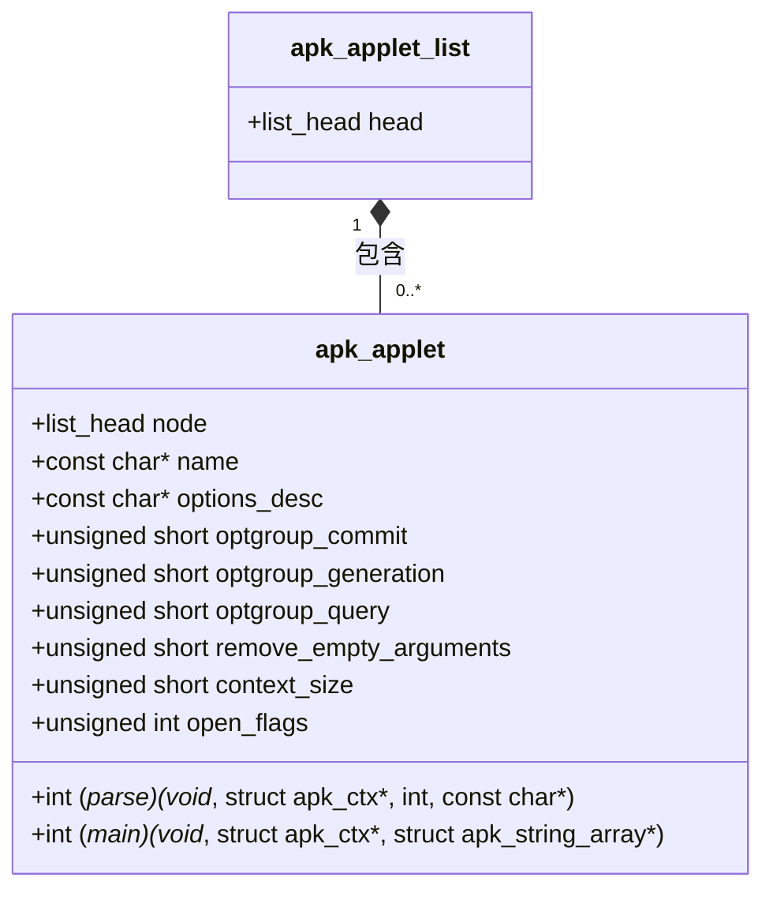
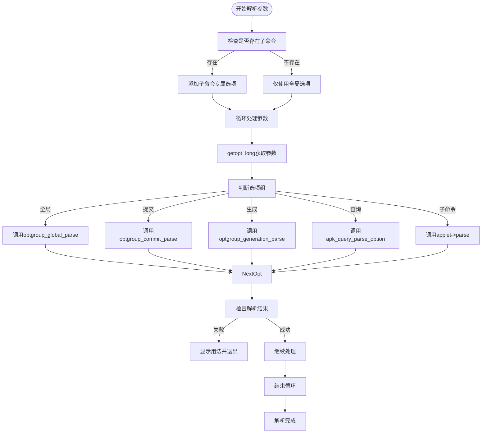
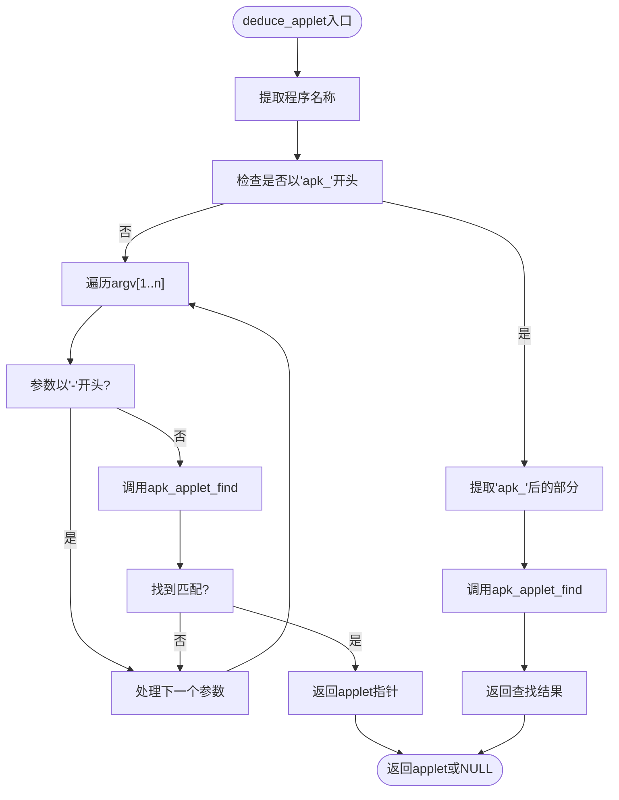
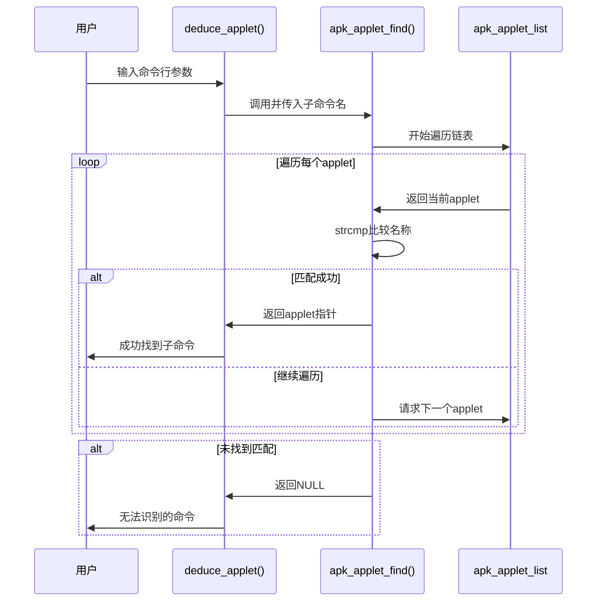
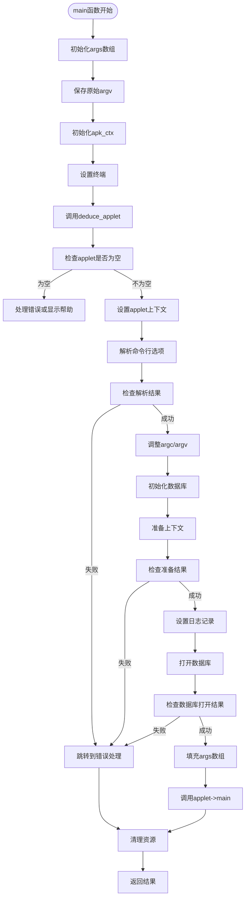
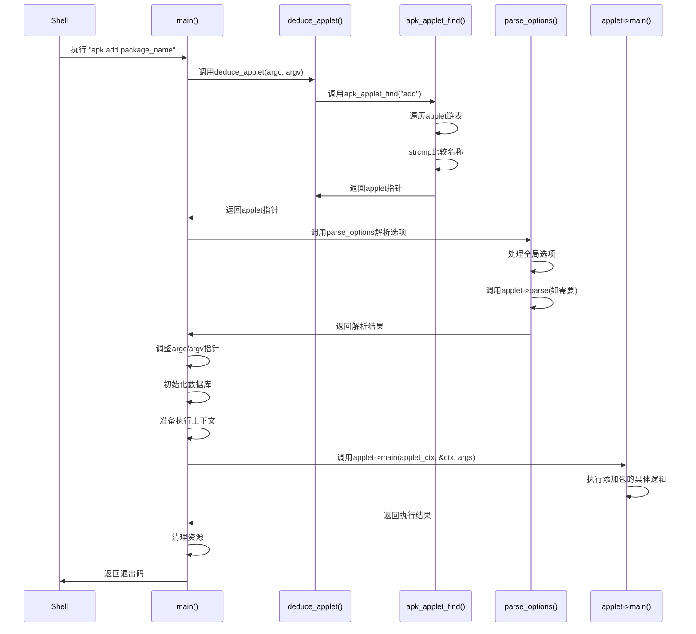

# 子命令解析与分发

<cite>
**本文档中引用的文件**  
- [src/apk.c](file://src/apk.c)
- [src/applet.c](file://src/applet.c)
- [src/apk_applet.h](file://src/apk_applet.h)
</cite>

## 目录
1. [简介](#简介)
2. [子命令注册与查找机制](#子命令注册与查找机制)
3. [命令行参数解析流程](#命令行参数解析流程)
4. [deduce_applet函数分析](#deduce_applet函数分析)
5. [apk_applet_find匹配过程](#apk_applet_find匹配过程)
6. [上下文初始化与执行衔接](#上下文初始化与执行衔接)
7. [完整调用路径示例](#完整调用路径示例)

## 简介
apk-tools采用模块化设计，通过子命令机制实现功能扩展。本文件详细阐述其命令行参数解析、子命令分发及执行流程，重点分析`deduce_applet`和`apk_applet_find`函数如何协同工作以匹配用户输入的子命令。

**Section sources**
- [src/apk.c](file://src/apk.c#L558-L645)
- [src/applet.c](file://src/applet.c#L14-L32)

## 子命令注册与查找机制
apk-tools使用链表结构维护所有注册的子命令。每个子命令通过`apk_applet_register`函数注册到全局链表中，并通过`apk_applet_find`函数进行名称匹配查找。

**Diagram sources**
- [src/apk_applet.h](file://src/apk_applet.h#L36-L51)
- [src/applet.c](file://src/applet.c#L14-L22)

## 命令行参数解析流程
apk-tools的参数解析分为两个阶段：全局选项解析和子命令特定选项解析。`parse_options`函数负责处理所有命令行参数，根据参数所属的选项组调用相应的解析函数。

**Diagram sources**
- [src/apk.c](file://src/apk.c#L474-L516)
- [src/apk_applet.h](file://src/apk_applet.h#L49-L50)

## deduce_applet函数分析
`deduce_applet`函数负责推断用户意图执行的子命令。它首先检查程序调用名称是否以"apk_"开头，若是则直接提取子命令名；否则遍历命令行参数寻找第一个非选项参数作为子命令名。

**Diagram sources**
- [src/apk.c](file://src/apk.c#L292-L313)

**Section sources**
- [src/apk.c](file://src/apk.c#L292-L313)

## apk_applet_find匹配过程
`apk_applet_find`函数通过遍历已注册的子命令链表，使用`strcmp`进行字符串比较来匹配子命令名称。该过程区分大小写且要求完全匹配。

**Diagram sources**
- [src/applet.c](file://src/applet.c#L24-L32)

**Section sources**
- [src/applet.c](file://src/applet.c#L24-L32)

## 上下文初始化与执行衔接
从`main`函数到具体子命令的执行涉及多个初始化步骤，包括上下文初始化、选项解析、数据库准备等。整个流程确保了执行环境的正确配置。

**Diagram sources**
- [src/apk.c](file://src/apk.c#L558-L645)

**Section sources**
- [src/apk.c](file://src/apk.c#L558-L645)

## 完整调用路径示例
以下是一个从`main`函数到具体子命令`main`函数的完整调用路径示例，展示了apk-tools如何处理`apk add package_name`命令。

**Diagram sources**
- [src/apk.c](file://src/apk.c#L558-L645)
- [src/applet.c](file://src/applet.c#L24-L32)

**Section sources**
- [src/apk.c](file://src/apk.c#L558-L645)