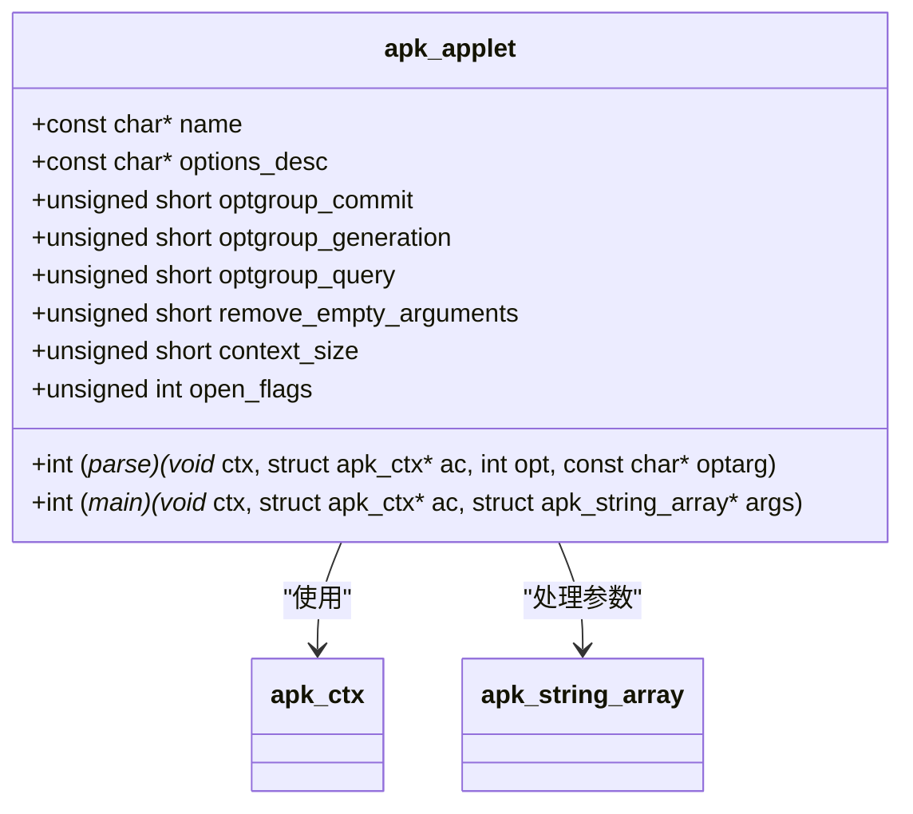
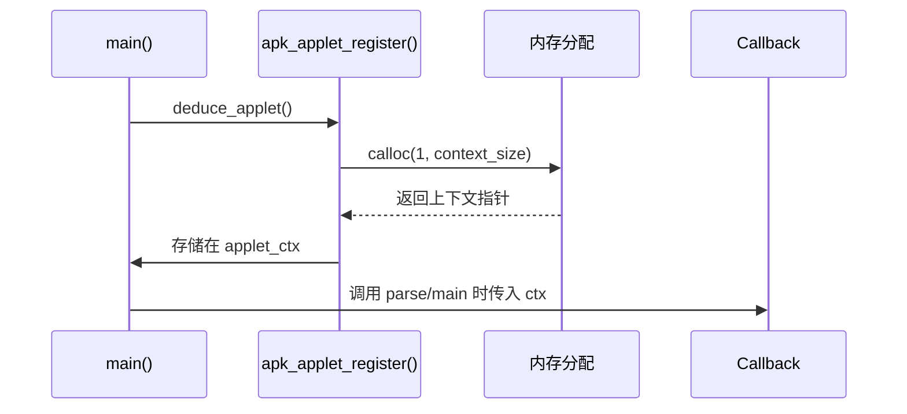
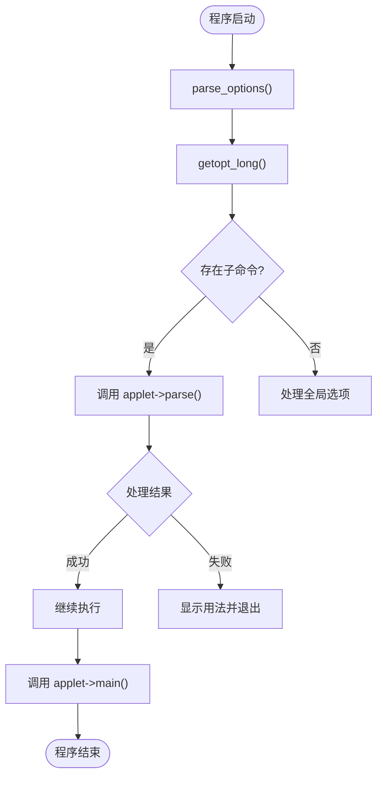

# 自定义子命令开发

<cite>
**本文档中引用的文件**  
- [apk_applet.h](file://src/apk_applet.h)
- [applet.c](file://src/applet.c)
- [apk.c](file://src/apk.c)
- [apk_context.h](file://src/apk_context.h)
- [app_add.c](file://src/app_add.c)
</cite>

## 目录
1. [简介](#简介)
2. [核心结构与注册机制](#核心结构与注册机制)
3. [上下文内存管理](#上下文内存管理)
4. [命令行选项处理](#命令行选项处理)
5. [完整自定义子命令示例](#完整自定义子命令示例)
6. [调试技巧与常见陷阱](#调试技巧与常见陷阱)

## 简介
本文档为开发者提供在 apk-tools 项目中创建自定义子命令的完整指南。涵盖从定义 `apk_applet` 结构体、注册子命令、处理命令行选项到上下文内存管理的全过程。通过分析现有代码结构，指导开发者如何正确集成新子命令并参与构建系统。

## 核心结构与注册机制

`apk_applet` 结构体是定义子命令的核心数据结构，包含子命令的名称、选项描述符、回调函数等关键信息。



**Diagram sources**  
- [apk_applet.h](file://src/apk_applet.h#L36-L58)

**Section sources**  
- [apk_applet.h](file://src/apk_applet.h#L36-L58)
- [applet.c](file://src/applet.c#L18-L32)

## 上下文内存管理

`context_size` 字段用于指定子命令私有上下文结构体的大小。系统会在运行时自动分配该大小的内存，并通过 `ctx` 参数传递给 `parse` 和 `main` 回调函数。



**Diagram sources**  
- [apk.c](file://src/apk.c#L581-L582)
- [app_add.c](file://src/app_add.c#L18-L21)

**Section sources**  
- [apk.c](file://src/apk.c#L581-L582)
- [app_add.c](file://src/app_add.c#L18-L21)

## 命令行选项处理

子命令通过 `getopt_long` 集成机制处理命令行选项。选项描述通过宏定义生成，系统自动解析并调用相应的 `parse` 回调函数。



**Diagram sources**  
- [apk.c](file://src/apk.c#L474-L519)
- [app_add.c](file://src/app_add.c#L33-L58)

**Section sources**  
- [apk.c](file://src/apk.c#L474-L519)
- [app_add.c](file://src/app_add.c#L33-L58)

## 完整自定义子命令示例

以下是一个完整的自定义子命令代码结构示例，展示了如何定义上下文结构、选项、解析函数和主函数，并正确注册到系统中。

```c
struct my_applet_ctx {
    const char *config_file;
    unsigned short verbose_level;
};

#define MY_APPLET_OPTIONS(OPT) \
    OPT(OPT_MY_CONFIG, APK_OPT_ARG "config") \
    OPT(OPT_MY_VERBOSE, APK_OPT_SH("v") "verbose")

APK_OPTIONS(my_applet_options_desc, MY_APPLET_OPTIONS);

static int my_applet_parse(void *ctx, struct apk_ctx *ac, int opt, const char *optarg) {
    struct my_applet_ctx *mctx = (struct my_applet_ctx *) ctx;
    
    switch (opt) {
    case OPT_MY_CONFIG:
        mctx->config_file = optarg;
        break;
    case OPT_MY_VERBOSE:
        mctx->verbose_level++;
        break;
    default:
        return -ENOTSUP;
    }
    return 0;
}

static int my_applet_main(void *ctx, struct apk_ctx *ac, struct apk_string_array *args) {
    struct my_applet_ctx *mctx = (struct my_applet_ctx *) ctx;
    // 实现主逻辑
    return 0;
}

static struct apk_applet my_applet = {
    .name = "myapplet",
    .options_desc = my_applet_options_desc,
    .context_size = sizeof(struct my_applet_ctx),
    .parse = my_applet_parse,
    .main = my_applet_main,
};

APK_DEFINE_APPLET(my_applet);
```

**Section sources**  
- [app_add.c](file://src/app_add.c)
- [apk_applet.h](file://src/apk_applet.h)

## 调试技巧与常见陷阱

### 常见问题及解决方案

| 问题类型 | 现象 | 解决方案 |
|---------|------|---------|
| 注册失败 | 子命令无法识别 | 确保使用 `APK_DEFINE_APPLET` 宏注册 |
| 选项解析错误 | 选项不被识别或参数错误 | 检查选项宏定义格式和 `parse` 函数实现 |
| 上下文访问错误 | 程序崩溃或数据异常 | 确认 `context_size` 设置正确且不访问未初始化内存 |
| 构建集成问题 | 新命令未编译 | 确保源文件已添加到 Makefile 或构建系统 |

### 调试建议
- 使用 `--help` 检查子命令帮助信息是否正确生成
- 通过 `strace` 或调试器跟踪 `apk_applet_register` 调用
- 在 `parse` 和 `main` 函数中添加日志输出
- 检查构建系统是否包含新源文件

**Section sources**  
- [applet.c](file://src/applet.c)
- [apk.c](file://src/apk.c)
- [app_add.c](file://src/app_add.c)