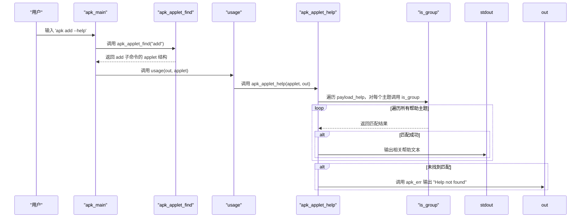

# 帮助信息动态显示

<cite>
**Referenced Files in This Document**   
- [applet.c](file://src/applet.c)
- [apk_applet.h](file://src/apk_applet.h)
- [genhelp_apk.lua](file://src/genhelp_apk.lua)
- [apk_defines.h](file://src/apk_defines.h)
- [apk_print.h](file://src/apk_print.h)
</cite>

## 目录
1. [介绍](#介绍)
2. [核心组件](#核心组件)
3. [调用流程分析](#调用流程分析)
4. [帮助信息过滤逻辑](#帮助信息过滤逻辑)
5. [错误处理机制](#错误处理机制)
6. [帮助信息生成流程](#帮助信息生成流程)
7. [扩展新帮助主题](#扩展新帮助主题)

## 介绍
`apk_applet_help` 函数是 apk-tools 中实现按需显示帮助信息的核心组件。该函数通过遍历预编译的帮助信息数据，根据当前执行的子命令（applet）与帮助主题的匹配关系，动态输出相关的帮助内容。本文档详细分析了该函数的实现机制，包括其如何处理全局选项、子命令特定选项和通用组的过滤逻辑，以及在未找到匹配帮助时的错误处理机制。

## 核心组件

`apk_applet_help` 函数通过遍历 `payload_help` 中的 null 分隔字符串对，利用 `is_group` 函数判断当前子命令与主题的匹配关系，从而只输出相关部分。该函数还支持压缩的帮助信息，通过 `COMPRESSED_HELP` 宏进行条件编译。

**Section sources**
- [applet.c](file://src/applet.c#L47-L75)
- [apk_applet.h](file://src/apk_applet.h#L54-L54)

## 调用流程分析

从用户输入 'apk add --help' 到最终输出文本的完整调用流程如下：



**Diagram sources**
- [applet.c](file://src/applet.c#L47-L75)
- [applet.c](file://src/applet.c#L23-L32)
- [apk.c](file://src/apk.c#L284-L289)

**Section sources**
- [applet.c](file://src/applet.c#L47-L75)
- [applet.c](file://src/applet.c#L23-L32)
- [apk.c](file://src/apk.c#L284-L289)

## 帮助信息过滤逻辑

`is_group` 函数实现了帮助信息的过滤逻辑，根据不同的条件判断当前子命令是否与帮助主题匹配：

```mermaid
flowchart TD
Start([开始]) --> CheckAppletNull{"applet 为空?"}
CheckAppletNull --> |是| CheckAPKTopic{"主题 == \"APK\"?"}
CheckAppletNull --> |否| CheckAppName{"主题 == applet->name?"}
CheckAppName --> |是| ReturnTrue["返回 1 (匹配)"]
CheckAppName --> |否| CheckGlobal{"主题 == \"GLOBAL\"?"}
CheckGlobal --> |是| ReturnTrue
CheckGlobal --> |否| CheckGeneration{"applet->optgroup_generation && 主题 == \"GENERATION\"?"}
CheckGeneration --> |是| ReturnTrue
CheckGeneration --> |否| CheckCommit{"applet->optgroup_commit && 主题 == \"COMMIT\"?"}
CheckCommit --> |是| ReturnTrue
CheckCommit --> |否| CheckQuery{"applet->optgroup_query && 主题 == \"QUERY\"?"}
CheckQuery --> |是| ReturnTrue
CheckQuery --> |否| ReturnFalse["返回 0 (不匹配)"]
CheckAPKTopic --> |是| ReturnTrue
CheckAPKTopic --> |否| ReturnFalse
ReturnTrue --> End([结束])
ReturnFalse --> End
```

**Diagram sources**
- [applet.c](file://src/applet.c#L35-L44)

**Section sources**
- [applet.c](file://src/applet.c#L35-L44)

## 错误处理机制

当 `apk_applet_help` 函数未能找到匹配的帮助信息时，会调用 `apk_err` 函数输出错误信息。该机制确保了即使在帮助信息缺失的情况下，用户也能获得明确的反馈。

```mermaid
flowchart TD
Start([apk_applet_help]) --> ProcessHelp["处理 payload_help"]
ProcessHelp --> CountNum["统计匹配数量 num"]
CountNum --> CheckNum{"num == 0?"}
CheckNum --> |是| CallApkErr["调用 apk_err(out, \"Help not found\")"]
CheckNum --> |否| OutputHelp["输出帮助信息"]
CallApkErr --> End([函数结束])
OutputHelp --> End
```

**Diagram sources**
- [applet.c](file://src/applet.c#L47-L75)
- [apk_print.h](file://src/apk_print.h#L39-L40)

**Section sources**
- [applet.c](file://src/applet.c#L47-L75)
- [apk_print.h](file://src/apk_print.h#L39-L40)

## 帮助信息生成流程

帮助信息的生成是一个自动化的过程，通过 Lua 脚本 `genhelp_apk.lua` 从 manpage 文件生成 C 语言的常量数组：

```mermaid
graph TD
A[scdoc manpage] --> B[genhelp_apk.lua]
B --> C[解析文档结构]
C --> D[生成 help payload]
D --> E[压缩数据 (可选)]
E --> F[生成 C 代码]
F --> G[payload_help 数组]
G --> H[编译到 apk-tools]
```

**Diagram sources**
- [genhelp_apk.lua](file://src/genhelp_apk.lua)

**Section sources**
- [genhelp_apk.lua](file://src/genhelp_apk.lua)

## 扩展新帮助主题

要扩展新的帮助主题，需要在 `genhelp_apk.lua` 脚本中定义新的选项组，并在相应的 applet 结构中设置对应的 optgroup 标志位。例如，要为某个子命令添加新的帮助主题，可以在 Lua 脚本中添加相应的渲染逻辑，并在 C 代码中设置 `optgroup_` 相关字段。

**Section sources**
- [genhelp_apk.lua](file://src/genhelp_apk.lua)
- [apk_applet.h](file://src/apk_applet.h#L36-L51)