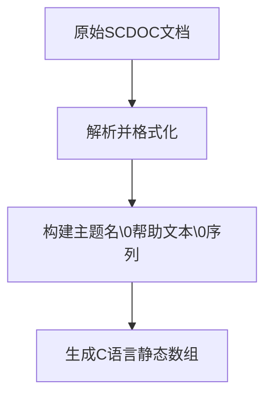
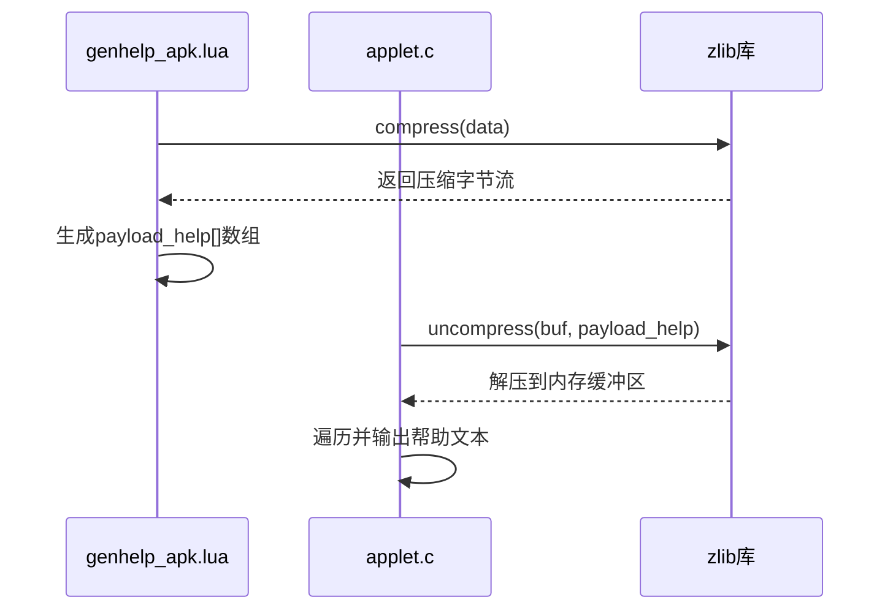

# 帮助数据存储与压缩

<cite>
**本文档引用的文件**   
- [genhelp_apk.lua](file://src/genhelp_apk.lua)
- [applet.c](file://src/applet.c)
- [genhelp.lua](file://src/genhelp.lua)
</cite>

## 目录
1. [介绍](#介绍)
2. [帮助数据结构设计](#帮助数据结构设计)
3. [压缩机制与运行时解压](#压缩机制与运行时解压)
4. [静态常量数组的优势](#静态常量数组的优势)
5. [数据流转换示意图](#数据流转换示意图)
6. [内存使用优化建议](#内存使用优化建议)

## 介绍
apk-tools 项目通过将帮助文本嵌入二进制文件的方式，实现了帮助信息的高效存储与快速访问。该机制利用 Lua 脚本 `genhelp_apk.lua` 将原始帮助文档转换为 C 语言中的静态常量数组，并通过 zlib 压缩算法减少存储空间占用。本文档详细解析这一过程的技术实现，包括数据结构设计、压缩与解压流程、以及在嵌入式环境下的性能优势。

**Section sources**
- [genhelp_apk.lua](file://src/genhelp_apk.lua#L1-L150)
- [applet.c](file://src/applet.c#L1-L77)

## 帮助数据结构设计
`genhelp_apk.lua` 脚本负责生成 `payload_help` 数组，其二进制格式设计精巧。所有主题名称与对应帮助文本以 null 字符（`\0`）分隔，形成连续的字符串序列。这种设计使得在运行时可以通过简单的字符串操作进行遍历和查找，无需复杂的解析逻辑。每个主题名后紧跟其帮助内容，同样以 null 字符结尾，便于按块读取。

**Diagram sources**
- [genhelp_apk.lua](file://src/genhelp_apk.lua#L74-L88)
- [genhelp_apk.lua](file://src/genhelp_apk.lua#L118-L134)

**Section sources**
- [genhelp_apk.lua](file://src/genhelp_apk.lua#L74-L88)
- [genhelp_apk.lua](file://src/genhelp_apk.lua#L118-L134)

## 压缩机制与运行时解压
`COMPRESSED_HELP` 宏用于标识帮助数据是否经过压缩。当启用压缩时，`genhelp_apk.lua` 调用 `app:compress(data)` 方法（基于 zlib 的 gzip 压缩）对拼接后的帮助数据进行压缩，并将压缩后的字节流写入 `payload_help[]` 数组。在运行时，`applet.c` 中的 `apk_applet_help` 函数通过 `uncompress` 函数调用将压缩数据解压至临时缓冲区，随后在内存中进行遍历输出。此机制显著减少了二进制文件体积，同时保持了运行时的可访问性。

**Diagram sources**
- [genhelp_apk.lua](file://src/genhelp_apk.lua#L120-L122)
- [applet.c](file://src/applet.c#L58-L62)

**Section sources**
- [genhelp_apk.lua](file://src/genhelp_apk.lua#L120-L122)
- [applet.c](file://src/applet.c#L58-L62)

## 静态常量数组的优势
在嵌入式环境下，将帮助数据作为静态常量数组嵌入二进制文件具有显著优势。首先，它完全消除了对外部帮助文件的依赖，确保了软件包的自包含性和可移植性。其次，避免了文件 I/O 操作，极大提高了帮助信息的启动和访问速度。此外，编译时确定的数据大小有助于内存规划，且只读属性增强了运行时安全性。尽管增加了二进制体积，但通过 zlib 压缩有效缓解了这一问题。

**Section sources**
- [genhelp_apk.lua](file://src/genhelp_apk.lua#L123-L134)
- [applet.c](file://src/applet.c#L52-L53)

## 数据流转换示意图
以下流程图展示了从原始文本到最终压缩字节流的完整转换过程。

**Diagram sources**
- [genhelp.lua](file://src/genhelp.lua#L129-L195)
- [genhelp_apk.lua](file://src/genhelp_apk.lua#L139-L147)

## 内存使用优化建议
当前实现中，解压过程需要分配一个与原始数据大小相等的临时缓冲区（`buf[payload_help_size]`）。一个潜在的优化点是采用流式解压，结合有限状态机直接解析压缩流中的 null 分隔符，从而避免一次性加载全部解压数据，减少峰值内存占用。此外，可评估不同压缩级别对体积与解压时间的权衡，选择最适合目标平台的配置。

**Section sources**
- [applet.c](file://src/applet.c#L52-L53)
- [genhelp_apk.lua](file://src/genhelp_apk.lua#L120-L121)