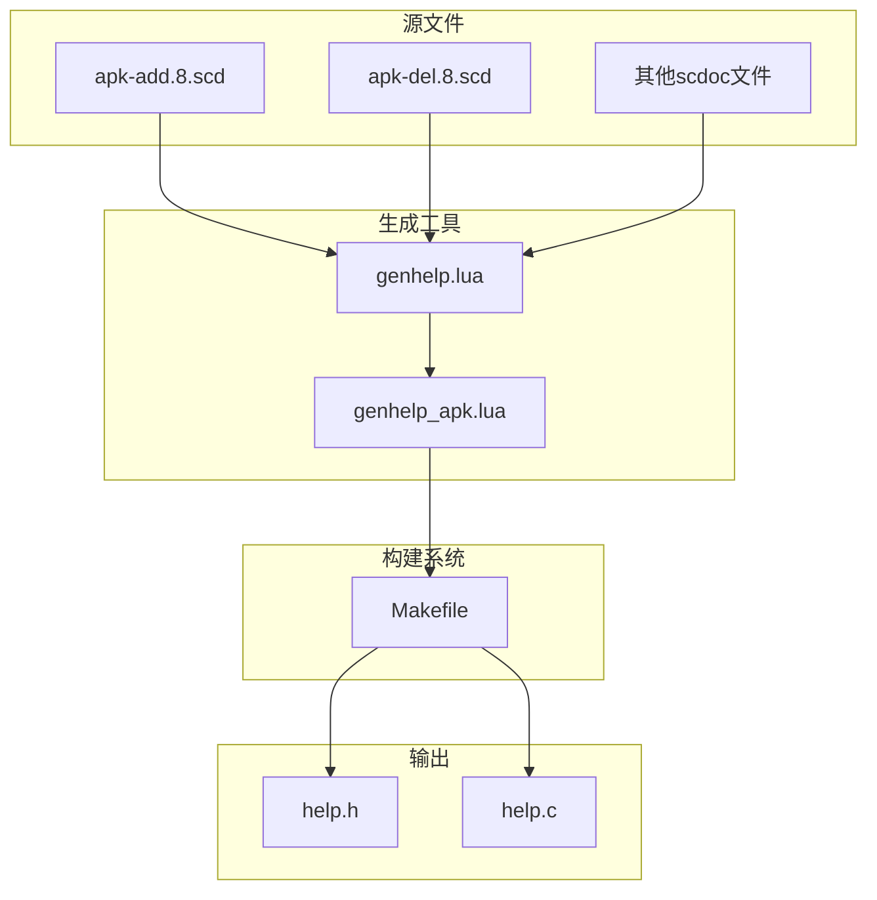
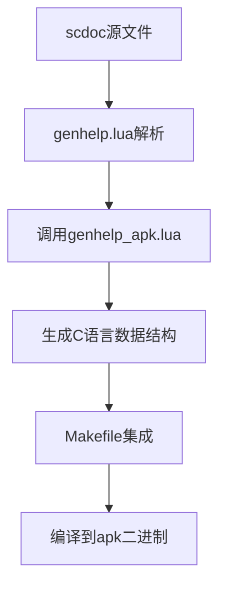
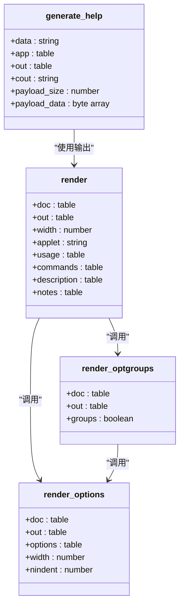
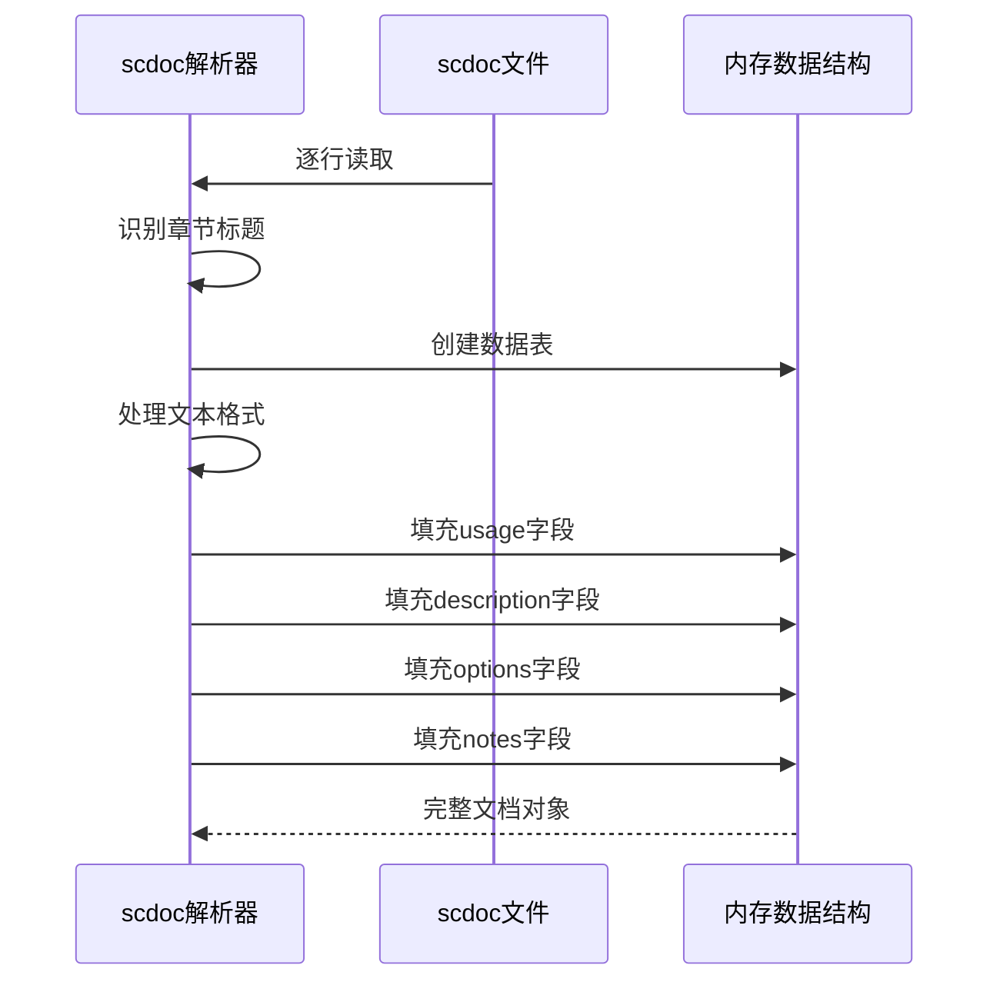
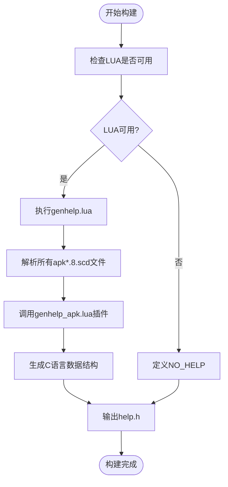
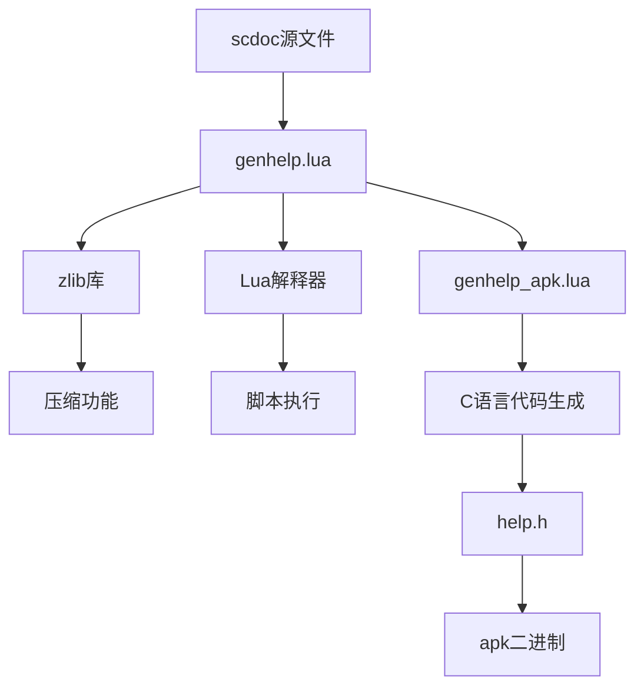

# 帮助文档生成

<cite>
**本文档引用的文件**  
- [genhelp_apk.lua](file://src/genhelp_apk.lua)
- [genhelp.lua](file://src/genhelp.lua)
- [Makefile](file://src/Makefile)
- [applet.c](file://src/applet.c)
- [apk-add.8.scd](file://doc/apk-add.8.scd)
- [apk-del.8.scd](file://doc/apk-del.8.scd)
</cite>

## 目录
1. [简介](#简介)
2. [项目结构](#项目结构)
3. [核心组件](#核心组件)
4. [架构概述](#架构概述)
5. [详细组件分析](#详细组件分析)
6. [依赖分析](#依赖分析)
7. [性能考虑](#性能考虑)
8. [故障排除指南](#故障排除指南)
9. [结论](#结论)

## 简介
本文档详细介绍了apk-tools项目中帮助文档的生成机制。重点说明了如何通过Lua脚本将scdoc格式的手册页转换为C语言源码中的压缩数据块，以及开发者如何修改和添加帮助文本。文档涵盖了从源文件编辑到最终二进制输出的完整流程，并解释了相关性能优化策略。

## 项目结构
apk-tools项目的帮助文档生成系统主要由以下几个部分组成：位于`doc/`目录下的scdoc源文件、位于`src/`目录中的Lua生成脚本和Makefile构建规则。该系统采用自动化流程将人类可读的手册页转换为嵌入式帮助数据。

**Diagram sources**  
- [doc/apk-add.8.scd](file://doc/apk-add.8.scd)
- [src/genhelp.lua](file://src/genhelp.lua)
- [src/genhelp_apk.lua](file://src/genhelp_apk.lua)
- [src/Makefile](file://src/Makefile)

**Section sources**  
- [src/Makefile](file://src/Makefile#L78-L124)
- [doc/apk-add.8.scd](file://doc/apk-add.8.scd#L1-L67)

## 核心组件
帮助文档生成系统的核心组件包括scdoc解析器、格式化渲染器和数据压缩模块。`genhelp.lua`作为主控脚本负责解析所有scdoc文件并调用`genhelp_apk.lua`插件进行特定格式的生成。整个系统设计为可扩展，支持不同输出格式。

**Section sources**  
- [src/genhelp.lua](file://src/genhelp.lua#L1-L196)
- [src/genhelp_apk.lua](file://src/genhelp_apk.lua#L1-L151)

## 架构概述
帮助文档生成系统采用分层架构，从源文档解析到最终代码生成分为多个阶段。系统首先解析scdoc格式的源文件，然后通过插件机制生成特定格式的输出，最后由构建系统将其集成到最终的二进制文件中。

**Diagram sources**  
- [src/genhelp.lua](file://src/genhelp.lua#L169-L195)
- [src/genhelp_apk.lua](file://src/genhelp_apk.lua#L139-L148)
- [src/Makefile](file://src/Makefile#L91-L96)

## 详细组件分析

### genhelp_apk.lua分析
`genhelp_apk.lua`脚本是帮助文档生成的核心组件，负责将解析后的文档数据转换为C语言源码格式。

#### 渲染函数分析

**Diagram sources**  
- [src/genhelp_apk.lua](file://src/genhelp_apk.lua#L84-L112)
- [src/genhelp_apk.lua](file://src/genhelp_apk.lua#L35-L64)
- [src/genhelp_apk.lua](file://src/genhelp_apk.lua#L71-L81)
- [src/genhelp_apk.lua](file://src/genhelp_apk.lua#L118-L134)

**Section sources**  
- [src/genhelp_apk.lua](file://src/genhelp_apk.lua#L84-L112)

### scdoc格式解析
系统使用`genhelp.lua`中的scdoc解析器来处理手册页源文件。解析器能够识别各种Markdown-like语法元素，并将其转换为结构化的数据表。

**Diagram sources**  
- [src/genhelp.lua](file://src/genhelp.lua#L24-L134)

**Section sources**  
- [src/genhelp.lua](file://src/genhelp.lua#L24-L134)

### 构建系统集成
Makefile在帮助文档生成过程中扮演关键角色，它定义了从源文件到最终头文件的依赖关系和生成规则。

**Diagram sources**  
- [src/Makefile](file://src/Makefile#L91-L96)

**Section sources**  
- [src/Makefile](file://src/Makefile#L91-L124)

## 依赖分析
帮助文档生成系统依赖于多个外部组件和内部模块的协同工作。这些依赖关系确保了从源文档到可执行代码的无缝转换。

**Diagram sources**  
- [src/genhelp.lua](file://src/genhelp.lua#L157-L167)
- [src/Makefile](file://src/Makefile#L17-L18)

**Section sources**  
- [src/genhelp.lua](file://src/genhelp.lua#L153-L167)
- [src/Makefile](file://src/Makefile#L17-L18)

## 性能考虑
帮助文档生成系统在设计时充分考虑了性能和资源使用效率，特别是在二进制文件大小方面。

### 文本压缩机制
系统默认使用gzip压缩帮助文本，显著减少了最终二进制文件的体积。压缩过程在构建时完成，运行时只需解压缩，平衡了存储空间和运行性能。

**Diagram sources**  
- [src/genhelp_apk.lua](file://src/genhelp_apk.lua#L120-L133)
- [src/applet.c](file://src/applet.c#L52-L61)

**Section sources**  
- [src/genhelp_apk.lua](file://src/genhelp_apk.lua#L118-L134)
- [src/applet.c](file://src/applet.c#L50-L76)

### 内存使用优化
通过将帮助文本作为压缩数据块嵌入二进制文件，系统避免了运行时读取外部文件的开销。同时，按需解压缩的设计确保了内存使用的高效性。

## 故障排除指南
当帮助文档生成出现问题时，可以按照以下步骤进行排查：

**Section sources**  
- [src/genhelp.lua](file://src/genhelp.lua#L174-L186)
- [src/Makefile](file://src/Makefile#L92-L95)

### 常见问题及解决方案
1. **Lua解释器未找到**：确保系统中安装了Lua 5.3，并在PATH中可用
2. **scdoc文件解析错误**：检查文件格式是否符合规范，特别是章节标题的语法
3. **压缩失败**：确认zlib库已正确安装并可被Lua脚本访问
4. **生成的help.h缺失**：检查Makefile中的依赖关系和生成规则

## 结论
apk-tools的帮助文档生成系统是一个高效、可维护的自动化流程。通过将文档与代码生成分离，系统实现了文档内容的易编辑性和最终二进制文件的紧凑性。开发者可以轻松地通过编辑scdoc文件来更新帮助文本，而构建系统会自动完成其余工作。这种设计不仅提高了开发效率，还确保了帮助文档与软件功能的一致性。