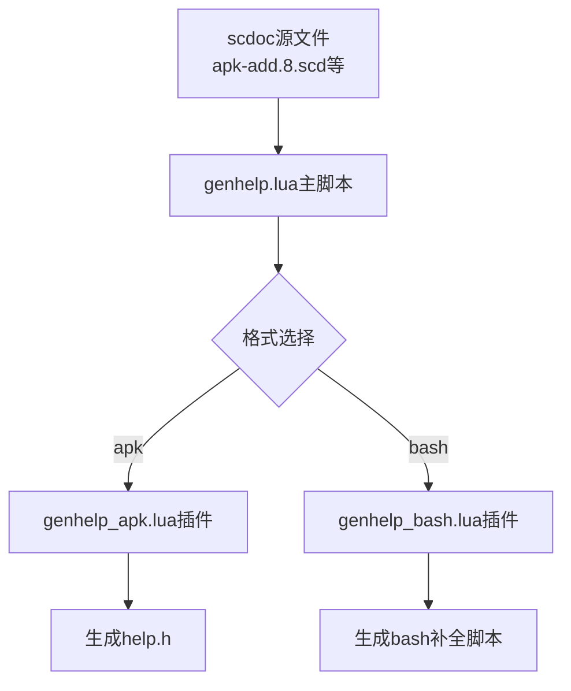
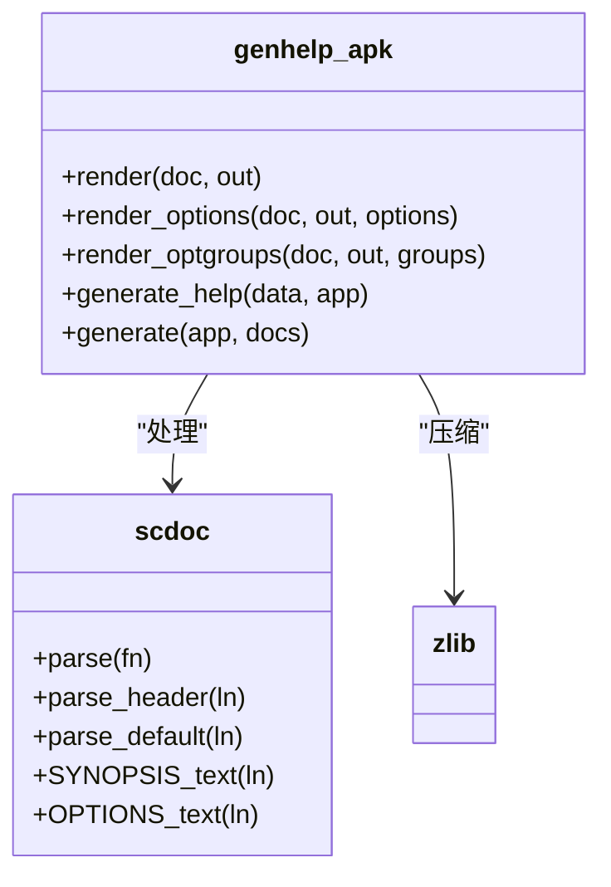
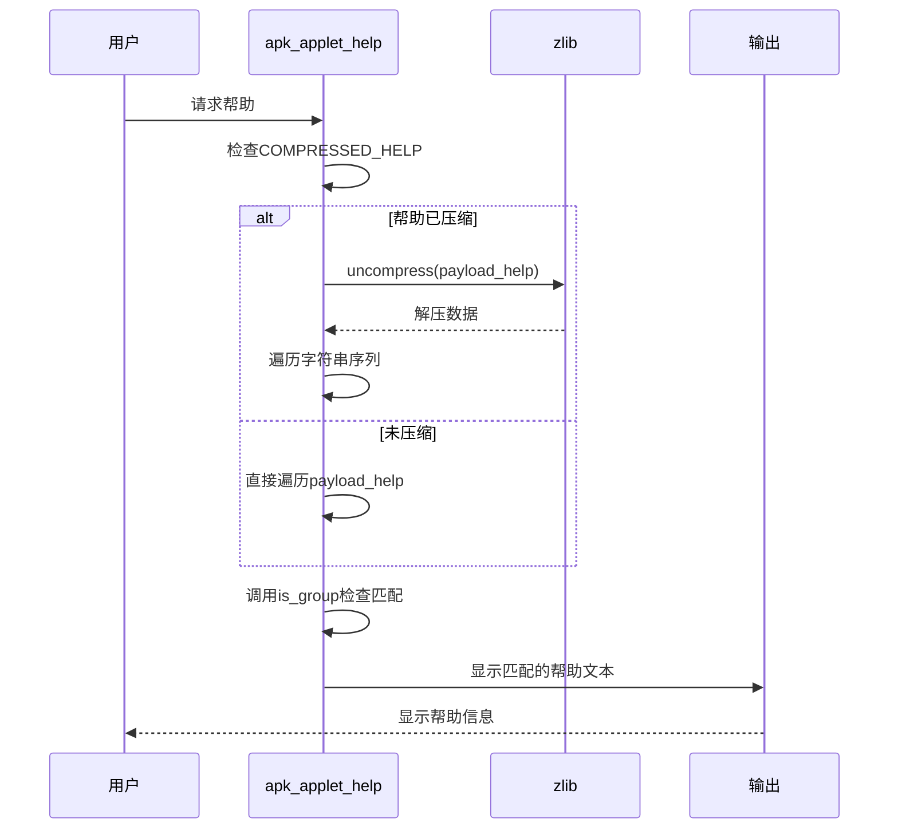

# 帮助系统

<cite>
**本文档中引用的文件**   
- [applet.c](file://src/applet.c)
- [genhelp.lua](file://src/genhelp.lua)
- [genhelp_apk.lua](file://src/genhelp_apk.lua)
- [apk_applet.h](file://src/apk_applet.h)
- [Makefile](file://src/Makefile)
- [apk-add.8.scd](file://doc/apk-add.8.scd)
</cite>

## 目录
1. [帮助系统概述](#帮助系统概述)
2. [帮助数据生成流程](#帮助数据生成流程)
3. [帮助数据结构与压缩](#帮助数据结构与压缩)
4. [帮助信息显示机制](#帮助信息显示机制)
5. [帮助内容组织结构](#帮助内容组织结构)
6. [帮助文档更新流程](#帮助文档更新流程)

## 帮助系统概述

apk-tools的帮助系统采用了一种高效的内置帮助机制，将scdoc格式的手册页转换为压缩的二进制数据嵌入到可执行文件中。这种设计避免了运行时查找外部帮助文件的开销，同时通过压缩减少了二进制文件的大小。帮助系统的核心组件包括genhelp.lua脚本、genhelp_apk.lua插件和applet.c中的运行时显示逻辑。

**Section sources**
- [applet.c](file://src/applet.c#L1-L77)
- [genhelp.lua](file://src/genhelp.lua#L1-L196)

## 帮助数据生成流程

帮助数据的生成是一个自动化的过程，由Makefile中的构建规则触发。当构建系统检测到doc目录下的scdoc文件发生变化时，会调用genhelp.lua脚本处理这些源文件。genhelp.lua作为主控制器，解析命令行参数并根据指定的格式（如apk或bash）加载相应的插件（如genhelp_apk.lua）来生成输出。

**Diagram sources**
- [genhelp.lua](file://src/genhelp.lua#L169-L192)
- [Makefile](file://src/Makefile#L98-L100)

**Section sources**
- [genhelp.lua](file://src/genhelp.lua#L169-L192)
- [Makefile](file://src/Makefile#L90-L104)

## 帮助数据结构与压缩

genhelp_apk.lua插件负责将解析后的帮助内容转换为C语言头文件格式。该插件首先调用render和render_optgroups函数将文档内容格式化为字符串序列，然后使用gzip算法进行压缩。生成的代码包含三个关键元素：COMPRESSED_HELP宏定义、payload_help_size变量和payload_help字节数组。

**Diagram sources**
- [genhelp_apk.lua](file://src/genhelp_apk.lua#L84-L148)
- [genhelp.lua](file://src/genhelp.lua#L129-L134)

**Section sources**
- [genhelp_apk.lua](file://src/genhelp_apk.lua#L114-L150)
- [genhelp.lua](file://src/genhelp.lua#L153-L167)

## 帮助信息显示机制

运行时的帮助信息显示由applet.c中的apk_applet_help函数实现。当用户请求特定子命令的帮助时，系统首先检查COMPRESSED_HELP宏是否定义。如果定义了，则使用zlib的uncompress函数解压payload_help数组到临时缓冲区；否则直接从原始数据读取。函数通过遍历字符串序列，使用is_group函数判断当前主题是否与请求的子命令匹配，从而选择性地显示相关内容。

**Diagram sources**
- [applet.c](file://src/applet.c#L48-L76)
- [apk_applet.h](file://src/apk_applet.h#L55)

**Section sources**
- [applet.c](file://src/applet.c#L48-L76)

## 帮助内容组织结构

帮助内容采用分层组织结构，确保信息的清晰和可读性。每个子命令的帮助信息以子命令名称作为主题标识，后跟用法说明（SYNOPSIS）。全局选项（GLOBAL OPTIONS）在所有子命令中共享，而特定于子命令的选项则分组显示。使用示例和注意事项（NOTES）部分提供实际操作指导。这种结构通过在字符串序列中使用空字符（\0）作为分隔符来实现，使得运行时可以高效地定位和显示特定部分。

**Section sources**
- [apk-add.8.scd](file://doc/apk-add.8.scd#L1-L67)
- [genhelp_apk.lua](file://src/genhelp_apk.lua#L71-L81)

## 帮助文档更新流程

更新帮助文档的完整流程包括三个主要步骤：修改源文件、重新生成和验证。首先，开发者需要编辑doc目录下的相应scdoc文件，遵循scdoc的标记语法。然后，通过重新构建项目触发genhelp.lua脚本的执行，该脚本会自动处理所有scdoc文件并生成更新的help.h。最后，通过编译和运行apk-tools，验证新帮助内容的正确显示。此流程确保了帮助文档与代码功能的同步，同时保持了高效的构建过程。

**Section sources**
- [Makefile](file://src/Makefile#L98-L100)
- [genhelp.lua](file://src/genhelp.lua#L174-L186)