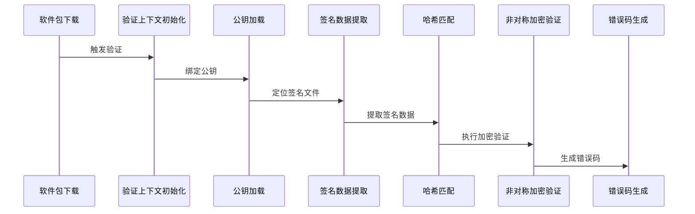
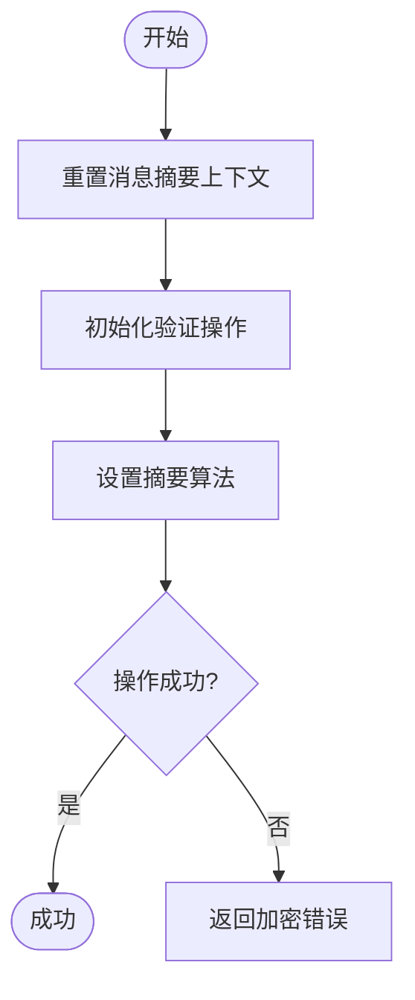
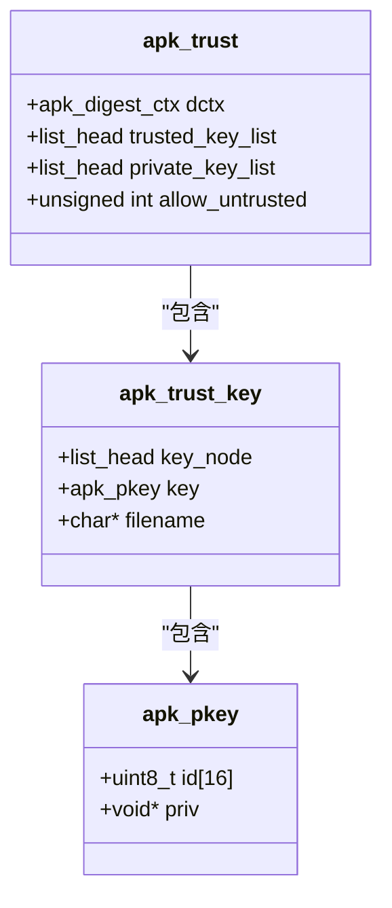
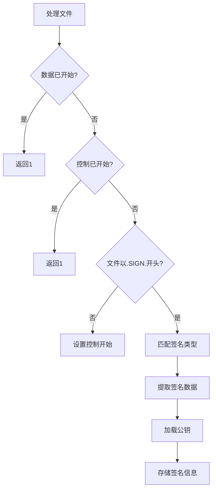
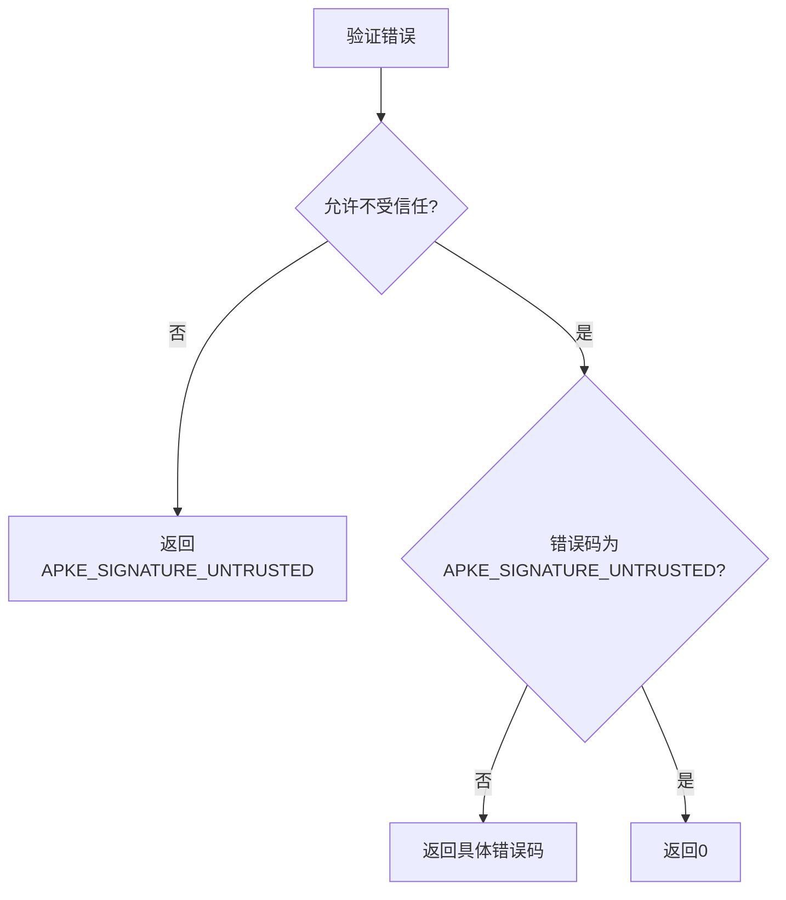
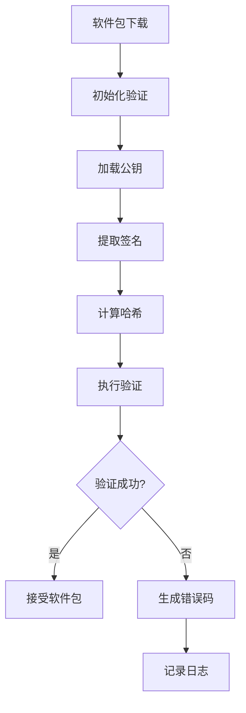

# GPG签名验证流程

<cite>
**本文档引用的文件**   
- [apk_crypto.h](file://src/apk_crypto.h)
- [trust.c](file://src/trust.c)
- [app_verify.c](file://src/app_verify.c)
- [crypto_openssl.c](file://src/crypto_openssl.c)
- [extract_v2.c](file://src/extract_v2.c)
- [adb.c](file://src/adb.c)
- [apk_trust.h](file://src/apk_trust.h)
- [apk_defines.h](file://src/apk_defines.h)
</cite>

## 目录
1. [引言](#引言)
2. [验证流程概述](#验证流程概述)
3. [核心组件分析](#核心组件分析)
4. [验证上下文初始化](#验证上下文初始化)
5. [公钥绑定与签名比对](#公钥绑定与签名比对)
6. [签名数据提取与哈希匹配](#签名数据提取与哈希匹配)
7. [非对称加密验证](#非对称加密验证)
8. [错误码生成与日志输出](#错误码生成与日志输出)
9. [常见签名错误诊断](#常见签名错误诊断)
10. [安全审计支持](#安全审计支持)
11. [结论](#结论)

## 引言
apk-tools的GPG签名验证机制是确保软件包完整性和来源可信性的关键安全组件。该机制在软件包下载后立即触发，通过一系列严格的密码学验证步骤来确认软件包未被篡改且来自可信源。本文档全面解析该验证机制，为安全审计人员提供详细的流程分析和关键检查点。

## 验证流程概述



**图示来源**
- [extract_v2.c](file://src/extract_v2.c#L38-L87)
- [crypto_openssl.c](file://src/crypto_openssl.c#L226-L233)

## 核心组件分析

apk-tools的GPG签名验证机制由多个核心组件协同工作，包括验证上下文管理、公钥处理、密码学操作和错误处理系统。这些组件共同构成了一个完整的验证流程，确保软件包的安全性。

**本节来源**
- [apk_crypto.h](file://src/apk_crypto.h#L104-L104)
- [apk_trust.h](file://src/apk_trust.h#L27-L30)
- [extract_v2.c](file://src/extract_v2.c#L20-L43)

## 验证上下文初始化

验证流程始于`apk_verify_start`函数的调用，该函数初始化验证上下文并准备进行签名验证。在OpenSSL实现中，此过程涉及重置消息摘要上下文并初始化验证操作。



**图示来源**
- [crypto_openssl.c](file://src/crypto_openssl.c#L226-L233)
- [crypto_mbedtls.c](file://src/crypto_mbedtls.c#L322-L331)

**本节来源**
- [crypto_openssl.c](file://src/crypto_openssl.c#L226-L233)
- [crypto_mbedtls.c](file://src/crypto_mbedtls.c#L322-L331)

## 公钥绑定与签名比对

公钥绑定是验证过程的关键步骤，系统通过`apk_trust_load_key`函数加载公钥，并在验证上下文中建立绑定关系。签名比对过程涉及从软件包中识别签名文件并匹配相应的公钥。



**图示来源**
- [trust.c](file://src/trust.c#L5-L21)
- [apk_trust.h](file://src/apk_trust.h#L13-L25)

**本节来源**
- [trust.c](file://src/trust.c#L5-L21)
- [apk_trust.h](file://src/apk_trust.h#L13-L25)

## 签名数据提取与哈希匹配

签名数据提取过程通过分析软件包中的特殊文件（以.SIGN.开头）来定位签名信息。系统根据文件名确定使用的摘要算法，并提取相应的公钥进行验证。



**图示来源**
- [extract_v2.c](file://src/extract_v2.c#L89-L173)
- [extract_v2.c](file://src/extract_v2.c#L38-L87)

**本节来源**
- [extract_v2.c](file://src/extract_v2.c#L89-L173)

## 非对称加密验证

非对称加密验证是整个流程的核心，通过`apk_verify`函数执行最终的签名验证。该过程使用公钥对签名进行解密，并与计算出的哈希值进行比对。

```mermaid
sequenceDiagram
participant 验证上下文 as apk_digest_ctx
participant 公钥 as apk_pkey
participant 签名数据 as 签名数据
participant 验证结果 as 验证结果
验证上下文->>验证上下文 : 重置算法
验证上下文->>公钥 : 绑定公钥
验证上下文->>签名数据 : 提供签名
验证结果<-验证上下文 : 返回验证结果
```

**图示来源**
- [crypto_openssl.c](file://src/crypto_openssl.c#L236-L240)
- [extract_v2.c](file://src/extract_v2.c#L233-L275)

**本节来源**
- [crypto_openssl.c](file://src/crypto_openssl.c#L236-L240)
- [extract_v2.c](file://src/extract_v2.c#L233-L275)

## 错误码生成与日志输出

验证失败时，系统生成详细的错误码并输出相应的日志信息。错误码系统设计为层次化结构，便于诊断和处理不同类型的验证失败。



**图示来源**
- [extract_v2.c](file://src/extract_v2.c#L245-L248)
- [apk_defines.h](file://src/apk_defines.h#L65-L66)

**本节来源**
- [extract_v2.c](file://src/extract_v2.c#L245-L248)
- [apk_defines.h](file://src/apk_defines.h#L65-L66)

## 常见签名错误诊断

### 过期密钥
当使用的公钥已过期时，系统会拒绝验证。审计人员应检查密钥的有效期和信任链。

### 无效签名
无效签名通常由数据篡改或签名过程错误引起。应重新下载软件包并重新验证。

### 算法不匹配
当签名使用的摘要算法与预期不匹配时，验证会失败。应确保使用正确的算法配置。

**本节来源**
- [apk_defines.h](file://src/apk_defines.h#L61-L66)
- [extract_v2.c](file://src/extract_v2.c#L245-L248)

## 安全审计支持

为支持安全审计，提供以下关键检查点清单：

1. **验证上下文初始化**：确保`apk_verify_start`正确初始化
2. **公钥加载**：验证`apk_trust_load_key`正确加载可信公钥
3. **签名提取**：确认签名文件正确识别和提取
4. **哈希计算**：检查摘要算法正确应用
5. **非对称验证**：验证`apk_verify`函数正确执行
6. **错误处理**：确保错误码正确生成和处理



**图示来源**
- [app_verify.c](file://src/app_verify.c#L18-L35)
- [extract_v2.c](file://src/extract_v2.c#L330-L358)

**本节来源**
- [app_verify.c](file://src/app_verify.c#L18-L35)
- [extract_v2.c](file://src/extract_v2.c#L330-L358)

## 结论
apk-tools的GPG签名验证机制是一个多层次的安全系统，通过严格的密码学验证确保软件包的完整性和来源可信性。该机制遵循最小权限原则，为安全审计提供了清晰的检查点和详细的错误信息。理解这一流程对于维护软件供应链安全至关重要。