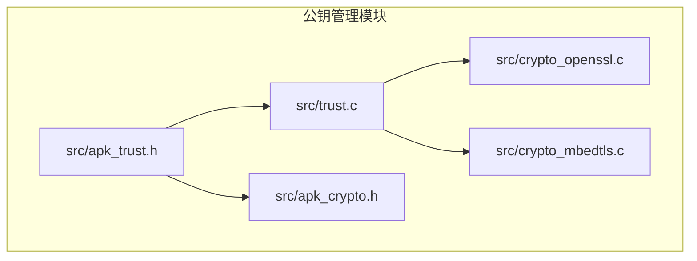
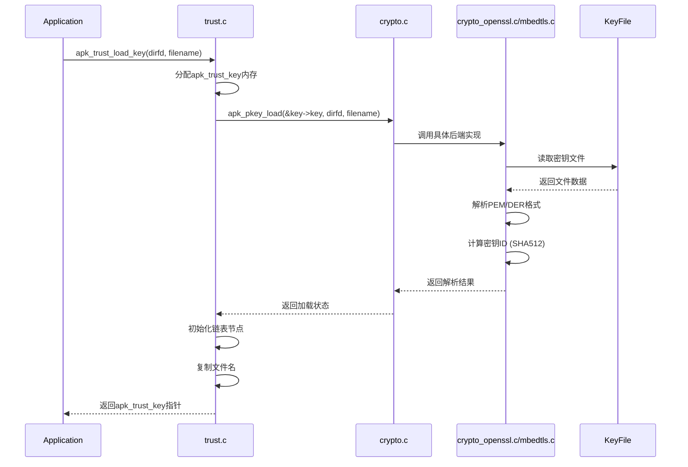

# 公钥加载与可信密钥检索

<cite>
**Referenced Files in This Document**   
- [src/trust.c](file://src/trust.c)
- [src/apk_trust.h](file://src/apk_trust.h)
- [src/crypto_openssl.c](file://src/crypto_openssl.c)
- [src/crypto_mbedtls.c](file://src/crypto_mbedtls.c)
- [src/apk_crypto.h](file://src/apk_crypto.h)
</cite>

## Table of Contents
1. [项目结构](#项目结构)
2. [核心组件](#核心组件)
3. [公钥加载机制](#公钥加载机制)
4. [密钥匹配与检索](#密钥匹配与检索)
5. [密钥ID生成原理](#密钥id生成原理)
6. [错误诊断与安全实践](#错误诊断与安全实践)

## 项目结构
apk-tools项目采用模块化设计，其核心安全功能位于`src/`目录下。与GPG公钥管理直接相关的文件主要集中在`src/trust.c`、`src/crypto_openssl.c`和`src/crypto_mbedtls.c`中。`src/apk_trust.h`头文件定义了可信密钥的抽象数据结构，而`src/apk_crypto.h`则提供了底层加密操作的统一接口。该项目支持OpenSSL和mbedTLS两种加密后端，通过条件编译实现功能适配。

**Diagram sources**
- [src/apk_trust.h](file://src/apk_trust.h)
- [src/trust.c](file://src/trust.c)
- [src/crypto_openssl.c](file://src/crypto_openssl.c)
- [src/crypto_mbedtls.c](file://src/crypto_mbedtls.c)
- [src/apk_crypto.h](file://src/apk_crypto.h)

**Section sources**
- [src/trust.c](file://src/trust.c)
- [src/apk_trust.h](file://src/apk_trust.h)

## 核心组件
本系统的核心组件围绕`struct apk_trust`和`struct apk_pkey`两个数据结构构建。`apk_trust`结构体维护了可信公钥和私钥的链表，是整个信任体系的中心。`apk_pkey`结构体封装了加密库（OpenSSL/mbedTLS）的原生密钥对象，并包含一个16字节的密钥ID，用于快速识别和匹配。`apk_trust_key`结构体作为桥梁，将`apk_pkey`与文件名关联起来，存储在`apk_trust`的`trusted_key_list`链表中。

**Section sources**
- [src/apk_trust.h](file://src/apk_trust.h#L13-L30)
- [src/apk_crypto.h](file://src/apk_crypto.h#L93-L96)

## 公钥加载机制
公钥加载的核心流程由`apk_trust_load_key`函数驱动。该函数首先在指定目录文件描述符`dirfd`下，通过文件名`filename`定位公钥文件。随后，它调用`apk_pkey_load`函数，该函数根据编译时选择的加密后端（OpenSSL或mbedTLS）执行具体操作。

在OpenSSL后端，`apk_pkey_load`使用`BIO_new_fp`创建一个文件指针BIO对象，并调用`PEM_read_bio_PUBKEY`函数解析PEM格式的公钥。对于DER格式，该函数同样适用，因为OpenSSL的PEM读取函数能够自动识别并处理DER编码。在mbedTLS后端，`apk_pkey_load`首先通过`apk_load_file_at`将整个密钥文件读入内存缓冲区，然后调用`mbedtls_pk_parse_public_key`进行解析。两种后端在解析成功后，都会调用`apk_pkey_init`或`apk_pkey_fingerprint`来计算并设置密钥ID。

**Diagram sources**
- [src/trust.c](file://src/trust.c#L5-L21)
- [src/crypto_openssl.c](file://src/crypto_openssl.c#L189-L208)
- [src/crypto_mbedtls.c](file://src/crypto_mbedtls.c#L258-L293)

**Section sources**
- [src/trust.c](file://src/trust.c#L5-L21)
- [src/crypto_openssl.c](file://src/crypto_openssl.c#L189-L208)
- [src/crypto_mbedtls.c](file://src/crypto_mbedtls.c#L258-L293)

## 密钥匹配与检索
可信密钥的检索由`apk_trust_key_by_name`函数实现。该函数接收一个`struct apk_trust`指针和一个文件名字符串。它通过`list_for_each_entry`宏遍历`trusted_key_list`链表中的每一个`apk_trust_key`节点。对于每个节点，它使用`strcmp`函数将节点中存储的`filename`与传入的查询文件名进行比较。一旦找到完全匹配的项，函数立即返回该节点内嵌的`apk_pkey`结构体的指针。如果遍历完整个链表都未找到匹配项，则返回`NULL`。这种基于文件名的线性搜索是简单直接的，适用于密钥数量不多的场景。

**Section sources**
- [src/trust.c](file://src/trust.c#L50-L58)

## 密钥ID生成原理
密钥ID是公钥的唯一标识，其生成方式在不同加密后端中保持一致。在OpenSSL后端，`apk_pkey_init`函数首先调用`i2d_PublicKey`将`EVP_PKEY`对象序列化为DER编码的字节流。然后，它使用`EVP_Digest`函数对该字节流应用SHA512哈希算法。最终，哈希值的前16个字节被复制到`apk_pkey`结构体的`id`字段中。mbedTLS后端的`apk_pkey_fingerprint`函数采用相同逻辑：先用`mbedtls_pk_write_pubkey`导出公钥的DER编码，再用`mbedtls_md`计算SHA512哈希，并取前16字节作为ID。这种设计确保了即使使用不同加密库，同一公钥也能生成相同的ID，为跨平台兼容性提供了基础。

**Section sources**
- [src/crypto_openssl.c](file://src/crypto_openssl.c#L166-L182)
- [src/crypto_mbedtls.c](file://src/crypto_mbedtls.c#L191-L208)

## 错误诊断与安全实践
当公钥加载失败时，系统会返回详细的错误码。`-APKE_CRYPTO_KEY_FORMAT`表示文件格式错误或内容损坏，常见于PEM文件缺少`-----BEGIN PUBLIC KEY-----`头尾标记，或DER文件结构不完整。`-ENOMEM`表示内存分配失败。`-errno`则直接反映了底层系统调用（如`openat`）的错误，例如权限不足（`EACCES`）或文件不存在（`ENOENT`）。诊断时应首先检查文件路径、权限和格式。

为确保安全，建议将可信公钥存储在权限为`644`（所有者可读写，组和其他用户只读）的目录中，例如`/etc/apk/keys/`。避免将密钥存放在世界可写的目录下。同时，应定期轮换密钥并验证密钥ID，防止使用过期或泄露的密钥。代码中通过`apk_pkey_free`函数确保密钥对象被安全释放，防止内存泄露。

**Section sources**
- [src/apk_defines.h](file://src/apk_defines.h#L61-L63)
- [src/crypto_openssl.c](file://src/crypto_openssl.c#L196-L197)
- [src/crypto_mbedtls.c](file://src/crypto_mbedtls.c#L156-L157)