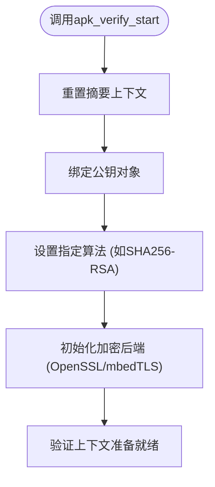
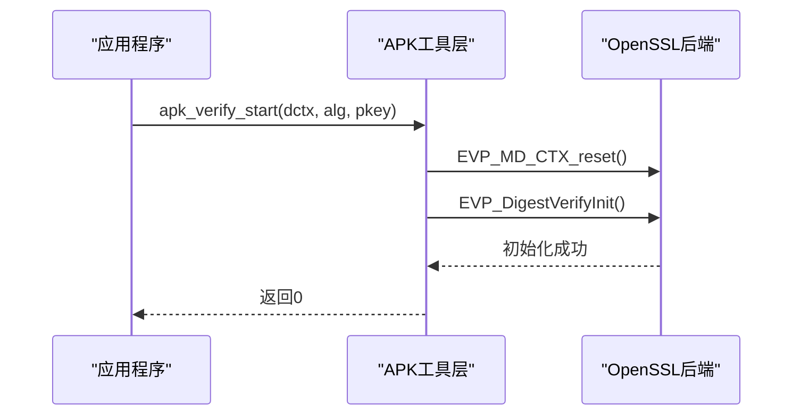
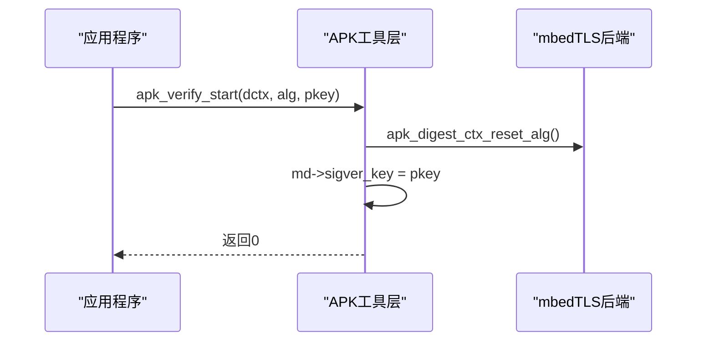
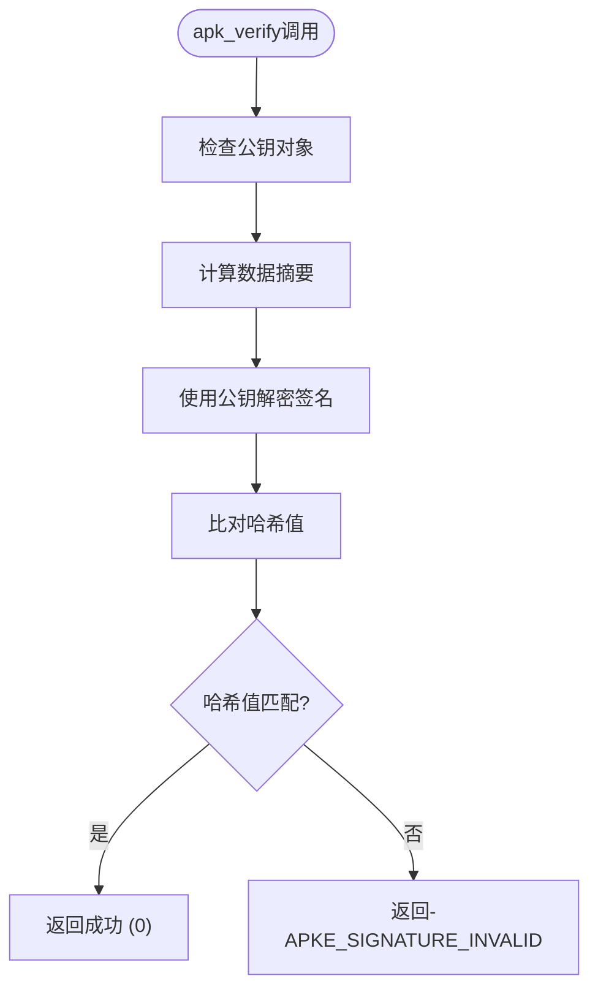
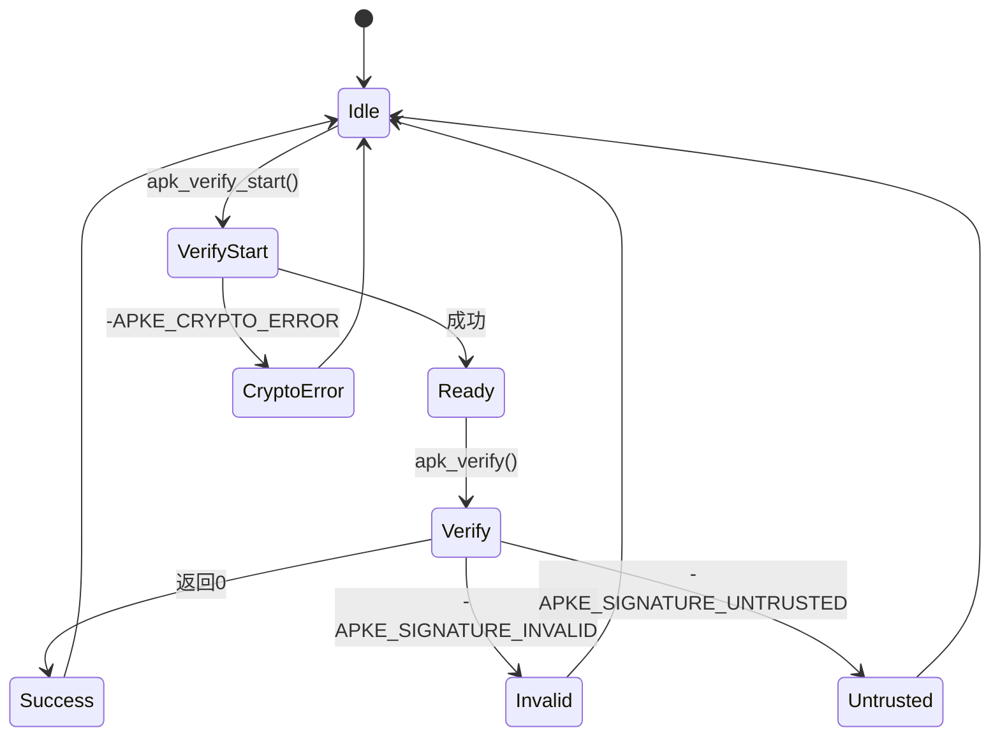

# 签名比对与验证执行

<cite>
**本文档引用文件**   
- [crypto_openssl.c](file://src/crypto_openssl.c)
- [crypto_mbedtls.c](file://src/crypto_mbedtls.c)
- [apk_crypto.h](file://src/apk_crypto.h)
- [extract_v2.c](file://src/extract_v2.c)
- [apk_defines.h](file://src/apk_defines.h)
</cite>

## 目录
1. [引言](#引言)
2. [核心执行流程分析](#核心执行流程分析)
3. [OpenSSL与mbedTLS后端实现对比](#openssl与mbedtls后端实现对比)
4. [签名验证全过程解析](#签名验证全过程解析)
5. [返回码与异常类型](#返回码与异常类型)
6. [验证失败排查方案](#验证失败排查方案)
7. [结论](#结论)

## 引言
本文档系统阐述APK工具中签名验证的核心执行流程。从调用`apk_verify_start`接口开始，深入分析其如何根据指定算法（如SHA256-RSA）重置摘要上下文并绑定公钥对象。通过对比OpenSSL后端与mbedTLS后端的实现差异，揭示跨加密库抽象层的设计精髓。详细描述`apk_verify`函数如何传入签名数据进行最终比对，包括ASN.1编码解析、哈希值提取与非对称解密验证的全过程。解释不同返回码对应的底层异常类型，并提供抓包分析与日志追踪相结合的验证失败排查方案。

**Section sources**
- [extract_v2.c](file://src/extract_v2.c#L1-L50)

## 核心执行流程分析
签名验证的核心流程始于`apk_verify_start`函数的调用。该函数负责初始化验证上下文，重置摘要状态，并绑定指定的公钥对象。在APKv2包的验证过程中，`apk_sign_ctx_mpart_cb`回调函数在解析多部分数据流时，会根据当前处理的文件块类型决定是否启动验证流程。当检测到控制块结束且存在签名时，系统会调用`apk_verify_start`来准备验证环境。

**Diagram sources **
- [crypto_openssl.c](file://src/crypto_openssl.c#L227-L234)
- [crypto_mbedtls.c](file://src/crypto_mbedtls.c#L323-L332)

**Section sources**
- [crypto_openssl.c](file://src/crypto_openssl.c#L227-L234)
- [crypto_mbedtls.c](file://src/crypto_mbedtls.c#L323-L332)
- [extract_v2.c](file://src/extract_v2.c#L204)

## OpenSSL与mbedTLS后端实现对比
APK工具通过抽象层支持OpenSSL和mbedTLS两种加密后端，其设计精髓在于提供统一的API接口，同时封装底层库的差异。

### OpenSSL后端实现
在OpenSSL后端中，`apk_verify_start`函数利用EVP高级接口进行操作：
- 调用`EVP_MD_CTX_reset`重置摘要上下文
- 使用`EVP_DigestVerifyInit`初始化验证操作，传入算法标识和公钥
- 通过`apk_digest_alg_to_evp`函数将内部算法标识转换为OpenSSL的EVP_MD指针

**Diagram sources **
- [crypto_openssl.c](file://src/crypto_openssl.c#L227-L234)

### mbedTLS后端实现
在mbedTLS后端中，实现方式有所不同：
- 调用`apk_digest_ctx_reset_alg`重置算法上下文
- 直接将公钥对象存储在`apk_mbed_digest`结构体的`sigver_key`字段中
- 使用`apk_digest_alg_to_mbedtls_type`将算法标识转换为mbedTLS类型

**Diagram sources **
- [crypto_mbedtls.c](file://src/crypto_mbedtls.c#L323-L332)

**Section sources**
- [crypto_openssl.c](file://src/crypto_openssl.c#L227-L234)
- [crypto_mbedtls.c](file://src/crypto_mbedtls.c#L323-L332)

## 签名验证全过程解析
`apk_verify`函数负责执行最终的签名比对操作，其过程包括ASN.1编码解析、哈希值提取与非对称解密验证。

### 验证流程
1. **摘要计算**：首先调用`apk_digest_ctx_final`完成摘要计算，生成待验证的数据摘要
2. **非对称解密**：使用绑定的公钥对签名数据进行解密，得到原始哈希值
3. **比对验证**：将计算得到的摘要与解密得到的哈希值进行比对

**Diagram sources **
- [crypto_openssl.c](file://src/crypto_openssl.c#L236-L241)
- [crypto_mbedtls.c](file://src/crypto_mbedtls.c#L334-L351)

### ASN.1编码处理
在验证过程中，系统会自动处理ASN.1编码的签名数据：
- OpenSSL后端通过`EVP_DigestVerifyFinal`自动处理ASN.1结构
- mbedTLS后端通过`mbedtls_pk_verify`函数直接验证ASN.1编码的签名

**Section sources**
- [crypto_openssl.c](file://src/crypto_openssl.c#L236-L241)
- [crypto_mbedtls.c](file://src/crypto_mbedtls.c#L334-L351)

## 返回码与异常类型
系统定义了多种返回码来表示不同的验证结果和异常情况：

| 返回码 | 含义 | 底层异常类型 |
|--------|------|-------------|
| 0 | 验证成功 | 无异常 |
| -APKE_CRYPTO_ERROR | 加密错误 | 上下文未初始化、算法不支持、内存分配失败等 |
| -APKE_SIGNATURE_INVALID | 签名无效 | 哈希值不匹配、签名解密失败、ASN.1编码错误等 |
| -APKE_SIGNATURE_UNTRUSTED | 签名不受信任 | 公钥不在信任列表中、证书链验证失败等 |

这些返回码在`apk_defines.h`中定义，并在`print.c`中提供了对应的错误信息字符串。

**Diagram sources **
- [apk_defines.h](file://src/apk_defines.h#L34-L66)
- [print.c](file://src/print.c#L41-L62)

**Section sources**
- [apk_defines.h](file://src/apk_defines.h#L34-L66)
- [print.c](file://src/print.c#L41-L62)

## 验证失败排查方案
当签名验证失败时，可采用以下综合排查方案：

### 日志追踪
1. **启用详细日志**：通过调试标志获取详细的执行流程信息
2. **检查返回码**：根据具体的返回码定位问题类型
3. **追踪上下文状态**：检查摘要上下文和公钥对象的状态

### 抓包分析
1. **捕获数据流**：使用网络抓包工具捕获APK文件传输过程
2. **分析签名块**：检查`.SIGN.*`文件的内容和格式
3. **验证哈希值**：独立计算数据块的哈希值并与签名中的值比对

### 常见问题排查
- **-APKE_CRYPTO_ERROR**：检查加密库初始化状态，确认算法支持情况
- **-APKE_SIGNATURE_INVALID**：验证数据完整性，检查ASN.1编码格式
- **-APKE_SIGNATURE_UNTRUSTED**：确认公钥是否在信任列表中，检查证书链

**Section sources**
- [extract_v2.c](file://src/extract_v2.c#L233-L275)
- [crypto_openssl.c](file://src/crypto_openssl.c#L236-L241)
- [crypto_mbedtls.c](file://src/crypto_mbedtls.c#L334-L351)

## 结论
APK工具的签名验证系统通过精心设计的抽象层，实现了对OpenSSL和mbedTLS两种加密后端的无缝支持。`apk_verify_start`和`apk_verify`函数构成了验证流程的核心，通过统一的接口封装了底层加密库的差异。系统采用分阶段的验证策略，先初始化验证环境，再执行最终比对，确保了验证过程的安全性和可靠性。丰富的返回码体系为故障排查提供了有力支持，结合日志追踪和抓包分析，可以有效诊断和解决各种验证失败问题。