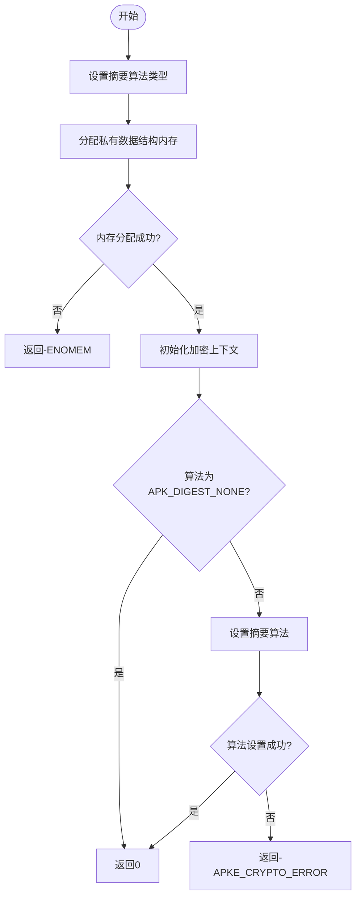
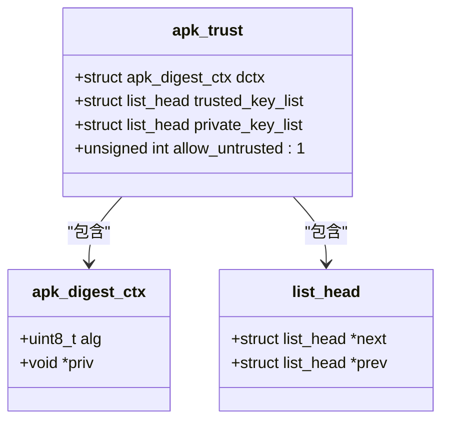
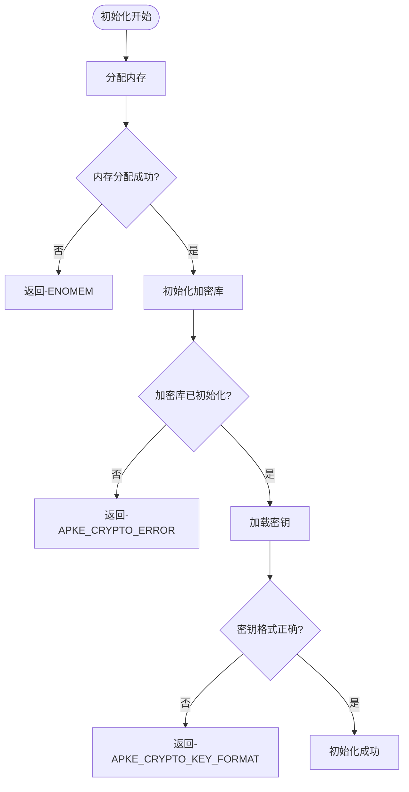
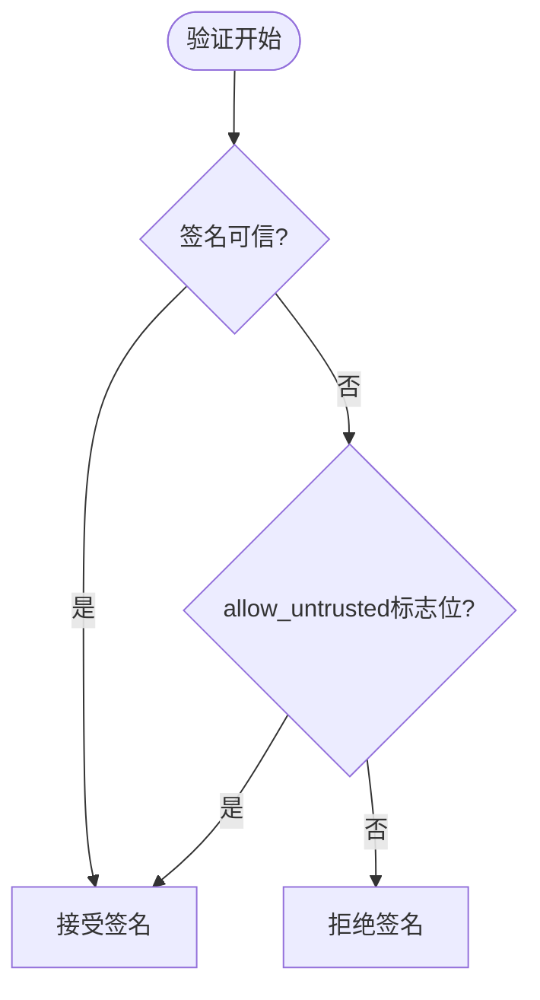

# 验证上下文初始化

<cite>
**本文档中引用的文件**   
- [apk_trust.h](file://src/apk_trust.h)
- [trust.c](file://src/trust.c)
- [crypto_openssl.c](file://src/crypto_openssl.c)
- [crypto_mbedtls.c](file://src/crypto_mbedtls.c)
- [apk_crypto.h](file://src/apk_crypto.h)
</cite>

## 目录
1. [介绍](#介绍)
2. [核心组件分析](#核心组件分析)
3. [结构体初始化流程](#结构体初始化流程)
4. [摘要上下文初始化](#摘要上下文初始化)
5. [内存布局与安全清零策略](#内存布局与安全清零策略)
6. [错误处理机制](#错误处理机制)
7. [非严格验证模式](#非严格验证模式)
8. [调试检查清单](#调试检查清单)

## 介绍
本文件全面解析APK工具中GPG签名验证的初始化阶段。重点描述`apk_trust_init`函数如何初始化`apk_trust`结构体，包括digest上下文、可信密钥链表和私钥链表的初始化过程。文档还解释了`apk_digest_ctx_init`在设置摘要算法状态中的作用，并说明结构体内存布局与安全清零策略。

## 核心组件分析

**本节来源**
- [apk_trust.h](file://src/apk_trust.h#L20-L25)
- [trust.c](file://src/trust.c#L23-L29)

## 结构体初始化流程

`apk_trust_init`函数负责初始化`apk_trust`结构体，该结构体是APK包管理系统中信任机制的核心数据结构。初始化过程包括四个关键步骤：

1. **结构体清零**：通过`(struct apk_trust){}`语法将整个结构体清零，确保所有字段都处于已知的初始状态
2. **摘要上下文初始化**：调用`apk_digest_ctx_init`函数初始化digest上下文
3. **可信密钥链表初始化**：使用`list_init`函数初始化可信密钥链表
4. **私钥链表初始化**：使用`list_init`函数初始化私钥链表

这种初始化顺序确保了结构体在使用前处于一致且安全的状态。

**本节来源**
- [trust.c](file://src/trust.c#L23-L29)

## 摘要上下文初始化

`apk_digest_ctx_init`函数负责初始化摘要上下文，该函数在不同的加密后端实现中有所不同：

### OpenSSL后端实现
在OpenSSL后端中，`apk_digest_ctx_init`函数执行以下操作：
- 设置摘要算法类型
- 分配私有数据结构内存
- 初始化EVP_MD_CTX上下文
- 设置最终化标志
- 调用EVP_DigestInit_ex初始化摘要算法

### mbedTLS后端实现
在mbedTLS后端中，`apk_digest_ctx_init`函数执行以下操作：
- 设置摘要算法类型
- 分配`apk_mbed_digest`结构体内存
- 初始化mbedtls_md_context_t
- 调用mbedtls_md_setup和mbedtls_md_starts初始化摘要算法

两种实现都返回0表示成功，或返回负的错误码表示失败。

**图表来源**
- [crypto_openssl.c](file://src/crypto_openssl.c#L107-L121)
- [crypto_mbedtls.c](file://src/crypto_mbedtls.c#L74-L89)

**本节来源**
- [crypto_openssl.c](file://src/crypto_openssl.c#L107-L121)
- [crypto_mbedtls.c](file://src/crypto_mbedtls.c#L74-L89)

## 内存布局与安全清零策略

`apk_trust`结构体的内存布局经过精心设计，以确保安全性和效率：

**图表来源**
- [apk_trust.h](file://src/apk_trust.h#L20-L25)

安全清零策略体现在以下几个方面：
1. **初始化时清零**：使用`(struct apk_trust){}`语法确保结构体所有字节都被清零
2. **内存释放时清零**：在`apk_digest_ctx_free`函数中，对敏感数据进行安全清零
3. **密钥文件处理时清零**：在加载密钥文件后，立即使用`mbedtls_platform_zeroize`清零缓冲区

**本节来源**
- [apk_trust.h](file://src/apk_trust.h#L20-L25)
- [crypto_openssl.c](file://src/crypto_openssl.c#L140-L143)
- [crypto_mbedtls.c](file://src/crypto_mbedtls.c#L116-L125)

## 错误处理机制

初始化过程中可能遇到多种错误情况，系统采用分层的错误处理机制：

关键错误码包括：
- `-ENOMEM`：内存分配失败
- `-APKE_CRYPTO_ERROR`：加密操作失败
- `-APKE_CRYPTO_KEY_FORMAT`：密钥格式错误

**图表来源**
- [crypto_openssl.c](file://src/crypto_openssl.c#L107-L121)
- [crypto_mbedtls.c](file://src/crypto_mbedtls.c#L74-L89)

**本节来源**
- [crypto_openssl.c](file://src/crypto_openssl.c#L107-L121)
- [crypto_mbedtls.c](file://src/crypto_mbedtls.c#L74-L89)

## 非严格验证模式

`allow_untrusted`标志位允许配置非严格验证模式，这在开发和测试环境中非常有用：

当`allow_untrusted`设置为1时，即使签名不可信，系统也会接受该签名，这有助于在开发过程中绕过严格的信任检查。

**图表来源**
- [extract_v2.c](file://src/extract_v2.c#L75-L87)
- [extract_v2.c](file://src/extract_v2.c#L223-L249)

**本节来源**
- [extract_v2.c](file://src/extract_v2.c#L75-L87)
- [extract_v2.c](file://src/extract_v2.c#L223-L249)

## 调试检查清单

当遇到初始化异常时，开发者可以按照以下检查清单进行排查：

### 内存相关问题
- [ ] 检查系统内存是否充足
- [ ] 确认`calloc`调用是否成功
- [ ] 验证`apk_digest_ctx_init`中的内存分配

### 加密库初始化问题
- [ ] 确认`apk_crypto_init`是否已调用
- [ ] 检查OpenSSL/mbedTLS库是否正确加载
- [ ] 验证算法查找是否成功

### 密钥相关问题
- [ ] 检查密钥文件路径是否正确
- [ ] 验证密钥文件格式是否符合要求
- [ ] 确认密钥文件权限设置

### 配置问题
- [ ] 检查`allow_untrusted`标志位设置
- [ ] 验证摘要算法选择
- [ ] 确认信任链配置

**本节来源**
- [crypto_openssl.c](file://src/crypto_openssl.c#L255-L268)
- [crypto_mbedtls.c](file://src/crypto_mbedtls.c#L363-L370)
- [trust.c](file://src/trust.c#L23-L29)