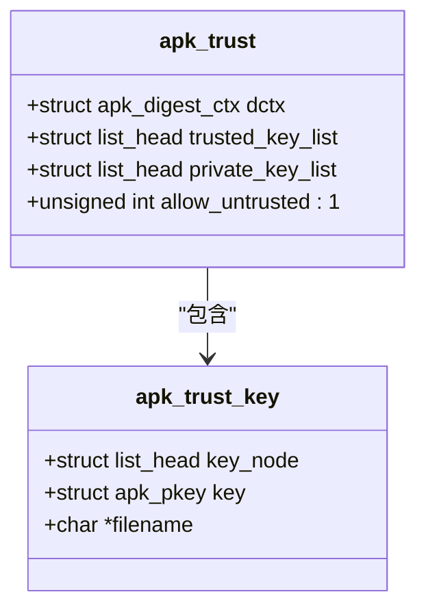
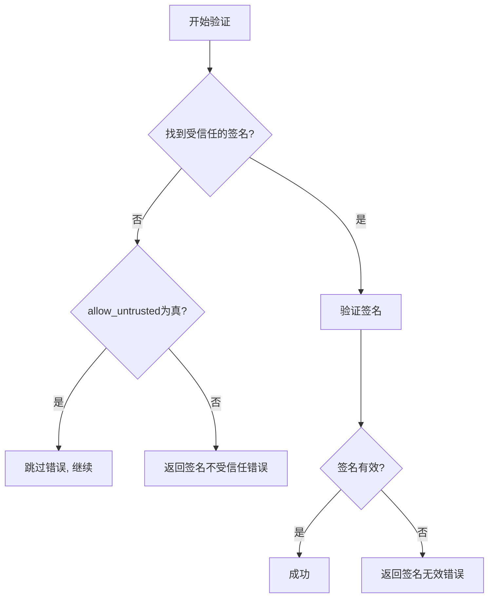

# 信任策略控制

<cite>
**本文档引用的文件**
- [apk_trust.h](file://src/apk_trust.h)
- [trust.c](file://src/trust.c)
- [context.c](file://src/context.c)
- [apk.c](file://src/apk.c)
- [extract_v2.c](file://src/extract_v2.c)
- [adb.c](file://src/adb.c)
</cite>

## 目录
1. [引言](#引言)
2. [核心数据结构](#核心数据结构)
3. [allow_untrusted标志位的内存布局](#allow_untrusted标志位的内存布局)
4. [强制信任模式的安全风险与使用场景](#强制信任模式的安全风险与使用场景)
5. [对签名验证流程的影响](#对签名验证流程的影响)
6. [命令行参数动态启用](#命令行参数动态启用)
7. [安全审计建议](#安全审计建议)

## 引言
本文档深入分析apk-tools中的信任策略控制系统，重点聚焦于`allow_untrusted`标志位的设计与实现。该标志位是系统安全模型中的关键组成部分，允许在特定场景下绕过严格的签名验证，为系统维护和紧急恢复提供了必要的灵活性，同时也引入了潜在的安全风险。

## 核心数据结构
信任策略的核心数据结构是`struct apk_trust`，它定义了信任上下文的完整状态，包括受信任的密钥列表、私钥列表以及关键的信任策略标志。



**图源**
- [apk_trust.h](file://src/apk_trust.h#L19-L24)

**本节源**
- [apk_trust.h](file://src/apk_trust.h#L12-L29)

## allow_untrusted标志位的内存布局
`allow_untrusted`标志位在`struct apk_trust`中被定义为一个单比特的位域（bit-field），其内存布局设计体现了对内存效率和原子操作的考量。

### 位域设计
该标志位通过`unsigned int allow_untrusted : 1;`声明，这意味着：
1.  **内存效率**：它仅占用`struct apk_trust`结构体中一个`unsigned int`类型的一个比特位，极大地节省了内存空间。
2.  **原子性**：由于它与结构体中的其他字段（如`dctx`、`trusted_key_list`等）共享同一个`unsigned int`的存储空间，对该标志位的读写操作通常可以与相邻字段的访问合并，从而在某些架构上实现原子性。
3.  **初始化**：`apk_trust_init`函数在初始化`struct apk_trust`时，会将整个结构体清零，这确保了`allow_untrusted`标志位的初始状态为`0`（即不信任非受信任包）。

```c
struct apk_trust {
    struct apk_digest_ctx dctx;
    struct list_head trusted_key_list;
    struct list_head private_key_list;
    unsigned int allow_untrusted : 1; // 单比特位域
};
```

**本节源**
- [apk_trust.h](file://src/apk_trust.h#L23)
- [trust.c](file://src/trust.c#L23-L29)

## 强制信任模式的安全风险与使用场景
`allow_untrusted`标志位启用了“强制信任模式”，允许系统安装和运行未经受信任密钥签名的软件包。

### 安全风险
启用此模式会带来显著的安全风险：
1.  **完整性丧失**：无法保证软件包在传输或存储过程中未被篡改。
2.  **来源不可信**：软件包可能来自恶意第三方，包含后门、病毒或勒索软件。
3.  **供应链攻击**：攻击者可以替换合法软件包，从而在系统中植入持久性后门。

### 使用场景
尽管存在风险，但在以下特定场景下，此功能是必要的：
1.  **离线环境**：在无法访问官方密钥服务器的隔离网络中，管理员可能需要手动安装预先下载的软件包。
2.  **紧急恢复**：当系统因密钥损坏或丢失而无法启动时，可以使用此模式安装修复工具或恢复密钥。
3.  **开发与测试**：开发人员在测试新软件包时，可能尚未完成正式的签名流程。

**本节源**
- [context.c](file://src/context.c#L63)
- [extract_v2.c](file://src/extract_v2.c#L80-L84)

## 对签名验证流程的影响
`allow_untrusted`标志位直接影响`apk_trust_key_by_name`的查找行为和整体的签名验证流程。

### 查找行为
`apk_trust_key_by_name`函数本身不直接使用`allow_untrusted`标志。它的作用是根据文件名在`trusted_key_list`中查找对应的公钥。如果查找失败，返回`NULL`，这会触发后续的验证失败逻辑。

### 签名验证流程
`allow_untrusted`标志在验证流程的多个环节被检查：
1.  **上下文初始化**：在`apk_sign_ctx_init`中，`allow_untrusted`的值从`struct apk_trust`复制到`struct apk_sign_ctx`的上下文中。
2.  **信任检查**：在`check_signing_key_trust`函数中，如果`signature.pkey`为`NULL`（即未找到受信任的签名），但`allow_untrusted`为真，则验证流程会跳过错误，继续执行。
3.  **最终决策**：在`apk_extract_v2`的主流程中，即使`verify_error`为`-APKE_SIGNATURE_UNTRUSTED`，只要`allow_untrusted`为真，最终的返回码也会被覆盖为`0`（成功）。



**图源**
- [extract_v2.c](file://src/extract_v2.c#L75-L87)
- [extract_v2.c](file://src/extract_v2.c#L353-L354)

**本节源**
- [extract_v2.c](file://src/extract_v2.c#L44-L65)
- [extract_v2.c](file://src/extract_v2.c#L75-L87)
- [extract_v2.c](file://src/extract_v2.c#L329-L359)

## 命令行参数动态启用
`allow_untrusted`策略可以通过命令行参数`--allow-untrusted`动态启用。

### 实现机制
1.  **参数解析**：`apk.c`文件中的`optgroup_global_parse`函数处理`--allow-untrusted`选项。
2.  **标志设置**：当解析到此选项时，会将`ac->flags`中的`APK_ALLOW_UNTRUSTED`位设置为1。
3.  **策略应用**：在`apk_ctx_prepare`函数中，检查`ac->flags & APK_ALLOW_UNTRUSTED`，如果为真，则将`ac->trust.allow_untrusted`设置为1，从而激活强制信任模式。

```c
// 在 apk.c 中
case OPT_GLOBAL_allow_untrusted:
    ac->flags |= APK_ALLOW_UNTRUSTED;
    break;

// 在 context.c 中
if (ac->flags & APK_ALLOW_UNTRUSTED) ac->trust.allow_untrusted = 1;
```

**本节源**
- [apk.c](file://src/apk.c#L156-L158)
- [context.c](file://src/context.c#L63)

## 安全审计建议
为了在利用`allow_untrusted`功能的同时降低安全风险，建议采取以下审计措施：

1.  **监控日志**：定期检查系统日志（如`/var/log/apk.log`），搜索包含`WARNING`或`allow-untrusted`关键字的条目，以发现所有非信任包的安装行为。
2.  **记录使用**：建立一个独立的审计日志，记录每次使用`--allow-untrusted`参数的命令、时间、用户和安装的软件包。
3.  **定期清理**：在完成紧急任务后，立即禁用`allow_untrusted`模式，并审查和清理在此期间安装的软件包。
4.  **最小权限**：仅在绝对必要时才使用此选项，并且应由具有最高权限的管理员执行。

**本节源**
- [context.c](file://src/context.c#L108-L121)