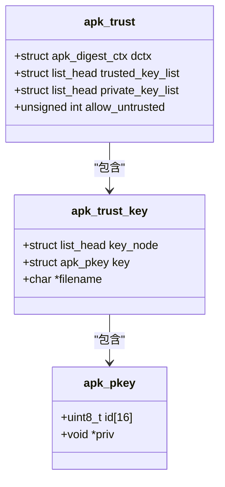
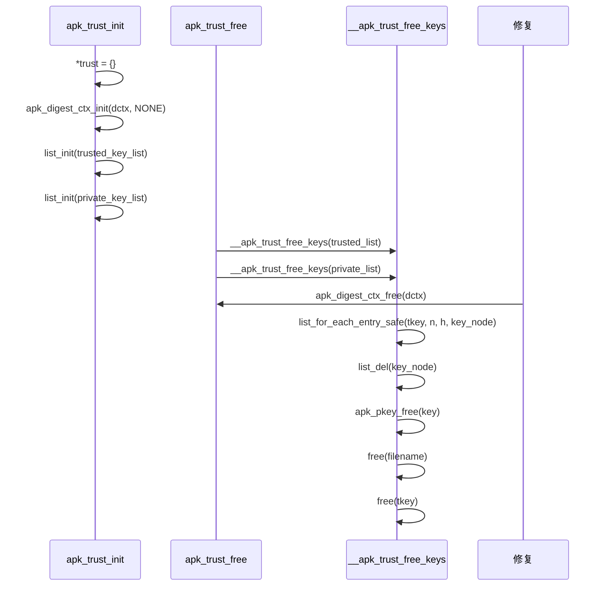
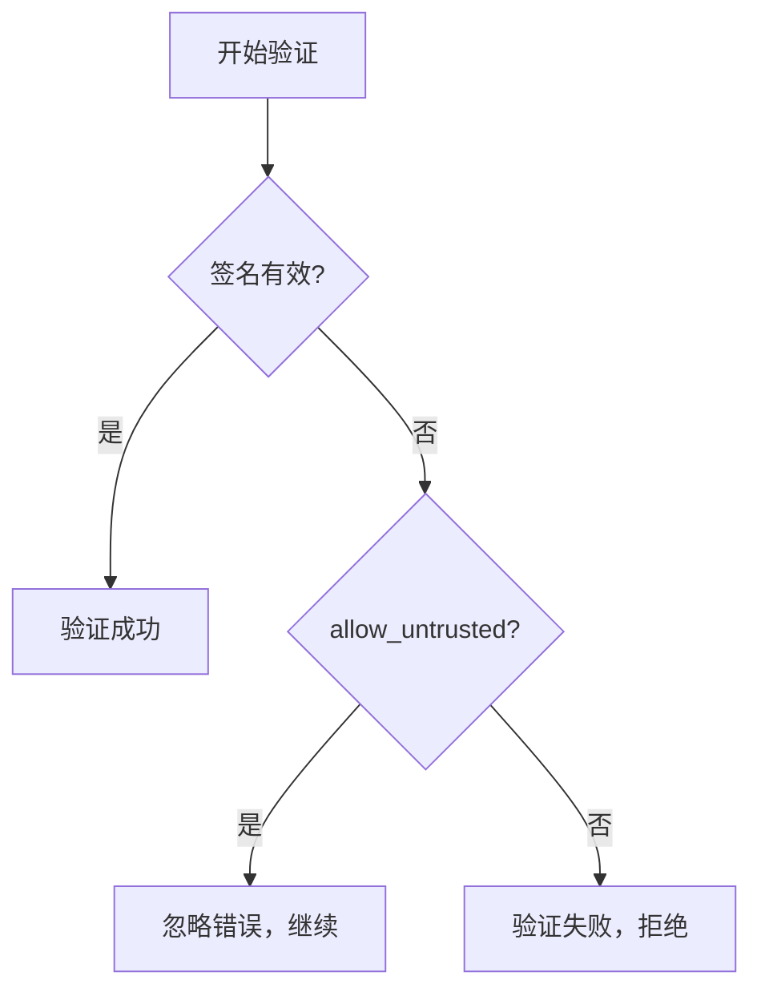

# 信任管理机制

<cite>
**本文档引用的文件**  
- [apk_trust.h](file://src/apk_trust.h)
- [trust.c](file://src/trust.c)
- [context.c](file://src/context.c)
- [apk_crypto.h](file://src/apk_crypto.h)
- [extract_v2.c](file://src/extract_v2.c)
</cite>

## 目录
1. [结构体设计与链表管理](#结构体设计与链表管理)  
2. [资源生命周期管理](#资源生命周期管理)  
3. [公钥加载流程](#公钥加载流程)  
4. [allow_untrusted 标志位的安全含义](#allow_untrusted-标志位的安全含义)  
5. [系统管理员配置指南](#系统管理员配置指南)  
6. [密钥查询操作](#密钥查询操作)

## 结构体设计与链表管理

`struct apk_trust` 是 apk-tools 中用于管理信任密钥的核心结构体，其设计体现了模块化与安全性的结合。该结构体包含两个链表：`trusted_key_list` 和 `private_key_list`，分别用于存储受信任的公钥和私钥。

- `trusted_key_list`：链表头，用于维护系统信任的公钥集合。这些公钥通常来自可信的软件仓库签名者。
- `private_key_list`：链表头，用于维护系统拥有的私钥，用于签名操作。
- `dctx`：摘要上下文，用于在签名和验证过程中计算哈希值。
- `allow_untrusted`：布尔标志位，指示是否允许在验证过程中接受未受信任的签名。

每个密钥通过 `struct apk_trust_key` 封装，包含 `key_node`（链表节点）、`key`（实际的 `apk_pkey` 结构）和 `filename`（密钥文件名）。链表的初始化在 `apk_trust_init` 中完成，确保两个链表处于空状态。

**Diagram sources**  
- [apk_trust.h](file://src/apk_trust.h#L19-L24)
- [apk_trust.h](file://src/apk_trust.h#L13-L17)

**Section sources**  
- [apk_trust.h](file://src/apk_trust.h#L19-L24)
- [trust.c](file://src/trust.c#L23-L29)

## 资源生命周期管理

`apk_trust_init` 和 `apk_trust_free` 函数共同管理 `struct apk_trust` 的资源生命周期。

`apk_trust_init` 函数负责初始化一个 `apk_trust` 实例。它首先将整个结构体清零，然后初始化摘要上下文 `dctx` 为 `APK_DIGEST_NONE` 状态，并分别初始化两个链表头 `trusted_key_list` 和 `private_key_list`，确保链表处于空状态。这一过程确保了信任管理器在使用前处于一个干净、可预测的状态。

`apk_trust_free` 函数负责释放 `apk_trust` 实例占用的所有资源。它调用内部函数 `__apk_trust_free_keys` 分别清理 `trusted_key_list` 和 `private_key_list` 中的所有密钥节点。清理过程包括：从链表中移除节点、释放密钥对象 `apk_pkey`、释放文件名字符串，最后释放节点本身。最后，释放摘要上下文 `dctx` 的资源。

**Diagram sources**  
- [trust.c](file://src/trust.c#L23-L29)
- [trust.c](file://src/trust.c#L43-L48)
- [trust.c](file://src/trust.c#L31-L41)

**Section sources**  
- [trust.c](file://src/trust.c#L23-L29)
- [trust.c](file://src/trust.c#L43-L48)

## 公钥加载流程

`apk_trust_load_key` 函数负责从文件系统加载一个密钥，并将其封装为 `struct apk_trust_key` 对象。该函数的执行流程如下：

1.  **内存分配**：使用 `calloc` 分配 `struct apk_trust_key` 所需的内存空间。
2.  **密钥加载**：调用 `apk_pkey_load` 函数，将指定路径的密钥文件内容加载到 `key` 字段中。`apk_pkey_load` 会根据文件格式（如 PEM）解析公钥或私钥，并计算其指纹（ID）。
3.  **错误处理**：如果 `apk_pkey_load` 失败，函数会立即释放已分配的 `apk_trust_key` 内存，并返回错误码。
4.  **链表初始化**：成功加载密钥后，调用 `list_init(&key->key_node)` 初始化该密钥的链表节点。
5.  **文件名保存**：使用 `strdup` 复制传入的 `filename` 字符串，并将其指针赋值给 `key->filename`，以便后续通过文件名查找密钥。
6.  **返回结果**：返回指向新创建的 `apk_trust_key` 对象的指针。

此流程确保了密钥加载过程的健壮性，包含了内存分配失败和文件解析失败的错误处理。

**Section sources**  
- [trust.c](file://src/trust.c#L4-L21)
- [apk_crypto.h](file://src/apk_crypto.h#L98)

## allow_untrusted 标志位的安全含义

`allow_untrusted` 是 `struct apk_trust` 中的一个单比特标志位，用于控制系统的信任策略。当该标志位被设置为 `1` 时，系统进入一种“降级模式”或“宽松模式”。

在正常的验证流程中（如 `extract_v2.c` 中的 `check_signing_key_trust` 函数），如果一个包的签名无法与 `trusted_key_list` 中的任何公钥匹配，验证将失败并返回 `-APKE_SIGNATURE_UNTRUSTED` 错误。然而，当 `allow_untrusted` 为 `true` 时，即使签名验证失败，系统也会忽略此错误并允许操作继续进行。

这种模式通常用于以下场景：
- **系统恢复**：在系统损坏或密钥环丢失时，允许管理员安装关键的修复包。
- **开发与测试**：在开发环境中，允许安装未经正式签名的测试包。
- **紧急维护**：在紧急情况下绕过严格的签名验证。

虽然此功能提供了便利，但也极大地降低了系统的安全性，因为它允许执行来源不明的代码。因此，该模式应仅在必要时临时启用，并在操作完成后立即关闭。

**Diagram sources**  
- [extract_v2.c](file://src/extract_v2.c#L75-L86)

**Section sources**  
- [apk_trust.h](file://src/apk_trust.h#L24)
- [extract_v2.c](file://src/extract_v2.c#L75-L86)

## 系统管理员配置指南

系统管理员可以通过以下步骤配置信任锚点：

1.  **密钥目录布局**：将受信任的公钥文件（通常为 `.pub` 后缀）放置在标准目录中，如 `/etc/apk/keys/` 或 `/lib/apk/keys/`。`apk_ctx_get_trust` 函数会自动扫描这些目录。
2.  **文件命名规范**：密钥文件应以发行版或仓库的名称命名，例如 `alpine-devel@lists.alpinelinux.org-5.10.pub`。这有助于管理员识别密钥来源。
3.  **权限设置**：确保密钥目录和文件的权限设置为 `644`（文件）和 `755`（目录），以防止普通用户篡改。根目录 `/etc/apk/keys/` 应由 `root` 用户拥有。
4.  **启用降级模式**：在需要时，可以通过命令行参数（如 `--allow-untrusted`）或环境变量来临时启用 `allow_untrusted` 模式。此操作应在 `apk_ctx_prepare` 函数中完成，该函数会根据 `ac->flags` 设置 `trust->allow_untrusted`。

**Section sources**  
- [context.c](file://src/context.c#L144-L162)
- [context.c](file://src/context.c#L63)

## 密钥查询操作

`apk_trust_key_by_name` 函数提供了一种通过文件名查找特定密钥的机制。其实现非常直接：

1.  **遍历链表**：使用 `list_for_each_entry` 宏遍历 `trusted_key_list` 链表中的每一个 `apk_trust_key` 节点。
2.  **名称比较**：对于每个节点，检查其 `filename` 字段是否非空，并使用 `strcmp` 函数与传入的 `filename` 参数进行比较。
3.  **返回结果**：如果找到匹配项，则返回指向该节点中 `apk_pkey` 的指针。如果遍历完整个链表都未找到，则返回 `NULL`。

此函数仅在受信任的公钥列表中进行查找，不会搜索私钥列表。它为上层应用（如包验证）提供了一个便捷的接口，用于根据签名文件名定位对应的验证公钥。

**Section sources**  
- [trust.c](file://src/trust.c#L50-L58)
- [apk_trust.h](file://src/apk_trust.h#L29)