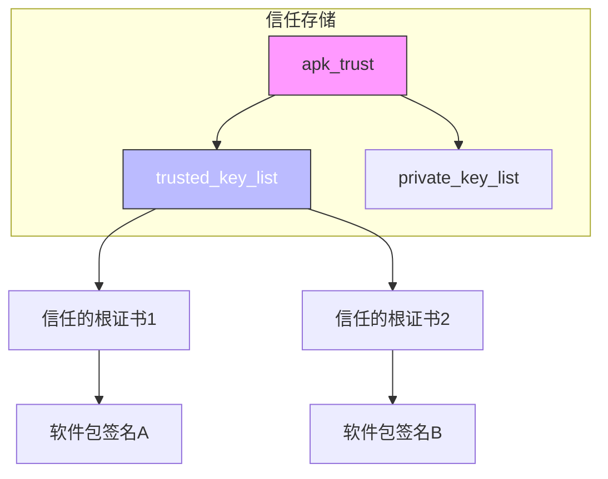
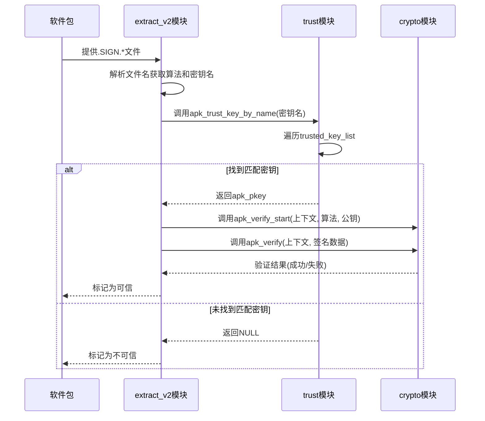
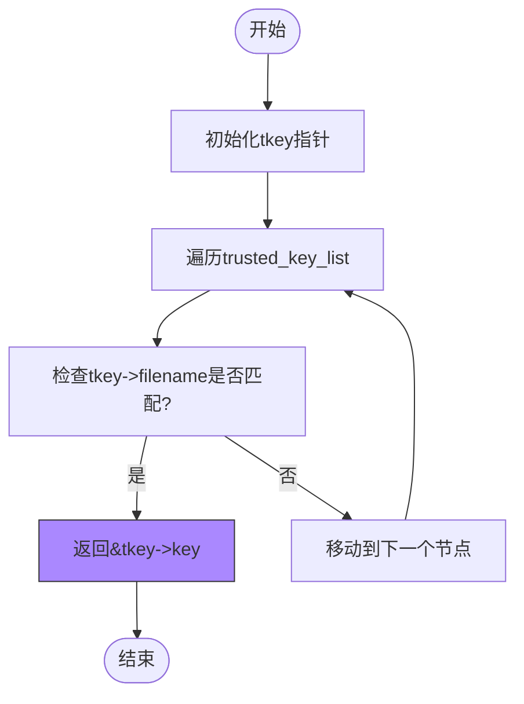
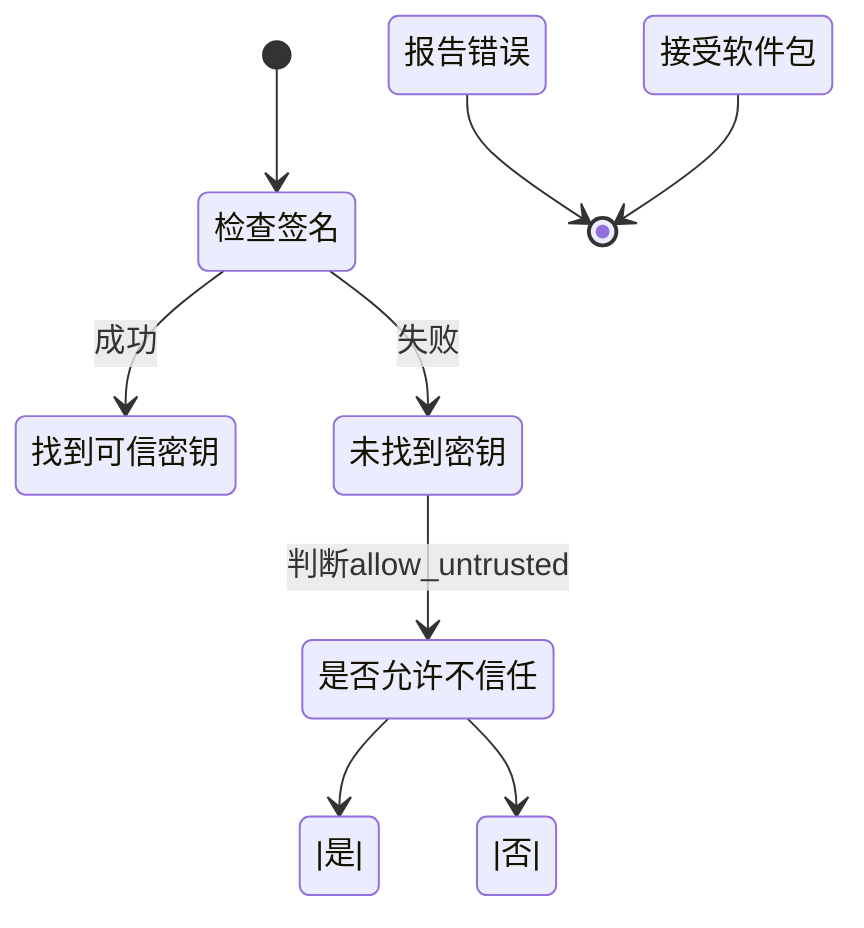

# 信任链构建

<cite>
**本文档中引用的文件**   
- [trust.c](file://src/trust.c)
- [apk_trust.h](file://src/apk_trust.h)
- [crypto.c](file://src/crypto.c)
- [apk_crypto.h](file://src/apk_crypto.h)
- [extract_v2.c](file://src/extract_v2.c)
</cite>

## 目录
1. [引言](#引言)
2. [信任链构建机制](#信任链构建机制)
3. [证书链逐级验证流程](#证书链逐级验证流程)
4. [信任锚点查找逻辑](#信任锚点查找逻辑)
5. [多密钥环境下的公钥选择策略](#多密钥环境下的公钥选择策略)
6. [信任链断裂处理机制](#信任链断裂处理机制)
7. [自定义信任链构建指南](#自定义信任链构建指南)
8. [结论](#结论)

## 引言
apk-tools 通过基于根证书的信任链机制确保软件包签名的可信性。该机制依赖于 `trusted_key_list` 中预置的受信任根证书，对软件包进行逐级验证，确保其来源合法且未被篡改。本文件深入解析该信任链的构建与验证过程，涵盖核心数据结构、验证流程、错误处理及最佳实践。

## 信任链构建机制

apk-tools 的信任链构建基于 `struct apk_trust` 结构体，其中维护了两个关键链表：`trusted_key_list` 用于存储受信任的公钥，`private_key_list` 用于存储私钥。信任链的起点是 `trusted_key_list` 中的根证书（信任锚点），所有软件包签名必须能追溯到这些根证书才能被验证通过。

**Diagram sources**
- [apk_trust.h](file://src/apk_trust.h#L20-L23)
- [trust.c](file://src/trust.c#L24-L30)

**Section sources**
- [apk_trust.h](file://src/apk_trust.h#L20-L23)
- [trust.c](file://src/trust.c#L24-L30)

## 证书链逐级验证流程

软件包的验证流程始于解析其内部的 `.SIGN.*` 文件。系统会遍历这些签名文件，根据文件名（如 `.SIGN.RSA512.keyname`）提取签名算法和对应的公钥名称。随后，系统调用 `apk_trust_key_by_name` 在 `trusted_key_list` 中查找匹配的公钥。一旦找到匹配的受信任公钥，即认为该签名由可信实体签发，信任链建立成功。验证过程使用 `apk_verify` 函数，结合 `apk_digest_ctx` 上下文和提取的签名数据，完成密码学验证。

**Diagram sources**
- [extract_v2.c](file://src/extract_v2.c#L88-L159)
- [trust.c](file://src/trust.c#L50-L58)
- [apk_crypto.h](file://src/apk_crypto.h#L105)

**Section sources**
- [extract_v2.c](file://src/extract_v2.c#L88-L159)
- [crypto_openssl.c](file://src/crypto_openssl.c#L235-L240)

## 信任锚点查找逻辑

`apk_trust_key_by_name` 函数是查找信任锚点的核心。它接收一个 `apk_trust` 结构体指针和一个密钥文件名，通过 `list_for_each_entry` 宏遍历 `trusted_key_list` 链表。对于链表中的每个 `apk_trust_key` 节点，函数检查其 `filename` 字段是否与传入的参数完全匹配。一旦找到匹配项，立即返回该节点内嵌的 `apk_pkey` 结构体指针，从而完成信任锚点的定位。该过程是线性的，因此保持信任密钥列表的精简有助于提高查找效率。

**Diagram sources**
- [trust.c](file://src/trust.c#L50-L58)

**Section sources**
- [trust.c](file://src/trust.c#L50-L58)

## 多密钥环境下的公钥选择策略

在存在多个签名的软件包中，系统采用“首个可信签名”策略。`extract_v2.c` 中的 `apk_sign_ctx_process_file` 函数在处理 `.SIGN.*` 文件时，会设置一个标志 `ctx->signature.pkey`。一旦找到一个由 `trusted_key_list` 中的密钥签名的有效签名，该标志即被设置。后续的签名文件即使有效，也会因为该标志已设置而被跳过（`if (ctx->signature.pkey != NULL) return 0;`）。这种策略确保了只要存在一个可信签名，软件包即被视为可信，无需验证所有签名，提高了效率。

**Section sources**
- [extract_v2.c](file://src/extract_v2.c#L112-L115)

## 信任链断裂处理机制

当信任链断裂时（即无法在 `trusted_key_list` 中找到匹配的公钥），系统会根据配置采取相应措施。`check_signing_key_trust` 函数负责此检查。如果 `signature.pkey` 为 `NULL` 且 `trust->allow_untrusted` 标志未设置，函数将返回 `-APKE_SIGNATURE_UNTRUSTED` 错误码。该错误码最终会映射为用户可读的错误信息“签名不受信任”，并在命令行中提示用户。这确保了在默认安全配置下，任何无法追溯到信任锚点的软件包都会被拒绝安装。

**Diagram sources**
- [extract_v2.c](file://src/extract_v2.c#L74-L86)
- [print.c](file://src/print.c#L21-L42)

**Section sources**
- [extract_v2.c](file://src/extract_v2.c#L74-L86)

## 自定义信任链构建指南

构建自定义信任链涉及管理 `trusted_key_list`。最佳实践包括：
1.  **交叉签名 (Cross-signing)**：为了平滑过渡，可以将新旧两套密钥同时加入 `trusted_key_list`。旧密钥可以为新密钥的证书签名，形成一条从旧信任锚点到新密钥的信任路径，从而允许使用新密钥签名的软件包在旧系统上被验证。
2.  **密钥轮换 (Key Rollover)**：当需要更换密钥时，应先将新公钥添加到 `trusted_key_list` 中，然后使用新密钥对软件包进行签名。在确保所有客户端都已更新信任列表后，再逐步移除旧的公钥。这避免了因密钥过期而导致的软件包无法安装的问题。
3.  **密钥管理**：使用 `apk_trust_load_key` 函数从文件系统加载密钥，并通过 `apk_trust_init` 和 `apk_trust_free` 管理 `apk_trust` 结构体的生命周期，确保资源正确释放。

**Section sources**
- [trust.c](file://src/trust.c#L5-L22)
- [trust.c](file://src/trust.c#L24-L48)

## 结论
apk-tools 的信任链机制通过 `trusted_key_list` 实现了基于根证书的严格验证。其核心在于 `apk_trust_key_by_name` 的链表遍历查找和 `apk_verify` 的密码学验证。系统在多密钥环境下优先选择首个可信签名，并在信任链断裂时通过清晰的错误码提示用户。遵循交叉签名和分阶段密钥轮换的最佳实践，可以安全、可靠地管理自定义信任链，确保软件分发的安全性。