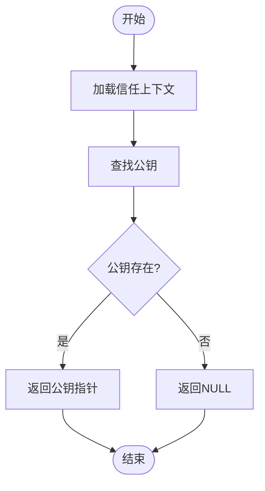
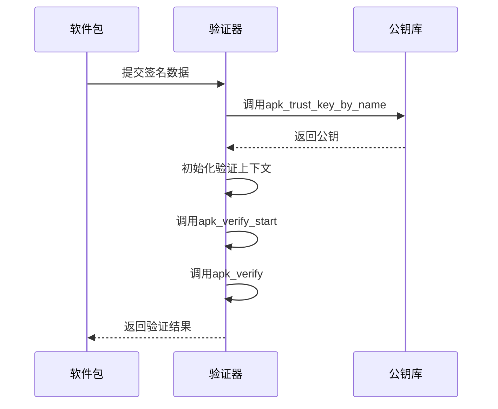
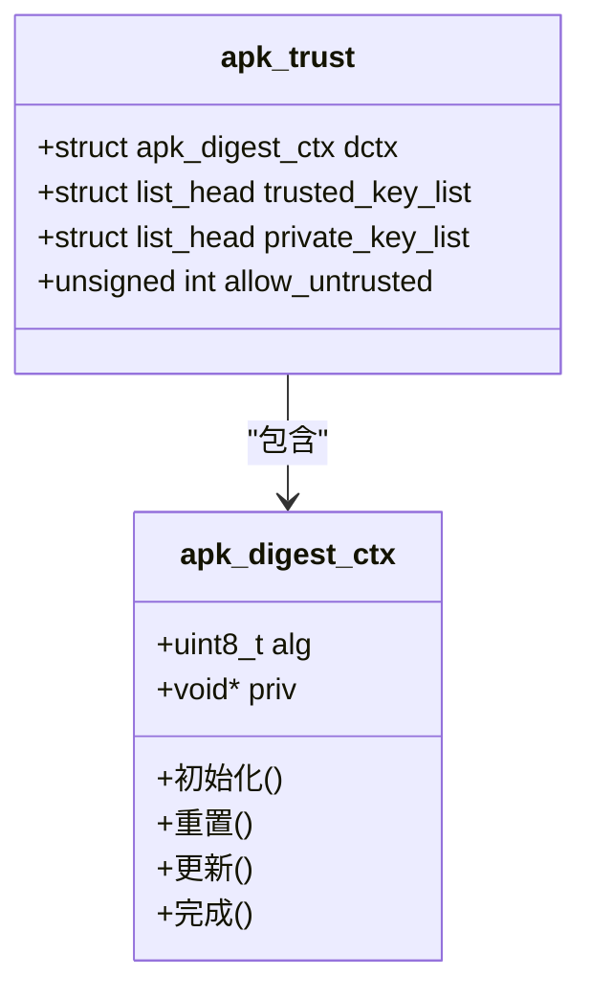
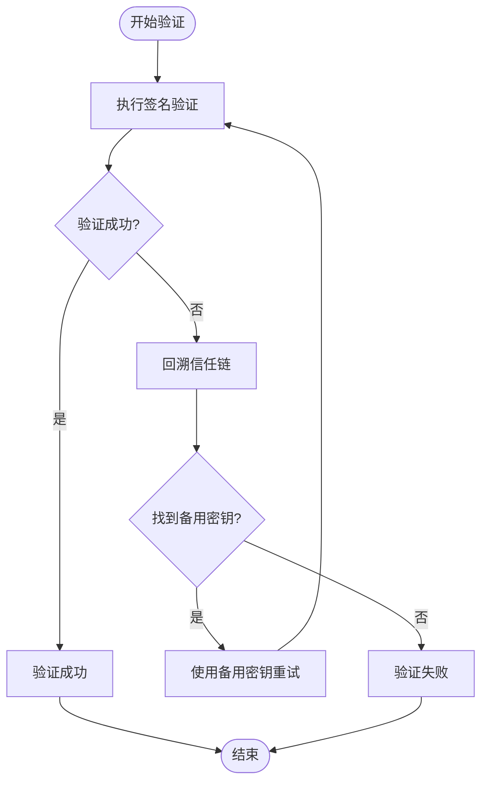
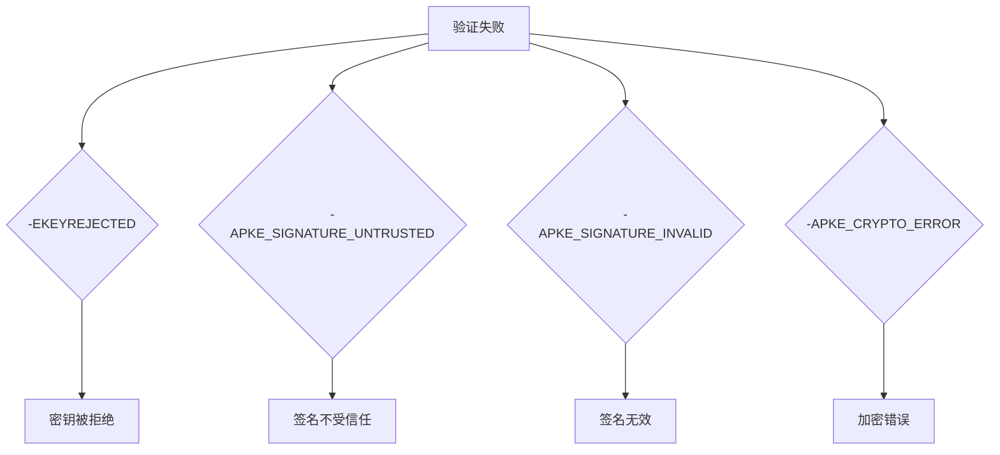

# 信任链验证流程

<cite>
**本文档中引用的文件**   
- [trust.c](file://src/trust.c)
- [apk_trust.h](file://src/apk_trust.h)
- [extract_v2.c](file://src/extract_v2.c)
- [crypto_openssl.c](file://src/crypto_openssl.c)
- [crypto_mbedtls.c](file://src/crypto_mbedtls.c)
- [context.c](file://src/context.c)
- [adb.c](file://src/adb.c)
- [apk_crypto.h](file://src/apk_crypto.h)
</cite>

## 目录
1. [信任链验证概述](#信任链验证概述)
2. [公钥获取与信任上下文](#公钥获取与信任上下文)
3. [签名验证流程](#签名验证流程)
4. [哈希计算与digest_ctx作用](#哈希计算与digest_ctx作用)
5. [验证失败处理与备用密钥重试](#验证失败处理与备用密钥重试)
6. [错误码区分机制](#错误码区分机制)
7. [多级CA体系构建指南](#多级ca体系构建指南)
8. [allow_untrusted标志位风险](#allow_untrusted标志位风险)

## 信任链验证概述

apk-tools的完整信任链验证流程从公钥获取开始，通过非对称加密技术对软件包签名进行验证。该流程涉及信任上下文管理、哈希计算、签名验证和错误处理等多个关键环节。系统通过信任链机制确保软件包来源的可信性，防止恶意软件的注入和篡改。

## 公钥获取与信任上下文

信任链验证的第一步是通过`apk_trust_key_by_name`函数获取公钥。该函数在信任上下文中查找指定名称的公钥，返回对应的`apk_pkey`结构体。



**图示来源**
- [trust.c](file://src/trust.c#L50-L58)
- [apk_trust.h](file://src/apk_trust.h#L29)

**本节来源**
- [trust.c](file://src/trust.c#L50-L58)
- [apk_trust.h](file://src/apk_trust.h#L20-L25)

## 签名验证流程

获取公钥后，系统调用`apk_pkey_verify`对软件包签名进行非对称加密验证。验证过程包括初始化验证上下文、设置公钥和执行验证操作。



**图示来源**
- [extract_v2.c](file://src/extract_v2.c#L240-L244)
- [crypto_openssl.c](file://src/crypto_openssl.c#L227-L240)
- [crypto_mbedtls.c](file://src/crypto_mbedtls.c#L323-L354)

**本节来源**
- [extract_v2.c](file://src/extract_v2.c#L240-L244)
- [crypto_openssl.c](file://src/crypto_openssl.c#L227-L240)

## 哈希计算与digest_ctx作用

`digest_ctx`在哈希计算中扮演核心角色，负责管理哈希算法的状态和计算过程。它与信任上下文紧密关联，确保哈希计算的一致性和安全性。



**图示来源**
- [apk_crypto.h](file://src/apk_crypto.h#L47-L89)
- [crypto_openssl.c](file://src/crypto_openssl.c#L108-L156)
- [crypto_mbedtls.c](file://src/crypto_mbedtls.c#L46-L99)

**本节来源**
- [apk_crypto.h](file://src/apk_crypto.h#L47-L89)
- [crypto_openssl.c](file://src/crypto_openssl.c#L108-L156)

## 验证失败处理与备用密钥重试

当签名验证失败时，系统会回溯信任链并尝试备用密钥进行重试。这一机制提高了验证的容错能力，确保在主密钥失效时仍能完成验证。



**图示来源**
- [extract_v2.c](file://src/extract_v2.c#L138-L159)
- [adb.c](file://src/adb.c#L1367-L1388)

**本节来源**
- [extract_v2.c](file://src/extract_v2.c#L138-L159)
- [adb.c](file://src/adb.c#L1367-L1388)

## 错误码区分机制

系统通过不同的错误码来区分各种验证失败场景，便于诊断和处理。主要错误码包括-EKEYREJECTED等，每种错误码对应特定的失败原因。



**图示来源**
- [extract_v2.c](file://src/extract_v2.c#L80-L84)
- [adb.c](file://src/adb.c#L1388)

**本节来源**
- [extract_v2.c](file://src/extract_v2.c#L80-L84)
- [adb.c](file://src/adb.c#L1388)

## 多级CA体系构建指南

构建多级CA体系需要导入中间证书并配置信任策略。以下是具体操作步骤：

1. **生成根CA证书**
```bash
openssl genrsa -out root-ca.key 4096
openssl req -x509 -new -nodes -key root-ca.key -sha256 -days 3650 -out root-ca.crt
```

2. **生成中间CA证书**
```bash
openssl genrsa -out intermediate-ca.key 4096
openssl req -new -key intermediate-ca.key -out intermediate-ca.csr
openssl x509 -req -in intermediate-ca.csr -CA root-ca.crt -CAkey root-ca.key -CAcreateserial -out intermediate-ca.crt -days 1825 -sha256
```

3. **导入中间证书到信任库**
```bash
cp intermediate-ca.crt /etc/apk/keys/
```

4. **配置信任策略**
在`/etc/apk/repositories`中配置信任链：
```
https://mirror.example.com/alpine/v3.18/main
https://mirror.example.com/alpine/v3.18/community
```

**本节来源**
- [context.c](file://src/context.c#L145-L163)
- [trust.c](file://src/trust.c#L5-L22)

## allow_untrusted标志位风险

`allow_untrusted`标志位在开发测试环境中虽然方便，但存在严重的安全风险。启用此标志位会绕过信任验证，可能导致恶意软件的安装。


**图示来源**
- [apk_trust.h](file://src/apk_trust.h#L23)
- [context.c](file://src/context.c#L63)

**本节来源**
- [apk_trust.h](file://src/apk_trust.h#L23)
- [context.c](file://src/context.c#L63)