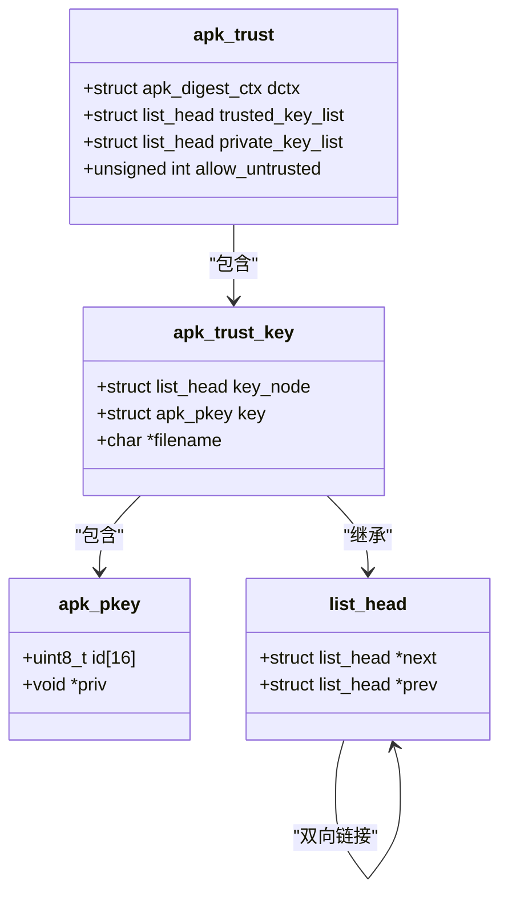
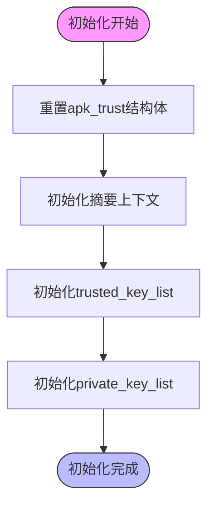
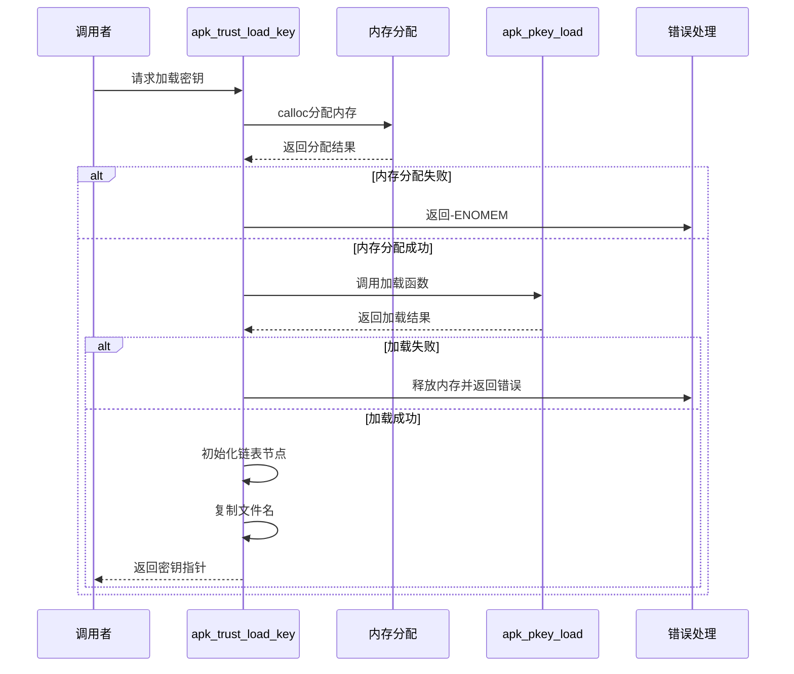
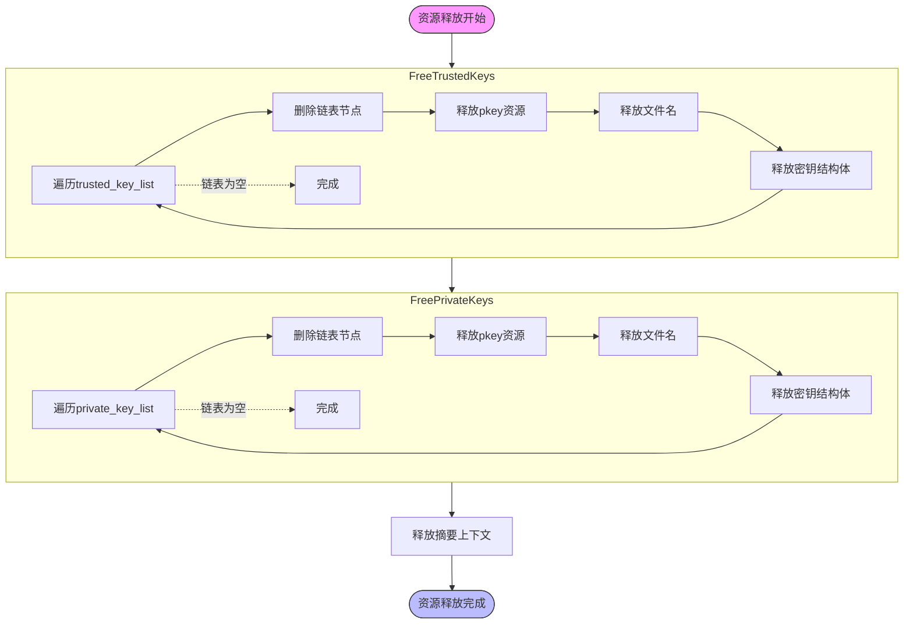
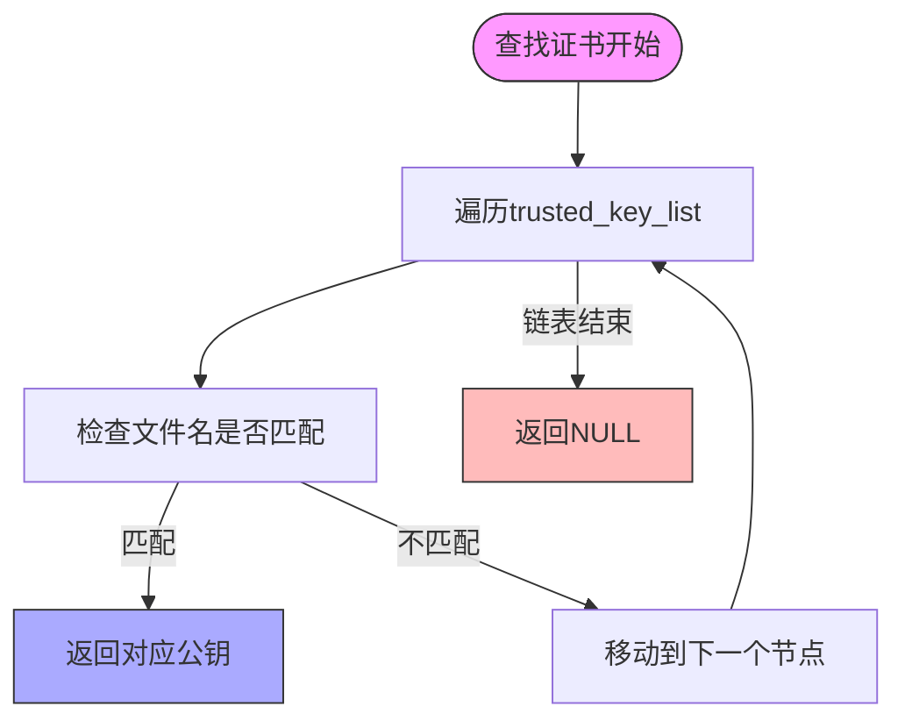

# 信任锚点管理

<cite>
**本文档引用的文件**  
- [apk_trust.h](file://src/apk_trust.h)
- [trust.c](file://src/trust.c)
- [apk_crypto.h](file://src/apk_crypto.h)
- [crypto_openssl.c](file://src/crypto_openssl.c)
- [crypto_mbedtls.c](file://src/crypto_mbedtls.c)
- [apk_defines.h](file://src/apk_defines.h)
</cite>

## 目录
1. [简介](#简介)
2. [信任锚点数据结构](#信任锚点数据结构)
3. [初始化与重置](#初始化与重置)
4. [密钥加载流程](#密钥加载流程)
5. [资源释放机制](#资源释放机制)
6. [证书选择策略](#证书选择策略)
7. [生产环境最佳实践](#生产环境最佳实践)

## 简介
apk-tools通过系统化的信任锚点管理机制确保软件包签名验证的安全性。本系统基于链表结构组织根证书，提供完整的生命周期管理，包括初始化、加载、查找和清理。核心功能由`apk_trust`结构体和相关函数实现，支持PEM格式公钥文件的加载与验证，为包管理系统提供可靠的信任基础。

## 信任锚点数据结构

信任锚点系统采用链表结构存储和组织根证书，确保高效的内存管理和快速的证书查找。

**Diagram sources**  
- [apk_trust.h](file://src/apk_trust.h#L20-L25)
- [apk_trust.h](file://src/apk_trust.h#L13-L17)
- [apk_crypto.h](file://src/apk_crypto.h#L93-L96)
- [apk_defines.h](file://src/apk_defines.h#L309-L310)

**Section sources**  
- [apk_trust.h](file://src/apk_trust.h#L13-L25)

## 初始化与重置

`apk_trust_init`函数在初始化时对信任链表进行清空与重置操作，确保系统处于已知的初始状态。

**Diagram sources**  
- [trust.c](file://src/trust.c#L24-L30)

**Section sources**  
- [trust.c](file://src/trust.c#L23-L29)

## 密钥加载流程

`apk_trust_load_key`函数在加载PEM格式公钥文件时执行内存分配与错误处理流程，确保安全可靠的密钥加载。

**Diagram sources**  
- [trust.c](file://src/trust.c#L4-L21)
- [crypto_openssl.c](file://src/crypto_openssl.c#L189-L208)
- [crypto_mbedtls.c](file://src/crypto_mbedtls.c#L259-L293)

**Section sources**  
- [trust.c](file://src/trust.c#L4-L21)

## 资源释放机制

`apk_trust_free`函数安全释放整个信任链表资源，防止内存泄漏，确保系统资源的正确管理。

**Diagram sources**  
- [trust.c](file://src/trust.c#L43-L48)
- [trust.c](file://src/trust.c#L32-L42)

**Section sources**  
- [trust.c](file://src/trust.c#L43-L48)

## 证书选择策略

当多个CA证书并存时，系统通过文件名匹配选择正确的信任锚点进行签名验证，确保准确的证书识别。

**Diagram sources**  
- [trust.c](file://src/trust.c#L50-L58)

**Section sources**  
- [trust.c](file://src/trust.c#L50-L58)

## 生产环境最佳实践

在生产环境中维护信任锚点需要遵循一系列最佳实践，确保系统的安全性和可靠性。

### 证书更新
- 定期更新信任的根证书，移除过期或不再使用的证书
- 使用自动化脚本批量更新证书，减少人为错误
- 在更新前备份现有信任锚点配置

### 吊销检查
- 实现证书吊销列表(CRL)检查机制
- 定期验证信任锚点的有效性
- 监控证书有效期，提前预警即将过期的证书

### 权限控制
- 严格限制信任锚点文件的访问权限
- 使用文件系统权限确保只有授权用户可修改
- 记录所有对信任锚点的修改操作

### 安全审计
- 定期审计信任的CA证书列表
- 验证每个信任锚点的来源和合法性
- 维护信任锚点变更的完整日志

**Section sources**  
- [apk_trust.h](file://src/apk_trust.h)
- [trust.c](file://src/trust.c)
- [apk_crypto.h](file://src/apk_crypto.h)