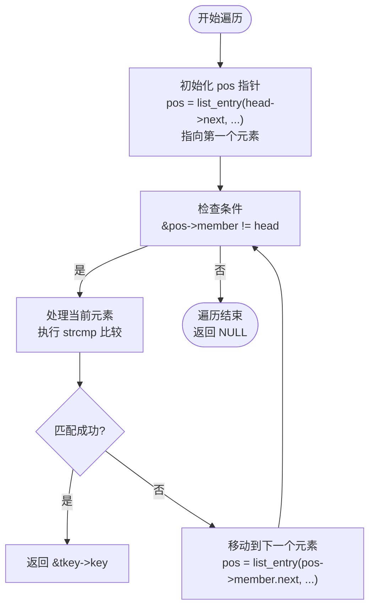

# 密钥匹配与查找

<cite>
**本文档引用的文件**  
- [trust.c](file://src/trust.c)
- [apk_trust.h](file://src/apk_trust.h)
- [apk_defines.h](file://src/apk_defines.h)
- [apk_crypto.h](file://src/apk_crypto.h)
- [extract_v2.c](file://src/extract_v2.c)
</cite>

## 目录
1. [引言](#引言)
2. [核心机制分析](#核心机制分析)
3. [链表遍历与性能](#链表遍历与性能)
4. [字符串匹配逻辑](#字符串匹配逻辑)
5. [扩展匹配策略](#扩展匹配策略)
6. [安全风险与命名规范](#安全风险与命名规范)
7. [调试与故障排除](#调试与故障排除)
8. [结论](#结论)

## 引言
在apk-tools项目中，密钥管理是确保软件包完整性和来源可信的核心功能。本文件深入解析`apk_trust_key_by_name`函数如何基于文件名实现密钥查找，详细说明其在`trusted_key_list`链表中的遍历机制、字符串比较逻辑以及潜在的安全考量。通过分析相关代码结构和调用流程，为开发者提供对密钥查找机制的全面理解。

## 核心机制分析

`apk_trust_key_by_name`函数是apk-tools中用于根据文件名查找可信密钥的核心函数。该函数接收一个`struct apk_trust`类型的信任上下文和一个目标文件名作为参数，返回对应的公钥指针。其工作流程如下：首先遍历`trust->trusted_key_list`链表中的每个`apk_trust_key`节点，然后检查当前节点的`filename`字段是否非空且与传入的目标文件名完全匹配。一旦找到匹配项，立即返回该节点所包含的`apk_pkey`密钥结构体的地址；若遍历完整个链表仍未找到匹配项，则返回NULL表示查找失败。

此机制确保了只有预先加载并注册到信任列表中的密钥文件才能被成功识别和使用，从而保障了系统安全性。

**Section sources**
- [trust.c](file://src/trust.c#L50-L58)
- [apk_trust.h](file://src/apk_trust.h#L29)

## 链表遍历与性能

`apk_trust_key_by_name`函数依赖`list_for_each_entry`宏来遍历`trusted_key_list`双向链表。该宏定义于`apk_defines.h`中，利用`container_of`机制将链表节点的`list_head`成员地址转换回其所属结构体（即`apk_trust_key`）的指针，从而实现对链表中每个元素的访问。

**Diagram sources**
- [apk_defines.h](file://src/apk_defines.h#L392-L395)
- [trust.c](file://src/trust.c#L55)

**Section sources**
- [apk_defines.h](file://src/apk_defines.h#L392-L395)
- [trust.c](file://src/trust.c#L55)

该遍历方式的时间复杂度为O(n)，其中n为链表长度。由于是线性搜索，性能随信任密钥数量增加而线性下降。在实际应用中，通常信任的密钥数量有限，因此该性能特征是可以接受的。对于需要更高性能的场景，可考虑引入哈希表等数据结构进行优化。

## 字符串匹配逻辑

密钥查找过程中的关键判断是通过标准C库函数`strcmp`实现的。`strcmp(tkey->filename, filename)`用于比较链表中当前密钥节点的文件名与目标文件名。`strcmp`函数按字典序逐字符比较两个字符串，当两字符串完全相同时返回0。因此，`if (tkey->filename && strcmp(tkey->filename, filename) == 0)`这一条件语句确保了只有当`filename`字段存在且内容与目标文件名完全一致时，才会判定为匹配成功。

这种精确匹配策略杜绝了路径遍历攻击（如使用`../`）或文件名混淆的可能性，增强了系统的安全性。同时，它也要求调用者必须提供准确的、与注册时完全一致的文件名。

**Section sources**
- [trust.c](file://src/trust.c#L56)

## 扩展匹配策略

虽然当前实现采用严格的精确匹配，但在某些场景下可能需要支持模糊匹配或通配符。例如，允许使用`*.pub`来匹配所有公钥文件，或支持正则表达式进行更复杂的模式匹配。潜在的扩展方式包括：

1.  **通配符匹配**：替换`strcmp`为`fnmatch`函数，支持`*`和`?`等通配符。
2.  **正则表达式**：引入正则表达式库，允许使用更强大的模式进行匹配。
3.  **前缀/后缀匹配**：提供专门的API来查找以特定字符串开头或结尾的密钥文件。

这些扩展需要在便利性和安全性之间进行权衡，因为过于宽松的匹配规则可能会引入安全漏洞。

## 安全风险与命名规范

当存在同名但内容不同的密钥文件时，会引发严重的安全风险。由于`apk_trust_key_by_name`函数在找到第一个匹配项后即返回，后续同名密钥将被忽略。这可能导致：
- **密钥混淆**：系统可能错误地使用了预期之外的密钥进行验证。
- **降级攻击**：攻击者可能通过放置一个弱密钥文件来覆盖原有的强密钥。

为避免此类风险，应制定严格的命名规范：
- **唯一性**：确保每个密钥文件名在信任库中是唯一的。
- **包含标识信息**：文件名应包含密钥所有者、用途或生成时间等信息，例如`alpine-devel@alpinelinux.org-2023.pub`。
- **避免通用名称**：禁止使用`key.pub`、`default.key`等容易冲突的通用名称。

遵循这些规范可以有效防止命名冲突，确保密钥查找的准确性和安全性。

**Section sources**
- [trust.c](file://src/trust.c#L50-L58)
- [apk_trust.h](file://src/apk_trust.h#L13-L18)

## 调试与故障排除

当密钥查找失败时，可以采取以下实用方法进行调试：
1.  **启用详细日志**：在`apk_trust_key_by_name`函数中添加日志输出，打印出每次比较的`tkey->filename`和`filename`，以确认遍历过程和匹配情况。
2.  **手动验证指纹**：使用外部工具（如`openssl`）手动计算密钥文件的指纹（如SHA-256），并与系统内部加载的密钥指纹进行比对，确认文件内容是否正确。
3.  **检查信任列表**：在调用查找函数前，遍历并打印整个`trusted_key_list`，确认目标密钥文件已成功加载。
4.  **验证文件路径**：确保传入的文件名是相对于正确目录的，并且文件系统中的实际文件名与代码中使用的名称完全一致（注意大小写和特殊字符）。

这些方法有助于快速定位问题根源，无论是配置错误、文件缺失还是代码逻辑问题。

**Section sources**
- [trust.c](file://src/trust.c#L50-L58)
- [extract_v2.c](file://src/extract_v2.c#L153)

## 结论

`apk_trust_key_by_name`函数通过线性遍历`trusted_key_list`链表并结合`strcmp`进行精确字符串匹配，实现了安全可靠的基于文件名的密钥查找。该机制设计简洁，安全性高，但性能随密钥数量线性增长。开发者在使用时应遵循严格的命名规范以避免冲突，并可通过日志和指纹验证等手段进行有效调试。未来可根据需求扩展支持更灵活的匹配模式，但需谨慎评估其带来的安全影响。