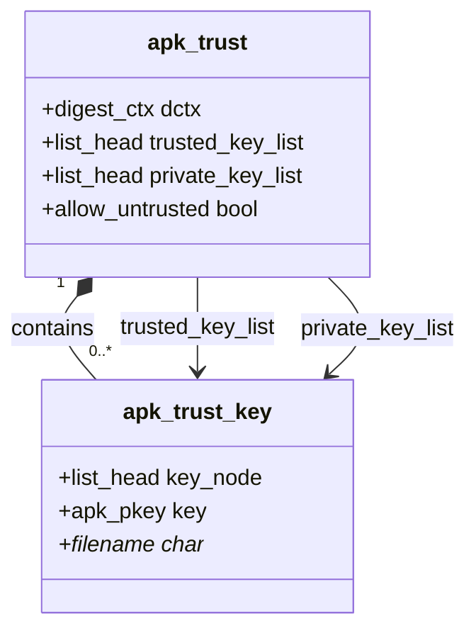
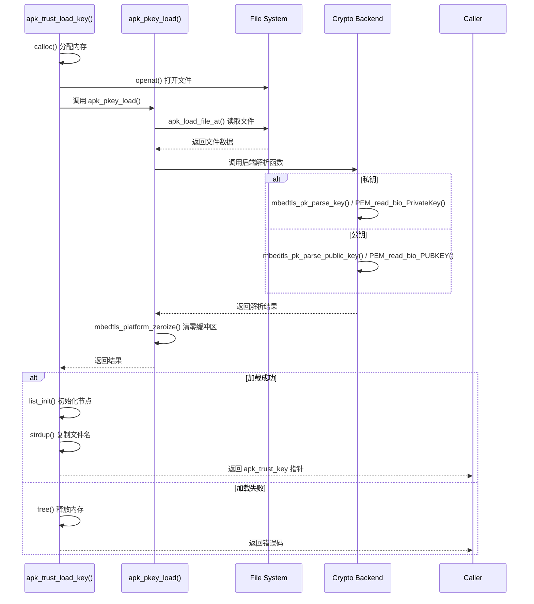

# 密钥存储与管理

<cite>
**Referenced Files in This Document**   
- [apk_trust.h](file://src/apk_trust.h)
- [trust.c](file://src/trust.c)
- [crypto_openssl.c](file://src/crypto_openssl.c)
- [crypto_mbedtls.c](file://src/crypto_mbedtls.c)
</cite>

## 目录
1. [密钥结构体设计](#密钥结构体设计)
2. [双链表分离存储策略](#双链表分离存储策略)
3. [密钥加载流程分析](#密钥加载流程分析)
4. [内存安全与数据保护](#内存安全与数据保护)
5. [文件系统配置建议](#文件系统配置建议)

## 密钥结构体设计

`struct apk_trust_key` 结构体是密钥存储的核心数据结构，采用链表节点、密钥数据和文件路径三重封装设计。该结构体包含三个主要成员：`key_node` 作为链表节点实现密钥的动态管理，`key` 存储实际的密钥数据（`struct apk_pkey` 类型），以及 `filename` 字符串指针记录密钥文件的路径信息。这种设计实现了元数据与实际密钥数据的分离，便于在内存中高效组织和管理多个密钥。

**Section sources**
- [apk_trust.h](file://src/apk_trust.h#L13-L17)

## 双链表分离存储策略

系统采用 `private_key_list` 和 `trusted_key_list` 两个独立链表进行密钥的分离存储。`private_key_list` 专门用于管理私钥，而 `trusted_key_list` 用于存储受信任的公钥。这种分离策略具有重要的安全意义：通过将私钥和公钥分开放置，可以实施不同的访问控制策略，降低私钥意外暴露的风险。同时，在密钥查找和验证过程中，能够快速定位到特定类型的密钥，提高操作效率并减少潜在的安全漏洞。

**Diagram sources**
- [apk_trust.h](file://src/apk_trust.h#L20-L23)

**Section sources**
- [apk_trust.h](file://src/apk_trust.h#L22-L23)

## 密钥加载流程分析

`apk_trust_load_key` 函数负责从文件系统加载 PEM/DER 格式的密钥，其完整流程包含权限检查、格式解析和内存安全处理。函数首先通过 `openat` 系统调用以只读模式打开密钥文件，实现基于文件描述符的安全访问。随后调用 `apk_pkey_load` 函数进行格式解析：对于 OpenSSL 后端，使用 `PEM_read_bio_PrivateKey` 或 `PEM_read_bio_PUBKEY` 分别解析私钥和公钥；对于 mbedTLS 后端，则通过 `mbedtls_pk_parse_key` 和 `mbedtls_pk_parse_public_key` 进行解析。整个加载过程严格遵循权限最小化原则，并对文件大小进行限制以防止资源耗尽攻击。

**Diagram sources**
- [trust.c](file://src/trust.c#L5-L21)
- [crypto_openssl.c](file://src/crypto_openssl.c#L190-L208)
- [crypto_mbedtls.c](file://src/crypto_mbedtls.c#L259-L293)

**Section sources**
- [trust.c](file://src/trust.c#L5-L21)

## 内存安全与数据保护

密钥管理系统实施了严格的内存保护机制以确保敏感数据安全。在密钥加载过程中，使用 `mbedtls_platform_zeroize()` 函数对存储原始密钥数据的缓冲区进行安全清零，防止敏感信息残留在内存中。密钥释放时，`apk_pkey_free` 函数会正确清理底层加密库的上下文并释放相关资源。访问控制通过将私钥和公钥分离存储在不同链表中实现，限制了对私钥的访问范围。此外，系统使用 `calloc` 进行内存分配，确保新分配的内存区域被初始化为零，进一步降低了信息泄露的风险。

**Section sources**
- [crypto_mbedtls.c](file://src/crypto_mbedtls.c#L284-L285)
- [crypto_openssl.c](file://src/crypto_openssl.c#L206-L207)

## 文件系统配置建议

为确保密钥存储的安全性，建议对密钥目录设置严格的权限控制，推荐使用 `0700` 权限模式，即仅允许所有者进行读、写和执行操作。密钥文件命名应遵循清晰的规范，例如采用 `.alpine-devel@alpinelinux.org.rsa.pub` 的格式，其中包含开发者标识、域名和密钥类型信息。这种命名方式不仅便于识别密钥的来源和用途，还能有效避免命名冲突。同时，应将密钥文件存储在受保护的系统目录中，并定期审计文件权限和访问日志。

**Section sources**
- [crypto_mbedtls.c](file://src/crypto_mbedtls.c#L167-L168)
- [crypto_openssl.c](file://src/crypto_openssl.c#L196-L197)