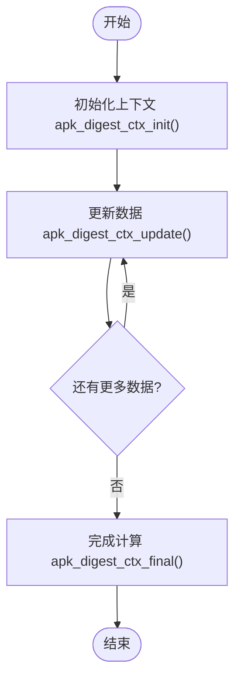
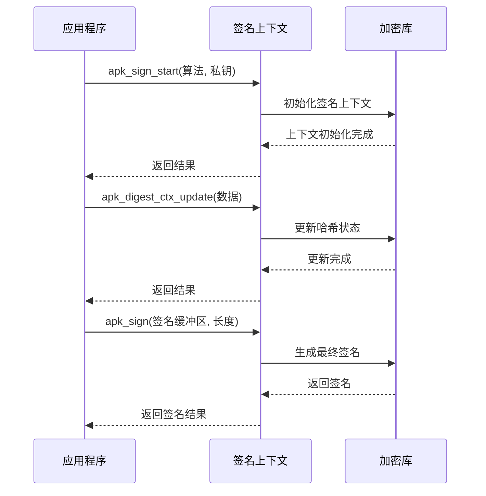

# 加密后端实现

<cite>
**本文档引用的文件**   
- [apk_crypto.h](file://src/apk_crypto.h)
- [crypto.c](file://src/crypto.c)
- [crypto_openssl.c](file://src/crypto_openssl.c)
- [crypto_mbedtls.c](file://src/crypto_mbedtls.c)
- [apk_defines.h](file://src/apk_defines.h)
- [apk_blob.h](file://src/apk_blob.h)
</cite>

## 目录
1. [双重加密后端架构](#双重加密后端架构)
2. [编译时加密库切换机制](#编译时加密库切换机制)
3. [摘要算法实现与包完整性校验](#摘要算法实现与包完整性校验)
4. [哈希计算流程与上下文管理](#哈希计算流程与上下文管理)
5. [核心函数实现逻辑](#核心函数实现逻辑)
6. [签名与验证过程分析](#签名与验证过程分析)
7. [算法扩展技术路径](#算法扩展技术路径)

## 双重加密后端架构

apk-tools 实现了双重加密后端架构，支持在 OpenSSL 和 mbedTLS 之间进行切换。该架构通过抽象层设计，将加密功能的接口与具体实现分离，确保了代码的可移植性和灵活性。系统在编译时根据配置选项选择相应的加密库实现，同时提供了统一的 API 接口供上层调用。

**Section sources**
- [apk_crypto.h](file://src/apk_crypto.h#L1-L111)
- [crypto_openssl.c](file://src/crypto_openssl.c#L1-L270)
- [crypto_mbedtls.c](file://src/crypto_mbedtls.c#L1-L372)

## 编译时加密库切换机制

apk-tools 通过编译时选项实现 OpenSSL 和 mbedTLS 之间的切换。系统在构建过程中根据配置决定链接哪个加密库的实现文件。这种设计允许开发者根据目标平台的安全需求、性能要求和许可证兼容性选择最合适的加密库。

两种实现都遵循相同的接口规范，通过 `apk_crypto.h` 头文件中定义的函数声明进行调用。`crypto_openssl.c` 和 `crypto_mbedtls.c` 分别实现了这些接口函数，提供了对底层加密库的封装。初始化函数 `apk_crypto_init()` 在程序启动时被调用，负责初始化所选加密库的上下文和资源。

**性能与安全性对比**：
- **OpenSSL**：功能丰富，性能优秀，广泛使用但代码库较大
- **mbedTLS**：轻量级设计，内存占用小，适合嵌入式系统，代码简洁易审计

**Section sources**
- [crypto_openssl.c](file://src/crypto_openssl.c#L1-L270)
- [crypto_mbedtls.c](file://src/crypto_mbedtls.c#L1-L372)
- [apk_crypto.h](file://src/apk_crypto.h#L108-L110)

## 摘要算法实现与包完整性校验

### 摘要算法定义

`apk_crypto.h` 文件中定义了多种摘要算法，用于包完整性校验：

```c
#define APK_DIGEST_NONE       0x00
#define APK_DIGEST_SHA1       0x02
#define APK_DIGEST_SHA256     0x03
#define APK_DIGEST_SHA512     0x04
#define APK_DIGEST_SHA256_160 0x05
```

这些算法提供了不同级别的安全性和性能平衡。SHA1 虽然存在已知的碰撞漏洞，但仍用于向后兼容；SHA256 和 SHA512 提供了更强的安全性保证。

### 包完整性校验应用

摘要算法在包完整性校验中发挥关键作用。系统通过计算包内容的哈希值并与预存的校验值进行比较，确保数据在传输和存储过程中未被篡改。`apk_digest_calc` 函数用于一次性计算数据块的完整哈希值，而 `apk_digest_ctx` 上下文机制则支持分块计算大文件的哈希值。

**Section sources**
- [apk_crypto.h](file://src/apk_crypto.h#L14-L31)
- [crypto.c](file://src/crypto.c#L3-L60)
- [crypto_openssl.c](file://src/crypto_openssl.c#L98-L105)
- [crypto_mbedtls.c](file://src/crypto_mbedtls.c#L65-L72)

## 哈希计算流程与上下文管理

### apk_digest_ctx 上下文管理机制

`apk_digest_ctx` 结构体是哈希计算的核心管理机制，定义如下：

```c
struct apk_digest_ctx {
    uint8_t alg;
    void *priv;
};
```

该结构体包含算法标识符和指向私有数据的指针。`priv` 指针在不同加密库实现中指向不同的上下文结构，实现了对底层加密库的抽象。

### 哈希计算流程

哈希计算流程包括初始化、更新和完成三个阶段：

1. **初始化**：`apk_digest_ctx_init()` 函数创建并初始化上下文
2. **更新**：`apk_digest_ctx_update()` 函数分块处理输入数据
3. **完成**：`apk_digest_ctx_final()` 函数生成最终的摘要值

这种分阶段的处理方式特别适合处理大文件或流式数据，避免了内存溢出问题。



**Diagram sources**
- [apk_crypto.h](file://src/apk_crypto.h#L79-L82)
- [crypto_openssl.c](file://src/crypto_openssl.c#L107-L121)
- [crypto_mbedtls.c](file://src/crypto_mbedtls.c#L74-L89)

**Section sources**
- [apk_crypto.h](file://src/apk_crypto.h#L77-L90)
- [crypto_openssl.c](file://src/crypto_openssl.c#L107-L164)
- [crypto_mbedtls.c](file://src/crypto_mbedtls.c#L74-L147)

## 核心函数实现逻辑

### apk_digest_calc 实现

`apk_digest_calc` 函数用于计算指定数据的摘要值。在 OpenSSL 实现中，该函数调用 `EVP_Digest` 进行一次性哈希计算：

```c
int apk_digest_calc(struct apk_digest *d, uint8_t alg, const void *ptr, size_t sz)
{
    unsigned int md_sz = sizeof d->data;
    if (EVP_Digest(ptr, sz, d->data, &md_sz, apk_digest_alg_to_evp(alg), 0) != 1)
        return -APKE_CRYPTO_ERROR;
    apk_digest_set(d, alg);
    return 0;
}
```

在 mbedTLS 实现中，使用 `mbedtls_md` 函数完成相同功能。

### apk_digest_ctx_init 实现

`apk_digest_ctx_init` 函数初始化哈希上下文。OpenSSL 实现创建 `EVP_MD_CTX` 上下文对象，而 mbedTLS 实现则分配 `mbedtls_md_context_t` 结构体。两种实现都通过 `priv` 指针保存底层上下文，实现了接口的统一。

**Section sources**
- [crypto_openssl.c](file://src/crypto_openssl.c#L98-L105)
- [crypto_mbedtls.c](file://src/crypto_mbedtls.c#L65-L72)
- [crypto_openssl.c](file://src/crypto_openssl.c#L107-L121)
- [crypto_mbedtls.c](file://src/crypto_mbedtls.c#L74-L89)

## 签名与验证过程分析

### 签名与验证函数作用

`apk_sign_start` 和 `apk_verify_start` 函数在数字签名过程中起关键作用：

- **apk_sign_start**：初始化签名操作，设置签名算法和私钥
- **apk_verify_start**：初始化验证操作，设置验证算法和公钥

这些函数准备了必要的上下文环境，为后续的签名生成和验证操作奠定了基础。

### 数据流分析

签名过程的数据流如下：
1. 调用 `apk_sign_start` 初始化签名上下文
2. 使用 `apk_digest_ctx_update` 更新要签名的数据
3. 调用 `apk_sign` 生成签名
4. 清理上下文资源

验证过程类似，但使用 `apk_verify_start` 和 `apk_verify` 函数。



**Diagram sources**
- [apk_crypto.h](file://src/apk_crypto.h#L103-L106)
- [crypto_openssl.c](file://src/crypto_openssl.c#L210-L217)
- [crypto_mbedtls.c](file://src/crypto_mbedtls.c#L295-L304)

**Section sources**
- [apk_crypto.h](file://src/apk_crypto.h#L101-L106)
- [crypto_openssl.c](file://src/crypto_openssl.c#L210-L241)
- [crypto_mbedtls.c](file://src/crypto_mbedtls.c#L295-L321)

## 算法扩展技术路径

### 接口约束

要扩展新的加密算法，必须遵守以下接口约束：
1. 实现 `apk_digest_alg_to_evp` 或 `apk_digest_alg_to_mdinfo` 映射函数
2. 在 `APK_DIGEST_*` 枚举中添加新的算法标识符
3. 实现相应的上下文管理函数（init, update, final）
4. 确保内存管理规范，正确分配和释放上下文资源

### 内存管理规范

系统采用统一的内存管理规范：
- 所有动态分配的上下文通过 `calloc` 创建
- 使用 `free` 函数释放内存
- 在错误处理路径中确保资源正确释放
- 通过 `apk_digest_ctx_free` 函数统一清理上下文

这种规范化的内存管理确保了系统的稳定性和安全性。

**Section sources**
- [apk_crypto.h](file://src/apk_crypto.h#L79-L90)
- [crypto_openssl.c](file://src/crypto_openssl.c#L140-L144)
- [crypto_mbedtls.c](file://src/crypto_mbedtls.c#L117-L125)