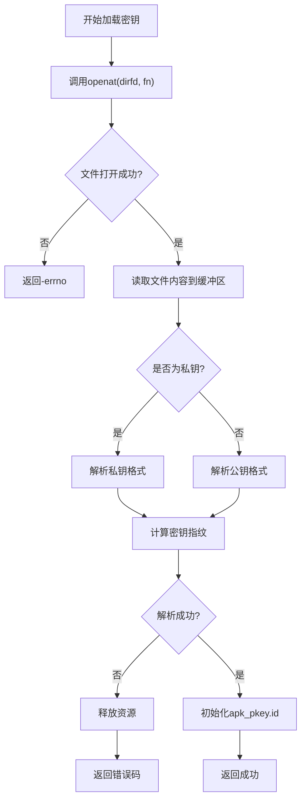
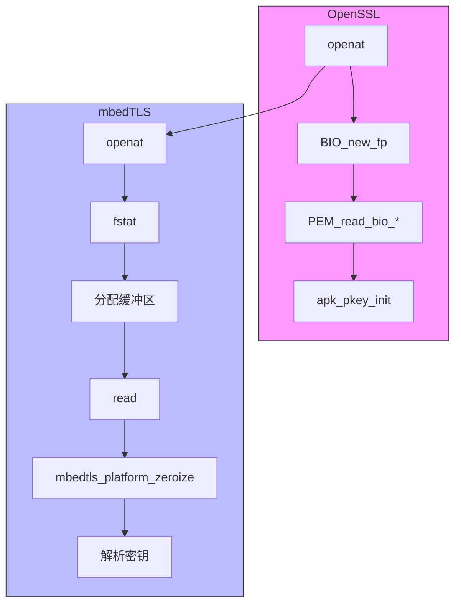

# 密钥管理机制

<cite>
**本文档中引用的文件**  
- [apk_crypto.h](file://src/apk_crypto.h)
- [crypto.c](file://src/crypto.c)
- [crypto_openssl.c](file://src/crypto_openssl.c)
- [crypto_mbedtls.c](file://src/crypto_mbedtls.c)
</cite>

## 目录
1. [引言](#引言)
2. [apk_pkey结构体设计](#apk_pkey结构体设计)
3. [密钥加载机制](#密钥加载机制)
4. [OpenSSL与mbedTLS实现对比](#openssl与mbedtls实现对比)
5. [资源释放策略](#资源释放策略)
6. [错误处理与排查](#错误处理与排查)
7. [安全存储最佳实践](#安全存储最佳实践)
8. [结论](#结论)

## 引言
apk-tools作为Alpine Linux的包管理系统，其安全性依赖于强大的非对称密钥管理机制。该系统通过`apk_pkey`结构体封装公私钥信息，并支持OpenSSL和mbedTLS两种加密后端。本文深入分析其密钥管理核心组件，涵盖结构体设计、密钥加载流程、跨库实现差异及安全实践。

**Section sources**
- [apk_crypto.h](file://src/apk_crypto.h#L92-L95)

## apk_pkey结构体设计
`apk_pkey`是apk-tools中用于表示非对称密钥的核心数据结构，定义于`apk_crypto.h`中。该结构体包含两个关键字段：16字节的`id`和指向私有实现的指针`priv`。

- `id[16]`: 存储密钥的唯一标识符，由公钥内容通过SHA512哈希算法生成，并截取前16字节构成指纹。
- `priv`: 无类型指针，用于指向后端加密库（如OpenSSL或mbedTLS）的具体密钥对象，实现抽象层与底层库的解耦。

此设计实现了密钥抽象与后端适配的分离，使得上层逻辑无需关心具体加密库的内部结构。

**Section sources**
- [apk_crypto.h](file://src/apk_crypto.h#L92-L95)

## 密钥加载机制
密钥加载由`apk_pkey_load`函数完成，采用`openat`系统调用以增强安全性，防止符号链接攻击。该函数接收目录文件描述符（dirfd）、文件名（fn）和是否加载私钥的标志（priv）。

**Diagram sources**
- [crypto_openssl.c](file://src/crypto_openssl.c#L189-L208)
- [crypto_mbedtls.c](file://src/crypto_mbedtls.c#L258-L293)

**Section sources**
- [crypto_openssl.c](file://src/crypto_openssl.c#L189-L208)
- [crypto_mbedtls.c](file://src/crypto_mbedtls.c#L258-L293)

## OpenSSL与mbedTLS实现对比
尽管`apk_pkey_load`在两种后端中功能一致，但其实现细节存在显著差异：

### PEM格式解析
- **OpenSSL**: 使用`PEM_read_bio_PrivateKey`和`PEM_read_bio_PUBKEY`直接从BIO流中解析PEM格式密钥，流程简洁。
- **mbedTLS**: 需先通过`apk_load_file_at`将文件完整读入内存，再调用`mbedtls_pk_parse_key`或`mbedtls_pk_parse_public_key`进行解析。

### 内存保护
- **OpenSSL**: 使用`OPENSSL_free`释放公钥DER编码数据。
- **mbedTLS**: 在读取密钥后立即调用`mbedtls_platform_zeroize(buf, blen)`清除内存中的敏感数据，随后释放缓冲区，提供更强的内存安全保证。

### 错误处理
- **OpenSSL**: 若PEM解析失败，返回`-APKE_CRYPTO_KEY_FORMAT`。
- **mbedTLS**: 在文件读取阶段即进行长度校验（最大64KB），非法大小直接返回`-APKE_CRYPTO_KEY_FORMAT`，并在读取失败时主动清零缓冲区。

**Diagram sources**
- [crypto_openssl.c](file://src/crypto_openssl.c#L189-L208)
- [crypto_mbedtls.c](file://src/crypto_mbedtls.c#L258-L293)

**Section sources**
- [crypto_openssl.c](file://src/crypto_openssl.c#L189-L208)
- [crypto_mbedtls.c](file://src/crypto_mbedtls.c#L258-L293)

## 资源释放策略
`apk_pkey_free`函数负责安全释放密钥资源，其行为因后端而异：

- **OpenSSL实现**: 调用`apk_pkey_set_pkey(pkey, NULL)`，后者内部执行`EVP_PKEY_free(pkey->priv)`，由OpenSSL库管理私钥对象的生命周期。
- **mbedTLS实现**: 直接调用`mbedtls_pk_free(&mp->pk)`释放mbedTLS密钥上下文，然后`free(mp)`释放封装结构体，并将`pkey->priv`置空，防止悬空指针。

两种实现均确保了密钥材料的彻底清理，符合安全编码规范。

**Section sources**
- [crypto_openssl.c](file://src/crypto_openssl.c#L184-L187)
- [crypto_mbedtls.c](file://src/crypto_mbedtls.c#L210-L219)

## 错误处理与排查
密钥加载可能失败并返回特定错误码：
- **-APKE_CRYPTO_KEY_FORMAT**: 密钥格式无效或文件大小超出限制（mbedTLS限定64KB）。排查方法：检查文件是否为标准PEM格式，确认无多余字符或损坏。
- **-ENOMEM**: 内存分配失败。排查方法：检查系统内存状态，确认进程无内存限制。
- **-errno**: 系统级错误（如ENOENT文件不存在，EACCES权限不足）。排查方法：验证路径正确性、文件存在性及读取权限。

建议使用`strace`工具跟踪系统调用，以精确定位失败环节。

**Section sources**
- [crypto_openssl.c](file://src/crypto_openssl.c#L196-L197)
- [crypto_mbedtls.c](file://src/crypto_mbedtls.c#L156-L157)

## 安全存储最佳实践
为保障密钥安全，建议遵循以下实践：
1. **权限控制**: 私钥文件权限应设为`600`（仅所有者可读写），存储目录权限为`700`。
2. **存储位置**: 将密钥存放在安全目录（如`/etc/apk/keys/`），避免放置于临时或共享目录。
3. **使用dirfd**: 始终通过目录文件描述符（dirfd）操作密钥，避免路径遍历风险。
4. **定期轮换**: 实施密钥轮换策略，减少长期密钥暴露风险。
5. **审计日志**: 记录密钥访问行为，便于安全审计。

**Section sources**
- [crypto_mbedtls.c](file://src/crypto_mbedtls.c#L149-L188)

## 结论
apk-tools的非对称密钥管理机制通过精心设计的`apk_pkey`结构体和抽象加载接口，实现了对OpenSSL与mbedTLS的无缝支持。其利用`openat`系统调用增强安全性，结合后端特性进行差异化实现，在保证功能一致性的同时，兼顾了性能与内存安全。开发者应遵循安全存储最佳实践，确保密钥生命周期的完整防护。