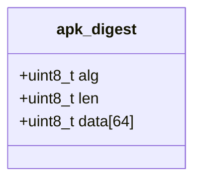
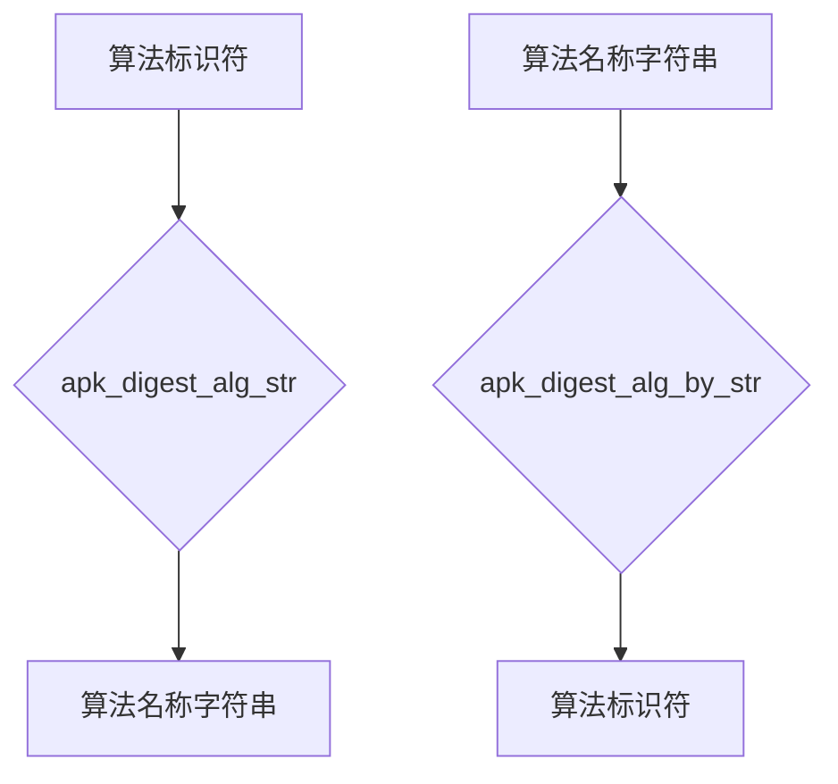
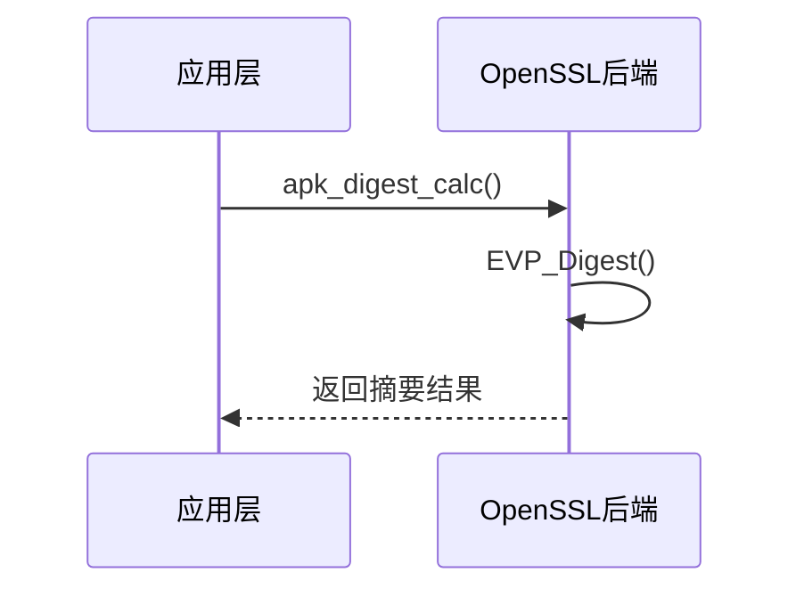
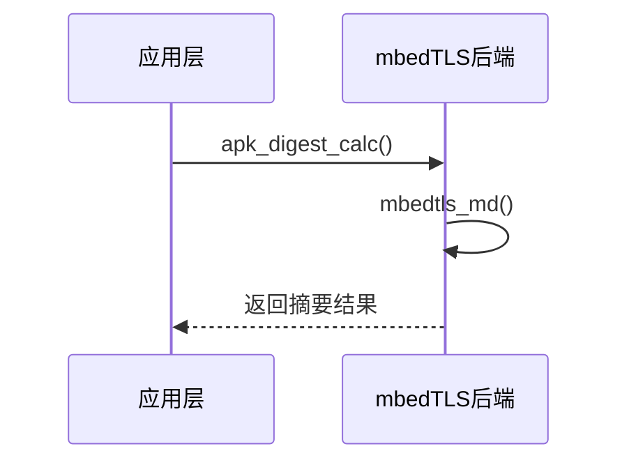
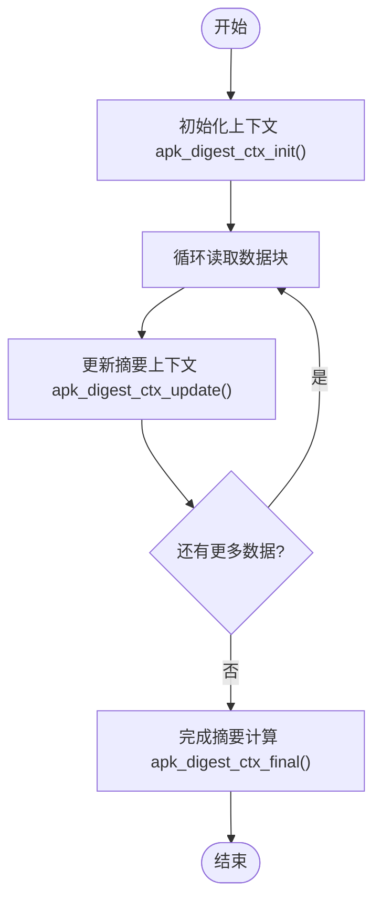

# 摘要算法实现

<cite>
**本文档引用的文件**
- [apk_crypto.h](file://src/apk_crypto.h)
- [crypto.c](file://src/crypto.c)
- [crypto_openssl.c](file://src/crypto_openssl.c)
- [crypto_mbedtls.c](file://src/crypto_mbedtls.c)
</cite>

## 目录
1. [摘要算法支持](#摘要算法支持)
2. [apk_digest结构体设计](#apk_digest结构体设计)
3. [算法名称映射机制](#算法名称映射机制)
4. [摘要计算实现差异](#摘要计算实现差异)
5. [分块哈希计算示例](#分块哈希计算示例)
6. [新增算法扩展指南](#新增算法扩展指南)

## 摘要算法支持

apk-tools支持多种摘要算法，包括SHA1、SHA256、SHA512和SHA256-160。这些算法通过预定义的标识符进行管理，每个算法都有对应的长度定义。系统通过条件编译支持OpenSSL和mbedTLS两种加密后端，确保在不同环境下都能正常工作。

**Section sources**
- [apk_crypto.h](file://src/apk_crypto.h#L16-L27)

## apk_digest结构体设计

`apk_digest`结构体是摘要计算的核心数据结构，包含算法标识符、数据长度和摘要数据三个字段。该结构体设计考虑了最大摘要长度需求，使用固定大小的缓冲区来存储摘要数据，确保内存布局的紧凑性和访问效率。结构体通过`apk_digest_set`函数进行初始化，该函数会根据算法类型自动设置正确的数据长度。

**Diagram sources**
- [apk_crypto.h](file://src/apk_crypto.h#L35-L38)

**Section sources**
- [apk_crypto.h](file://src/apk_crypto.h#L35-L38)
- [crypto.c](file://src/crypto.c#L58-L59)

## 算法名称映射机制

系统通过`apk_digest_alg_str`和`apk_digest_alg_by_str`函数实现算法名称与标识符的双向映射。`apk_digest_alg_str`函数将算法标识符转换为对应的字符串表示，而`apk_digest_alg_by_str`函数则执行相反的转换。这种映射基于静态字符串数组`apk_digest_str`实现，通过数组索引与算法标识符的对应关系完成快速查找。

**Diagram sources**
- [crypto.c](file://src/crypto.c#L3-L9)

**Section sources**
- [crypto.c](file://src/crypto.c#L10-L25)

## 摘要计算实现差异

### OpenSSL后端实现

在OpenSSL后端，`apk_digest_calc`函数通过调用`EVP_Digest`完成摘要计算。函数首先获取对应算法的EVP_MD指针，然后调用OpenSSL的摘要函数。对于OpenSSL 3.0及以上版本，使用`EVP_MD_fetch`动态获取算法，而旧版本则使用静态函数指针。

**Diagram sources**
- [crypto_openssl.c](file://src/crypto_openssl.c#L98-L105)

### mbedTLS后端实现

在mbedTLS后端，`apk_digest_calc`函数通过调用`mbedtls_md`完成摘要计算。函数首先将算法标识符转换为mbedTLS的MD类型，然后调用mbedTLS的通用摘要函数。mbedTLS实现更加简洁，直接使用单个函数处理所有算法。

**Diagram sources**
- [crypto_mbedtls.c](file://src/crypto_mbedtls.c#L65-L72)

### 性能与安全性对比

OpenSSL后端在性能上通常优于mbedTLS，特别是在处理大量数据时。然而，mbedTLS在代码体积和内存使用上更加高效，适合资源受限的环境。安全性方面，两者都经过了广泛的审计和测试，但OpenSSL由于历史原因可能存在更多的已知漏洞。mbedTLS的设计更加现代化，代码库更小，减少了潜在的攻击面。

**Section sources**
- [crypto_openssl.c](file://src/crypto_openssl.c#L48-L97)
- [crypto_mbedtls.c](file://src/crypto_mbedtls.c#L46-L64)

## 分块哈希计算示例

使用`apk_digest_ctx`上下文进行分块哈希计算的典型流程包括初始化、更新和完成三个阶段。首先调用`apk_digest_ctx_init`初始化上下文，然后通过`apk_digest_ctx_update`多次更新数据块，最后调用`apk_digest_ctx_final`获取最终摘要。这种分块计算方式特别适合处理大文件或流式数据。

**Diagram sources**
- [crypto_openssl.c](file://src/crypto_openssl.c#L108-L156)
- [crypto_mbedtls.c](file://src/crypto_mbedtls.c#L75-L154)

**Section sources**
- [crypto_openssl.c](file://src/crypto_openssl.c#L108-L156)
- [crypto_mbedtls.c](file://src/crypto_mbedtls.c#L75-L154)

## 新增算法扩展指南

### 接口约束

新增摘要算法需要遵循严格的接口约束。首先，在`apk_crypto.h`中定义新的算法标识符和长度常量。然后，在`apk_digest_str`数组中添加对应的字符串表示。最后，确保加密后端（OpenSSL或mbedTLS）支持该算法，并在相应的转换函数中添加算法映射。

### 内存管理规范

上下文结构体`apk_digest_ctx`使用`priv`指针管理后端特定的数据结构。在OpenSSL后端，使用`EVP_MD_CTX_new`和`EVP_MD_CTX_free`进行内存管理；在mbedTLS后端，使用`calloc`和`free`进行管理。必须确保在上下文释放时正确清理所有分配的资源。

### 后端集成方式

新增算法需要同时在两个加密后端中实现。对于OpenSSL，需要在`apk_digest_alg_to_evp`函数中添加算法映射；对于mbedTLS，需要在`apk_digest_alg_to_mbedtls_type`函数中添加映射。两个后端的实现必须保持行为一致性，确保跨平台的兼容性。

**Section sources**
- [apk_crypto.h](file://src/apk_crypto.h#L16-L27)
- [crypto_openssl.c](file://src/crypto_openssl.c#L83-L97)
- [crypto_mbedtls.c](file://src/crypto_mbedtls.c#L46-L57)