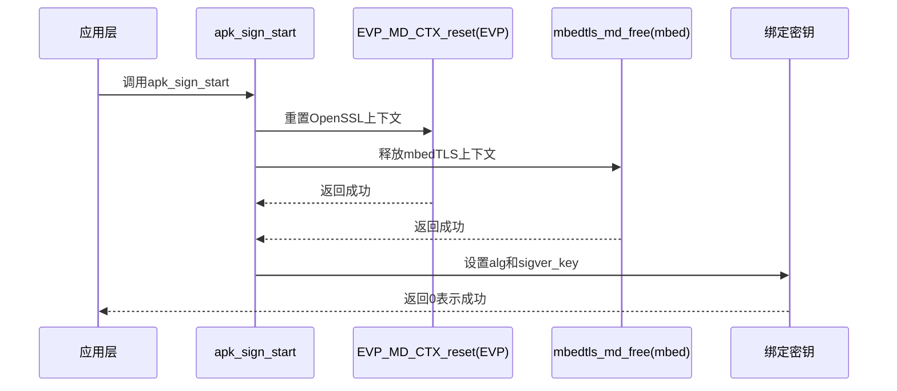
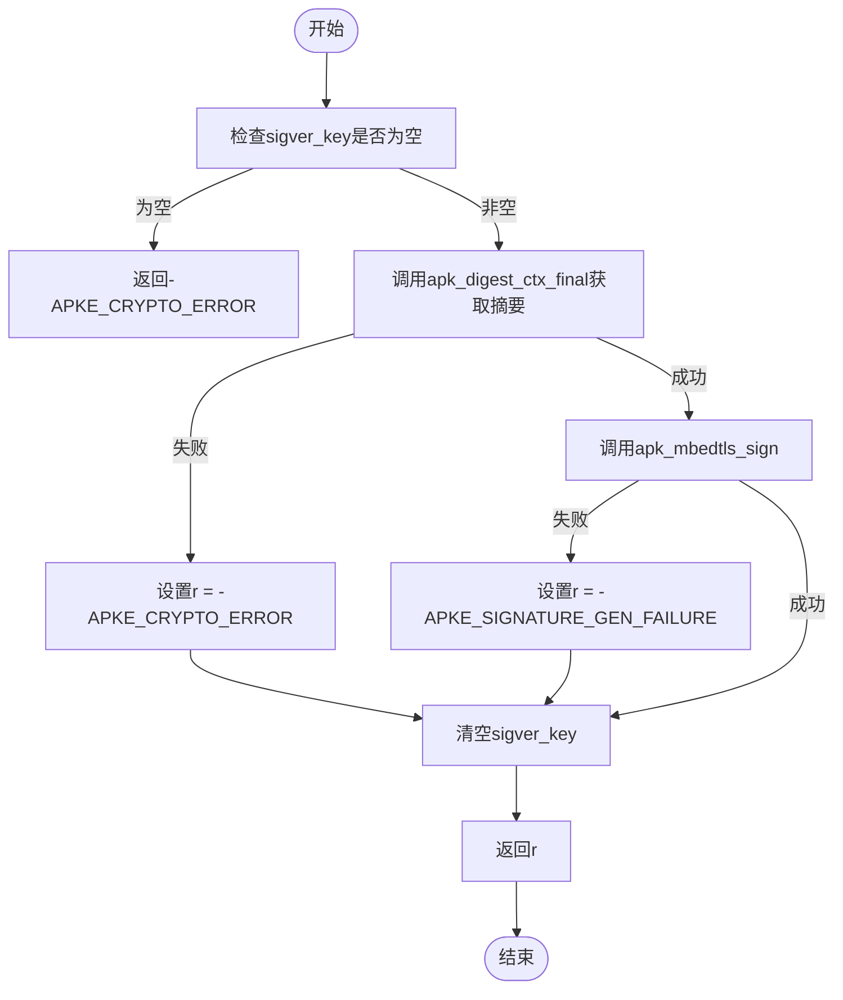
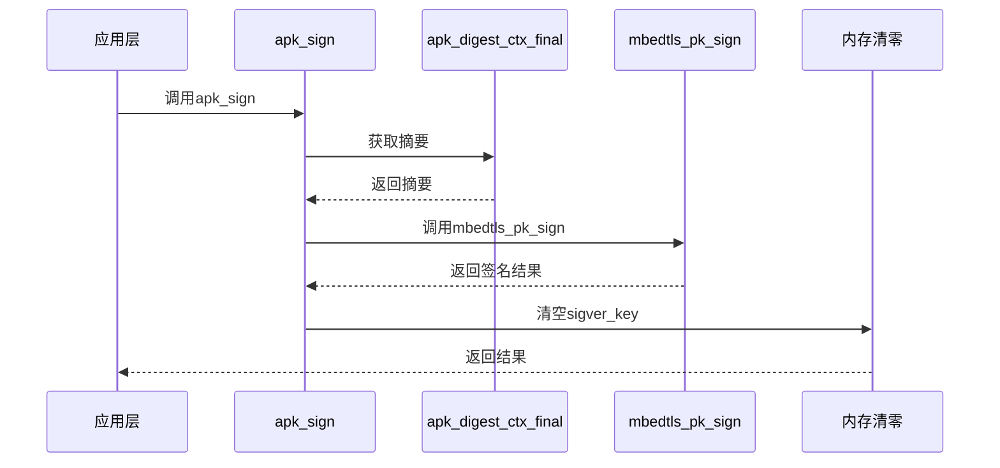

# 签名与验证流程

<cite>
**本文档引用文件**   
- [crypto.c](file://src/crypto.c)
- [crypto_mbedtls.c](file://src/crypto_mbedtls.c)
- [crypto_openssl.c](file://src/crypto_openssl.c)
- [apk_crypto.h](file://src/apk_crypto.h)
- [extract_v2.c](file://src/extract_v2.c)
</cite>

## 目录
1. [初始化上下文与绑定密钥](#初始化上下文与绑定密钥)
2. [签名与验证函数实现机制](#签名与验证函数实现机制)
3. [数据流与错误传播](#数据流与错误传播)
4. [调试签名失败问题](#调试签名失败问题)
5. [编译选项控制默认算法](#编译选项控制默认算法)

## 初始化上下文与绑定密钥

`apk_sign_start` 和 `apk_verify_start` 函数负责初始化摘要上下文并绑定私钥或公钥。在 OpenSSL 后端中，通过调用 `EVP_MD_CTX_reset` 重置上下文状态，随后使用 `EVP_DigestSignInit` 或 `EVP_DigestVerifyInit` 绑定指定的哈希算法和密钥。而在 mbedTLS 后端中，则通过 `apk_digest_ctx_reset_alg` 重置上下文，并将 `apk_pkey` 类型的密钥指针赋值给 `sigver_key` 字段完成绑定。

两种后端在状态机管理上存在差异：OpenSSL 使用 `EVP_MD_CTX_reset` 显式重置上下文，确保其处于初始状态；而 mbedTLS 则通过 `mbedtls_md_free` 释放旧的摘要上下文，再调用 `mbedtls_md_setup` 和 `mbedtls_md_starts` 重新设置新的算法上下文。这种设计使得 mbedTLS 更加注重资源的显式释放与重建。

**图示来源**
- [crypto_openssl.c](file://src/crypto_openssl.c#L210-L217)
- [crypto_mbedtls.c](file://src/crypto_mbedtls.c#L295-L304)

**本节来源**
- [crypto_openssl.c](file://src/crypto_openssl.c#L210-L217)
- [crypto_mbedtls.c](file://src/crypto_mbedtls.c#L295-L304)

## 签名与验证函数实现机制

`apk_sign` 和 `apk_verify` 函数在不同后端下的实现机制有所不同。在 OpenSSL 后端中，`apk_sign` 直接调用 `EVP_DigestSignFinal` 完成签名操作，该函数会自动处理摘要计算和签名生成；而 `apk_verify` 则调用 `EVP_DigestVerifyFinal` 验证签名的有效性。

在 mbedTLS 后端中，`apk_sign` 首先调用 `apk_digest_ctx_final` 获取最终的摘要值，然后通过 `apk_mbedtls_sign` 调用 `mbedtls_pk_sign` 执行签名操作。`apk_verify` 函数同样先获取摘要值，再调用 `mbedtls_pk_verify` 进行验证。值得注意的是，mbedTLS 的实现中包含了对随机数生成器的回调函数 `apk_mbedtls_random`，以确保签名过程的安全性。

**图示来源**
- [crypto_openssl.c](file://src/crypto_openssl.c#L219-L224)
- [crypto_mbedtls.c](file://src/crypto_mbedtls.c#L306-L320)

**本节来源**
- [crypto_openssl.c](file://src/crypto_openssl.c#L219-L224)
- [crypto_mbedtls.c](file://src/crypto_mbedtls.c#L306-L320)

## 数据流与错误传播

签名操作中的上下文重置、内存清零和错误传播构成了完整的数据流。在 OpenSSL 后端中，上下文重置由 `EVP_MD_CTX_reset` 完成，错误信息通过 OpenSSL 的错误栈进行传播；而在 mbedTLS 后端中，上下文重置通过 `mbedtls_md_free` 和 `mbedtls_md_setup` 实现，错误码直接作为函数返回值传递。

内存清零操作主要体现在密钥文件加载过程中。mbedTLS 在读取密钥文件后，立即调用 `mbedtls_platform_zeroize` 对缓冲区进行清零，防止敏感信息泄露。此外，在签名完成后，`sigver_key` 被显式置为 `NULL`，进一步增强了安全性。

**图示来源**
- [crypto_mbedtls.c](file://src/crypto_mbedtls.c#L306-L320)
- [crypto_mbedtls.c](file://src/crypto_mbedtls.c#L280-L285)

**本节来源**
- [crypto_mbedtls.c](file://src/crypto_mbedtls.c#L306-L320)
- [crypto_mbedtls.c](file://src/crypto_mbedtls.c#L280-L285)

## 调试签名失败问题

开发者在遇到签名失败时，可以通过分析 OpenSSL 的错误栈或解读 mbedTLS 的返回码来定位问题。OpenSSL 提供了丰富的错误诊断功能，可以通过 `ERR_get_error` 等函数获取详细的错误信息；而 mbedTLS 则通过统一的错误码体系进行反馈，如 `-APKE_SIGNATURE_GEN_FAILURE` 表示签名生成失败。

此外，还可以通过检查 `sigver_key` 是否为空、确认算法是否支持以及验证输入数据完整性等方式进行排查。对于 mbedTLS，还需关注随机数生成器的状态，确保其正常工作。

**本节来源**
- [crypto_openssl.c](file://src/crypto_openssl.c#L222-L223)
- [crypto_mbedtls.c](file://src/crypto_mbedtls.c#L317-L318)

## 编译选项控制默认算法

默认签名算法可通过编译选项进行控制。在代码层面，`apk_digest_alg_to_evp` 和 `apk_digest_alg_to_mbedtls_type` 函数分别负责将内部算法标识映射到 OpenSSL 和 mbedTLS 的对应类型。通过修改这些函数的实现或调整编译时的宏定义，可以改变默认使用的哈希算法。

例如，在 OpenSSL 后端中，`lookup_algorithms` 函数用于初始化 `sha1`、`sha256` 和 `sha512` 等全局变量，这些变量决定了可用的算法集合。类似地，在 mbedTLS 后端中，`apk_digest_alg_to_mdinfo` 函数通过 `mbedtls_md_info_from_type` 获取算法信息。

**本节来源**
- [crypto_openssl.c](file://src/crypto_openssl.c#L53-L57)
- [crypto_mbedtls.c](file://src/crypto_mbedtls.c#L59-L63)