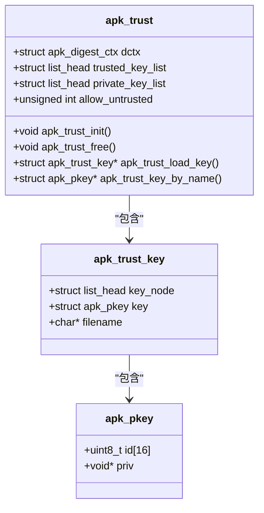

# 安全与加密

<cite>
**本文档中引用的文件**
- [apk_crypto.h](file://src/apk_crypto.h)
- [crypto_openssl.c](file://src/crypto_openssl.c)
- [crypto_mbedtls.c](file://src/crypto_mbedtls.c)
- [apk_trust.h](file://src/apk_trust.h)
- [trust.c](file://src/trust.c)
- [meson_options.txt](file://meson_options.txt)
- [app_verify.c](file://src/app_verify.c)
- [app_adbsign.c](file://src/app_adbsign.c)
</cite>

## 目录
1. [简介](#简介)
2. [双重加密后端实现](#双重加密后端实现)
3. [编译时加密库选择机制](#编译时加密库选择机制)
4. [GPG签名验证流程](#gpg签名验证流程)
5. [信任策略与apk_trust.h](#信任策略与apk_trust.h)
6. [加密性能比较](#加密性能比较)
7. [安全最佳实践](#安全最佳实践)
8. [证书与密钥存储格式](#证书与密钥存储格式)
9. [信任锚点管理](#信任锚点管理)
10. [系统管理员安全配置指南](#系统管理员安全配置指南)
11. [开发者扩展指南](#开发者扩展指南)

## 简介
apk-tools 提供了一套完整的安全机制，用于确保软件包的完整性、真实性和机密性。本系统通过支持 OpenSSL 和 mbedTLS 两种加密后端，实现了灵活的加密功能。核心安全特性包括基于哈希算法的完整性校验、非对称加密的数字签名验证以及可配置的信任策略管理。这些机制共同构成了一个多层次的安全防护体系，确保软件包从分发到安装的整个生命周期中的安全性。

## 双重加密后端实现
apk-tools 实现了基于 OpenSSL 和 mbedTLS 的双重加密后端架构，为系统提供了加密实现的灵活性和可移植性。该架构通过抽象层将加密功能与具体实现分离，允许在编译时选择不同的加密库。

两种后端均实现了相同的功能接口，包括摘要计算、数字签名生成与验证、密钥加载与管理等。OpenSSL 后端利用 EVP 接口提供现代加密功能，而 mbedTLS 后端则使用其模块化设计实现类似功能。这种设计确保了无论选择哪种后端，上层应用都能获得一致的加密服务。

**Section sources**
- [apk_crypto.h](file://src/apk_crypto.h#L14-L110)
- [crypto_openssl.c](file://src/crypto_openssl.c#L1-L270)
- [crypto_mbedtls.c](file://src/crypto_mbedtls.c#L1-L372)

## 编译时加密库选择机制
apk-tools 通过 Meson 构建系统提供编译时加密库选择机制。用户可以在构建时通过 `crypto_backend` 选项指定使用 OpenSSL 或 mbedTLS 作为加密后端。

该机制在 `meson_options.txt` 文件中定义，`crypto_backend` 选项的默认值为 'openssl'，但可以设置为 'mbedtls'。构建系统根据此选项决定链接哪个加密实现文件（crypto_openssl.c 或 crypto_mbedtls.c），从而在编译阶段确定最终使用的加密库。

这种设计允许系统在不同环境中选择最适合的加密库：在资源丰富的系统上使用功能全面的 OpenSSL，在资源受限的嵌入式系统上使用轻量级的 mbedTLS。

**Section sources**
- [meson_options.txt](file://meson_options.txt#L3)
- [apk_crypto.h](file://src/apk_crypto.h#L108-L110)

## GPG签名验证流程
apk-tools 的 GPG 签名验证流程是一个多步骤的安全验证过程，确保软件包来源的真实性和完整性。验证流程从加载信任的公钥开始，然后计算软件包的摘要，最后使用公钥验证数字签名。

验证过程首先初始化一个 `apk_trust` 结构，其中包含受信任的密钥列表。系统从配置目录加载所有受信任的公钥，并将其添加到信任链中。然后，对要验证的软件包计算指定算法的摘要（如 SHA-256），最后使用相应的公钥验证软件包附带的数字签名。

如果签名验证成功且签名来自受信任的密钥，则软件包被认为是可信的。此流程有效防止了中间人攻击和软件包篡改。

**Section sources**
- [trust.c](file://src/trust.c#L5-L60)
- [crypto_openssl.c](file://src/crypto_openssl.c#L227-L241)
- [crypto_mbedtls.c](file://src/crypto_mbedtls.c#L323-L355)

## 信任策略与apk_trust.h
`apk_trust.h` 文件定义了 apk-tools 的信任策略核心数据结构和接口。`struct apk_trust` 是信任管理的核心，包含受信任密钥列表、私钥列表和信任配置选项。

信任策略通过 `struct apk_trust_key` 结构管理，每个信任密钥包含密钥本身、文件名和链表节点。系统维护两个独立的密钥列表：受信任的公钥用于验证签名，私钥用于生成签名。`allow_untrusted` 标志位允许配置是否接受未签名或来自不受信任来源的包。

该信任模型支持灵活的安全策略配置，管理员可以根据安全需求调整信任级别，从严格模式（只接受受信任密钥签名的包）到宽松模式（允许未签名包）。

**Diagram sources**
- [apk_trust.h](file://src/apk_trust.h#L13-L31)
- [trust.c](file://src/trust.c#L5-L60)

**Section sources**
- [apk_trust.h](file://src/apk_trust.h#L1-L31)
- [trust.c](file://src/trust.c#L1-L60)

## 加密性能比较
OpenSSL 和 mbedTLS 在性能特性上有显著差异，适用于不同的使用场景。OpenSSL 通常在 x86_64 架构上提供更高的加密性能，特别是在支持硬件加速的系统上，其优化的汇编代码能充分利用 CPU 特性。

mbedTLS 则在资源受限环境和嵌入式系统中表现更佳，其代码体积小、内存占用低，且对实时系统友好。在 ARM 架构上，特别是没有硬件加密加速的设备上，mbedTLS 的性能优势更为明显。

对于大多数服务器环境，OpenSSL 是更好的选择，因为它提供了更广泛的算法支持和更好的性能。而对于容器环境或嵌入式设备，mbedTLS 的轻量级特性使其成为更合适的选择。

**Section sources**
- [crypto_openssl.c](file://src/crypto_openssl.c#L1-L270)
- [crypto_mbedtls.c](file://src/crypto_mbedtls.c#L1-L372)

## 安全最佳实践
为确保 apk-tools 的安全使用，建议遵循以下最佳实践：首先，始终使用最新的加密库版本，及时应用安全补丁。其次，严格管理信任的密钥，定期轮换密钥并撤销不再使用的密钥。

配置方面，建议在生产环境中设置 `allow_untrusted=0`，只接受受信任密钥签名的软件包。对于密钥存储，应使用安全的文件权限（如 600），并将私钥存储在安全的位置。

定期审计信任的密钥列表，确保只有授权的密钥被信任。在自动化部署环境中，使用专用的签名密钥，并限制其使用范围，以降低密钥泄露的风险。

**Section sources**
- [apk_trust.h](file://src/apk_trust.h#L24)
- [crypto_openssl.c](file://src/crypto_openssl.c#L243-L254)
- [crypto_mbedtls.c](file://src/crypto_mbedtls.c#L357-L363)

## 证书与密钥存储格式
apk-tools 支持标准的 PEM 格式存储证书和密钥，这是最广泛使用的文本格式。公钥和私钥都以 Base64 编码的形式存储，并用特定的头部和尾部标记（如 "-----BEGIN PUBLIC KEY-----"）。

密钥文件通常存储在 `/etc/apk/keys/` 目录下，每个文件包含一个公钥。文件名通常与密钥所有者相关联，便于管理和识别。系统通过 `apk_pkey_load` 函数加载这些密钥文件，该函数支持从文件描述符读取，增强了安全性。

对于私钥，建议使用密码保护，并存储在只有 root 用户可读的目录中。公钥可以更广泛地分发，但仍应确保其完整性，防止被篡改。

**Section sources**
- [crypto_openssl.c](file://src/crypto_openssl.c#L190-L209)
- [crypto_mbedtls.c](file://src/crypto_mbedtls.c#L259-L294)

## 信任锚点管理
信任锚点管理是 apk-tools 安全体系的核心。系统通过 `struct apk_trust` 结构管理信任锚点，即受信任的根密钥。管理员可以通过添加或删除 `/etc/apk/keys/` 目录中的密钥文件来管理信任锚点。

`apk_trust_load_key` 函数负责加载单个信任锚点，验证其格式正确性，并计算密钥指纹作为唯一标识。`apk_trust_key_by_name` 函数允许通过文件名查找特定的信任锚点，支持灵活的信任策略配置。

最佳实践建议维护少量的信任锚点，并使用层次化的签名体系：用根密钥签名发布密钥，再用发布密钥签名软件包。这样即使发布密钥泄露，也可以通过撤销该密钥来限制影响范围，而无需更换根密钥。

**Section sources**
- [trust.c](file://src/trust.c#L5-L60)
- [apk_trust.h](file://src/apk_trust.h#L29-L31)

## 系统管理员安全配置指南
系统管理员应遵循以下步骤进行安全配置：首先，确保系统使用安全的加密后端，根据环境选择 OpenSSL 或 mbedTLS。其次，严格管理 `/etc/apk/keys/` 目录中的信任密钥，只保留必要的信任锚点。

配置 `allow_untrusted=0` 以强制所有软件包必须有有效签名。定期检查密钥文件的完整性，防止未经授权的修改。对于私钥，应使用强密码保护，并限制访问权限。

监控系统日志中的安全事件，特别是签名验证失败的记录。建立密钥轮换策略，定期更新签名密钥。在多服务器环境中，使用集中式的密钥管理策略，确保所有系统使用一致的信任锚点。

**Section sources**
- [apk_trust.h](file://src/apk_trust.h#L24)
- [trust.c](file://src/trust.c#L24-L30)

## 开发者扩展指南
开发者如需扩展加密功能，应遵循现有的抽象层设计模式。新的加密后端应实现 `apk_crypto.h` 中定义的所有接口函数，包括摘要计算、密钥管理、签名和验证功能。

在 `meson_options.txt` 中添加新的 `crypto_backend` 选项值，并在构建系统中配置相应的源文件。确保新后端的 API 行为与现有后端一致，特别是错误处理和内存管理方面。

对于新的加密算法，需要在 `apk_crypto.h` 中定义相应的算法标识符，并在所有后端实现中提供支持。测试新功能时，应使用 `app_verify.c` 和 `app_adbsign.c` 中的工具进行端到端验证，确保兼容性和安全性。

**Section sources**
- [apk_crypto.h](file://src/apk_crypto.h#L14-L110)
- [meson_options.txt](file://meson_options.txt#L3)
- [app_verify.c](file://src/app_verify.c#L1-L45)
- [app_adbsign.c](file://src/app_adbsign.c#L1-L117)