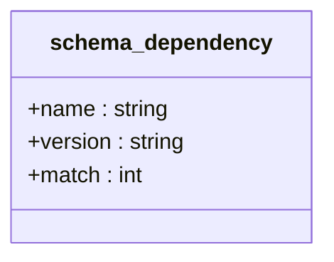
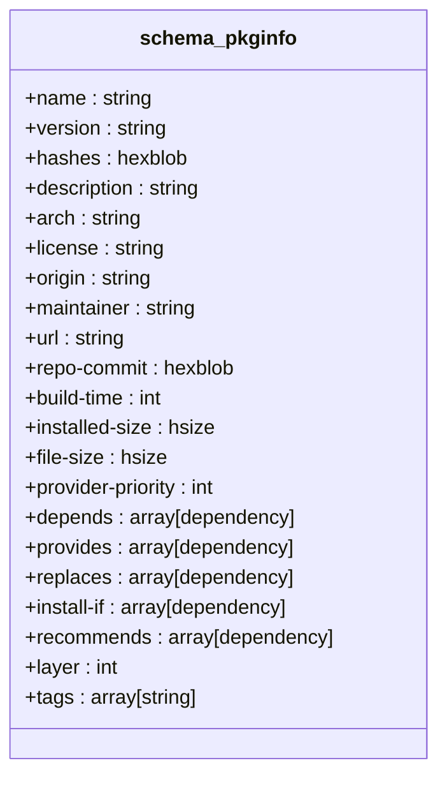
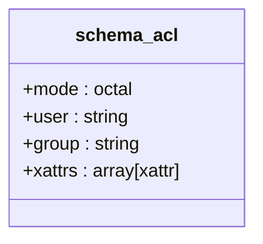
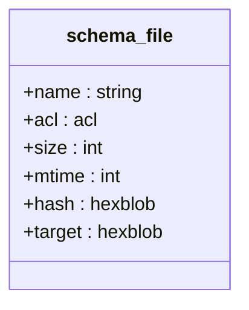
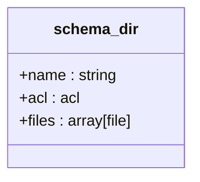
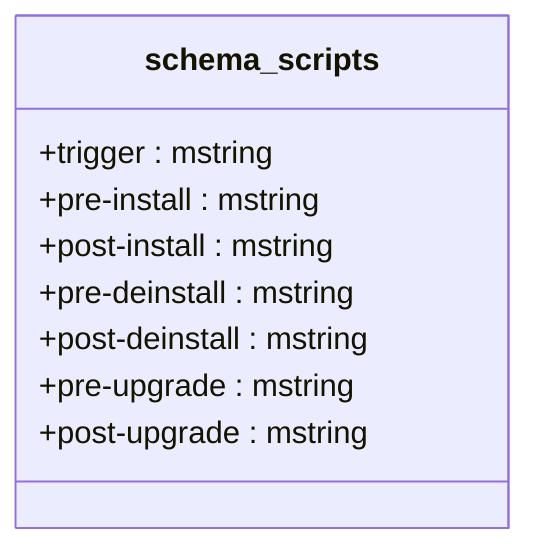
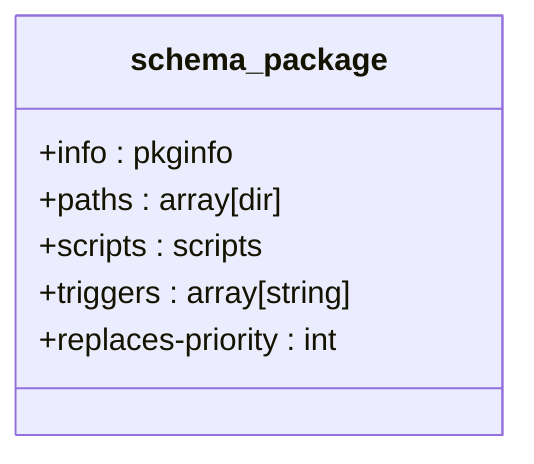
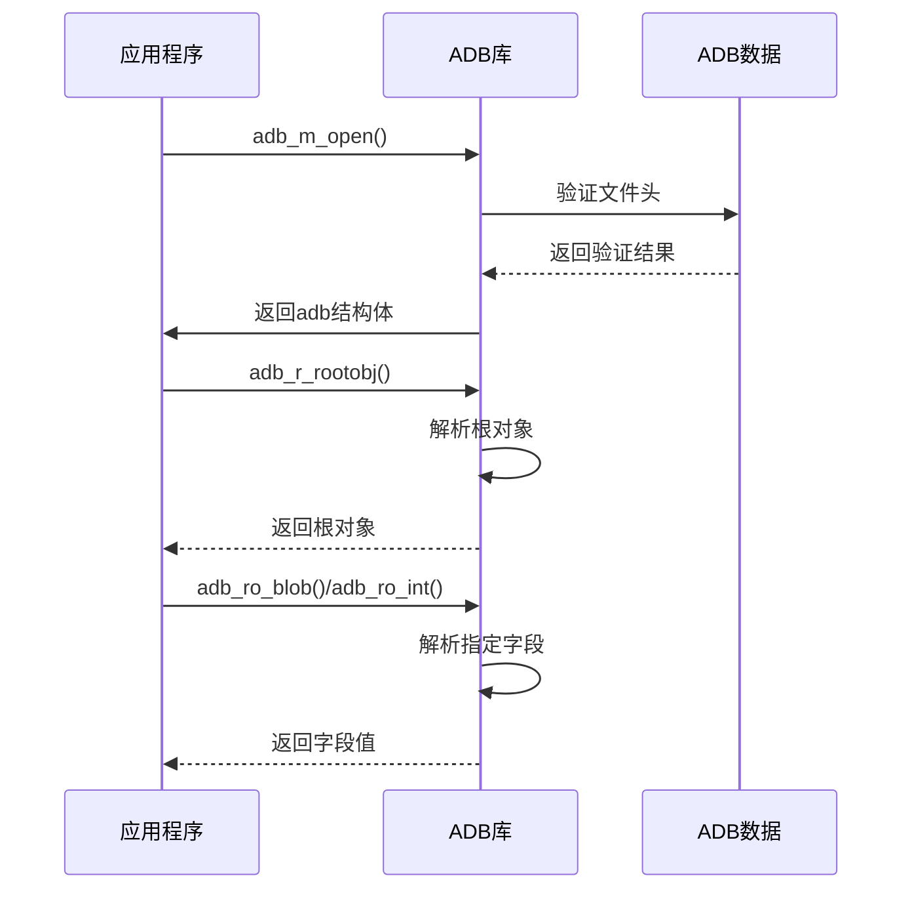
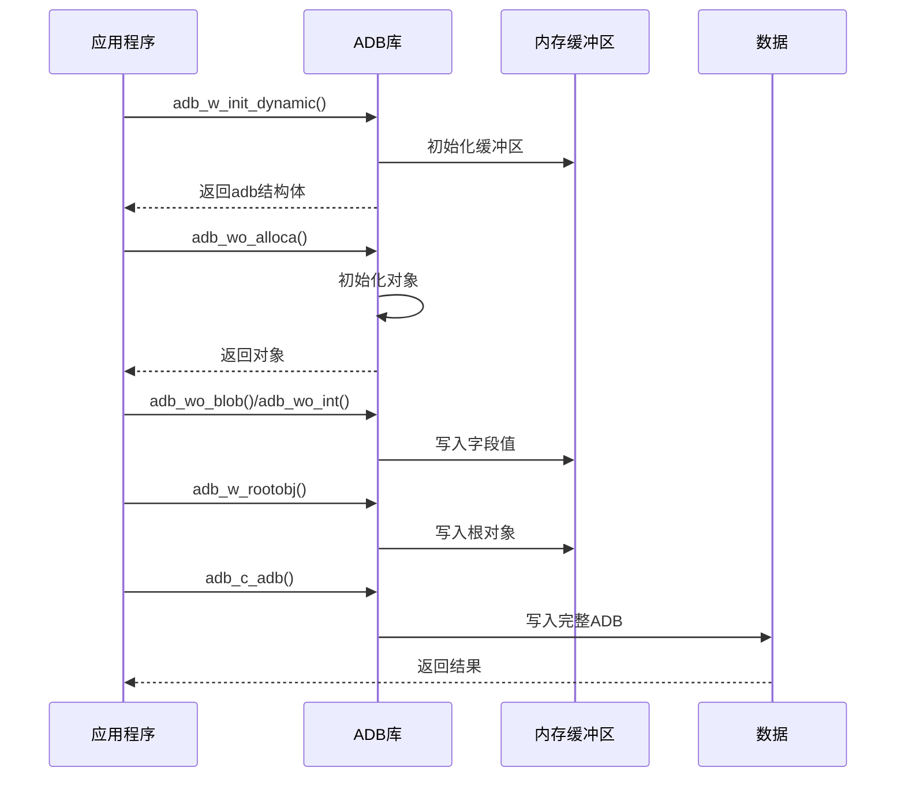
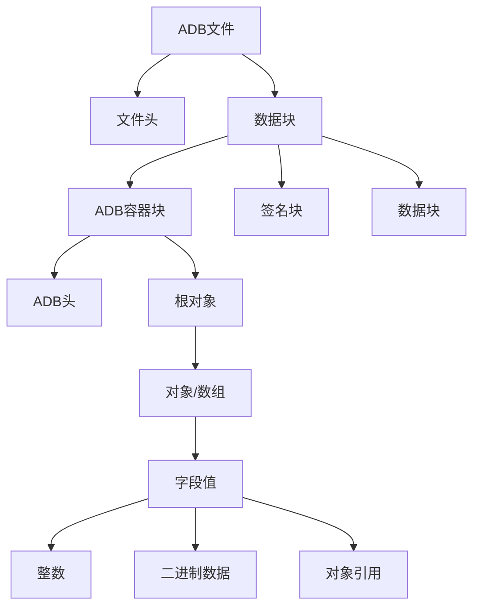

# ADB序列化

<cite>
**本文档引用的文件**   
- [adb.c](file://src/adb.c)
- [adb.h](file://src/adb.h)
- [apk_adb.c](file://src/apk_adb.c)
- [apk_adb.h](file://src/apk_adb.h)
</cite>

## 目录
1. [引言](#引言)
2. [ADB数据格式概述](#adb数据格式概述)
3. [核心Schema设计](#核心schema设计)
4. [ADB对象读写流程](#adb对象读写流程)
5. [序列化与反序列化机制](#序列化与反序列化机制)
6. [二进制结构图示](#二进制结构图示)
7. [示例数据块](#示例数据块)
8. [结论](#结论)

## 引言
ADB（Alpine Database）是apk-tools中用于序列化软件包元数据的核心机制。该机制通过定义严格的Schema结构，实现了软件包信息、文件列表、访问控制列表（ACL）和脚本等数据的高效存储与检索。本文档详细说明ADB的序列化机制，重点介绍其Schema设计原理、数据读写流程以及内部二进制表示。

**Section sources**
- [apk_adb.c](file://src/apk_adb.c#L1-L561)
- [adb.h](file://src/adb.h#L1-L316)

## ADB数据格式概述
ADB数据格式采用二进制编码，具有紧凑和高效的特性。其基本结构由文件头、数据块和对齐填充组成。

### 文件头
ADB文件以4字节的魔数（Magic Number）开头，值为`0x2e424441`（ASCII字符"ADB."）。文件头结构定义如下：

```c
struct adb_file_header {
    uint32_t magic;
    uint32_t schema;
};
```

### 数据块
ADB数据由多个数据块（Block）组成，每个块包含类型、大小和有效载荷。块类型包括：
- ADB_BLOCK_ADB (0): ADB容器块
- ADB_BLOCK_SIG (1): 签名块
- ADB_BLOCK_DATA (2): 数据块
- ADB_BLOCK_EXT (3): 扩展块

块结构定义如下：
```c
struct adb_block {
    uint32_t type_size;
    uint32_t reserved;
    uint64_t x_size;
};
```

所有块大小都按8字节对齐，不足部分用零填充。

**Section sources**
- [adb.h](file://src/adb.h#L46-L68)
- [adb.c](file://src/adb.c#L56-L99)

## 核心Schema设计
ADB的Schema系统通过C语言结构体定义，实现了类型安全的数据序列化。主要Schema包括ADB_SCHEMA_INDEX、ADB_SCHEMA_PACKAGE和ADB_SCHEMA_INSTALLED_DB。

### Schema类型系统
ADB定义了多种Schema类型：
- ADB_KIND_ADB: ADB容器
- ADB_KIND_OBJECT: 对象类型
- ADB_KIND_ARRAY: 数组类型
- ADB_KIND_BLOB: 二进制大对象
- ADB_KIND_NUMERIC: 数值类型
- ADB_KIND_OCTAL: 八进制类型

### 核心Schema定义
#### schema_dependency
该Schema用于表示软件包依赖关系，包含名称、版本和匹配条件三个字段：



**Diagram sources**
- [apk_adb.c](file://src/apk_adb.c#L374-L384)

#### schema_pkginfo
该Schema用于存储软件包基本信息，是ADB序列化的核心结构之一：



**Diagram sources**
- [apk_adb.c](file://src/apk_adb.c#L411-L437)

#### schema_acl
该Schema用于表示访问控制列表，包含权限模式、用户、组和扩展属性：



**Diagram sources**
- [apk_adb.c](file://src/apk_adb.c#L457-L466)

#### schema_file
该Schema用于表示文件信息，包含文件名、ACL、大小、修改时间、哈希值和目标：



**Diagram sources**
- [apk_adb.c](file://src/apk_adb.c#L468-L479)

#### schema_dir
该Schema用于表示目录信息，包含目录名、ACL和文件列表：



**Diagram sources**
- [apk_adb.c](file://src/apk_adb.c#L489-L497)

#### schema_scripts
该Schema用于存储软件包脚本，包含各种触发脚本：



**Diagram sources**
- [apk_adb.c](file://src/apk_adb.c#L507-L518)

#### schema_package
该Schema是软件包的完整表示，包含包信息、路径、脚本和触发器：



**Diagram sources**
- [apk_adb.c](file://src/apk_adb.c#L521-L531)

### Schema注册
所有Schema通过`adb_all_schemas`数组注册，系统根据Schema ID进行路由：

```c
const struct adb_db_schema adb_all_schemas[] = {
    { .magic = ADB_SCHEMA_INDEX,        .root = &schema_index, },
    { .magic = ADB_SCHEMA_INSTALLED_DB, .root = &schema_idb, },
    { .magic = ADB_SCHEMA_PACKAGE,      .root = &schema_package },
    {},
};
```

**Section sources**
- [apk_adb.c](file://src/apk_adb.c#L555-L559)
- [apk_adb.h](file://src/apk_adb.h#L5-L7)

## ADB对象读写流程
ADB提供了完整的对象读写API，支持从底层到高层的序列化操作。

### 读取流程
ADB读取流程从根对象开始，逐层解析数据：



**Diagram sources**
- [adb.c](file://src/adb.c#L202-L204)
- [adb.c](file://src/adb.c#L504-L507)

### 写入流程
ADB写入流程通过对象构建器模式实现：



**Diagram sources**
- [adb.c](file://src/adb.c#L381-L397)
- [adb.c](file://src/adb.c#L885-L889)

### 核心函数
#### adb_wo_val
该函数用于向ADB对象写入值，是写入操作的基础：

```c
adb_val_t adb_wo_val(struct adb_obj *o, unsigned i, adb_val_t v)
{
    if (i >= o->obj[ADBI_NUM_ENTRIES]) return adb_w_error(o->db, E2BIG);
    if (ADB_IS_ERROR(v)) return adb_w_error(o->db, ADB_VAL_VALUE(v));
    if (v != ADB_NULL && i >= o->num) o->num = i + 1;
    return o->obj[i] = v;
}
```

#### adb_ro_blob
该函数用于从ADB对象读取二进制数据：

```c
apk_blob_t adb_ro_blob(const struct adb_obj *o, unsigned i)
{
    return adb_r_blob(o->db, adb_ro_val(o, i));
}
```

**Section sources**
- [adb.c](file://src/adb.c#L988-L994)
- [adb.c](file://src/adb.c#L529-L532)

## 序列化与反序列化机制
ADB的序列化机制通过Schema定义和类型转换函数实现。

### 类型转换
每种Schema类型都定义了tostring、fromstring和compare函数：

```c
struct adb_scalar_schema {
    uint8_t kind;
    uint8_t multiline : 1;
    apk_blob_t (*tostring)(struct adb*, adb_val_t, char *, size_t);
    adb_val_t (*fromstring)(struct adb*, apk_blob_t);
    int (*compare)(struct adb*, adb_val_t, struct adb*, adb_val_t);
};
```

### 依赖解析
依赖字段通过特殊解析函数处理：

```c
int apk_dep_split(apk_blob_t *b, apk_blob_t *bdep)
{
    if (b->len == 0) return 0;
    apk_blob_spn(*b, APK_CTYPE_DEPENDENCY_SEPARATOR, NULL, b);
    apk_blob_cspn(*b, APK_CTYPE_DEPENDENCY_SEPARATOR, bdep, b);
    return bdep->len != 0;
}
```

### 对象比较
ADB支持对象比较操作，用于排序和查找：

```c
int adb_ro_cmpobj(const struct adb_obj *tmpl, const struct adb_obj *obj, unsigned mode)
{
    const struct adb_object_schema *schema = obj->schema;
    int is_set, r = 0;
    // 比较所有字段
    for (int i = ADBI_FIRST; i < num_fields; i++) {
        is_set = adb_ro_val(tmpl, i) != ADB_VAL_NULL;
        if (mode == ADB_OBJCMP_EXACT || is_set) {
            r = adb_ro_cmp(tmpl, obj, i, mode);
            if (r) return r;
        }
    }
    return 0;
}
```

**Section sources**
- [adb.h](file://src/adb.h#L152-L159)
- [apk_adb.c](file://src/apk_adb.c#L12-L20)
- [adb.c](file://src/adb.c#L547-L567)

## 二进制结构图示
ADB的二进制结构由多个层次组成：



**Diagram sources**
- [adb.h](file://src/adb.h#L103-L108)
- [adb.c](file://src/adb.c#L846-L858)

## 示例数据块
以下是一个典型的ADB数据块结构示例：

```
Offset(h) 00 01 02 03 04 05 06 07 08 09 0A 0B 0C 0D 0E 0F
00000000  41 44 42 2E 70 63 6B 67 00 00 00 00 00 00 00 00  ADB.pckg........
00000010  E0 00 00 06 00 00 00 00 00 00 00 00 00 00 00 00  ................
00000020  00 00 00 00 00 00 00 00 00 00 00 00 00 00 00 00  ................
00000030  00 00 00 00 00 00 00 00 00 00 00 00 00 00 00 00  ................
00000040  00 00 00 00 00 00 00 00 00 00 00 00 00 00 00 00  ................
00000050  00 00 00 00 00 00 00 00 00 00 00 00 00 00 00 00  ................
00000060  00 00 00 00 00 00 00 00 00 00 00 00 00 00 00 00  ................
00000070  00 00 00 00 00 00 00 00 00 00 00 00 00 00 00 00  ................
```

该示例显示：
- 前4字节为魔数"ADB."
- 接着4字节为Schema ID "pckg"
- 后续为ADB容器块，类型为E0（对象），长度为6

**Section sources**
- [adb.h](file://src/adb.h#L47-L48)
- [adb.c](file://src/adb.c#L846-L858)

## 结论
ADB序列化机制通过精心设计的Schema系统和高效的二进制编码，实现了软件包元数据的紧凑存储和快速访问。其模块化的Schema设计使得系统易于扩展和维护，而统一的读写API则保证了操作的一致性和可靠性。该机制在apk-tools中扮演着核心角色，为软件包管理提供了坚实的基础。