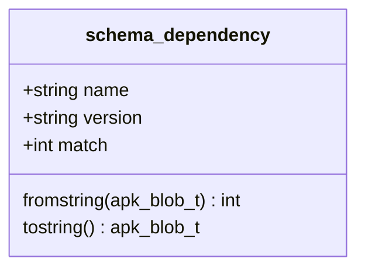
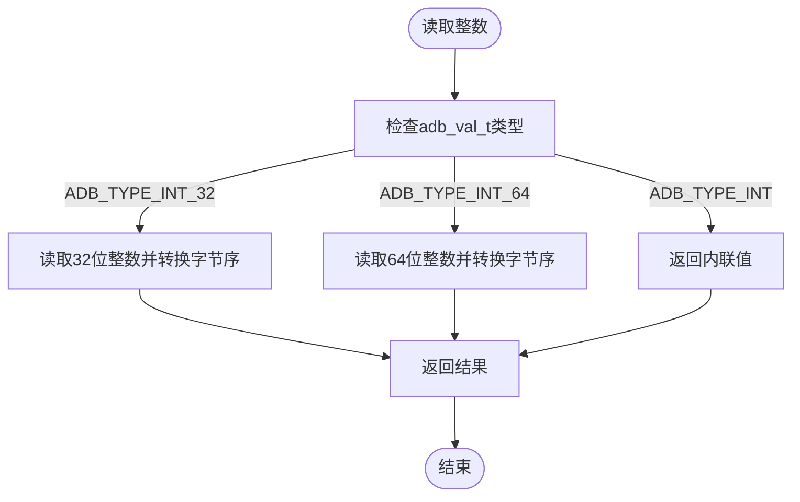

# ADB数据类型处理

<cite>
**本文档引用的文件**
- [adb.c](file://src/adb.c)
- [adb.h](file://src/adb.h)
- [apk_adb.c](file://src/apk_adb.c)
- [apk_serialize.h](file://src/apk_serialize.h)
- [serialize.c](file://src/serialize.c)
</cite>

## 目录
1. [引言](#引言)
2. [标量类型处理器](#标量类型处理器)
3. [复合类型序列化](#复合类型序列化)
4. [数据转换机制](#数据转换机制)
5. [序列化与反序列化流程](#序列化与反序列化流程)
6. [错误处理与验证](#错误处理与验证)

## 引言
apk-tools中的ADB（Alpine Database）系统采用了一套高效的二进制序列化机制来存储和处理包管理数据。该系统定义了多种标量类型处理器，用于将原始二进制数据（adb_val_t）与可读字符串之间进行转换。这些处理器通过函数指针（.tostring、.fromstring、.compare）实现了灵活的数据处理逻辑，支持从简单的字符串到复杂的版本号、权限模式等多种数据类型。本文档详细说明了这些处理器的实现机制及其在ADB序列化系统中的应用。

**Section sources**
- [adb.h](file://src/adb.h#L152-L159)
- [apk_adb.c](file://src/apk_adb.c#L92-L97)

## 标量类型处理器
ADB系统定义了多个标量类型处理器，每个处理器对应一种特定的数据类型，并通过`struct adb_scalar_schema`结构体中的函数指针实现转换逻辑。

### scalar_string处理器
`scalar_string`处理器用于处理普通字符串类型。其`.tostring`函数直接返回存储的二进制数据，`.fromstring`函数将输入字符串写入ADB数据库，`.compare`函数使用`apk_blob_sort`进行字典序比较。

**Section sources**
- [apk_adb.c](file://src/apk_adb.c#L78-L87)

### scalar_version处理器
`scalar_version`处理器专门用于处理版本号。`.fromstring`函数通过`apk_version_validate`验证输入的版本号格式，验证通过后将其作为二进制数据存储。`.compare`函数使用`apk_version_compare`进行版本号比较，确保版本比较的准确性。

**Section sources**
- [apk_adb.c](file://src/apk_adb.c#L194-L198)

### scalar_int处理器
`scalar_int`处理器处理整数类型。`.fromstring`函数使用`apk_blob_pull_uint`以十进制解析输入字符串，`.tostring`函数使用`apk_blob_fmt`将整数格式化为字符串，`.compare`函数直接比较两个整数的大小。

**Section sources**
- [apk_adb.c](file://src/apk_adb.c#L257-L262)

### scalar_oct处理器
`scalar_oct`处理器用于处理八进制权限模式。`.fromstring`函数使用`apk_blob_pull_uint`以八进制（基数8）解析输入字符串，然后调用`adb_w_int`将解析后的整数写入数据库。

**Section sources**
- [apk_adb.c](file://src/apk_adb.c#L284-L289)

### scalar_hsize处理器
`scalar_hsize`处理器处理人类可读的大小格式（如"1.5 KB"）。`.fromstring`函数首先尝试按空格分割输入字符串，提取数值和单位，然后使用`apk_get_human_size_unit`获取单位对应的字节数，最后将数值与单位相乘得到总字节数。

**Section sources**
- [apk_adb.c](file://src/apk_adb.c#L306-L317)

### scalar_hexblob处理器
`scalar_hexblob`处理器处理十六进制Blob数据。`.fromstring`函数检查输入字符串长度是否为偶数，然后使用`apk_blob_pull_hexdump`将十六进制字符串解析为二进制数据。

**Section sources**
- [apk_adb.c](file://src/apk_adb.c#L229-L242)

## 复合类型序列化
除了标量类型，ADB系统还支持复合类型的序列化，如依赖关系和访问控制列表。

### 依赖关系（schema_dependency）
`schema_dependency`定义了依赖项的结构，包含名称、版本和匹配模式三个字段。其`.fromstring`函数使用`apk_dep_parse`解析依赖字符串，验证名称和版本格式，并将解析结果写入对应的字段。

**Diagram sources**
- [apk_adb.c](file://src/apk_adb.c#L373-L384)

### 访问控制列表（schema_xattr）
`schema_xattr`用于处理扩展属性（xattr）。其`.fromstring`函数解析"key=value"格式的字符串，其中value部分为十六进制编码，使用`apk_blob_pull_hexdump`进行解码。

**Section sources**
- [apk_adb.c](file://src/apk_adb.c#L162-L167)

## 数据转换机制
ADB系统的数据转换机制基于`adb_val_t`类型，该类型使用位域区分不同类型的数据。

### 读取机制
读取机制通过`adb_r_int`和`adb_r_blob`等函数实现。`adb_r_int`根据`adb_val_t`的类型位选择不同的读取方式：内联整数直接返回值，32位和64位整数则从数据库中读取并进行字节序转换。

**Diagram sources**
- [adb.c](file://src/adb.c#L422-L440)

### 写入机制
写入机制通过`adb_w_int`和`adb_w_blob`等函数实现。`adb_w_int`根据整数大小选择最紧凑的存储方式：小整数使用内联存储，大整数则分配空间并存储。

**Section sources**
- [adb.c](file://src/adb.c#L777-L788)

## 序列化与反序列化流程
ADB系统的序列化与反序列化流程通过统一的接口实现。

### 反序列化流程
反序列化通过`adb_wo_val_fromstring`函数实现，该函数根据字段的类型调用相应的`fromstring`处理器。对于标量类型，直接调用标量处理器的`fromstring`函数；对于复合类型，则递归处理。

**Section sources**
- [adb.c](file://src/adb.c#L996-L1001)

### 序列化流程
序列化通过`adb_w_fromstring`函数实现，该函数根据`kind`参数选择相应的处理器，并调用其`tostring`函数生成可读字符串。

**Section sources**
- [adb.c](file://src/adb.c#L860-L882)

## 错误处理与验证
ADB系统在数据处理过程中包含严格的错误处理和验证机制。

### 错误表示
错误通过`ADB_ERROR`宏表示，将错误码嵌入`adb_val_t`中。处理函数在遇到错误时返回`ADB_ERROR`值，调用者可以通过`ADB_IS_ERROR`宏检测错误。

### 输入验证
各`fromstring`函数在解析输入时进行严格的格式验证。例如，`version_fromstring`验证版本号格式，`oct_fromstring`验证八进制数字，`hexblob_fromstring`验证十六进制字符串的长度和字符。

**Section sources**
- [adb.h](file://src/adb.h#L31-L33)