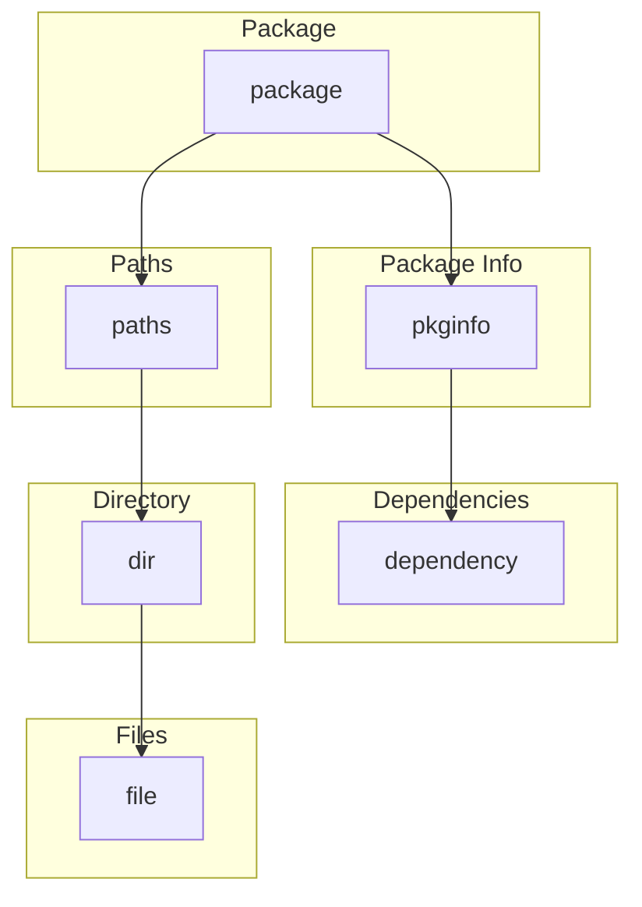

# ADB模式定义

<cite>
**本文档中引用的文件**  
- [adb.h](file://src/adb.h)
- [apk_adb.c](file://src/apk_adb.c)
- [apk_serialize.h](file://src/apk_serialize.h)
</cite>

## 目录
1. [引言](#引言)
2. [ADB模式标识符](#adb模式标识符)
3. [核心模式结构](#核心模式结构)
4. [模式配置项](#模式配置项)
5. [模式结构层级图示](#模式结构层级图示)

## 引言
ADB（Alpine Database）是apk-tools中用于序列化和存储软件包元数据的核心机制。其模式定义系统通过结构化的schema机制实现数据的高效序列化与反序列化。本文档详细阐述ADB的模式定义体系，包括schema标识符、对象模式结构及其配置项，旨在为开发者提供清晰的ADB序列化机制理解。

## ADB模式标识符
ADB通过预定义的schema标识符来识别数据库类型，确保数据的正确解析与处理。这些标识符在`apk_adb.h`中定义，作为数据库文件头的一部分，用于标识数据库的结构类型。

- **ADB_SCHEMA_INDEX**: 用于索引数据库，标识符值为`0x78646e69`（对应ASCII "indx"），表示该数据库包含软件包索引信息。
- **ADB_SCHEMA_PACKAGE**: 用于软件包数据库，标识符值为`0x676b6370`（对应ASCII "pckg"），表示该数据库包含完整的软件包定义。
- **ADB_SCHEMA_INSTALLED_DB**: 用于已安装数据库，标识符值为`0x00626469`（对应ASCII "idb"），表示该数据库记录了系统中已安装的软件包状态。

这些标识符在`adb_all_schemas`数组中与对应的根模式结构关联，确保在读取数据库时能够根据schema ID正确初始化解析器。

**Section sources**
- [apk_adb.h](file://src/apk_adb.h#L5-L7)
- [apk_adb.c](file://src/apk_adb.c#L555-L559)

## 核心模式结构
ADB的模式结构由`struct adb_object_schema`定义，描述了对象的字段、类型和行为。核心模式结构包括`schema_dependency`、`schema_pkginfo`、`schema_acl`、`schema_file`、`schema_dir`和`schema_scripts`，它们共同构成了软件包元数据的完整模型。

### 依赖模式 (schema_dependency)
`schema_dependency`定义了软件包依赖关系的结构，包含名称、版本和匹配操作符三个字段。其字段索引定义在`apk_adb.h`中：
- **ADBI_DEP_NAME**: 依赖名称，字段索引为`0x01`。
- **ADBI_DEP_VERSION**: 依赖版本，字段索引为`0x02`。
- **ADBI_DEP_MATCH**: 版本匹配操作符，字段索引为`0x03`。

该模式的数据类型为`ADB_KIND_OBJECT`，允许嵌套结构，其`fromstring`函数负责解析依赖字符串（如`"libc>=1.0"`）。

**Section sources**
- [apk_adb.c](file://src/apk_adb.c#L373-L384)
- [apk_adb.h](file://src/apk_adb.h#L10-L13)

### 软件包信息模式 (schema_pkginfo)
`schema_pkginfo`是软件包的核心元数据模式，包含名称、版本、哈希、描述、架构、许可证等信息。其字段索引定义在`apk_adb.h`中，例如：
- **ADBI_PI_NAME**: 包名，字段索引为`0x01`。
- **ADBI_PI_VERSION**: 版本，字段索引为`0x02`。
- **ADBI_PI_HASHES**: 哈希值，字段索引为`0x03`。
- **ADBI_PI_DEPENDS**: 依赖列表，字段索引为`0x0f`。

该模式使用`schema_dependency_array`作为依赖字段的子模式，实现了依赖列表的数组化存储。

**Section sources**
- [apk_adb.c](file://src/apk_adb.c#L410-L437)
- [apk_adb.h](file://src/apk_adb.h#L16-L37)

### 访问控制列表模式 (schema_acl)
`schema_acl`定义了文件的访问控制信息，包括权限模式、用户、组和扩展属性。其字段索引为：
- **ADBI_ACL_MODE**: 权限模式，字段索引为`0x01`。
- **ADBI_ACL_USER**: 用户，字段索引为`0x02`。
- **ADBI_ACL_GROUP**: 组，字段索引为`0x03`。
- **ADBI_ACL_XATTRS**: 扩展属性，字段索引为`0x04`。

该模式的数据类型为`ADB_KIND_OBJECT`，其`schema_xattr_array`字段用于存储扩展属性数组。

**Section sources**
- [apk_adb.c](file://src/apk_adb.c#L456-L465)
- [apk_adb.h](file://src/apk_adb.h#L40-L44)

### 文件与目录模式 (schema_file, schema_dir)
`schema_file`和`schema_dir`分别定义了文件和目录的元数据。`schema_file`包含文件名、ACL、大小、修改时间、哈希等字段，其字段索引为：
- **ADBI_FI_NAME**: 文件名，字段索引为`0x01`。
- **ADBI_FI_ACL**: ACL，字段索引为`0x02`。
- **ADBI_FI_SIZE**: 大小，字段索引为`0x03`。

`schema_dir`则包含目录名、ACL和文件列表，其`schema_file_array`字段用于存储目录下的文件数组。

**Section sources**
- [apk_adb.c](file://src/apk_adb.c#L467-L479)
- [apk_adb.c](file://src/apk_adb.c#L488-L497)
- [apk_adb.h](file://src/apk_adb.h#L47-L53)
- [apk_adb.h](file://src/apk_adb.h#L56-L59)

### 脚本模式 (schema_scripts)
`schema_scripts`定义了软件包的安装脚本，包括预安装、后安装、预卸载、后卸载等脚本。其字段索引为：
- **ADBI_SCRPT_PREINST**: 预安装脚本，字段索引为`0x02`。
- **ADBI_SCRPT_POSTINST**: 后安装脚本，字段索引为`0x03`。

该模式使用`scalar_mstring`（多行字符串）作为字段类型，支持存储多行脚本内容。

**Section sources**
- [apk_adb.c](file://src/apk_adb.c#L506-L518)
- [apk_adb.h](file://src/apk_adb.h#L62-L69)

## 模式配置项
每个模式结构都包含一系列配置项，用于控制序列化行为和数据完整性。

- **.num_fields**: 定义模式中字段的总数。例如，`schema_pkginfo`的`.num_fields`为`ADBI_PI_MAX`（`0x16`），表示其包含22个字段。
- **.num_compare**: 定义用于比较操作的字段索引。例如，`schema_pkginfo`的`.num_compare`为`ADBI_PI_HASHES`，表示在比较两个包信息时，从哈希字段开始进行比较。
- **.pre_commit**: 定义在提交对象前执行的回调函数。例如，`schema_package_adb_array`的`.pre_commit`为`adb_wa_sort`，确保在序列化前对包数组进行排序，保证数据的一致性。

这些配置项通过`ADB_OBJECT_FIELDS`和`ADB_FIELD`宏在代码中定义，确保了模式结构的清晰性和可维护性。

**Section sources**
- [adb.h](file://src/adb.h#L142-L149)
- [apk_adb.c](file://src/apk_adb.c#L411-L437)

## 模式结构层级图示
以下Mermaid图示展示了ADB模式结构的关键路径，包括`package → pkginfo → dependency`和`package → paths → dir → file`。

**Diagram sources**
- [apk_adb.c](file://src/apk_adb.c#L521-L532)
- [apk_adb.c](file://src/apk_adb.c#L410-L437)
- [apk_adb.c](file://src/apk_adb.c#L373-L384)
- [apk_adb.c](file://src/apk_adb.c#L488-L497)
- [apk_adb.c](file://src/apk_adb.c#L467-L479)