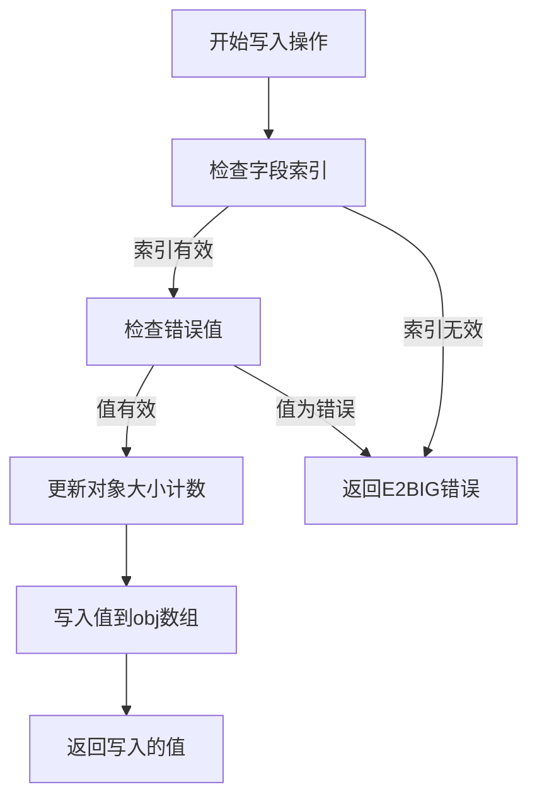
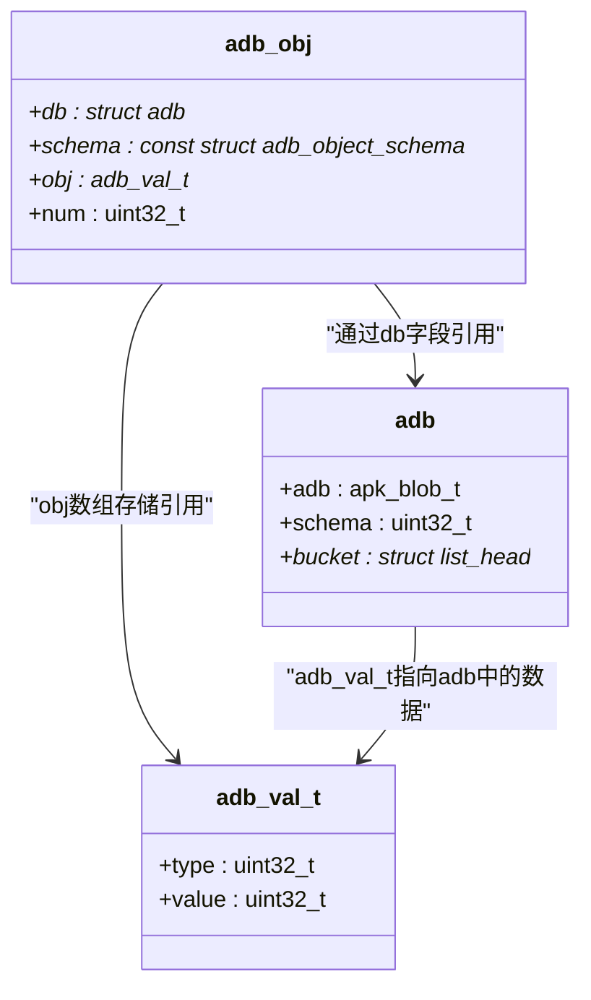
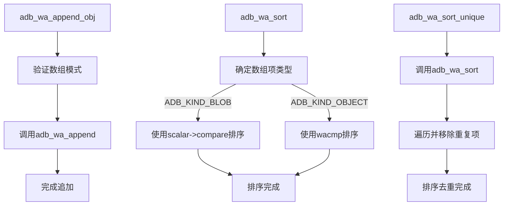

# ADB写操作流程

<cite>
**本文档中引用的文件**   
- [adb.c](file://src/adb.c)
- [adb.h](file://src/adb.h)
- [apk_adb.c](file://src/apk_adb.c)
- [apk_adb.h](file://src/apk_adb.h)
</cite>

## 目录
1. [引言](#引言)
2. [ADB对象序列化写入流程](#adb对象序列化写入流程)
3. [核心写操作函数实现机制](#核心写操作函数实现机制)
4. [底层写入函数与adb_obj结构协同工作](#底层写入函数与adb_obj结构协同工作)
5. [数组操作函数在数据组织中的作用](#数组操作函数在数据组织中的作用)
6. [从原始apk_blob_t输入到ADB对象构建的完整写入路径](#从原始apk_blob_t输入到adb对象构建的完整写入路径)
7. [字段映射与预定义模式应用](#字段映射与预定义模式应用)
8. [代码示例：通过adb_wo_alloca初始化对象并填充字段](#代码示例：通过adb_wo_alloca初始化对象并填充字段)

## 引言
ADB（Alpine Database）是apk-tools中用于管理软件包元数据的核心数据结构。本文档详细说明ADB对象的序列化写入流程，重点介绍核心写操作函数的实现机制，以及从原始输入到结构化数据的完整转换过程。

## ADB对象序列化写入流程
ADB对象的序列化写入流程始于通过`adb_wo_alloca`宏初始化一个符合特定模式的ADB对象。该宏调用`adb_wo_init`函数，在栈上分配足够空间来存储对象的所有字段值。写入过程遵循严格的模式验证，确保每个字段的值都符合预定义的数据类型和约束条件。当所有必要字段都被填充后，对象通过`adb_w_obj`或`adb_w_arr`函数提交，生成一个指向序列化数据的引用值（`adb_val_t`），该值可被嵌入到父对象或作为根对象写入数据库。

**Section sources**
- [adb.h](file://src/adb.h#L240-L241)
- [adb.c](file://src/adb.c#L988-L994)

## 核心写操作函数实现机制
核心写操作函数是构建ADB对象的基石，它们负责将不同类型的值安全地写入对象的指定字段。

### adb_wo_val函数
`adb_wo_val`是所有写操作的基础。它接收一个ADB对象指针、字段索引和一个`adb_val_t`类型的值。函数首先检查索引是否超出对象定义的最大条目数（`ADBI_NUM_ENTRIES`），然后验证输入值是否为错误状态。如果值有效且非空，它会更新对象的`num`字段以反映当前已填充的最大索引。最后，该值被直接写入对象的`obj`数组中。

### adb_wo_blob函数
`adb_wo_blob`用于将二进制大对象（blob）写入指定字段。它首先断言目标对象的模式为`ADB_KIND_OBJECT`，然后调用`adb_w_blob`将输入的`apk_blob_t`转换为一个`adb_val_t`，最后将这个转换后的值传递给`adb_wo_val`完成写入。

### adb_wo_int函数
`adb_wo_int`用于写入64位无符号整数。其实现非常简洁：它调用`adb_w_int`将整数转换为`adb_val_t`，然后将结果传递给`adb_wo_val`。

### adb_wo_alloca宏
`adb_wo_alloca`是一个宏，它使用`alloca`在当前函数的栈帧上为对象的值数组分配内存，然后调用`adb_wo_init`进行初始化。这种方式避免了动态内存分配的开销，非常适合生命周期短暂的临时对象。



**Diagram sources**
- [adb.c](file://src/adb.c#L988-L994)
- [adb.c](file://src/adb.c#L1003-L1006)
- [adb.c](file://src/adb.c#L1008-L1012)
- [adb.h](file://src/adb.h#L240)

**Section sources**
- [adb.c](file://src/adb.c#L988-L1012)
- [adb.h](file://src/adb.h#L251-L254)

## 底层写入函数与adb_obj结构协同工作
底层写入函数（如`adb_w_blob`、`adb_w_int`）不直接操作`adb_obj`，而是操作其关联的`struct adb`数据库上下文。它们负责将原始数据（如`apk_blob_t`或`uint64_t`）序列化并存储到数据库的连续内存块中，并返回一个`adb_val_t`作为该数据的引用。

`adb_obj`结构则作为一个“写时”（write-only）的视图或代理。它持有对`struct adb`的引用（`db`字段）、一个指向其模式（`schema`）的指针、一个指向其值数组（`obj`）的指针，以及一个记录当前已填充字段数的计数器（`num`）。当调用`adb_wo_blob`时，它通过`o->db`访问数据库上下文，调用`adb_w_blob`将blob数据写入数据库，并获取一个`adb_val_t`。然后，`adb_wo_blob`将这个`adb_val_t`作为元数据的引用，通过`adb_wo_val`写入到`adb_obj`自己的`obj`数组中。

这种设计实现了数据存储与数据组织的分离。`struct adb`负责高效、紧凑地存储所有原始数据，而`adb_obj`则提供了一个基于模式的、易于使用的接口来组织这些数据的引用。



**Diagram sources**
- [adb.h](file://src/adb.h#L187-L193)
- [adb.h](file://src/adb.h#L177-L185)
- [adb.h](file://src/adb.h#L15)

**Section sources**
- [adb.c](file://src/adb.c#L764-L767)
- [adb.c](file://src/adb.c#L777-L788)
- [adb.h](file://src/adb.h#L233-L234)

## 数组操作函数在数据组织中的作用
ADB提供了专门的函数来操作数组类型的对象（`ADB_KIND_ARRAY`），这些函数在构建复杂数据结构时至关重要。

### adb_wa_append系列函数
`adb_wa_append`是向数组对象追加一个`adb_val_t`值的基础函数。`adb_wa_append_obj`和`adb_wa_append_fromstring`是其封装，分别用于追加一个完整的ADB对象或根据字符串输入创建并追加一个对象。这些函数确保了数组的模式一致性。

### adb_wa_sort与adb_wa_sort_unique函数
`adb_wa_sort`根据数组项的模式对数组进行排序。它使用`qsort_r`并根据项的类型（blob、object、adb）选择合适的比较函数。`adb_wa_sort_unique`在此基础上，先对数组排序，然后遍历数组，移除连续的重复项，从而保证数组中元素的唯一性。这在处理依赖项列表等场景中非常有用，可以自动去重。



**Diagram sources**
- [adb.c](file://src/adb.c#L1054-L1065)
- [adb.c](file://src/adb.c#L1103-L1130)
- [adb.c](file://src/adb.c#L1132-L1145)

**Section sources**
- [adb.c](file://src/adb.c#L1054-L1145)

## 从原始apk_blob_t输入到ADB对象构建的完整写入路径
从原始字符串输入到构建完整的ADB对象，通常涉及自定义的解析函数，这些函数利用了ADB的写入API。

### dependencies_fromstring函数
该函数解析一个包含多个依赖项的字符串。它首先使用`adb_wo_alloca`创建一个临时的`dep`对象，其模式为`schema_dependency`。然后，它使用`apk_dep_split`逐个分割出单个依赖项字符串。对于每个分割出的字符串，它调用`adb_wo_fromstring(&dep, bdep)`，这会触发`schema_dependency`模式的`fromstring`回调。解析成功后，通过`adb_wa_append_obj(obj, &dep)`将这个临时的依赖项对象追加到主数组中。

### tags_fromstring函数
该函数解析一个包含多个标签的字符串。它使用`apk_blob_foreach_word`遍历字符串中的每个单词。对于每个单词，它直接调用`adb_wa_append_fromstring(obj, word)`。这会利用数组项的模式（`scalar_string`）来创建一个blob值并追加到数组中。

此路径展示了ADB的灵活性：通过定义模式的`fromstring`回调，可以将复杂的字符串解析逻辑封装在模式定义中，使得高层代码只需调用简单的`adb_wo_fromstring`即可完成整个解析和写入过程。

**Section sources**
- [apk_adb.c](file://src/apk_adb.c#L386-L400)
- [apk_adb.c](file://src/apk_adb.c#L107-L115)

## 字段映射与预定义模式应用
### adb_pkg_field_index函数
`adb_pkg_field_index`函数实现了一个字符到字段索引的快速映射。它使用一个静态的`map`数组，通过宏`MAP(ch, ndx)`将字符（如'P'代表包名）直接映射到预定义的常量（如`ADBI_PI_NAME`）。该函数首先检查输入字符的有效性，然后通过简单的数组索引查找返回对应的字段索引，效率极高。

### 预定义模式的应用
预定义模式（如`schema_string_array`、`schema_dependency_array`）在数据验证和结构化写入中扮演核心角色。
- **数据验证**：模式中的`fromstring`回调函数（如`string_fromstring`、`dependency_fromstring`）在写入前对输入数据进行验证。例如，`name_fromstring`会检查包名是否以字母数字开头且只包含有效字符。
- **结构化写入**：模式定义了对象的字段布局和类型。当使用`adb_wo_alloca`初始化一个对象时，系统就知道该对象最多可以有多少个字段，并且每个字段的类型是什么。这确保了写入操作的类型安全。
- **自动化处理**：模式的`pre_commit`钩子（如`schema_xattr_array`的`adb_wa_sort`）可以在对象提交前自动执行操作，如排序或去重，简化了上层逻辑。

**Section sources**
- [apk_adb.c](file://src/apk_adb.c#L47-L73)
- [apk_adb.h](file://src/apk_adb.h#L105)
- [apk_adb.c](file://src/apk_adb.c#L125-L129)
- [apk_adb.c](file://src/apk_adb.c#L403-L409)

## 代码示例：通过adb_wo_alloca初始化对象并填充字段
以下代码片段展示了如何使用`adb_wo_alloca`创建一个包信息对象并填充其字段。

```c
// 假设我们有一个ADB数据库上下文 'db'
struct adb_obj pkg_info;
apk_blob_t name_blob = APK_BLOB_STR("example-package");
apk_blob_t version_blob = APK_BLOB_STR("1.0-r0");

// 使用预定义的 schema_pkginfo 模式在栈上初始化对象
adb_wo_alloca(&pkg_info, &schema_pkginfo, db);

// 填充名称和版本字段
adb_wo_blob(&pkg_info, ADBI_PI_NAME, name_blob);
adb_wo_blob(&pkg_info, ADBI_PI_VERSION, version_blob);

// 填充一个整数字段，例如安装大小
adb_wo_int(&pkg_info, ADBI_PI_INSTALLED_SIZE, 1024);

// 此时，pkg_info 对象已构建完成，可以将其作为值写入父对象或提交
adb_val_t pkg_info_ref = adb_w_obj(&pkg_info);
// ... 后续操作
```

此示例清晰地展示了ADB写入API的简洁性和模式驱动的特性。

**Section sources**
- [adb.h](file://src/adb.h#L240)
- [adb.c](file://src/adb.c#L1008-L1012)
- [adb.c](file://src/adb.c#L1003-L1006)