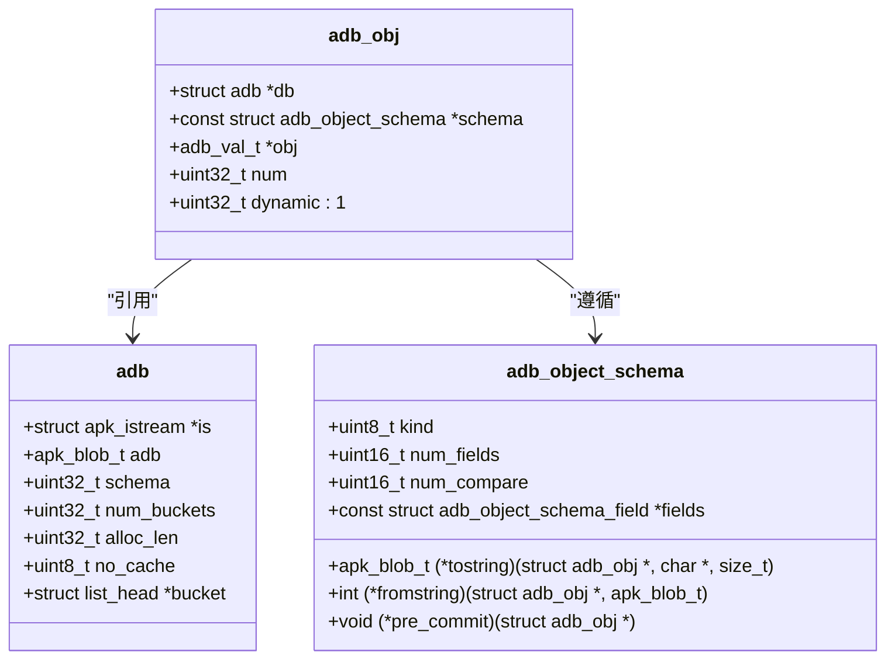
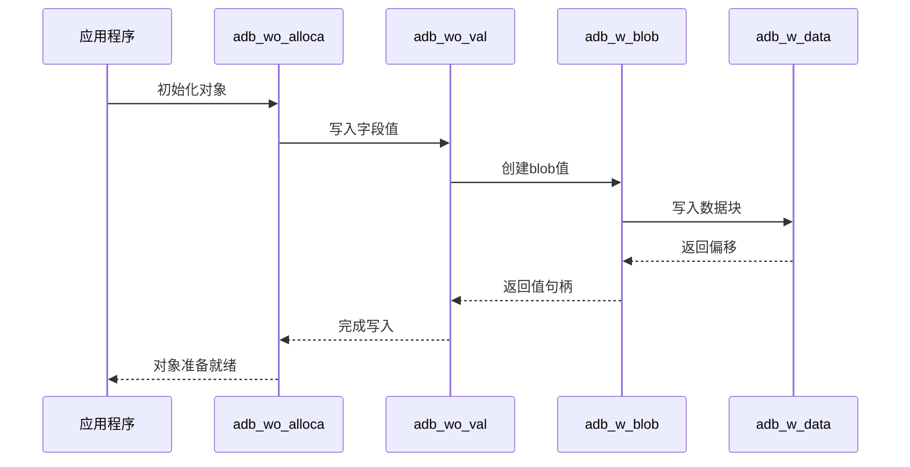
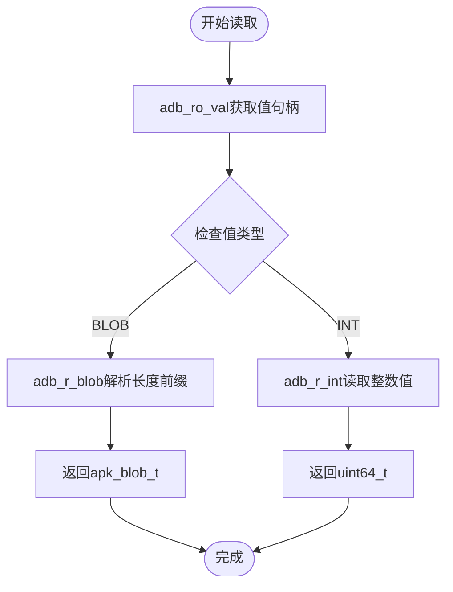
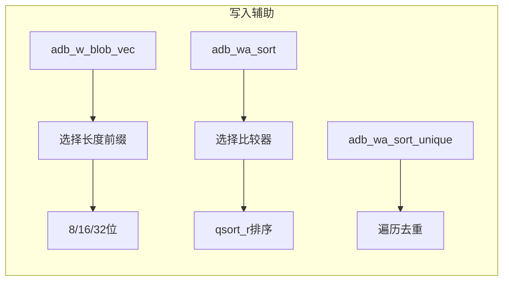
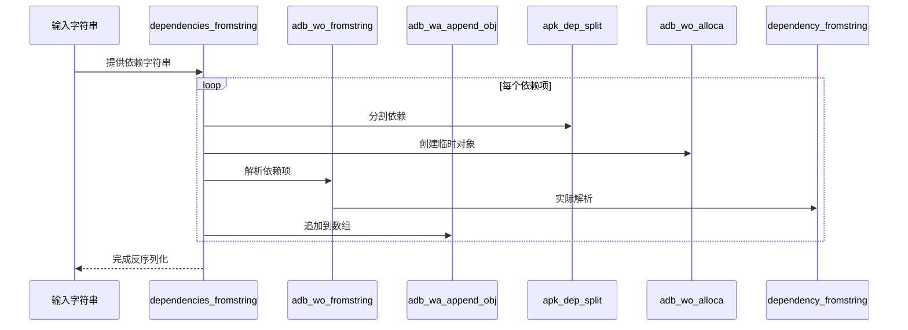

# ADB读写流程

<cite>
**本文档中引用的文件**   
- [adb.c](file://src/adb.c)
- [adb.h](file://src/adb.h)
- [apk_adb.c](file://src/apk_adb.c)
- [apk_adb.h](file://src/apk_adb.h)
</cite>

## 目录
1. [介绍](#介绍)
2. [ADB对象结构与工作模式](#adb对象结构与工作模式)
3. [写操作流程](#写操作流程)
4. [读操作实现机制](#读操作实现机制)
5. [辅助函数作用分析](#辅助函数作用分析)
6. [反序列化路径](#反序列化路径)
7. [ADB数据块二进制布局](#adb数据块二进制布局)
8. [结论](#结论)

## 介绍
本文件详细说明apk-tools中ADB（Alpine Database）对象的序列化与反序列化流程。重点分析ADB数据模型的读写机制，包括写操作函数的调用流程、读操作函数的实现方式、辅助函数在数据处理中的作用，以及从原始输入到ADB对象构建的完整反序列化路径。

**Section sources**
- [adb.h](file://src/adb.h#L186-L192)
- [adb.c](file://src/adb.c#L885-L944)

## ADB对象结构与工作模式
ADB对象的核心结构`struct adb_obj`包含指向数据库的指针、模式定义、值数组和计数器。该结构在写模式和读模式下表现出不同的行为特征。

在写模式下，通过`adb_wo_alloca`宏初始化对象，该宏调用`adb_wo_init`函数分配内存并设置初始状态。写模式使用`alloca`在栈上分配空间，适用于临时对象的创建。对象的`num`字段跟踪已填充的条目数量，而`obj[ADBI_NUM_ENTRIES]`保留最大分配空间信息。

在读模式下，`adb_r_obj`函数从数据库中解析对象，通过`adb_r_deref`进行内存解引用，验证数据完整性后构建`adb_obj`实例。读模式直接引用数据库中的内存区域，不进行数据复制。



**Diagram sources**
- [adb.h](file://src/adb.h#L186-L192)
- [adb.c](file://src/adb.c#L885-L944)

**Section sources**
- [adb.h](file://src/adb.h#L186-L192)
- [adb.c](file://src/adb.c#L885-L944)

## 写操作流程
写操作流程从`adb_wo_alloca`初始化开始，通过一系列写函数填充对象字段。核心写操作函数包括`adb_wo_val`、`adb_wo_blob`、`adb_wo_int`和`adb_wa_append_obj`。

`adb_wo_val`是基础写函数，负责将值写入指定索引。它首先验证索引范围和错误状态，然后更新`num`字段并存储值。`adb_wo_blob`和`adb_wo_int`是封装函数，分别调用`adb_w_blob`和`adb_w_int`创建值后再写入。

数组写入通过`adb_wa_append`系列函数实现。`adb_wa_append_obj`将整个对象追加到数组中，先验证对象类型和数据库一致性，然后调用`adb_w_obj`序列化对象并追加。



**Diagram sources**
- [adb.c](file://src/adb.c#L1004-L1039)
- [adb.c](file://src/adb.c#L745-L796)

**Section sources**
- [adb.c](file://src/adb.c#L1004-L1039)
- [adb.c](file://src/adb.c#L745-L796)

## 读操作实现机制
读操作通过`adb_ro_blob`和`adb_ro_int`等函数实现，这些函数是`adb_r_blob`和`adb_r_int`的封装。读操作流程从`adb_ro_val`获取值句柄开始，然后根据值类型调用相应的解析函数。

`adb_ro_blob`首先通过`adb_ro_val`获取值，然后调用`adb_r_blob`进行实际解析。`adb_r_blob`根据值类型（8位、16位或32位长度前缀）读取长度信息，然后返回指向实际数据的`apk_blob_t`。

`adb_ro_int`类似，通过`adb_ro_val`获取值后调用`adb_r_int`。`adb_r_int`根据值类型直接返回内联值或从数据库中读取32位/64位整数。



**Diagram sources**
- [adb.c](file://src/adb.c#L504-L553)
- [adb.c](file://src/adb.c#L443-L502)

**Section sources**
- [adb.c](file://src/adb.c#L504-L553)
- [adb.c](file://src/adb.c#L443-L502)

## 辅助函数作用分析
辅助函数在数据写入过程中发挥关键作用。`adb_w_blob_vec`处理向量blob写入，根据数据总长度选择8位、16位或32位长度前缀，并计算适当的对齐。

`adb_wa_sort`对数组进行排序，根据数组元素类型（BLOB、OBJECT或ADB）选择相应的比较函数。它使用`qsort_r`进行稳定排序，确保数据一致性。

`adb_wa_sort_unique`在排序基础上去除重复项，通过比较相邻元素并移动唯一值来实现去重。这两个函数通常在`pre_commit`钩子中调用，确保数据在提交前已排序且无重复。



**Diagram sources**
- [adb.c](file://src/adb.c#L726-L762)
- [adb.c](file://src/adb.c#L1103-L1130)
- [adb.c](file://src/adb.c#L1132-L1145)

**Section sources**
- [adb.c](file://src/adb.c#L726-L762)
- [adb.c](file://src/adb.c#L1103-L1130)
- [adb.c](file://src/adb.c#L1132-L1145)

## 反序列化路径
从原始`apk_blob_t`输入到ADB对象构建的反序列化路径始于`dependencies_fromstring`和`tags_fromstring`等自定义解析函数。这些函数通过`fromstring`钩子集成到模式中。

`dependencies_fromstring`解析依赖字符串，使用`apk_dep_split`分割依赖项，为每个项创建临时`adb_obj`，调用`adb_wo_fromstring`解析，然后通过`adb_wa_append_obj`追加到数组中。

`tags_fromstring`解析标签字符串，使用`apk_blob_foreach_word`遍历单词，验证标签格式后通过`adb_wa_append_fromstring`追加。这些函数展示了如何将文本输入转换为结构化ADB数据。



**Diagram sources**
- [apk_adb.c](file://src/apk_adb.c#L386-L400)
- [apk_adb.c](file://src/apk_adb.c#L107-L115)

**Section sources**
- [apk_adb.c](file://src/apk_adb.c#L386-L400)
- [apk_adb.c](file://src/apk_adb.c#L107-L115)

## ADB数据块二进制布局
ADB数据块采用紧凑的二进制格式，包含头部信息、字段索引、长度前缀和实际数据。数据块以`adb_block`结构开始，包含类型和大小信息。

对于blob数据，采用长度前缀编码：小数据（≤255字节）使用8位长度前缀，中等数据（≤65535字节）使用16位前缀，大数据使用32位前缀。整数根据值大小采用内联（≤268435455）或外部存储。

对象和数组以`adb_val_t`数组形式存储，首元素为条目数量，后续元素为值句柄。这种布局实现了高效的空间利用和快速随机访问。

```mermaid
erDiagram
ADB块 ||--o{ 头部 : 包含
ADB块 ||--o{ 字段索引 : 包含
ADB块 ||--o{ 长度前缀 : 包含
ADB块 ||--o{ 实际数据 : 包含
class ADB块 {
类型
大小
对齐
}
class 头部 {
adb_compat_ver
adb_ver
root
}
class 字段索引 {
字段ID
偏移
}
class 长度前缀 {
8/16/32位长度
}
class 实际数据 {
blob或整数数据
}
```

**Diagram sources**
- [adb.h](file://src/adb.h#L64-L98)
- [adb.c](file://src/adb.c#L745-L796)

**Section sources**
- [adb.h](file://src/adb.h#L64-L98)
- [adb.c](file://src/adb.c#L745-L796)

## 结论
ADB的序列化与反序列化机制通过精心设计的数据结构和高效的读写函数实现了高性能的数据存储。写操作采用栈分配和缓存机制优化性能，读操作通过直接内存引用实现零拷贝访问。辅助函数确保数据一致性和完整性，而自定义解析函数提供了灵活的文本到结构化数据转换能力。整体设计平衡了性能、内存使用和功能需求。