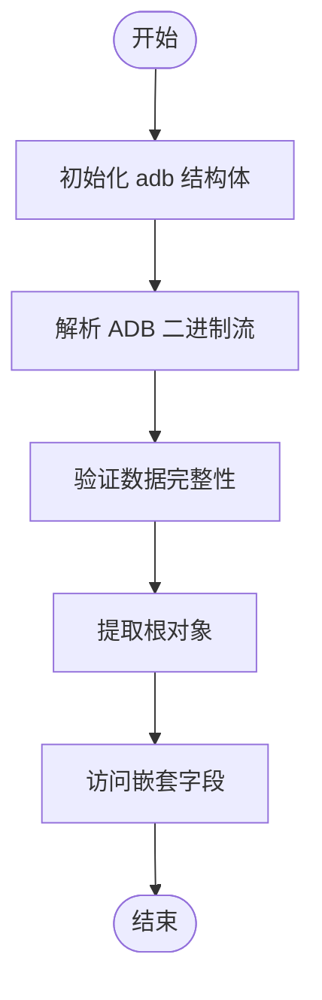
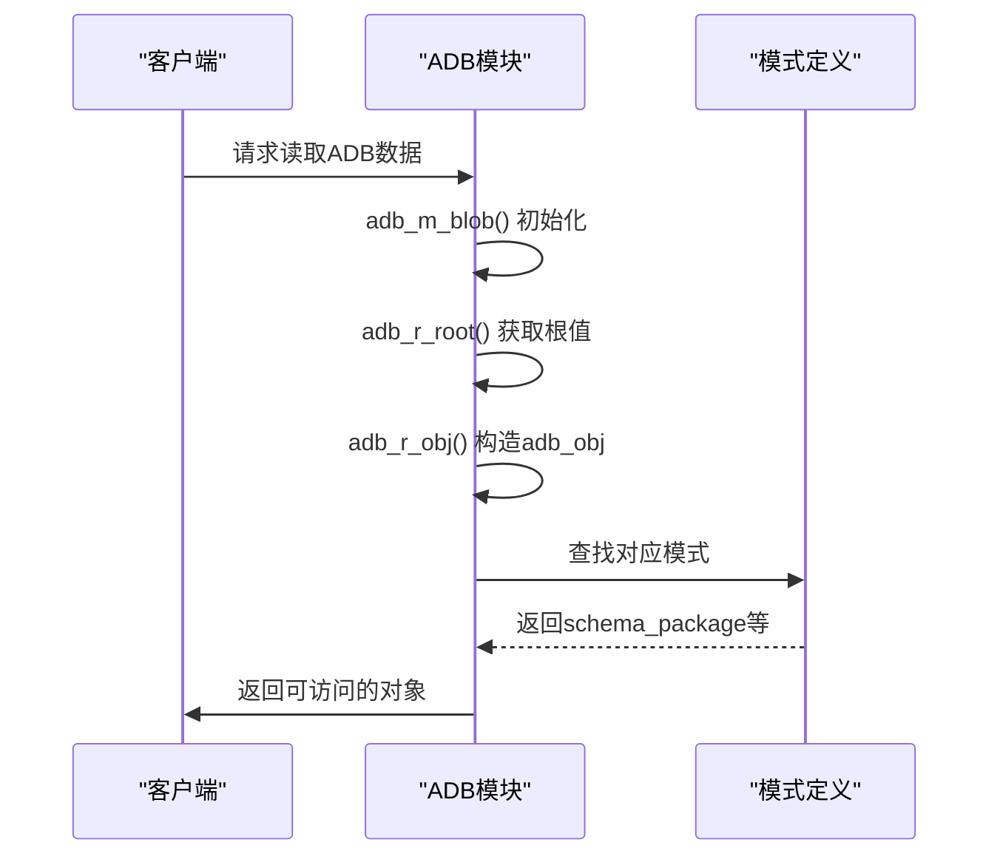

# ADB读操作流程

<cite>
**本文档引用的文件**   
- [adb.c](file://src/adb.c)
- [adb.h](file://src/adb.h)
- [apk_adb.c](file://src/apk_adb.c)
- [apk_adb.h](file://src/apk_adb.h)
</cite>

## 目录
1. [引言](#引言)
2. [ADB读取流程概述](#adb读取流程概述)
3. [核心读取函数实现原理](#核心读取函数实现原理)
4. [adb_obj结构在读模式下的内存布局与访问机制](#adb_obj结构在读模式下的内存布局与访问机制)
5. [从ADB二进制流到结构化数据的解析路径](#从adb二进制流到结构化数据的解析路径)
6. [格式化函数分析](#格式化函数分析)
7. [对象模式与数据解析](#对象模式与数据解析)
8. [代码示例与使用场景](#代码示例与使用场景)

## 引言
ADB（Alpine Database）是apk-tools中用于存储和读取结构化数据的核心机制。本文件深入解析ADB对象的反序列化读取流程，重点阐述`adb_ro_val`、`adb_ro_blob`、`adb_ro_int`等核心读取函数的实现原理，并说明底层读取函数如何从ADB结构中提取原始数据。

**Section sources**
- [adb.c](file://src/adb.c#L1-L1389)
- [adb.h](file://src/adb.h#L1-L316)

## ADB读取流程概述
ADB读取流程始于对二进制流的解析，通过`adb_m_blob`或`adb_m_process`函数初始化一个`struct adb`结构体。该结构体包含指向原始数据块的指针、模式ID以及桶结构用于缓存管理。读取过程依赖于模式定义来指导字段的解析，确保数据的一致性和正确性。



**Diagram sources **
- [adb.c](file://src/adb.c#L138-L349)

## 核心读取函数实现原理
### adb_ro_val函数
`adb_ro_val`函数用于从`adb_obj`对象中获取指定索引处的值。其实现非常直接：检查索引是否超出范围，若未越界则返回对应位置的`adb_val_t`值。

```c
adb_val_t adb_ro_val(const struct adb_obj *o, unsigned i)
{
	if (i >= o->num) return ADB_NULL;
	return o->obj[i];
}
```

**Section sources**
- [adb.c](file://src/adb.c#L518-L522)

### adb_ro_int函数
`adb_ro_int`函数通过调用`adb_r_int`将`adb_val_t`转换为`uint64_t`整数。它首先获取字段值，然后根据值的类型进行相应的解码处理。

```c
uint64_t adb_ro_int(const struct adb_obj *o, unsigned i)
{
	return adb_r_int(o->db, adb_ro_val(o, i));
}
```

**Section sources**
- [adb.c](file://src/adb.c#L524-L527)

### adb_ro_blob函数
`adb_ro_blob`函数用于读取二进制大对象（BLOB）。它通过`adb_r_blob`函数实现，根据`adb_val_t`的类型前缀决定长度编码方式（8位、16位或32位），并返回指向实际数据的`apk_blob_t`结构。

```c
apk_blob_t adb_ro_blob(const struct adb_obj *o, unsigned i)
{
	return adb_r_blob(o->db, adb_ro_val(o, i));
}
```

**Section sources**
- [adb.c](file://src/adb.c#L529-L532)

## adb_obj结构在读模式下的内存布局与访问机制
`struct adb_obj`是ADB读取操作中的核心数据结构，其定义如下：

```c
struct adb_obj {
	struct adb *db;
	const struct adb_object_schema *schema;
	adb_val_t *obj;
	uint32_t num;
	uint32_t dynamic : 1;
};
```

该结构体包含指向所属数据库的指针、模式定义、指向值数组的指针以及元素数量。访问机制通过`adb_ro_val`等函数实现，允许按索引安全地访问字段值。

**Section sources**
- [adb.h](file://src/adb.h#L186-L192)

## 从ADB二进制流到结构化数据的解析路径
解析路径始于`adb_r_root`函数，该函数从ADB头部读取根值。随后通过`adb_r_obj`将根值转换为`adb_obj`对象，结合模式定义递归解析嵌套结构。整个过程依赖于模式ID匹配和字段类型的正确识别。



**Diagram sources **
- [adb.c](file://src/adb.c#L416-L421)
- [adb.c](file://src/adb.c#L468-L501)

## 格式化函数分析
### dependency_tostring函数
`dependency_tostring`函数将依赖关系对象格式化为人类可读字符串。它读取名称、版本和匹配操作符，并按照APK依赖语法输出。

```c
static apk_blob_t dependency_tostring(struct adb_obj *obj, char *buf, size_t bufsz)
{
	apk_blob_t name, ver;
	unsigned int op;

	name = adb_ro_blob(obj, ADBI_DEP_NAME);
	ver  = adb_ro_blob(obj, ADBI_DEP_VERSION);
	op   = adb_ro_int(obj, ADBI_DEP_MATCH) ?: APK_VERSION_EQUAL;

	if (APK_BLOB_IS_NULL(name)) return APK_BLOB_NULL;

	if (APK_BLOB_IS_NULL(ver)) {
		if (op & APK_VERSION_CONFLICT)
			return apk_blob_fmt(buf, bufsz, "!"BLOB_FMT, BLOB_PRINTF(name));
		return name;
	}

	return apk_blob_fmt(buf, bufsz, "%s"BLOB_FMT"%s"BLOB_FMT,
		(op & APK_VERSION_CONFLICT) ? "!" : "",
		BLOB_PRINTF(name),
		apk_version_op_string(op),
		BLOB_PRINTF(ver));
}
```

**Section sources**
- [apk_adb.c](file://src/apk_adb.c#L326-L348)

### hexblob_tostring函数
`hexblob_tostring`函数将二进制哈希值转换为十六进制字符串表示，便于显示和比较。

```c
static apk_blob_t hexblob_tostring(struct adb *db, adb_val_t val, char *buf, size_t bufsz)
{
	apk_blob_t b = adb_r_blob(db, val), to = APK_BLOB_PTR_LEN(buf, bufsz);

	if (APK_BLOB_IS_NULL(b)) return b;

	apk_blob_push_hexdump(&to, b);
	if (!APK_BLOB_IS_NULL(to))
		return APK_BLOB_PTR_PTR(buf, to.ptr-1);

	return apk_blob_fmt(buf, bufsz, "(%ld bytes)", b.len);
}
```

**Section sources**
- [apk_adb.c](file://src/apk_adb.c#L216-L227)

## 对象模式与数据解析
### schema_package模式
`schema_package`定义了软件包对象的结构，包含信息、路径、脚本等子对象。

```c
const struct adb_object_schema schema_package = {
	.kind = ADB_KIND_OBJECT,
	.num_fields = ADBI_PKG_MAX,
	.num_compare = ADBI_PKG_PKGINFO,
	.fields = ADB_OBJECT_FIELDS(ADBI_PKG_MAX) {
		ADB_FIELD(ADBI_PKG_PKGINFO,	"info",		schema_pkginfo),
		ADB_FIELD(ADBI_PKG_PATHS,	"paths",	schema_dir_array),
		ADB_FIELD(ADBI_PKG_SCRIPTS,	"scripts",	schema_scripts),
		ADB_FIELD(ADBI_PKG_TRIGGERS,	"triggers",	schema_string_array),
		ADB_FIELD(ADBI_PKG_REPLACES_PRIORITY,	"replaces-priority",	scalar_int),
	},
};
```

**Section sources**
- [apk_adb.c](file://src/apk_adb.c#L520-L531)

### schema_pkginfo模式
`schema_pkginfo`描述了包元数据，如名称、版本、架构、许可证等。

```c
const struct adb_object_schema schema_pkginfo = {
	.kind = ADB_KIND_OBJECT,
	.num_fields = ADBI_PI_MAX,
	.num_compare = ADBI_PI_HASHES,
	.fields = ADB_OBJECT_FIELDS(ADBI_PI_MAX) {
		ADB_FIELD(ADBI_PI_NAME,		"name",		scalar_name),
		ADB_FIELD(ADBI_PI_VERSION,	"version",	scalar_version),
		ADB_FIELD(ADBI_PI_HASHES,	"hashes",	scalar_hexblob),
		// ... 其他字段
	},
};
```

**Section sources**
- [apk_adb.c](file://src/apk_adb.c#L410-L437)

### schema_dependency模式
`schema_dependency`定义了依赖关系的结构，包括名称、版本和匹配条件。

```c
const struct adb_object_schema schema_dependency = {
	.kind = ADB_KIND_OBJECT,
	.num_fields = ADBI_DEP_MAX,
	.num_compare = ADBI_DEP_NAME,
	.tostring = dependency_tostring,
	.fromstring = dependency_fromstring,
	.fields = ADB_OBJECT_FIELDS(ADBI_DEP_MAX) {
		ADB_FIELD(ADBI_DEP_NAME,	"name",		scalar_string),
		ADB_FIELD(ADBI_DEP_VERSION,	"version",	scalar_version),
		ADB_FIELD(ADBI_DEP_MATCH,	"match",	scalar_int),
	},
};
```

**Section sources**
- [apk_adb.c](file://src/apk_adb.c#L373-L384)

## 代码示例与使用场景
### 遍历ADB数组
```c
struct adb_obj arr;
adb_r_rootobj(db, &arr, &schema_pkginfo_array);
for (unsigned i = 1; i <= adb_ra_num(&arr); i++) {
	struct adb_obj pkg;
	adb_ro_obj(&arr, i, &pkg);
	// 处理每个包对象
}
```

### 访问嵌套对象字段
```c
struct adb_obj pkg, info;
adb_r_rootobj(db, &pkg, &schema_package);
adb_ro_obj(&pkg, ADBI_PKG_PKGINFO, &info);
apk_blob_t name = adb_ro_blob(&info, ADBI_PI_NAME);
uint64_t size = adb_ro_int(&info, ADBI_PI_INSTALLED_SIZE);
```

### 处理缺失或错误数据
```c
apk_blob_t ver = adb_ro_blob(&info, ADBI_PI_VERSION);
if (APK_BLOB_IS_NULL(ver)) {
	// 版本字段缺失，使用默认值或报错
}
```

**Section sources**
- [adb.c](file://src/adb.c#L534-L544)
- [adb.c](file://src/adb.c#L508-L516)