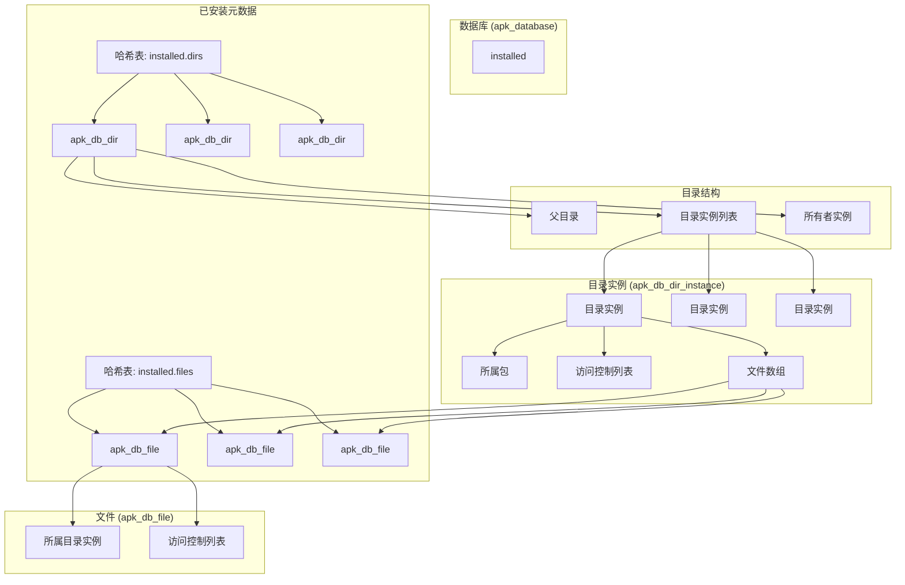
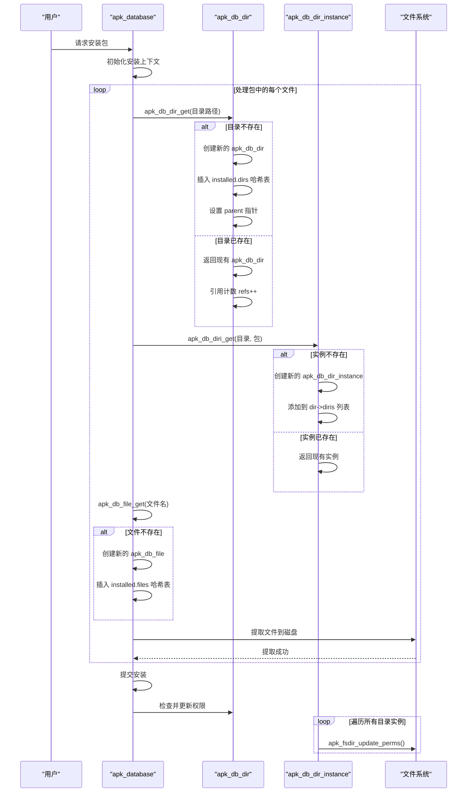

# 存储管理

<cite>
**本文档引用的文件**   
- [apk_database.h](file://src/apk_database.h)
- [database.c](file://src/database.c)
- [apk_fs.h](file://src/apk_fs.h)
- [apk_hash.h](file://src/apk_hash.h)
- [apk_xattr.h](file://src/apk_xattr.h)
- [fs_fsys.c](file://src/fs_fsys.c)
- [io.c](file://src/io.c)
- [apk_adb.c](file://src/apk_adb.c)
</cite>

## 目录
1. [存储管理](#存储管理)
2. [核心数据结构](#核心数据结构)
3. [哈希表组织与查询效率](#哈希表组织与查询效率)
4. [访问控制与扩展属性](#访问控制与扩展属性)
5. [目录引用计数与父子关系](#目录引用计数与父子关系)
6. [存储层次结构图](#存储层次结构图)
7. [文件/目录操作时序图](#文件目录操作时序图)

## 核心数据结构

apk-tools 使用一组精心设计的数据结构来管理文件和目录的元数据。核心结构包括 `apk_db_file`、`apk_db_dir` 和 `apk_db_dir_instance`，它们共同构成了一个高效的存储管理系统。

`apk_db_file` 结构体用于表示单个文件的元数据。它包含指向其所属目录实例的指针（`diri`）、访问控制列表（`acl`）、审计和损坏标志、摘要算法、文件名长度、摘要值以及可变长度的文件名。该结构通过哈希节点（`hash_node`）链接到哈希表中，实现快速查找。

`apk_db_dir` 结构体用于表示目录的元数据。它包含哈希节点、哈希值、指向父目录的指针、指向所有者目录实例的指针、目录实例列表、受保护路径数组、引用计数、名称长度、保护模式、是否有受保护子项的标志、创建和修改标志、权限是否正确的标志，以及根路径和目录名。该结构同样通过哈希节点链接到哈希表。

`apk_db_dir_instance` 结构体表示一个包在特定目录下的实例。它包含一个双向链表节点（`dir_diri_list`），用于链接到其所属目录的实例列表；一个文件数组（`files`），存储该实例下所有文件的指针；一个指向所属包的指针（`pkg`）；一个指向实际目录的指针（`dir`）；以及一个访问控制列表（`acl`）。这种设计将目录的物理存在与包的逻辑实例分离，允许多个包共享同一个目录。

这些结构体通过 `apk_database` 结构体中的 `installed.files` 和 `installed.dirs` 两个哈希表进行组织和管理，实现了高效的元数据存储和检索。

**Section sources**
- [apk_database.h](file://src/apk_database.h#L39-L50)
- [apk_database.h](file://src/apk_database.h#L85-L106)
- [apk_database.h](file://src/apk_database.h#L111-L117)
- [apk_database.h](file://src/apk_database.h#L181-L251)

## 哈希表组织与查询效率

apk-tools 使用哈希表来高效地组织和查询文件与目录的元数据。`installed.files` 和 `installed.dirs` 是两个核心的哈希表，分别存储 `apk_db_file` 和 `apk_db_dir` 对象。

对于 `installed.dirs` 哈希表，其键（key）是目录的完整路径（`apk_blob_t`），哈希函数使用 `apk_blob_hash`。查找操作通过 `apk_db_dir_query` 函数实现，该函数直接使用目录路径作为键在哈希表中进行查找，时间复杂度为 O(1)。插入操作通过 `apk_db_dir_get` 函数实现，该函数首先尝试查找，如果不存在则创建新的 `apk_db_dir` 对象并插入哈希表。

对于 `installed.files` 哈希表，其键是一个复合键，由目录路径和文件名组成（`struct apk_db_file_hash_key`）。哈希函数 `apk_db_file_hash_key` 通过将文件名的哈希值与目录路径的哈希值进行组合来生成最终的哈希值。查找操作通过 `apk_db_file_query` 函数实现，该函数构造一个 `apk_db_file_hash_key` 键，然后在哈希表中进行查找。这种设计确保了即使文件名相同但位于不同目录下，也能被正确区分和查找。

哈希表的高效性得益于精心设计的哈希函数和冲突解决机制。`apk_hash` 结构体定义了操作哈希表所需的所有函数指针，包括获取键、计算哈希值、比较键和项等。这使得哈希表的操作非常灵活且高效，能够满足包管理器对元数据快速访问的需求。

**Section sources**
- [apk_database.h](file://src/apk_database.h#L117-L118)
- [apk_database.h](file://src/apk_database.h#L244-L245)
- [database.c](file://src/database.c#L110-L159)
- [database.c](file://src/database.c#L293-L297)
- [database.c](file://src/database.c#L423-L435)
- [apk_hash.h](file://src/apk_hash.h#L37-L73)

## 访问控制与扩展属性

apk-tools 通过 `apk_db_acl` 结构体来管理文件和目录的访问控制列表（ACL），该结构体包含了权限模式（`mode`）、用户ID（`uid`）、组ID（`gid`）以及扩展属性（xattrs）的摘要信息。ACL 与 `apk_db_file` 和 `apk_db_dir_instance` 结构体关联，确保了每个文件和目录实例都有明确的权限设置。

当需要检查或更新文件系统上目录的权限时，apk-tools 会调用 `apk_fsdir_check` 和 `apk_fsdir_update_perms` 等函数。这些函数通过 `apk_fsdir` 抽象层与底层文件系统交互。`apk_fsdir_check` 检查目录的权限、所有者和组是否与预期的 ACL 一致，如果不一致则返回 `APK_FS_DIR_MODIFIED`。`apk_fsdir_update_perms` 则负责更新目录的权限和所有者，它会调用 `fchmodat` 和 `fchownat` 系统调用来完成实际的修改。

对于扩展属性（xattrs），apk-tools 在 `apk_file_info` 结构体中使用 `xattrs` 数组来存储。在提取文件时，`fsys_file_extract` 函数会遍历此数组，并通过 `apk_fsetxattr` 系统调用将每个扩展属性设置到文件上。`is_system_xattr` 函数用于区分用户命名空间（`user.*`）和系统命名空间的扩展属性，后者在某些提取模式下会被忽略。文件的扩展属性摘要（`xattr_digest`）也会被计算和验证，以确保文件完整性。

**Section sources**
- [apk_database.h](file://src/apk_database.h#L28-L34)
- [apk_database.h](file://src/apk_database.h#L43-L44)
- [apk_database.h](file://src/apk_database.h#L117-L118)
- [apk_fs.h](file://src/apk_fs.h#L28-L47)
- [apk_xattr.h](file://src/apk_xattr.h#L1-L31)
- [fs_fsys.c](file://src/fs_fsys.c#L156-L193)
- [fs_fsys.c](file://src/fs_fsys.c#L46-L58)
- [io.c](file://src/io.c#L756-L790)

## 目录引用计数与父子关系

apk-tools 使用引用计数（`refs`）和父子指针（`parent`）来管理目录的生命周期和层次结构。

`apk_db_dir` 结构体中的 `refs` 字段是一个无符号短整型，用于记录当前有多少个 `apk_db_dir_instance` 正在引用该目录。当一个目录实例被创建时，它会通过 `apk_db_dir_get` 函数获取或创建一个 `apk_db_dir` 对象，并调用 `apk_db_dir_ref` 函数将其引用计数加一。当一个目录实例被移除时，`apk_db_diri_remove` 函数会调用 `apk_db_dir_unref` 函数将引用计数减一。只有当引用计数降至零时，该目录对象才会被从哈希表中移除，并且如果需要，其在文件系统上的对应目录也会被删除。

父子关系通过 `parent` 指针实现。`apk_db_dir` 结构体中的 `parent` 字段指向其父目录的 `apk_db_dir` 对象。当通过 `apk_db_dir_get` 创建一个新目录时，它会解析其路径，找到父目录的路径，然后递归地调用 `apk_db_dir_get` 来获取或创建父目录对象，并将 `parent` 指针指向它。这种设计使得系统能够轻松地遍历目录树，例如在删除一个目录时，`apk_db_dir_unref` 会递归地调用其父目录的 `apk_db_dir_unref`，从而正确地管理整个路径的引用计数。

**Section sources**
- [apk_database.h](file://src/apk_database.h#L90-L91)
- [apk_database.h](file://src/apk_database.h#L95-L96)
- [database.c](file://src/database.c#L287-L291)
- [database.c](file://src/database.c#L267-L285)
- [database.c](file://src/database.c#L307-L369)

## 存储层次结构图

**Diagram sources**
- [apk_database.h](file://src/apk_database.h#L181-L251)
- [apk_database.h](file://src/apk_database.h#L85-L106)
- [apk_database.h](file://src/apk_database.h#L111-L117)
- [apk_database.h](file://src/apk_database.h#L39-L50)

## 文件/目录操作时序图

**Diagram sources**
- [database.c](file://src/database.c#L307-L369)
- [database.c](file://src/database.c#L804-L852)
- [database.c](file://src/database.c#L476-L501)
- [database.c](file://src/database.c#L372-L390)
- [fs_fsys.c](file://src/fs_fsys.c#L46-L58)