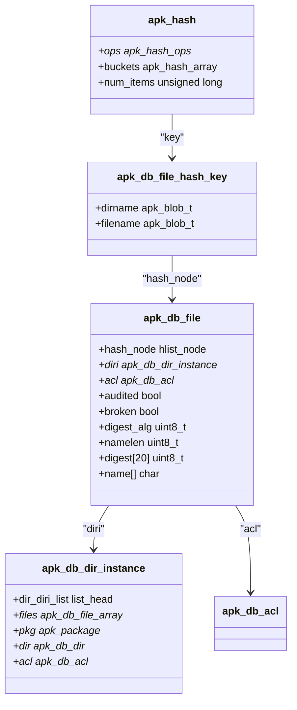
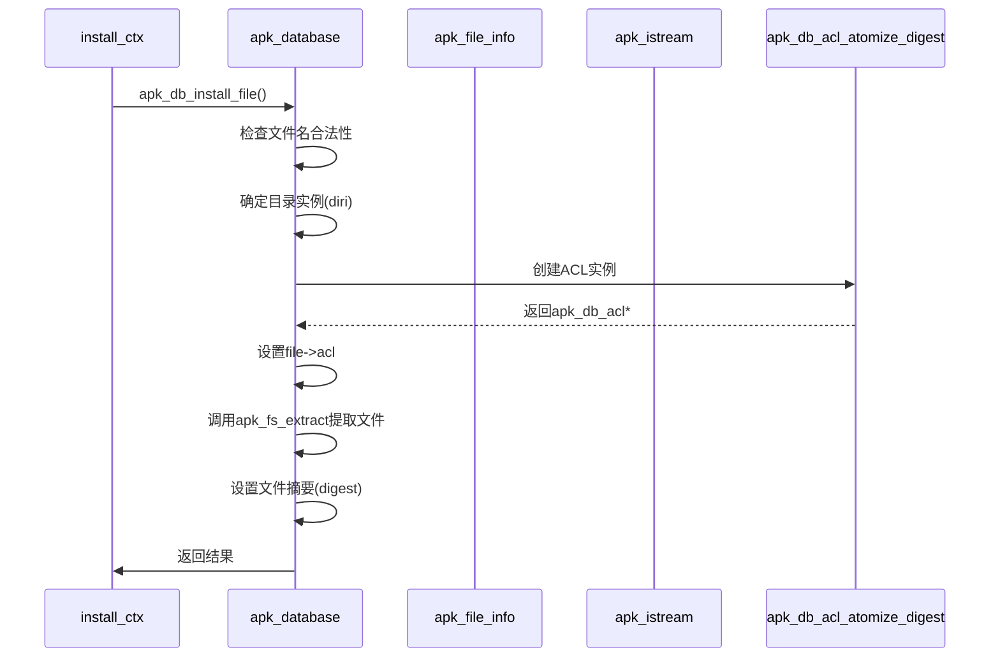
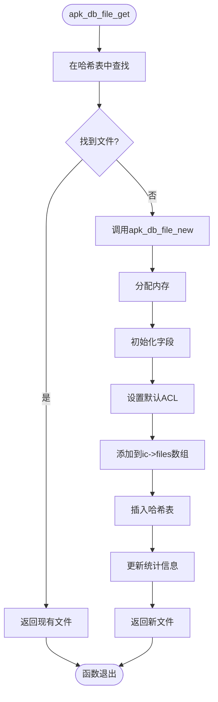

# 文件管理

<cite>
**本文档中引用的文件**   
- [apk_database.h](file://src/apk_database.h)
- [database.c](file://src/database.c)
- [hash.c](file://src/hash.c)
</cite>

## 目录
1. [文件结构设计](#文件结构设计)
2. [哈希表组织与查询机制](#哈希表组织与查询机制)
3. [元数据存储与权限管理](#元数据存储与权限管理)
4. [核心操作函数分析](#核心操作函数分析)
5. [性能分析](#性能分析)

## 文件结构设计

`apk_db_file` 结构体是 apk-tools 文件管理系统的核心数据结构，用于在内存中表示已安装软件包中的文件条目。该结构体通过哈希节点、目录实例指针、ACL权限控制、审计与损坏标志、摘要算法、名称长度和内容摘要等字段，实现了对文件元数据的高效管理和查询。

结构体中的 `hash_node` 字段是哈希表的关键组成部分，它允许文件条目被快速插入、查找和删除。`diri` 字段指向 `apk_db_dir_instance` 结构体，建立了文件与目录实例之间的关联。`acl` 字段则指向 `apk_db_acl` 结构体，用于存储文件的访问控制列表（ACL）信息。

审计与损坏标志（`audited` 和 `broken`）用于标记文件的状态，例如是否经过审计或是否损坏。`digest_alg` 字段指定了用于计算文件摘要的算法，而 `digest` 数组则存储了实际的摘要值。`namelen` 字段记录了文件名的长度，`name[]` 字段则是一个柔性数组成员，用于存储文件名本身。

**Section sources**
- [apk_database.h](file://src/apk_database.h#L39-L50)

## 哈希表组织与查询机制

`installed.files` 哈希表是文件管理系统的核心索引结构，它通过目录名和文件名的组合键实现高效查询。该哈希表的组织方式基于 `apk_hash` 结构，利用 `file_hash_ops` 操作集来定义其行为。

哈希表的键由 `apk_db_file_hash_key` 结构体表示，该结构体包含 `dirname` 和 `filename` 两个字段。哈希函数 `apk_db_file_hash_key` 通过将文件名的哈希值作为种子，与目录名的哈希值进行组合，生成最终的哈希值。这种设计确保了即使目录名或文件名单独变化，也能产生不同的哈希值，从而减少哈希冲突。

查找操作通过 `apk_db_file_query` 函数实现。该函数首先构建一个 `apk_db_file_hash_key` 键，然后调用 `apk_hash_get` 函数在哈希表中进行查找。插入操作则通过 `apk_db_file_get` 函数完成，该函数在查找失败时会创建一个新的 `apk_db_file` 实例并将其插入到哈希表中。

**Diagram sources **
- [apk_database.h](file://src/apk_database.h#L39-L50)
- [database.c](file://src/database.c#L116-L119)
- [database.c](file://src/database.c#L121-L126)
- [database.c](file://src/database.c#L153-L158)

**Section sources**
- [database.c](file://src/database.c#L422-L434)
- [database.c](file://src/database.c#L475-L500)

## 元数据存储与权限管理

文件元数据的存储策略围绕 `apk_db_acl` 结构体展开，该结构体负责管理文件的权限、所有者、扩展属性（xattrs）和访问控制列表（ACL）。`mode`、`uid` 和 `gid` 字段分别存储了文件的权限模式、用户ID和组ID。`xattr_hash_len` 和 `xattr_hash[]` 字段则用于存储扩展属性的哈希值。

ACL的处理流程在文件安装过程中完成。当从软件包中提取文件时，`apk_db_install_file` 函数会调用 `apk_db_acl_atomize_digest` 函数，根据文件的元数据创建一个 `apk_db_acl` 实例，并将其赋值给新创建的 `apk_db_file` 实例的 `acl` 字段。这种设计确保了文件的元数据能够被持久化存储，并在需要时进行验证。

**Diagram sources **
- [database.c](file://src/database.c#L2752-L2892)
- [apk_database.h](file://src/apk_database.h#L28-L34)

**Section sources**
- [database.c](file://src/database.c#L2752-L2892)

## 核心操作函数分析

文件管理系统的三个核心函数是 `apk_db_file_new`、`apk_db_file_get` 和 `apk_db_file_query`。`apk_db_file_new` 函数负责创建一个新的 `apk_db_file` 实例。它首先使用 `apk_balloc_new_extra` 从内存池中分配内存，然后初始化结构体的各个字段，包括将 `acl` 字段设置为默认的 `apk_default_acl_file`。

`apk_db_file_get` 函数是文件获取的主要入口。它首先尝试通过 `apk_hash_get_hashed` 在哈希表中查找文件。如果查找失败，则调用 `apk_db_file_new` 创建新实例，并使用 `apk_hash_insert_hashed` 将其插入到哈希表中。这个过程确保了文件条目的唯一性。

`apk_db_file_query` 函数则是一个纯粹的查询函数，它不创建新实例，仅用于检查文件是否存在。这三个函数共同构成了文件管理的基础，为上层应用提供了稳定可靠的文件操作接口。

**Diagram sources **
- [database.c](file://src/database.c#L451-L473)
- [database.c](file://src/database.c#L475-L500)
- [database.c](file://src/database.c#L422-L434)

**Section sources**
- [database.c](file://src/database.c#L451-L473)
- [database.c](file://src/database.c#L475-L500)
- [database.c](file://src/database.c#L422-L434)

## 性能分析

文件哈希表的插入、查找和删除算法的时间复杂度在平均情况下为 O(1)。这得益于哈希表的数据结构特性。`apk_hash_get_hashed` 和 `apk_hash_insert_hashed` 函数的实现都基于哈希桶的链表结构，通过计算哈希值直接定位到目标桶，然后在桶内进行线性查找或插入。

在大规模软件包管理场景下，这种设计表现出优异的性能。即使系统中安装了成千上万个软件包，包含数百万个文件，哈希表也能保持高效的查询速度。内存池（`balloc`）的使用进一步优化了内存分配性能，减少了频繁的 `malloc` 和 `free` 调用带来的开销。

然而，最坏情况下，当哈希冲突严重时，时间复杂度可能退化为 O(n)。为了避免这种情况，系统通过精心设计的哈希函数（`apk_db_file_hash_key`）和合理的哈希表大小来最小化冲突概率。此外，`apk_db_file_array` 的使用也为文件的批量操作提供了便利，进一步提升了整体性能。

**Section sources**
- [hash.c](file://src/hash.c#L50-L83)
- [database.c](file://src/database.c#L475-L500)
- [database.c](file://src/database.c#L422-L434)