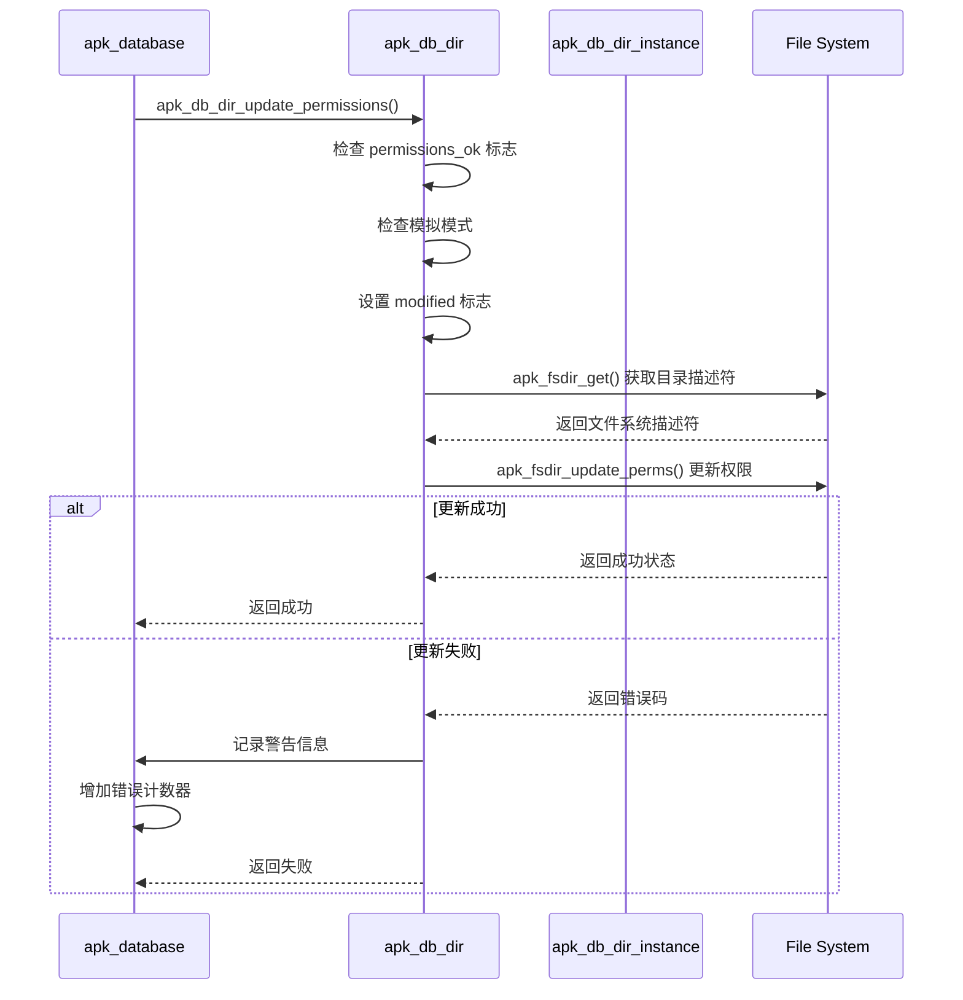
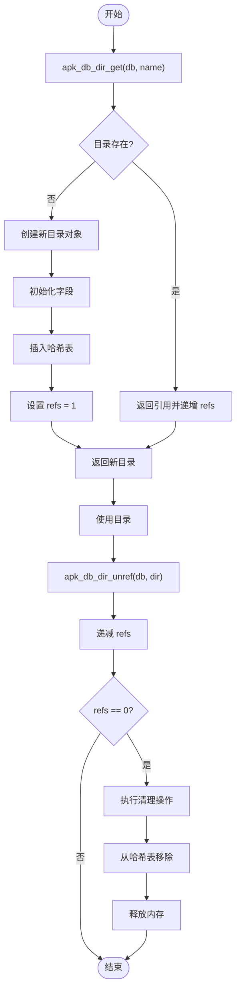
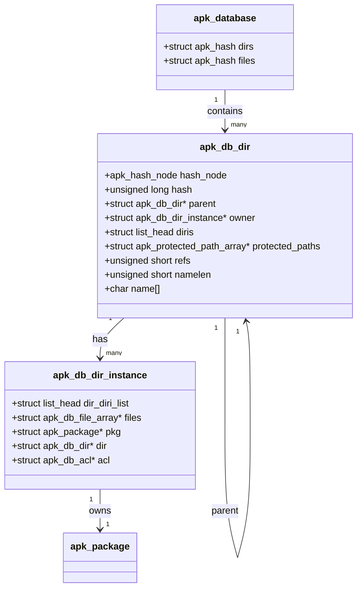

# 目录管理

<cite>
**Referenced Files in This Document**   
- [apk_database.h](file://src/apk_database.h)
- [database.c](file://src/database.c)
- [app_audit.c](file://src/app_audit.c)
- [query.c](file://src/query.c)
- [app_fix.c](file://src/app_fix.c)
</cite>

## 目录管理

`apk_db_dir` 结构体是 apk-tools 中用于管理文件系统目录的核心数据结构。该结构体设计用于高效地处理复杂的文件系统层次结构，通过哈希表组织和引用计数机制来实现高性能的目录操作。`apk_db_dir` 不仅维护了目录的基本信息，还通过父子关系指针构建了完整的目录树结构，为包管理系统的安装、查询和验证操作提供了基础支持。

**Section sources**
- [apk_database.h](file://src/apk_database.h#L85-L106)
- [database.c](file://src/database.c#L298-L369)

## 核心字段设计与实现

`apk_db_dir` 结构体包含多个关键字段，每个字段都有特定的设计目的和实现细节。哈希节点（hash_node）和哈希值（hash）字段用于在哈希表中快速定位目录对象，确保目录查询操作的高效性。父目录指针（parent）是构建目录树结构的关键，它允许从任意目录节点向上遍历到根目录，从而维护了文件系统的层次关系。所有者实例（owner）字段指向拥有该目录的包实例，用于权限管理和所有权验证。

目录实例列表（diris）是一个双向链表，存储了所有在该目录下创建文件的包实例，支持多包共享目录的场景。受保护路径数组（protected_paths）则用于实现目录保护机制，通过模式匹配来确定子目录或文件的保护级别。这些字段共同构成了一个功能完整的目录管理单元，能够满足包管理系统对目录操作的各种需求。

**Section sources**
- [apk_database.h](file://src/apk_database.h#L85-L106)
- [database.c](file://src/database.c#L300-L369)

## 引用计数机制

引用计数（refs）机制是 `apk_db_dir` 结构体中至关重要的资源管理组件。该机制通过一个无符号短整型字段来跟踪目录对象的引用次数，确保在多处使用同一目录时不会过早释放内存。当目录被创建或获取时，引用计数会递增；当不再需要该目录时，引用计数会递减。只有当引用计数降至零时，目录对象才会被真正释放。

这种机制在处理复杂的包依赖关系时尤为重要，因为它允许多个包实例同时引用同一个目录对象，而不会导致内存泄漏或悬空指针。引用计数与 `apk_db_dir_unref` 函数紧密结合，后者在递减引用计数后会检查是否需要执行清理操作，包括从父目录中移除链接和可能的物理删除。这种设计确保了资源的正确管理和内存的高效利用。

**Section sources**
- [apk_database.h](file://src/apk_database.h#L95-L96)
- [database.c](file://src/database.c#L265-L284)

## 父子关系管理

目录的父子关系管理通过 parent 指针实现，这是构建文件系统层次结构的基础。每个 `apk_db_dir` 对象都包含一个指向其父目录的指针，从而形成了一棵从根目录开始的树状结构。根目录的特殊情况通过将 parent 指针设置为 NULL 来处理，这在 `apk_db_dir_get` 函数中有明确的判断逻辑。

当创建一个新的目录时，系统会自动解析其路径，找到或创建相应的父目录，并建立父子链接。这种递归的目录创建过程确保了目录树的完整性和一致性。父子关系不仅用于导航文件系统，还在目录删除时发挥作用：删除一个目录会触发对其父目录的递归处理，确保整个目录树的正确维护。这种设计使得文件系统操作既高效又可靠。

**Section sources**
- [apk_database.h](file://src/apk_database.h#L90)
- [database.c](file://src/database.c#L326-L337)

## 目录权限更新流程

目录权限更新流程由 `apk_db_dir_update_permissions` 函数负责执行，该函数确保目录权限的一致性。当调用此函数时，系统会首先检查目录的权限状态标志（permissions_ok），如果权限已经正确则直接返回，避免不必要的操作。在非模拟模式下，函数会获取目录的文件系统描述符，并调用底层文件系统接口来更新权限、用户ID和组ID。

权限更新过程中包含了错误处理机制，如果更新失败，系统会记录警告信息并增加错误计数器。这种设计确保了即使在部分失败的情况下，系统也能继续运行并提供诊断信息。权限更新通常在包安装或修复过程中触发，是维护文件系统安全性和完整性的重要环节。通过将权限更新与目录对象的状态紧密关联，系统能够精确控制何时以及如何更新目录权限。

**Diagram sources**
- [database.c](file://src/database.c#L371-L389)

**Section sources**
- [database.c](file://src/database.c#L371-L389)

## 目录操作示例

目录的创建、查询和释放操作通过一组关键函数实现。`apk_db_dir_get` 函数用于获取或创建目录对象，它会先尝试从哈希表中查找现有目录，如果不存在则分配新的目录对象并初始化其字段。`apk_db_dir_query` 函数提供了一种只查询不创建的轻量级访问方式，适用于需要检查目录是否存在但不希望创建新目录的场景。

`apk_db_dir_unref` 函数负责目录的释放操作，它会递减引用计数并在计数归零时执行清理工作。这些函数的调用示例展示了典型的目录操作流程：首先通过 `apk_db_dir_get` 获取目录引用，进行必要的操作后，通过 `apk_db_dir_unref` 释放引用。这种获取-使用-释放的模式确保了资源的正确管理，避免了内存泄漏。

**Diagram sources**
- [database.c](file://src/database.c#L298-L369)
- [database.c](file://src/database.c#L292-L296)
- [database.c](file://src/database.c#L265-L284)

**Section sources**
- [database.c](file://src/database.c#L298-L369)
- [database.c](file://src/database.c#L292-L296)
- [database.c](file://src/database.c#L265-L284)

## 目录哈希表组织

目录哈希表的组织结构基于 `apk_hash` 数据结构，提供了高效的目录查询性能。哈希表使用目录名称作为键，通过哈希函数计算出哈希值，并在相应的桶中存储目录对象。这种设计使得目录查询的时间复杂度接近 O(1)，即使在处理包含大量目录的复杂文件系统时也能保持高性能。

哈希表的查询效率得益于精心设计的哈希函数和冲突解决策略。`apk_db_dir_get_key` 函数提取目录名称作为哈希键，而 `apk_blob_hash` 函数则计算出均匀分布的哈希值。当发生哈希冲突时，系统使用链地址法来处理，确保所有同桶的目录对象都能被正确访问。这种组织结构特别适合包管理系统中频繁的目录查找操作，为整体性能提供了重要保障。

**Section sources**
- [apk_database.h](file://src/apk_database.h#L110-L115)
- [database.c](file://src/database.c#L104-L108)

## 实际应用示例

`apk_db_dir` 结构体在多个实际应用场景中发挥着关键作用。在 `app_audit.c` 文件的 `audit_directory_tree` 函数中，系统使用 `apk_db_dir_get` 获取目录引用，对目录进行审计操作后通过 `apk_db_dir_unref` 释放引用。这种模式确保了在遍历文件系统时的资源安全。

在 `query.c` 文件的 `get_owner` 函数中，系统使用 `apk_db_dir_query` 查询目录对象以确定文件的所有者，这在实现 "who owns" 功能时至关重要。而在 `app_fix.c` 文件的 `fix_directory_permissions` 函数中，系统遍历所有目录并调用 `apk_db_dir_update_permissions` 来修复权限问题，展示了目录权限管理的实际应用。这些示例共同说明了 `apk_db_dir` 结构体在包管理系统中的核心地位和广泛用途。

**Diagram sources**
- [app_audit.c](file://src/app_audit.c#L382-L396)
- [query.c](file://src/query.c#L511-L521)
- [app_fix.c](file://src/app_fix.c#L60-L76)

**Section sources**
- [app_audit.c](file://src/app_audit.c#L382-L396)
- [query.c](file://src/query.c#L511-L521)
- [app_fix.c](file://src/app_fix.c#L60-L76)