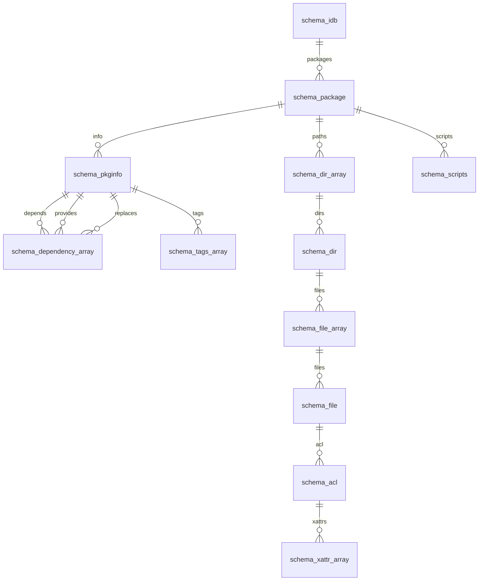
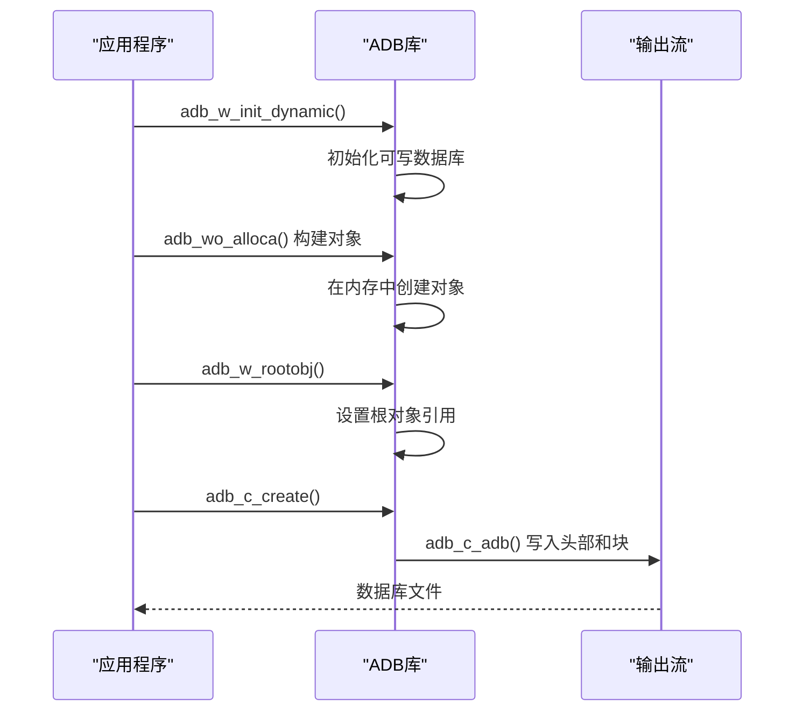
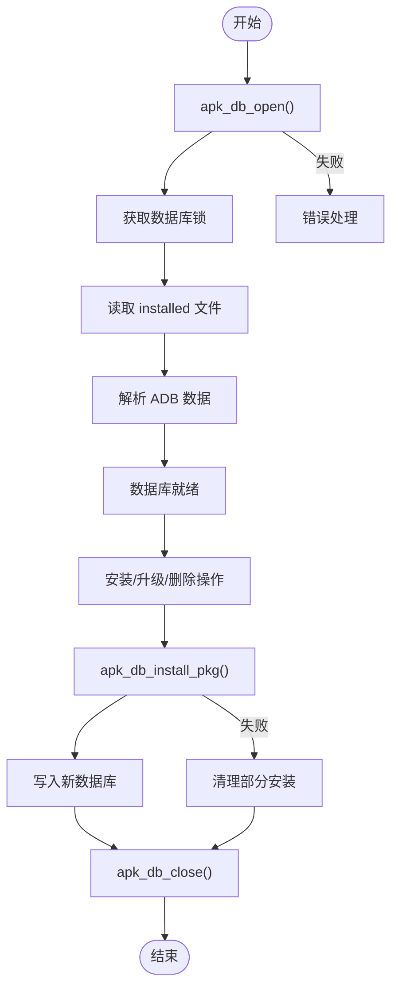
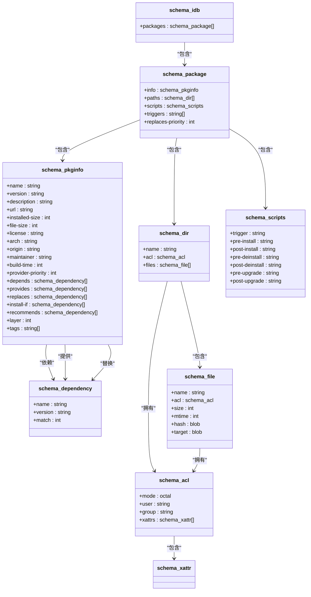

# 数据库与存储

<cite>
**本文档中引用的文件**   
- [adb.c](file://src/adb.c)
- [adb.h](file://src/adb.h)
- [apk_adb.c](file://src/apk_adb.c)
- [database.c](file://src/database.c)
- [apk_database.h](file://src/apk_database.h)
</cite>

## 目录
1. [引言](#引言)
2. [ADB数据库架构](#adb数据库架构)
3. [序列化模式](#序列化模式)
4. [数据库读写流程](#数据库读写流程)
5. [数据持久化与事务](#数据持久化与事务)
6. [元数据管理](#元数据管理)
7. [数据库生命周期](#数据库生命周期)
8. [数据库模式图](#数据库模式图)

## 引言
apk-tools 使用一种名为 ADB（Alpine Database）的自定义二进制格式来存储已安装软件包的信息。这种格式设计紧凑、高效，支持数据完整性验证和签名。本文档详细阐述了 ADB 格式的内部结构、序列化模式、读写机制以及其在 apk-tools 中的生命周期管理。

## ADB数据库架构
ADB 格式是一种基于块（block）的二进制文件格式。一个 ADB 文件由一个文件头和多个数据块组成，这些块可以包含数据库内容、签名或扩展信息。

### 文件头
每个 ADB 文件都以一个固定的文件头开始，其结构定义在 `adb.h` 中：
```c
struct adb_file_header {
    uint32_t magic;    // 魔数，固定为 0x2e424441 ('ADB.')
    uint32_t schema;   // 模式ID，标识数据库的结构
};
```
魔数用于快速验证文件是否为有效的 ADB 文件。模式ID（schema）指明了数据库遵循的结构模式，例如 `ADB_SCHEMA_INSTALLED_DB` 用于已安装的包数据库。

### 数据块
文件头之后是多个数据块。每个块都有一个头部，定义了其类型和大小。主要的块类型包括：
- **ADB_BLOCK_ADB**: 包含实际的数据库内容。
- **ADB_BLOCK_SIG**: 包含数据库的数字签名，用于验证完整性。
- **ADB_BLOCK_DATA**: 包含原始数据流。

块的处理由 `adb.c` 文件中的 `__adb_m_parse` 函数负责，该函数会按顺序解析每个块，并根据其类型进行相应的处理（如验证签名、读取数据）。

**Section sources**
- [adb.h](file://src/adb.h#L47-L54)
- [adb.c](file://src/adb.c#L138-L195)

## 序列化模式
ADB 格式的核心是其灵活的序列化模式系统，该系统定义了如何将复杂的数据结构（如对象和数组）编码为二进制流。

### 基本类型
ADB 支持多种基本类型，通过 `adb_val_t` 类型来表示。其值由一个类型标记和一个值组成：
- **整数 (INT)**: 支持小整数（直接编码在值中）和大整数（存储在数据区）。
- **二进制大对象 (BLOB)**: 用于存储字符串或任意二进制数据，长度前缀可以是 8、16 或 32 位。
- **数组 (ARRAY) 和对象 (OBJECT)**: 复合类型，由多个 `adb_val_t` 值组成。

### 模式定义
模式在 `apk_adb.c` 文件中定义，使用一系列 `const struct adb_object_schema` 结构体。这些结构体描述了对象的字段、类型以及如何进行序列化和反序列化。

#### 核心模式结构
- **`schema_package`**: 代表一个已安装软件包的完整信息。
- **`schema_idb`**: 代表整个已安装数据库，是 `schema_package` 数组的容器。



**Diagram sources **
- [apk_adb.c](file://src/apk_adb.c#L546-L552)
- [apk_adb.c](file://src/apk_adb.c#L520-L531)

### 标量类型
模式中还定义了各种标量类型，如 `scalar_string`、`scalar_version` 和 `scalar_int`。这些类型不仅定义了数据的存储方式，还提供了比较和字符串转换函数，确保了数据的一致性和可读性。

**Section sources**
- [apk_adb.c](file://src/apk_adb.c#L78-L325)
- [apk_adb.c](file://src/apk_adb.c#L411-L438)

## 数据库读写流程
ADB 数据库的读写操作通过一组精心设计的 API 来完成。

### 读取流程
1.  **初始化**: 调用 `adb_init` 初始化一个 `struct adb` 结构体。
2.  **解析**: 使用 `adb_m_process` 或 `adb_m_blob` 函数解析输入流或内存块。这个过程会验证文件头、签名，并将数据库内容加载到内存中。
3.  **访问**: 通过 `adb_r_rootobj` 获取根对象，然后使用 `adb_ro_*` 系列函数（如 `adb_ro_int`, `adb_ro_blob`）遍历和读取数据。

### 写入流程
1.  **初始化**: 调用 `adb_w_init_dynamic` 或 `adb_w_init_static` 创建一个可写的数据库上下文。
2.  **构建**: 使用 `adb_wo_*` 系列函数（如 `adb_wo_alloca`, `adb_wo_blob`）在内存中构建对象和数组。
3.  **提交**: 调用 `adb_w_rootobj` 将根对象的引用写入数据库头部。
4.  **持久化**: 使用 `adb_c_create` 函数将内存中的数据库写入输出流。



**Diagram sources **
- [adb.c](file://src/adb.c#L380-L396)
- [adb.c](file://src/adb.c#L721-L724)
- [adb.c](file://src/adb.c#L1296-L1300)

**Section sources**
- [adb.c](file://src/adb.c#L380-L396)
- [adb.c](file://src/adb.c#L721-L724)
- [adb.c](file://src/adb.c#L1296-L1300)

## 数据持久化与事务
ADB 格式本身不提供传统意义上的事务（ACID），但其设计确保了数据写入的原子性和一致性。

### 原子性
数据库的写入是一个整体过程。`adb_c_create` 函数会将整个数据库结构（包括所有块和签名）一次性写入输出流。如果写入过程在中途失败，生成的文件将是不完整的，从而避免了部分更新导致的数据库损坏。

### 一致性
- **模式验证**: 在读取时，会根据预期的模式ID (`expected_schema`) 进行验证，确保数据结构正确。
- **完整性检查**: 通过 `adb_trust_verify_signature` 函数验证数字签名，防止数据被篡改。

## 元数据管理
ADB 数据库用于存储丰富的包元数据。

### 包信息 (pkginfo)
`schema_pkginfo` 模式定义了包的核心元数据，包括：
- **名称 (name)**: 包的名称。
- **版本 (version)**: 包的版本号。
- **依赖 (depends)**: 该包所依赖的其他包。
- **提供 (provides)**: 该包提供的虚拟包或功能。
- **替换 (replaces)**: 该包替换的旧包。
- **大小 (installed-size, file-size)**: 安装大小和文件大小。

### 文件列表与ACL
- **文件列表 (paths)**: `schema_dir_array` 和 `schema_file_array` 模式记录了包安装的所有文件及其路径。
- **访问控制列表 (ACL)**: `schema_acl` 模式存储了文件的权限（mode）、所有者（uid/gid）和扩展属性（xattrs），确保了安装时能正确恢复文件的权限。

**Section sources**
- [apk_adb.c](file://src/apk_adb.c#L411-L438)
- [apk_adb.c](file://src/apk_adb.c#L468-L487)
- [apk_adb.c](file://src/apk_adb.c#L457-L466)

## 数据库生命周期
已安装包数据库的生命周期由 `apk_database.h` 中的 `struct apk_database` 管理。

### 打开 (Open)
`apk_db_open` 函数负责打开和初始化数据库。其主要步骤包括：
1.  设置默认的 ACL（访问控制列表）。
2.  读取系统架构信息。
3.  获取并持有数据库锁，防止并发修改。
4.  读取受保护的路径列表。
5.  通过 `apk_db_read_layer` 读取位于 `/lib/apk/db/installed` 的 ADB 文件。
6.  解析并加载已安装的包信息。

### 提交与回滚
- **提交**: 当一个包被成功安装或升级时，`apk_db_install_pkg` 函数会创建新的数据库状态并将其写入磁盘。这是一个原子操作。
- **回滚**: ADB 格式本身不支持回滚。如果安装过程失败，apk-tools 会尝试清理部分安装的文件，但不会恢复到之前的数据库状态。真正的“回滚”通常通过重新安装旧版本的包来实现。

### 关闭 (Close)
`apk_db_close` 函数负责清理资源，包括释放所有内存中的数据结构、关闭文件描述符和释放锁。



**Diagram sources **
- [database.c](file://src/database.c#L1971-L2160)
- [database.c](file://src/database.c#L2287-L2319)
- [database.c](file://src/database.c#L3157-L3229)

**Section sources**
- [database.c](file://src/database.c#L1971-L2160)
- [database.c](file://src/database.c#L2287-L2319)
- [database.c](file://src/database.c#L3157-L3229)

## 数据库模式图
下图总结了 ADB 数据库的核心模式结构。



**Diagram sources **
- [apk_adb.c](file://src/apk_adb.c#L546-L552)
- [apk_adb.c](file://src/apk_adb.c#L520-L531)