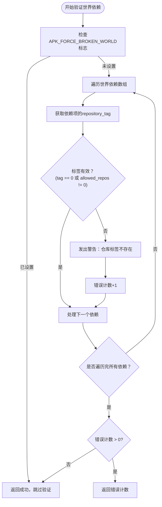
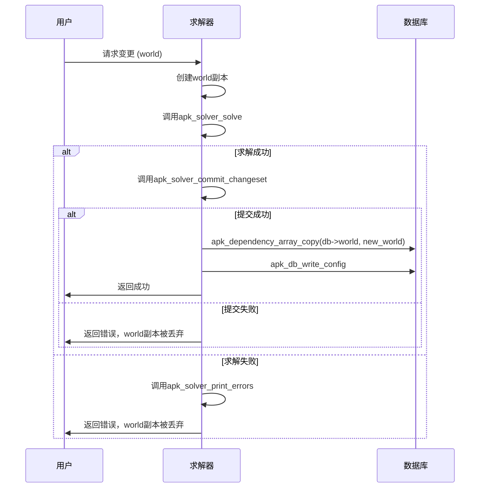

# 世界依赖管理

<cite>
**本文档中引用的文件**  
- [database.c](file://src/database.c#L2508-L2525)
- [apk_database.h](file://src/apk_database.h#L284-L284)
- [commit.c](file://src/commit.c#L908-L929)
- [app_add.c](file://src/app_add.c#L146-L209)
- [apk_package.h](file://src/apk_package.h#L44-L51)
</cite>

## 目录
1. [世界依赖数组的初始化与解析](#世界依赖数组的初始化与解析)
2. [世界依赖的验证机制](#世界依赖的验证机制)
3. [依赖解析器作为求解起点](#依赖解析器作为求解起点)
4. [世界依赖与临时依赖的区别](#世界依赖与临时依赖的区别)
5. [事务回滚时的处理策略](#事务回滚时的处理策略)
6. [世界依赖的配置示例](#世界依赖的配置示例)
7. [错误处理最佳实践](#错误处理最佳实践)

## 世界依赖数组的初始化与解析

世界依赖数组是APK包管理系统中的核心数据结构，用于记录用户显式安装的软件包及其依赖关系。该数组在系统初始化时从`/etc/apk/world`文件中读取，并在每次包操作时进行更新。在`app_add.c`文件中，通过`apk_dependency_array_init`函数初始化世界依赖数组，并使用`apk_dependency_array_copy`将当前数据库中的世界依赖复制到操作上下文中。随后，通过命令行参数或配置文件添加的每个依赖项都会被解析为`struct apk_dependency`结构体，并通过`apk_deps_add`函数添加到世界依赖数组中。依赖项的解析包括名称、版本约束和可选的仓库标签（tag），确保依赖规格符合`name(@tag)([<>~=]version)`的格式要求。

**Section sources**
- [app_add.c](file://src/app_add.c#L118-L120)
- [apk_package.h](file://src/apk_package.h#L44-L51)

## 世界依赖的验证机制

世界依赖的完整性验证由`apk_db_check_world`函数负责执行。该函数在提交任何包变更之前被调用，以确保所有世界依赖项引用的仓库标签均有效存在。函数遍历世界依赖数组中的每个依赖项，检查其`repository_tag`字段。如果标签ID为0或指向一个`allowed_repos`字段为空的仓库标签（表示该标签未被定义或已失效），则视为无效依赖。对于无效依赖，系统会通过`apk_warn`发出警告，指出具体是哪个依赖项的仓库标签不存在。验证过程受`APK_FORCE_BROKEN_WORLD`标志控制，若该标志被设置，则跳过验证并允许继续操作。此验证机制防止了因引用不存在的仓库而导致的求解失败，确保了系统状态的一致性。



**Diagram sources**
- [database.c](file://src/database.c#L2508-L2525)

**Section sources**
- [database.c](file://src/database.c#L2508-L2525)
- [commit.c](file://src/commit.c#L917-L920)

## 依赖解析器作为求解起点

世界依赖数组是包依赖解析器的求解起点。当调用`apk_solver_commit`函数时，传入的世界依赖数组被直接用作求解的初始约束条件。解析器会将这些依赖视为必须满足的“世界状态”，并基于此计算出安装、升级或删除软件包的完整变更集（`struct apk_changeset`）。在`app_add.c`中，用户通过`apk add`命令指定的包会首先被添加到世界依赖数组中，然后该数组被传递给`apk_solver_commit`。求解器会确保最终的系统状态能够满足世界依赖数组中定义的所有约束。这种设计使得世界依赖不仅记录了用户意图，还直接驱动了包管理器的决策过程，是连接用户操作与系统状态的核心桥梁。

**Section sources**
- [commit.c](file://src/commit.c#L923-L925)
- [app_add.c](file://src/app_add.c#L191-L193)

## 世界依赖与临时依赖的区别

世界依赖（World Dependencies）与临时依赖（Transient Dependencies）在生命周期、持久性和管理方式上存在根本区别。世界依赖是用户显式安装的包，其列表被持久化存储在`/etc/apk/world`文件中，即使系统重启也不会丢失。它们是包求解的起点，决定了系统的长期状态。相反，临时依赖是为满足世界依赖而自动安装的间接依赖，它们不会被写入`/etc/apk/world`，其存在仅由世界依赖的需要决定。当最后一个依赖它的世界包被移除时，该临时依赖通常也会被自动清理。在数据结构上，两者都使用`struct apk_dependency`，但世界依赖的`repository_tag`字段具有实际意义，用于指定安装源，而临时依赖的此字段通常不被使用或忽略。

**Section sources**
- [database.c](file://src/database.c#L2517-L2518)
- [apk_package.h](file://src/apk_package.h#L49-L50)

## 事务回滚时的处理策略

APK包管理系统通过原子性操作和状态回滚机制来保证事务的完整性。当`apk_solver_commit`在求解或应用变更集（`apk_changeset`）过程中遇到错误时，系统会进入回滚流程。核心策略是不直接修改当前的`db->world`数组，而是先在内存中创建一个世界依赖数组的副本进行操作。如果整个求解和提交过程成功，才会通过`apk_dependency_array_copy(&db->world, world)`将新的世界依赖状态持久化到数据库。如果过程中发生任何错误（例如，`apk_solver_solve`返回非零值或`apk_db_write_config`失败），该函数会直接返回错误码，内存中的世界依赖副本会被释放，而原始的`db->world`保持不变。这确保了系统的世界状态不会进入不一致或部分更新的中间状态，从而实现了事务的原子性。



**Diagram sources**
- [commit.c](file://src/commit.c#L922-L929)
- [commit.c](file://src/commit.c#L930-L931)

**Section sources**
- [commit.c](file://src/commit.c#L908-L929)

## 世界依赖的配置示例

世界依赖可以通过命令行和配置文件两种方式管理。

**命令行管理**：
使用`apk add`命令可以向世界依赖列表添加新包。
```bash
# 添加一个包到世界依赖
apk add nginx

# 添加一个指定仓库标签的包
apk add nginx@testing

# 添加一个指定版本的包
apk add nginx=1.20.1-r0
```

**配置文件管理**：
世界依赖的持久化列表存储在`/etc/apk/world`文件中。可以直接编辑此文件来批量管理依赖。
```text
# /etc/apk/world 文件示例
busybox
alpine-base
nginx@testing
openrc
```
修改此文件后，需要运行`apk fix`或`apk upgrade`来使变更生效，因为直接编辑文件不会触发求解器。

**Section sources**
- [app_add.c](file://src/app_add.c#L166-L170)
- [database.c](file://src/database.c#L2510-L2525)

## 错误处理最佳实践

处理世界依赖相关错误的最佳实践包括：
1.  **预验证**：在执行任何操作前，始终调用`apk_db_check_world`验证世界依赖的完整性，避免在求解阶段才发现仓库标签错误。
2.  **清晰的错误信息**：当依赖解析失败时，应使用`apk_solver_print_errors`提供详细的错误报告，明确指出是哪个包的哪个依赖无法满足，以及具体原因（如版本冲突、仓库缺失）。
3.  **优雅降级**：在非关键场景下，可以使用`APK_FORCE_BROKEN_WORLD`等强制标志允许操作继续，但需向用户明确提示风险。
4.  **输入验证**：在解析用户输入的依赖字符串时，应严格验证其格式（如`name(@tag)([<>~=]version)`），并在`apk_blob_pull_dep`失败时立即返回格式错误，防止无效数据进入求解流程。
5.  **事务安全**：确保所有对世界依赖的修改都在事务中进行，利用副本机制保证原始状态的完整性，避免部分更新。

**Section sources**
- [database.c](file://src/database.c#L2520-L2522)
- [app_add.c](file://src/app_add.c#L166-L170)
- [commit.c](file://src/commit.c#L918-L919)