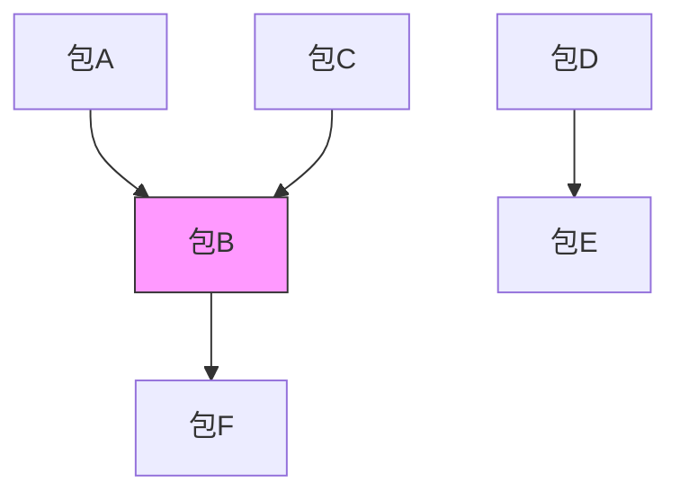

# 依赖解析

<cite>
**本文档引用的文件**   
- [database.c](file://src/database.c)
- [package.c](file://src/package.c)
- [solver.c](file://src/solver.c)
- [apk_package.h](file://src/apk_package.h)
- [apk_solver.h](file://src/apk_solver.h)
</cite>

## 目录
1. [简介](#简介)
2. [反向依赖图构建](#反向依赖图构建)
3. [依赖满足状态判断](#依赖满足状态判断)
4. [冲突依赖与安装条件处理](#冲突依赖与安装条件处理)
5. [依赖解析流程](#依赖解析流程)
6. [依赖匹配算法](#依赖匹配算法)

## 简介
依赖解析是apk包管理系统的核心功能，负责处理包之间的依赖关系、冲突和安装条件。该系统通过构建反向依赖图、分析依赖满足状态、处理冲突依赖和安装条件，最终生成解决方案。本文档详细说明了依赖解析的核心机制，包括`apk_db_pkg_rdepends`函数如何构建反向依赖关系图，`apk_dep_analyze`函数如何判断依赖满足状态，以及冲突依赖和安装条件的处理逻辑。

## 反向依赖图构建

依赖解析器通过`apk_db_pkg_rdepends`函数构建反向依赖关系图。该函数遍历包的依赖列表和安装条件列表，为每个依赖项建立反向引用。当一个包依赖于另一个包时，被依赖的包会记录其依赖者信息，形成反向依赖链。这种设计使得系统能够快速查询某个包被哪些其他包所依赖，对于处理包的移除和更新操作至关重要。

**图源**
- [database.c](file://src/database.c#L508-L521)

**节源**
- [database.c](file://src/database.c#L508-L521)

## 依赖满足状态判断

`apk_dep_analyze`函数负责判断依赖是否满足。该函数首先检查目标包是否存在，若不存在则返回无关状态。然后检查依赖名称是否与包名称匹配，若匹配则调用`apk_dep_is_materialized`检查版本是否满足。如果不匹配，则遍历包提供的虚拟包列表，检查是否有提供者能满足依赖要求。函数返回三种可能状态：满足、冲突或无关。

**节源**
- [package.c](file://src/package.c#L285-L299)

## 冲突依赖与安装条件处理

系统通过`apk_dep_conflict`函数识别冲突依赖，该函数检查依赖操作符中的冲突标志位。对于安装条件(`install_if`)，系统采用特殊处理机制：只有当安装条件中的所有依赖都满足时，相关包才会被安装。这种机制允许创建条件性依赖，例如调试工具包仅在开发环境需要时才安装。

在求解过程中，依赖解析器结合世界依赖(world)和已安装包状态进行求解。世界依赖代表用户显式请求的包，而已安装包状态提供当前系统的上下文。解析器优先考虑已安装包的版本，同时确保世界依赖得到满足，实现平滑的升级和降级操作。

**节源**
- [apk_package.h](file://src/apk_package.h#L128-L128)
- [solver.c](file://src/solver.c#L1069-L1145)

## 依赖解析流程

依赖解析从用户请求开始，经过多个阶段最终生成解决方案。首先，系统收集用户请求的包作为世界依赖。然后，解析器发现所有直接和间接依赖，构建完整的依赖图。接下来，通过约束传播和包选择算法，确定每个包的最优版本。最后，生成变更集，包含需要安装、更新或移除的包列表。

**图源**
- [solver.c](file://src/solver.c#L1069-L1145)

**节源**
- [solver.c](file://src/solver.c#L1069-L1145)

## 依赖匹配算法

依赖匹配算法基于版本比较和提供者机制。当检查依赖是否满足时，系统首先检查精确名称匹配，然后检查虚拟包提供关系。版本匹配支持多种操作符，包括等于、大于、小于等。算法优先选择已安装的包版本，然后考虑仓库中的最新版本。对于冲突依赖，系统确保互斥包不会同时安装。

**节源**
- [package.c](file://src/package.c#L285-L299)
- [apk_package.h](file://src/apk_package.h#L133-L133)