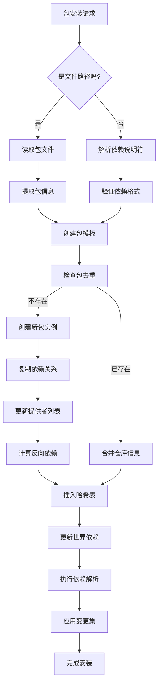

# 包与依赖管理

<cite>
**本文档引用的文件**   
- [database.c](file://src/database.c)
- [apk_database.h](file://src/apk_database.h)
- [package.c](file://src/package.c)
- [app_add.c](file://src/app_add.c)
</cite>

## 目录
1. [数据库包添加机制](#数据库包添加机制)
2. [包升级判断逻辑](#包升级判断逻辑)
3. [世界依赖数组管理](#世界依赖数组管理)
4. [包名查询机制](#包名查询机制)
5. [依赖解析流程图](#依赖解析流程图)

## 数据库包添加机制

`apk_db_pkg_add` 函数负责将新软件包添加到数据库中，该过程包含多个关键步骤以确保数据的完整性和一致性。首先，函数会验证包的基本信息，包括名称、版本和ID摘要长度，同时检查架构兼容性。如果包的架构与系统不兼容，则将其标记为不可安装。

包去重通过使用SHA1摘要作为键在哈希表中查找来实现。如果未找到匹配项，则创建新的包实例并复制所有相关信息，包括依赖关系、提供者和标签。新包被插入到可用包的哈希表中，并更新其名称的提供者列表。对于提供的功能，也会相应地更新相关名称的提供者列表。

当包被成功添加后，系统会检查并更新反向依赖（rdepends）。这涉及到遍历新包的依赖项和安装条件，为每个依赖项名称添加当前包到其反向依赖列表中。此外，如果包是从仓库中添加的，还会标记该名称及其提供的功能具有仓库提供者。

在处理已安装包时，函数还会处理包实例（ipkg）的转移，确保所有目录实例（diri）正确指向新包，并更新包的安装状态。最后，模板被重置以供后续使用。

**Section sources**
- [database.c](file://src/database.c#L572-L620)

## 包升级判断逻辑

`apk_db_pkg_upgradable` 函数用于判断一个包是否可以升级。此函数首先检查指定名称是否有已安装的包。如果没有已安装的包，则直接返回不可升级。

接下来，函数获取已安装包的仓库标签，并确定允许的仓库集合。只有当候选包所在的仓库位于允许集合内时，才考虑升级可能性。最后，通过比较版本号来决定是否可以升级：如果候选包的版本高于已安装包的版本，则认为该包可升级，并返回已安装包的信息；否则返回不可升级。

此机制确保了只有来自可信仓库且版本更高的包才能被考虑用于升级，从而维护系统的稳定性和安全性。

**Section sources**
- [database.c](file://src/database.c#L559-L570)

## 世界依赖数组管理

世界依赖数组代表用户显式请求安装的包集合。`add_main` 函数负责解析和验证这些依赖关系。当用户指定一个虚拟包时，系统会解析包说明符，验证其格式正确性，并生成相应的虚拟包。

对于每个命令行参数，函数区分文件路径和依赖说明符。如果是文件路径，则读取包文件并从中提取依赖信息；如果是依赖说明符，则直接解析。解析过程中使用 `apk_blob_pull_dep` 函数，该函数能够处理复杂的依赖语法，包括冲突标记、版本约束和仓库标签。

解析后的依赖被添加到世界依赖数组中，并设置求解器标志，以便在后续的依赖解析过程中正确处理。整个过程确保了世界依赖列表的准确性和完整性，为后续的包管理操作奠定了基础。

**Section sources**
- [app_add.c](file://src/app_add.c#L106-L195)

## 包名查询机制

数据库通过高效的哈希表结构支持快速的包名查询。`apk_db_get_name` 函数负责获取或创建一个包名对象。它首先计算名称的哈希值，并尝试在哈希表中查找。如果找到现有对象，则直接返回；否则，分配新内存，初始化对象，并将其插入哈希表。

`apk_db_query_name` 函数提供了一种更轻量级的查询方式，仅返回已存在的名称对象而不创建新的。这两个函数共同构成了包名管理的核心，确保了名称的唯一性和高效访问。

此外，系统还提供了 `apk_db_get_pkg_by_name` 函数，用于根据文件名反向查找对应的包。该函数通过枚举可能的分割点，结合包名规范进行匹配，实现了从文件名到包对象的精确映射。

**Section sources**
- [database.c](file://src/database.c#L160-L187)
- [database.c](file://src/database.c#L2533-L2571)

## 依赖解析流程图

**Diagram sources**
- [database.c](file://src/database.c#L572-L620)
- [package.c](file://src/package.c#L656-L691)
- [app_add.c](file://src/app_add.c#L106-L195)