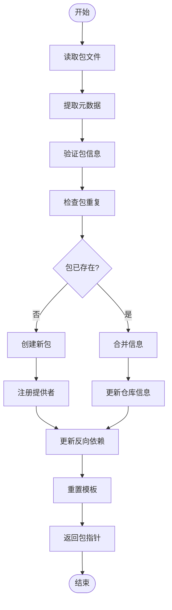

# 包管理

<cite>
**本文档引用的文件**   
- [database.c](file://src/database.c)
- [apk_database.h](file://src/apk_database.h)
- [package.c](file://src/package.c)
- [apk_package.h](file://src/apk_package.h)
- [apk_hash.h](file://src/apk_hash.h)
- [apk_balloc.h](file://src/apk_balloc.h)
- [apk_defines.h](file://src/apk_defines.h)
- [apk_adb.h](file://src/apk_adb.h)
</cite>

## 目录
1. [简介](#简介)
2. [包生命周期管理](#包生命周期管理)
3. [包添加流程](#包添加流程)
4. [包元数据存储结构](#包元数据存储结构)
5. [包查询机制](#包查询机制)
6. [并发数据一致性](#并发数据一致性)

## 简介
本文档详细介绍了apk-tools中数据库如何管理软件包的生命周期。重点分析了`apk_db_pkg_add`函数如何将新包添加到数据库，包括包去重、架构兼容性检查、提供者(provider)注册和反向依赖(rdepends)更新机制。同时解释了`apk_db_get_name`函数如何通过哈希表高效检索包名，以及`apk_db_query_name`函数在查询过程中的作用。文档还描述了包元数据的存储结构，包括名称、版本、依赖关系和文件列表，并提供了包添加流程图。

## 包生命周期管理

### 包添加机制
`apk_db_pkg_add`函数是管理包生命周期的核心函数，负责将新包添加到数据库中。该函数实现了完整的包去重、架构兼容性检查、提供者注册和反向依赖更新机制。

#### 包去重与架构兼容性检查
当调用`apk_db_pkg_add`函数时，首先进行基本验证，确保包名称、版本和ID有效。然后检查架构兼容性，如果不兼容则标记包为不可安装：

```c
if (!pkg->name || !pkg->version || tmpl->id.len < APK_DIGEST_LENGTH_SHA1) return NULL;
if (!apk_db_arch_compatible(db, tmpl->pkg.arch)) tmpl->pkg.uninstallable = 1;
```

#### 包去重机制
函数通过SHA1哈希值在`available.packages`哈希表中查找是否存在相同包。如果不存在，则创建新包；如果存在，则合并仓库信息：

```c
idb = apk_hash_get(&db->available.packages, APK_BLOB_PTR_LEN((char*)tmpl->id.data, APK_DIGEST_LENGTH_SHA1));
if (idb == NULL) {
    // 创建新包
} else {
    // 合并仓库信息
    old_repos = idb->repos;
    idb->repos |= pkg->repos;
}
```

**Section sources**
- [database.c](file://src/database.c#L572-L620)
- [apk_database.h](file://src/apk_database.h#L298)

### 提供者注册机制
当成功添加新包时，系统会自动注册提供者信息。对于包本身，使用`APK_PROVIDER_FROM_PACKAGE`宏创建提供者；对于提供的依赖项，使用`APK_PROVIDER_FROM_PROVIDES`宏创建：

```c
apk_provider_array_add(&idb->name->providers, APK_PROVIDER_FROM_PACKAGE(idb));
apk_array_foreach(dep, idb->provides)
    apk_provider_array_add(&dep->name->providers, APK_PROVIDER_FROM_PROVIDES(idb, dep));
```

**Section sources**
- [database.c](file://src/database.c#L596-L598)
- [apk_package.h](file://src/apk_package.h#L114-L115)

### 反向依赖更新
系统通过`apk_db_pkg_rdepends`函数更新反向依赖关系。当一个包依赖于另一个包时，被依赖包的反向依赖列表会添加依赖包的信息：

```c
static void apk_db_pkg_rdepends(struct apk_database *db, struct apk_package *pkg)
{
    apk_array_foreach(d, pkg->depends) {
        struct apk_name *rname = d->name;
        add_name_to_array(pkg->name, &rname->rdepends);
    }
}
```

**Section sources**
- [database.c](file://src/database.c#L509-L522)

## 包添加流程

### 包添加完整流程
包添加流程从读取包文件开始，经过解析、验证，最终添加到数据库。以下是完整的包添加流程：



**Diagram sources**
- [database.c](file://src/database.c#L572-L620)
- [package.c](file://src/package.c#L656-L691)

### 包模板处理
在包添加过程中，使用`struct apk_package_tmpl`结构体作为临时模板。添加完成后，调用`apk_pkgtmpl_reset`函数重置模板，确保资源正确释放：

```c
apk_pkgtmpl_reset(tmpl);
return idb;
```

**Section sources**
- [database.c](file://src/database.c#L619)
- [apk_package.h](file://src/apk_package.h#L159)

## 包元数据存储结构

### 包数据结构
包元数据存储在`struct apk_package`结构体中，包含名称、版本、依赖关系等信息：

```c
struct apk_package {
    apk_hash_node hash_node;
    struct apk_name *name;
    struct apk_installed_package *ipkg;
    struct apk_dependency_array *depends, *install_if, *provides, *recommends;
    struct apk_blobptr_array *tags;
    apk_blob_t *version;
    apk_blob_t *arch, *license, *origin, *maintainer, *url, *description, *commit;
    uint64_t installed_size, size;
    time_t build_time;
    uint32_t repos;
    unsigned short provider_priority;
    unsigned short filename_ndx;
    unsigned char uninstallable : 1;
    uint8_t digest_alg;
    uint8_t digest[];
};
```

**Section sources**
- [apk_package.h](file://src/apk_package.h#L74-L102)

### 依赖关系存储
依赖关系通过`struct apk_dependency`结构体存储，包含名称、版本、操作符等信息：

```c
struct apk_dependency {
    struct apk_name *name;
    apk_blob_t *version;
    uint8_t op;
    uint16_t broken : 1;
    uint16_t repository_tag : 6;
    uint16_t layer : 4;
};
```

**Section sources**
- [apk_package.h](file://src/apk_package.h#L44-L51)

### 哈希表存储机制
系统使用哈希表高效存储和检索包信息。`available.packages`哈希表以包的SHA1哈希值为键，存储包信息：

```c
struct apk_hash {
    const struct apk_hash_ops *ops;
    struct apk_hash_array *buckets;
    int num_items;
};
```

**Section sources**
- [apk_hash.h](file://src/apk_hash.h#L37-L41)

## 包查询机制

### 包名检索
`apk_db_get_name`函数通过哈希表高效检索包名。如果包名不存在，则创建新的包名条目：

```c
struct apk_name *apk_db_get_name(struct apk_database *db, apk_blob_t name)
{
    unsigned long hash = apk_hash_from_key(&db->available.names, name);
    pn = (struct apk_name *) apk_hash_get_hashed(&db->available.names, name, hash);
    if (pn != NULL) return pn;
    
    // 创建新条目
    pn = apk_balloc_new_extra(&db->ba_names, struct apk_name, name.len+1);
    apk_hash_insert_hashed(&db->available.names, pn, hash);
    return pn;
}
```

**Section sources**
- [database.c](file://src/database.c#L165-L187)
- [apk_database.h](file://src/apk_database.h#L261)

### 包名查询
`apk_db_query_name`函数用于查询包名，直接使用哈希表的get操作：

```c
struct apk_name *apk_db_query_name(struct apk_database *db, apk_blob_t name)
{
    return (struct apk_name *) apk_hash_get(&db->available.names, name);
}
```

**Section sources**
- [database.c](file://src/database.c#L160-L163)
- [apk_database.h](file://src/apk_database.h#L262)

### 包名到包的映射
`apk_db_get_pkg_by_name`函数通过文件名查找对应的包，支持复杂的包名规范：

```c
struct apk_package *apk_db_get_pkg_by_name(struct apk_database *db, apk_blob_t filename, ssize_t filesize, apk_blob_t pkgname_spec)
{
    // 遍历可能的分割点
    for (int i = 1; i < filename.len; i++) {
        if (filename.ptr[i] != split_char) continue;
        name = apk_db_get_name(db, APK_BLOB_PTR_LEN(filename.ptr, i));
        // 检查包是否匹配
    }
    return NULL;
}
```

**Section sources**
- [database.c](file://src/database.c#L2533-L2571)

## 并发数据一致性

### 内存分配机制
系统使用`apk_balloc`内存池管理器来确保内存分配的效率和一致性。`apk_balloc_new_extra`宏用于分配带有额外空间的内存：

```c
#define apk_balloc_new_extra(ba, type, extra) (type *) apk_balloc_aligned(ba, sizeof(type)+extra, alignof(type))
```

**Section sources**
- [apk_balloc.h](file://src/apk_balloc.h#L26)
- [database.c](file://src/database.c#L583)

### 哈希表操作原子性
哈希表操作通过`apk_hash_insert`和`apk_hash_get`函数实现，这些函数内部使用哈希值确保操作的原子性：

```c
static inline void apk_hash_insert(struct apk_hash *h, apk_hash_item item)
{
    return apk_hash_insert_hashed(h, item, apk_hash_from_item(h, item));
}
```

**Section sources**
- [apk_hash.h](file://src/apk_hash.h#L68-L71)
- [database.c](file://src/database.c#L595)

### 数据库初始化
数据库初始化时，通过`apk_db_init`函数设置所有必要的数据结构和哈希表：

```c
void apk_db_init(struct apk_database *db, struct apk_ctx *ac)
{
    apk_hash_init(&db->available.names, &pkg_name_hash_ops, 20000);
    apk_hash_init(&db->available.packages, &pkg_info_hash_ops, 10000);
    // 初始化其他哈希表
}
```

**Section sources**
- [database.c](file://src/database.c#L1941-L1970)