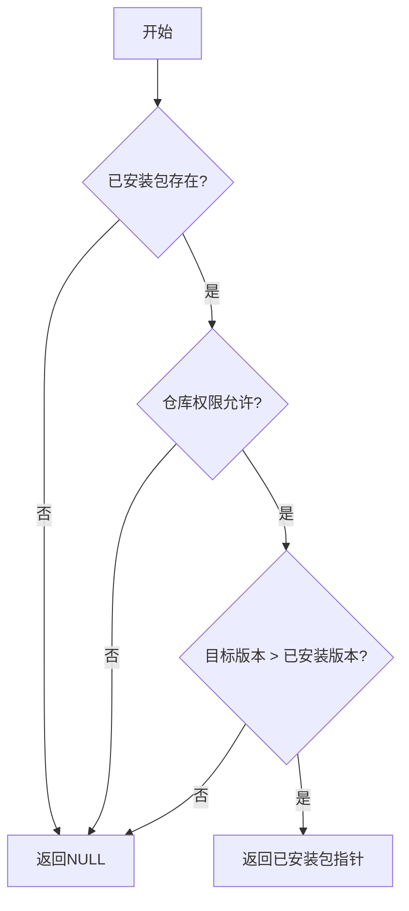
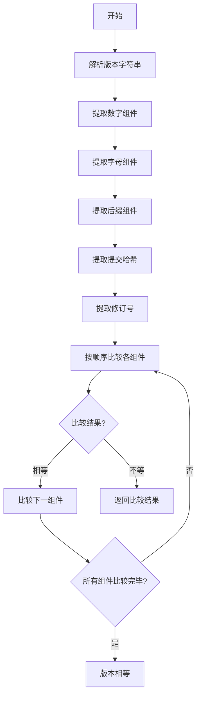
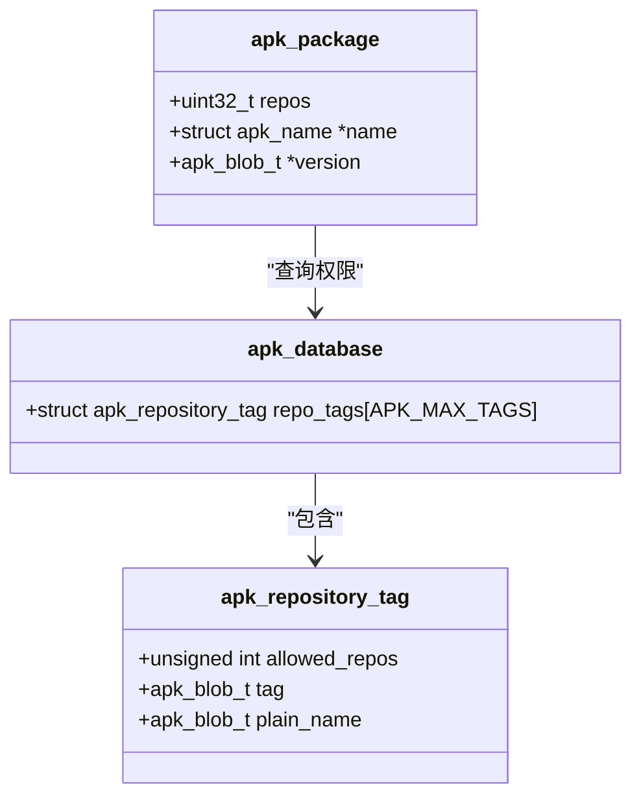
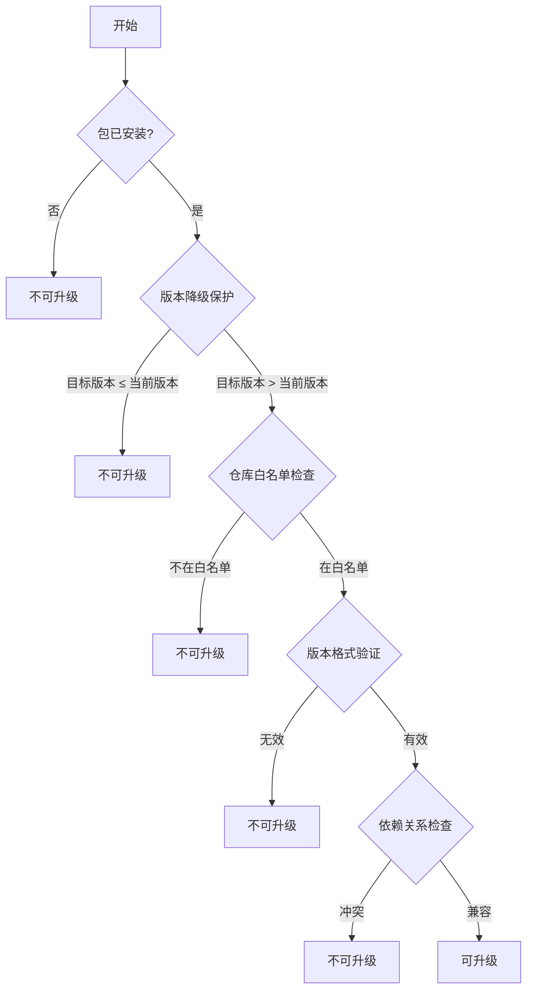

# 可升级性判断

<cite>
**本文档中引用的文件**
- [database.c](file://src/database.c#L559-L570)
- [apk_database.h](file://src/apk_database.h#L297-L297)
- [version.c](file://src/version.c#L322-L329)
- [apk_version.h](file://src/apk_version.h#L28-L28)
- [package.c](file://src/package.c#L28-L35)
- [apk_package.h](file://src/apk_package.h#L167-L167)
</cite>

## 目录
1. [函数概述](#函数概述)
2. [可升级性判断逻辑](#可升级性判断逻辑)
3. [版本匹配算法](#版本匹配算法)
4. [仓库权限验证机制](#仓库权限验证机制)
5. [返回值语义](#返回值语义)
6. [可升级性决策树](#可升级性决策树)
7. [批量升级场景应用](#批量升级场景应用)

## 函数概述

`apk_db_pkg_upgradable`函数是APK包管理器中用于判断指定软件包是否可升级的核心函数。该函数通过检查已安装包的存在性、版本比较和仓库权限验证三个关键步骤，决定一个软件包是否可以被升级。

**Section sources**
- [database.c](file://src/database.c#L559-L570)
- [apk_database.h](file://src/apk_database.h#L297-L297)

## 可升级性判断逻辑

`apk_db_pkg_upgradable`函数的实现逻辑包含三个主要步骤：

1. **已安装包存在性检查**：函数首先通过`apk_pkg_get_installed`函数查询指定包名的已安装包。如果未找到已安装的包，则直接返回NULL，表示不可升级。

2. **仓库权限验证**：函数检查目标包的仓库是否在已安装包的允许仓库列表中。这是通过比较`pkg->repos`和`allowed_repos`位掩码实现的。

3. **版本比较**：使用`apk_version_match`函数比较已安装包和目标包的版本，只有当目标包版本大于已安装包版本时才认为可升级。

**Diagram sources**
- [database.c](file://src/database.c#L559-L570)

**Section sources**
- [database.c](file://src/database.c#L559-L570)

## 版本匹配算法

`apk_version_match`函数在升级决策中起着关键作用，它实现了复杂的版本比较逻辑：

1. **版本解析**：将版本字符串解析为多个组件，包括数字、字母、后缀（如alpha、beta、rc）、提交哈希和修订号。

2. **组件比较**：按顺序比较各个版本组件：
   - 数字组件按数值比较
   - 字母组件按ASCII值比较
   - 后缀组件按预定义的优先级比较（如alpha < beta < rc < 正式版）
   - 提交哈希和修订号作为最后的比较依据

3. **模糊匹配**：支持模糊版本匹配，允许前缀匹配。

**Diagram sources**
- [version.c](file://src/version.c#L280-L315)

**Section sources**
- [version.c](file://src/version.c#L322-L329)
- [apk_version.h](file://src/apk_version.h#L28-L28)

## 仓库权限验证机制

仓库权限验证通过`repository_tag`机制实现，这是一种基于标签的权限控制策略：

1. **标签系统**：每个仓库都有一个或多个标签，这些标签定义了仓库的权限级别。

2. **权限位掩码**：`allowed_repos`是一个位掩码，表示已安装包允许从哪些标签的仓库升级。

3. **权限检查**：通过位运算检查目标包的仓库标签是否在允许的范围内。

4. **白名单机制**：只有在白名单中的仓库才能提供升级包，这防止了从不受信任的源进行升级。

**Diagram sources**
- [apk_database.h](file://src/apk_database.h#L168-L171)

**Section sources**
- [database.c](file://src/database.c#L559-L570)

## 返回值语义

`apk_db_pkg_upgradable`函数的返回值具有明确的语义：

- **返回已安装包指针**：表示该包可升级。返回值指向已安装包的结构体，包含当前版本信息，可用于后续的升级操作。

- **返回NULL**：表示该包不可升级。可能的原因包括：
  - 该包未安装
  - 目标版本不高于已安装版本
  - 目标包来自不允许的仓库
  - 其他权限或策略限制

这种设计使得调用者可以简单地通过检查返回值是否为NULL来判断可升级性，同时在可升级的情况下直接获得已安装包的引用，便于后续操作。

**Section sources**
- [database.c](file://src/database.c#L559-L570)

## 可升级性决策树

可升级性判断遵循一个清晰的决策流程，包含多个保护策略：

决策策略包括：
- **版本降级保护**：防止意外降级到旧版本
- **仓库白名单**：确保只从受信任的源升级
- **版本格式验证**：确保版本字符串符合规范
- **依赖关系检查**：确保升级不会破坏依赖关系

**Diagram sources**
- [database.c](file://src/database.c#L559-L570)

**Section sources**
- [database.c](file://src/database.c#L559-L570)

## 批量升级场景应用

在批量升级场景中，`apk_db_pkg_upgradable`函数的应用具有以下特点：

1. **高效性**：函数设计为轻量级检查，适合在循环中对大量包进行可升级性判断。

2. **一致性**：所有包使用相同的升级策略，确保升级过程的一致性和可预测性。

3. **错误隔离**：单个包的升级失败不会影响其他包的升级决策。

4. **策略统一**：版本比较、仓库权限等策略在整个批量升级过程中保持一致。

5. **性能优化**：通过缓存和预计算，减少重复的权限检查和版本解析操作。

该函数在`app_upgrade.c`等批量升级相关模块中被广泛调用，作为升级决策的核心组件，确保了批量升级过程的安全性和可靠性。

**Section sources**
- [database.c](file://src/database.c#L559-L570)