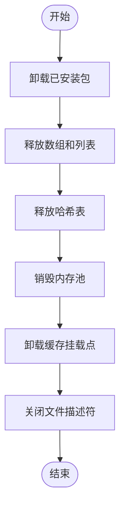
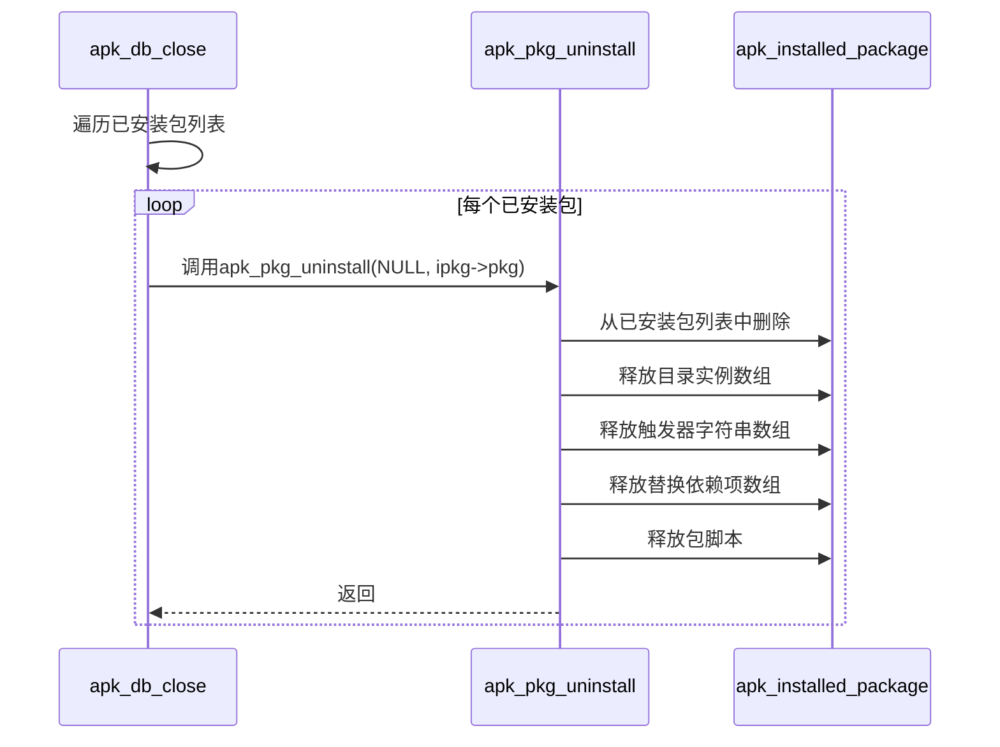
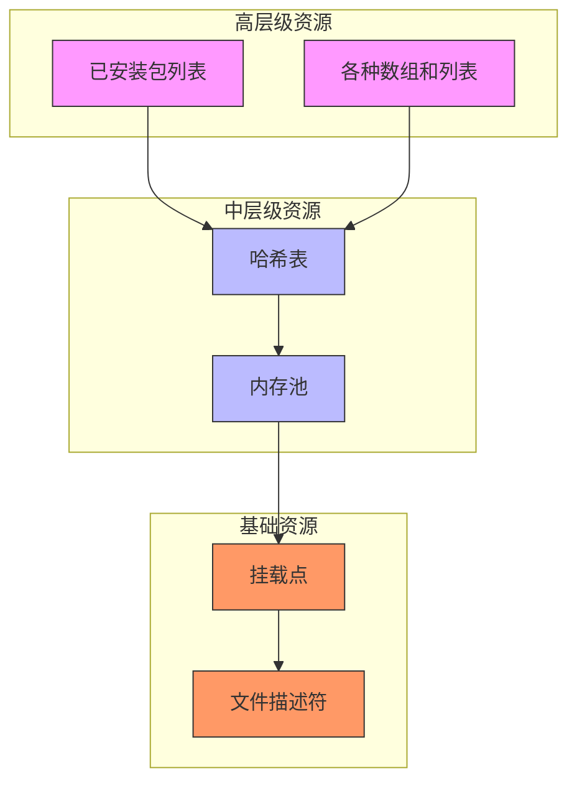

# 数据库关闭与清理

<cite>
**Referenced Files in This Document**   
- [database.c](file://src/database.c)
- [apk_database.h](file://src/apk_database.h)
- [package.c](file://src/package.c)
- [hash.c](file://src/hash.c)
- [balloc.c](file://src/balloc.c)
</cite>

## 目录
1. [函数概述](#函数概述)
2. [资源清理流程](#资源清理流程)
3. [已安装包处理逻辑](#已安装包处理逻辑)
4. [逆序资源释放原则](#逆序资源释放原则)
5. [异常情况处理](#异常情况处理)
6. [资源依赖关系图](#资源依赖关系图)

## 函数概述

`apk_db_close`函数是apk工具包中用于安全关闭和清理数据库的核心函数。该函数负责释放所有动态分配的资源，确保系统状态的一致性。函数执行一系列清理操作，包括卸载已安装的包、释放各种哈希表、销毁内存池、关闭文件描述符以及卸载挂载点。

**Section sources**
- [database.c](file://src/database.c#L2287-L2319)

## 资源清理流程

`apk_db_close`函数按照严格的顺序执行资源清理操作，确保所有资源都被正确释放。清理流程包括以下几个主要步骤：

1. **已安装包卸载**：遍历已安装包列表，逐个卸载所有已安装的包。
2. **数组和列表释放**：释放各种数组和列表，包括受保护路径数组、架构数组、文件名数组等。
3. **哈希表释放**：释放可用和已安装组件的哈希表，包括包、名称、文件和目录的哈希表。
4. **内存池销毁**：销毁用于名称、包、文件和依赖项的内存池。
5. **文件描述符关闭**：关闭缓存文件描述符和锁文件描述符。
6. **挂载点卸载**：调用`remount_cache_ro`函数卸载缓存挂载点。

**Diagram sources **
- [database.c](file://src/database.c#L2287-L2319)

**Section sources**
- [database.c](file://src/database.c#L2287-L2319)

## 已安装包处理逻辑

在清理过程中，`apk_db_close`函数首先处理已安装的包。通过`list_for_each_entry_safe`宏遍历`db->installed.packages`列表，对每个已安装的包调用`apk_pkg_uninstall`函数进行卸载。这个过程确保了所有已安装的包都被正确地从系统中移除，同时释放了与这些包相关的所有资源。

`apk_pkg_uninstall`函数负责具体的卸载操作，包括从已安装包列表中删除包、释放目录实例数组、释放触发器字符串数组、释放替换依赖项数组，以及释放包脚本。

**Diagram sources **
- [database.c](file://src/database.c#L2287-L2290)
- [package.c](file://src/package.c#L64-L96)

**Section sources**
- [database.c](file://src/database.c#L2287-L2290)
- [package.c](file://src/package.c#L64-L96)

## 逆序资源释放原则

`apk_db_close`函数遵循逆序资源释放原则，即按照与资源分配相反的顺序进行释放。这种原则确保了在释放资源时，不会出现对已释放资源的引用，从而避免了潜在的内存错误。

例如，函数首先释放高层级的数据结构（如已安装包），然后逐步释放底层的数据结构（如哈希表和内存池），最后关闭最基础的资源（如文件描述符）。这种逆序释放的策略保证了资源清理的完整性和安全性。

**Section sources**
- [database.c](file://src/database.c#L2287-L2319)

## 异常情况处理

`apk_db_close`函数在设计时考虑了异常情况的处理。虽然函数本身没有显式的异常处理机制，但通过以下方式确保了在异常情况下也能正确清理资源：

1. **条件检查**：在关闭文件描述符之前，检查文件描述符是否有效（大于0），避免对无效文件描述符进行操作。
2. **幂等性**：许多清理函数（如`apk_hash_free`和`apk_balloc_destroy`）设计为幂等的，即使多次调用也不会导致错误。
3. **资源状态管理**：通过维护资源的状态（如引用计数），确保资源只在不再被引用时才被释放。

这些设计确保了即使在部分清理操作失败的情况下，函数也能尽可能地完成剩余的清理工作，保持系统的稳定性和一致性。

**Section sources**
- [database.c](file://src/database.c#L2315-L2319)
- [hash.c](file://src/hash.c#L27-L31)
- [balloc.c](file://src/balloc.c#L21-L29)

## 资源依赖关系图

下图展示了`apk_db_close`函数中各组件间的引用和销毁顺序。该图清晰地显示了资源之间的依赖关系，以及清理过程中遵循的逆序释放原则。

**Diagram sources **
- [database.c](file://src/database.c#L2287-L2319)
- [apk_database.h](file://src/apk_database.h#L182-L252)

**Section sources**
- [database.c](file://src/database.c#L2287-L2319)
- [apk_database.h](file://src/apk_database.h#L182-L252)