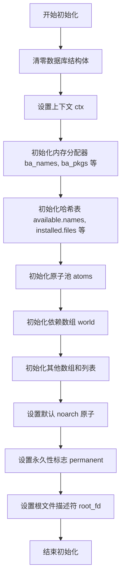
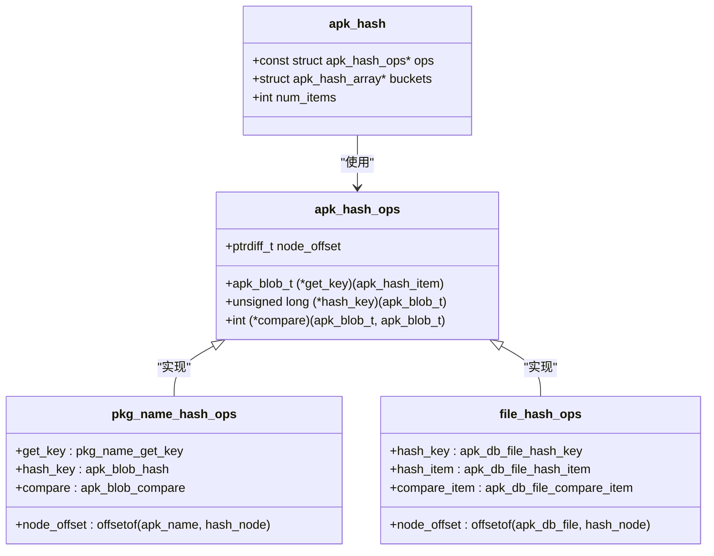
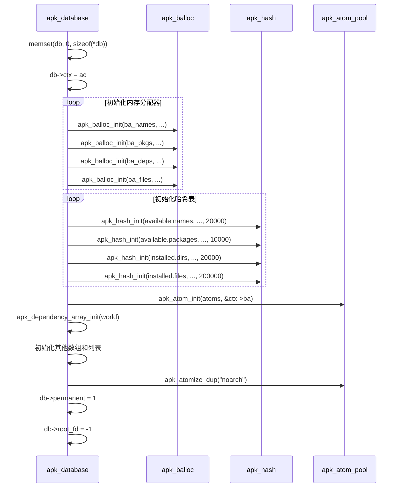
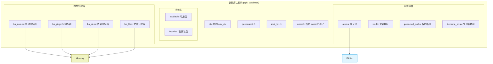

# 数据库初始化

<cite>
**本文档引用的文件**  
- [database.c](file://src/database.c#L1940-L1969)
- [apk_database.h](file://src/apk_database.h#L279)
- [hash.c](file://src/hash.c#L12-L19)
- [balloc.c](file://src/balloc.c#L16-L19)
- [atom.c](file://src/atom.c#L30-L34)
</cite>

## 目录
1. [简介](#简介)
2. [核心组件初始化](#核心组件初始化)
3. [内存分配器初始化](#内存分配器初始化)
4. [哈希表初始化](#哈希表初始化)
5. [原子池与依赖数组](#原子池与依赖数组)
6. [默认ACL与标志设置](#默认acl与标志设置)
7. [初始化流程时序图](#初始化流程时序图)
8. [内存布局图](#内存布局图)

## 简介
`apk_db_init` 函数是 apk-tools 数据库系统的核心初始化函数，负责为 `struct apk_database` 结构体分配和初始化所有必要的资源。该函数在系统启动时被调用，为包管理操作建立一个稳定、高效的运行环境。它通过初始化内存分配器、哈希表、原子池等关键组件，构建了整个数据库的内存基础架构。

**Section sources**
- [database.c](file://src/database.c#L1940-L1969)

## 核心组件初始化
`apk_db_init` 函数首先将传入的 `apk_database` 结构体清零，确保所有字段处于已知的初始状态。随后，它将上下文指针 `ctx` 关联到数据库实例，为后续操作提供全局配置和输出流。函数还初始化了多个动态数组和列表，如 `installed.packages` 和 `installed.triggers`，用于跟踪已安装的包和待处理的触发器。

**Diagram sources**
- [database.c](file://src/database.c#L1940-L1969)

**Section sources**
- [database.c](file://src/database.c#L1940-L1969)

## 内存分配器初始化
函数通过调用 `apk_balloc_init` 来初始化四个专用的内存分配器（`ba_names`, `ba_pkgs`, `ba_deps`, `ba_files`）。这些分配器采用基于页的批量分配策略，能有效减少内存碎片并提高分配效率。

- `ba_names`: 用于分配 `apk_name` 结构体，初始页大小为 `(sizeof(struct apk_name) + 16) * 256`，预留了额外空间以容纳名称字符串。
- `ba_pkgs`: 用于分配 `apk_package` 结构体，页大小为 `sizeof(struct apk_package) * 256`。
- `ba_deps`: 用于分配 `apk_dependency` 结构体，页大小为 `sizeof(struct apk_dependency) * 256`。
- `ba_files`: 用于分配 `apk_db_file` 结构体，初始页大小为 `(sizeof(struct apk_db_file) + 32) * 256`，同样预留了额外空间。

**Section sources**
- [database.c](file://src/database.c#L1943-L1946)
- [balloc.c](file://src/balloc.c#L16-L19)

## 哈希表初始化
函数使用 `apk_hash_init` 初始化了四个关键的哈希表，这些哈希表是数据库快速查找的核心。

**Diagram sources**
- [database.c](file://src/database.c#L1947-L1950)
- [hash.c](file://src/hash.c#L12-L19)
- [apk_database.h](file://src/apk_database.h)

**Section sources**
- [database.c](file://src/database.c#L1947-L1950)

### 哈希表参数与目的
| 哈希表字段 | 操作符 (ops) | 初始桶数 | 目的 |
| :--- | :--- | :--- | :--- |
| `available.names` | `pkg_name_hash_ops` | 20000 | 存储所有可用包名，实现快速名称查询 |
| `available.packages` | `pkg_info_hash_ops` | 10000 | 存储所有可用包信息，通过校验和索引 |
| `installed.dirs` | `dir_hash_ops` | 20000 | 跟踪已安装的目录，用于文件系统管理 |
| `installed.files` | `file_hash_ops` | 200000 | 存储所有已安装文件的元数据，是最大的哈希表 |

## 原子池与依赖数组
- **原子池 (atoms)**：通过 `apk_atom_init(&db->atoms, &db->ctx->ba)` 初始化。原子池用于存储字符串的唯一实例（如包名、架构名），避免重复存储，节省内存。它使用 `ctx` 的 `ba` 分配器，并创建一个大小为 10000 的内部哈希表来管理原子。
- **依赖数组 (world)**：通过 `apk_dependency_array_init(&db->world)` 初始化。这个数组用于存储“世界依赖”（world dependencies），即用户显式安装的包列表，是包管理操作的起点。

**Section sources**
- [database.c](file://src/database.c#L1951-L1952)
- [atom.c](file://src/atom.c#L30-L34)

## 默认ACL与标志设置
函数在初始化末尾设置了关键的标志和默认值：
- `db->permanent = 1;`：将数据库标记为永久性。这通常意味着数据库的更改需要被持久化到磁盘。
- `db->root_fd = -1;`：将根文件描述符初始化为 -1，表示尚未设置或无效。此描述符用于后续的 chroot 或文件系统操作。
- `db->noarch = apk_atomize_dup(&db->atoms, APK_BLOB_STRLIT("noarch"));`：创建一个名为 "noarch" 的原子，并将其存储在 `noarch` 字段中。这为处理与架构无关的包提供了便利。

**Section sources**
- [database.c](file://src/database.c#L1965-L1969)

## 初始化流程时序图

**Diagram sources**
- [database.c](file://src/database.c#L1940-L1969)

## 内存布局图

**Diagram sources**
- [database.c](file://src/database.c#L1940-L1969)
- [apk_database.h](file://src/apk_database.h)