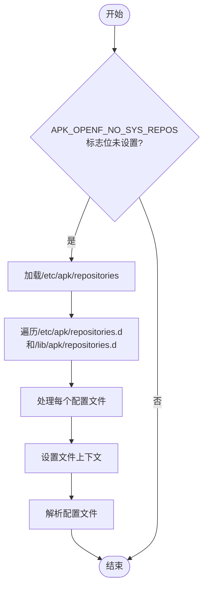
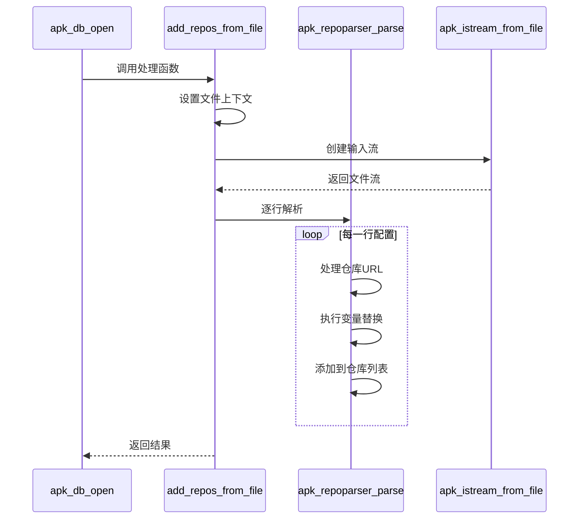
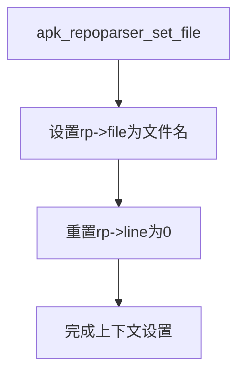
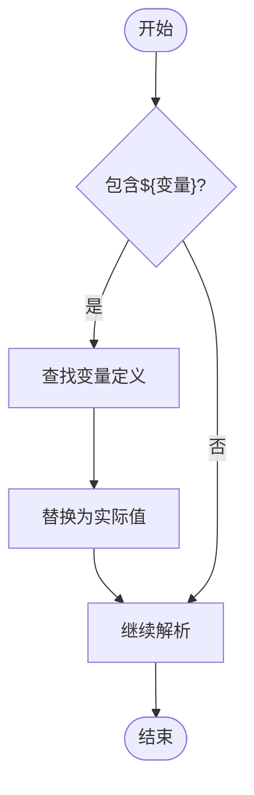
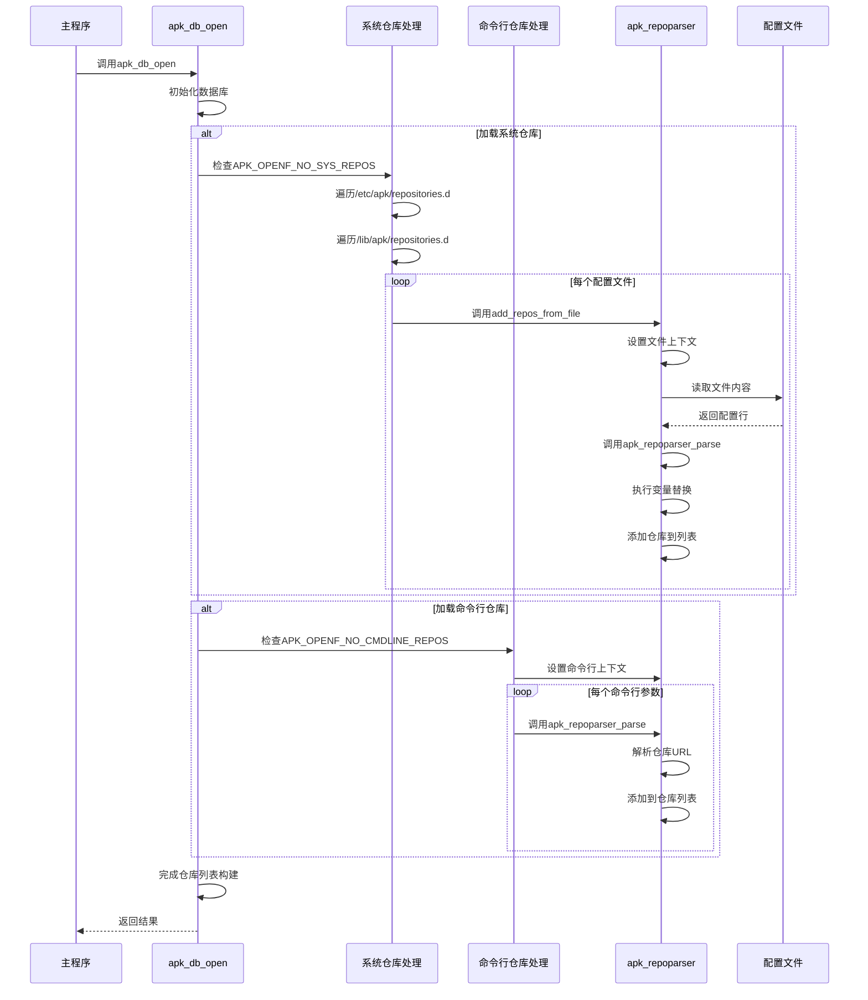

# 仓库配置解析

<cite>
**本文档引用的文件**
- [database.c](file://src/database.c)
- [repoparser.c](file://src/repoparser.c)
- [apk_repoparser.h](file://src/apk_repoparser.h)
</cite>

## 目录
1. [简介](#简介)
2. [核心流程分析](#核心流程分析)
3. [标志位控制机制](#标志位控制机制)
4. [配置文件遍历与解析](#配置文件遍历与解析)
5. [变量替换实现原理](#变量替换实现原理)
6. [时序图分析](#时序图分析)

## 简介
本文档详细阐述了apk-tools项目中仓库配置的解析流程。重点分析了`apk_db_open`函数如何根据不同的标志位决定是否加载系统级和命令行指定的仓库配置，以及`add_repos_from_file`函数如何遍历配置目录并解析仓库URL。文档还深入探讨了`apk_repoparser_set_file`函数的文件上下文设置机制和变量替换的实现原理。

## 核心流程分析
仓库配置解析的核心流程始于`apk_db_open`函数的执行。该函数作为数据库打开的入口点，负责初始化数据库结构并解析相关的仓库配置。在解析过程中，系统会根据传入的标志位来决定是否加载不同来源的仓库配置。

**Section sources**
- [database.c](file://src/database.c#L1971-L2160)

## 标志位控制机制
在`apk_db_open`函数中，通过检查`ac->open_flags`标志位来控制仓库配置的加载行为：

- 当`APK_OPENF_NO_SYS_REPOS`标志位未设置时，系统会加载系统级仓库配置
- 当`APK_OPENF_NO_CMDLINE_REPOS`标志位未设置时，系统会加载命令行指定的仓库配置

这种基于标志位的条件判断机制允许用户灵活控制仓库配置的加载范围，为不同的使用场景提供定制化的配置管理能力。

**Section sources**
- [database.c](file://src/database.c#L1971-L2160)

## 配置文件遍历与解析
### 系统配置文件遍历
当系统级仓库配置被启用时，`add_repos_from_file`函数负责遍历指定的配置目录。该函数通过`apk_dir_foreach_config_file`调用，依次处理`/etc/apk/repositories.d`和`/lib/apk/repositories.d`目录下的配置文件。

**Diagram sources**
- [database.c](file://src/database.c#L1971-L2160)
- [database.c](file://src/database.c#L1661-L1675)

### 配置解析流程
`add_repos_from_file`函数首先调用`apk_repoparser_set_file`设置当前解析的文件上下文，然后通过`apk_db_parse_istream`逐行读取配置文件内容，并将每一行传递给`add_repository`回调函数进行处理。

**Diagram sources**
- [database.c](file://src/database.c#L1661-L1675)
- [repoparser.c](file://src/repoparser.c#L148-L222)

**Section sources**
- [database.c](file://src/database.c#L1661-L1675)
- [repoparser.c](file://src/repoparser.c#L148-L222)

## 变量替换实现原理
### 文件上下文设置
`apk_repoparser_set_file`函数负责设置当前解析的文件上下文，初始化`rp->file`为当前文件名，并将行号`rp->line`重置为0。这个上下文信息在后续的错误报告和调试中起到重要作用。

**Diagram sources**
- [repoparser.c](file://src/repoparser.c#L92-L96)

### 变量替换机制
变量替换机制通过`apk_blob_subst`函数实现，该函数在解析仓库URL时会查找并替换`${ARCH}`等变量。系统预定义了`APK_ARCH`变量，其值来自系统架构配置。

**Diagram sources**
- [repoparser.c](file://src/repoparser.c#L148-L222)
- [repoparser.c](file://src/repoparser.c#L99-L106)

**Section sources**
- [repoparser.c](file://src/repoparser.c#L148-L222)
- [repoparser.c](file://src/repoparser.c#L92-L96)

## 时序图分析
以下时序图展示了从配置文件读取到最终仓库列表构建的完整过程：

**Diagram sources**
- [database.c](file://src/database.c#L1971-L2160)
- [database.c](file://src/database.c#L1661-L1675)
- [repoparser.c](file://src/repoparser.c#L148-L222)