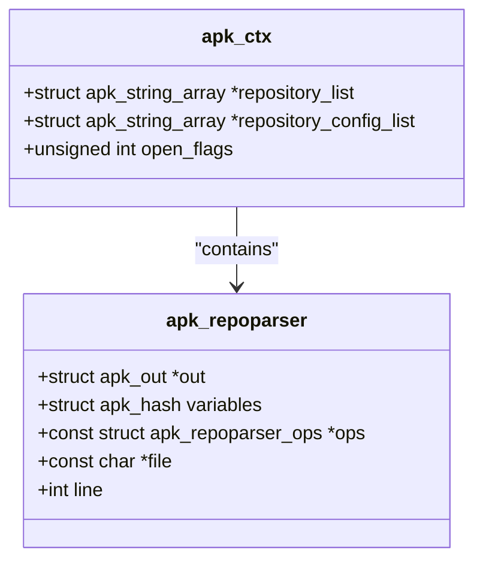
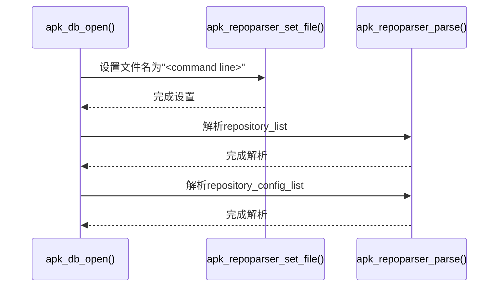
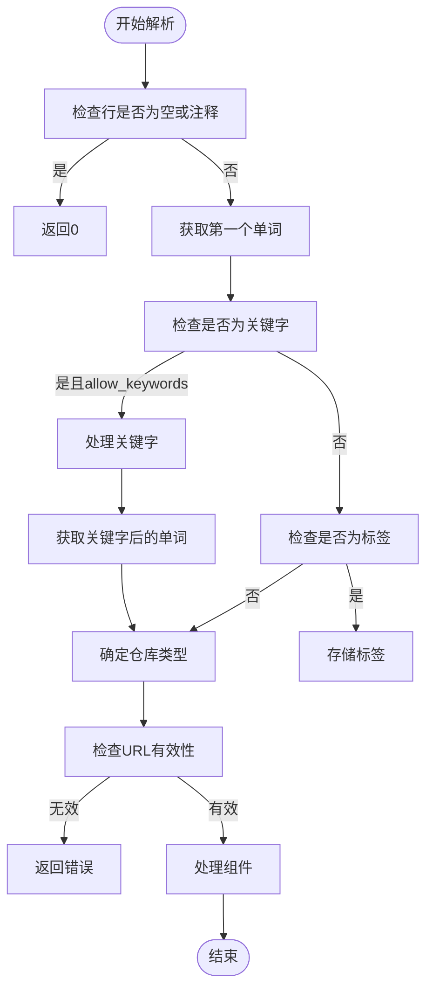

# 命令行仓库解析

<cite>
**Referenced Files in This Document**   
- [database.c](file://src/database.c)
- [repoparser.c](file://src/repoparser.c)
- [apk_context.h](file://src/apk_context.h)
- [apk_repoparser.h](file://src/apk_repoparser.h)
</cite>

## 目录
1. [命令行仓库解析机制](#命令行仓库解析机制)
2. [核心数据结构](#核心数据结构)
3. [解析流程分析](#解析流程分析)
4. [代码示例与使用](#代码示例与使用)

## 命令行仓库解析机制

在apk工具中，命令行指定的仓库解析机制是通过`apk_db_open`函数实现的。当用户通过`--repository`或`-R`参数添加仓库时，系统会根据配置标志位来决定是否处理命令行传入的仓库配置。

**Section sources**
- [database.c](file://src/database.c#L2103-L2111)

## 核心数据结构

命令行仓库解析涉及两个关键的数据结构：`apk_ctx`和`apk_repoparser`。`apk_ctx`结构体中的`repository_list`和`repository_config_list`成员用于存储命令行传入的仓库配置信息。



**Diagram sources **
- [apk_context.h](file://src/apk_context.h#L80-L82)
- [apk_repoparser.h](file://src/apk_repoparser.h#L16-L17)

**Section sources**
- [apk_context.h](file://src/apk_context.h#L80-L82)
- [apk_repoparser.h](file://src/apk_repoparser.h#L16-L17)

## 解析流程分析

命令行仓库的解析流程主要分为以下几个步骤：

1. 在`apk_db_open`函数中检查`APK_OPENF_NO_CMDLINE_REPOS`标志位
2. 调用`apk_repoparser_set_file`设置解析上下文为"<command line>"
3. 遍历`ac->repository_list`和`ac->repository_config_list`进行解析

当`APK_OPENF_NO_CMDLINE_REPOS`标志位未设置时，系统会执行命令行仓库的解析。首先通过`apk_repoparser_set_file`函数将当前解析上下文设置为"<command line>"，这有助于在错误报告中标识出错的配置来源。



**Diagram sources **
- [database.c](file://src/database.c#L2104-L2110)
- [repoparser.c](file://src/repoparser.c#L92-L96)

**Section sources**
- [database.c](file://src/database.c#L2103-L2111)
- [repoparser.c](file://src/repoparser.c#L92-L96)

`apk_repoparser_parse`函数负责逐行处理命令行输入的仓库URL。该函数接受一个`allow_keywords`参数，用于控制是否允许在命令行上下文中使用特定关键字（如"set"、"ndx"、"v2"、"v3"等）。



**Diagram sources **
- [repoparser.c](file://src/repoparser.c#L148-L222)

**Section sources**
- [repoparser.c](file://src/repoparser.c#L148-L222)

## 代码示例与使用

用户可以通过`--repository`或`-R`参数向apk工具添加仓库。例如：

```bash
apk add --repository http://dl-cdn.alpinelinux.org/alpine/edge/main package_name
```

在代码层面，`allow_keywords`参数在命令行上下文中的作用至关重要。当`allow_keywords`为`true`时，解析器允许使用"set"、"ndx"、"v2"、"v3"等关键字来指定仓库类型或设置变量。当为`false`时，这些关键字将被视为普通URL的一部分。

**Section sources**
- [repoparser.c](file://src/repoparser.c#L160-L175)
- [database.c](file://src/database.c#L2106-L2109)